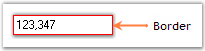

# Border Settings in WinForms Integer TextBox

Color and styles can be applied to the border of the WinForms Integer TextBox control using the following properties:

* [Border3DStyle](https://help.syncfusion.com/cr/windowsforms/Syncfusion.Windows.Forms.Tools.TextBoxExt.html#Syncfusion_Windows_Forms_Tools_TextBoxExt_Border3DStyle) - Sets the 3D border style when `BorderStyle` is `Fixed3D`.
* [BorderColor](https://help.syncfusion.com/cr/windowsforms/Syncfusion.Windows.Forms.Tools.TextBoxExt.html#Syncfusion_Windows_Forms_Tools_TextBoxExt_BorderColor) - Sets the color of the border.
* [BorderSides](https://help.syncfusion.com/cr/windowsforms/Syncfusion.Windows.Forms.Tools.TextBoxExt.html#Syncfusion_Windows_Forms_Tools_TextBoxExt_BorderSides) - Specifies which sides of the border are drawn.
* [BorderStyle](https://learn.microsoft.com/en-us/dotnet/api/system.windows.forms.borderstyle?view=netframework-4.7.2) - Sets the overall border style (for example, `FixedSingle` or `None`).



this.integerTextBox1.Border3DStyle = System.Windows.Forms.Border3DStyle.Bump;
this.integerTextBox1.BorderColor = System.Drawing.Color.Red;
this.integerTextBox1.BorderSides = System.Windows.Forms.Border3DSide.All;
this.integerTextBox1.BorderStyle = System.Windows.Forms.BorderStyle.FixedSingle;


Me.integerTextBox1.Border3DStyle = System.Windows.Forms.Border3DStyle.Bump
Me.integerTextBox1.BorderColor = System.Drawing.Color.Red
Me.integerTextBox1.BorderSides = System.Windows.Forms.Border3DSide.All
Me.integerTextBox1.BorderStyle = System.Windows.Forms.BorderStyle.FixedSingle



A sample that demonstrates the Border Settings of the WinForms Integer TextBox control is available at the following sample installation path:

`%LOCALAPPDATA%\Syncfusion\EssentialStudio\<Version Number>\Windows\Tools.Windows\Samples\Editor Controls\Editor Controls\CS`
