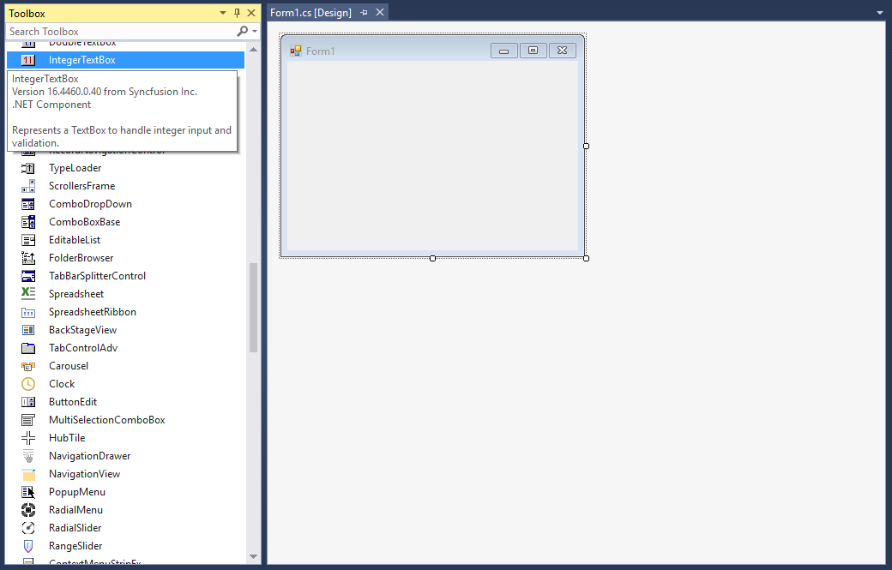
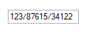

# Getting Started with WinForms Integer TextBox

## Assembly deployment

Refer to the [control dependencies](https://help.syncfusion.com/windowsforms/control-dependencies#integertextbox) section to get the list of assemblies or NuGet packages that need to be added as a reference to use the control in any application.

You can find more details about installing the NuGet packages in a Windows Forms application at the following link:

[How to install NuGet packages](https://help.syncfusion.com/windowsforms/installation/install-nuget-packages)

### Create a simple application with WinForms Integer TextBox

You can create a Windows Forms application with the WinForms Integer TextBox using the following steps:

### Create a project

Create a new Windows Forms project in Visual Studio to display the WinForms Integer TextBox control.

## Add control through designer

The WinForms Integer TextBox control can be added to an application by dragging it from the toolbox onto the designer surface. The **Syncfusion.Shared.Base** assembly reference will be added automatically:

## Add control manually in code

To add the control manually, follow the steps below:

1. Add the **Syncfusion.Shared.Base** assembly reference to the project.

2. Add the **Syncfusion.Windows.Forms.Tools** namespace:




using Syncfusion.Windows.Forms.Tools;


Imports Syncfusion.Windows.Forms.Tools



{{ codesnippet1 | OrderList_Indent_Level_1 }}

3. Create a WinForms Integer TextBox instance and add it to the form:




IntegerTextBox integerTextBox1 = new IntegerTextBox();
this.Controls.Add(integerTextBox1);


Dim integerTextBox1 As IntegerTextBox = New IntegerTextBox()
Me.Controls.Add(integerTextBox1)



{{ codesnippet2 | OrderList_Indent_Level_1 }}

## Maximum and minimum value constraints

You can set the maximum and minimum values using the [MaxValue](https://help.syncfusion.com/cr/windowsforms/Syncfusion.Windows.Forms.Tools.IntegerTextBox.html#Syncfusion_Windows_Forms_Tools_IntegerTextBox_MaxValue) and [MinValue](https://help.syncfusion.com/cr/windowsforms/Syncfusion.Windows.Forms.Tools.IntegerTextBox.html#Syncfusion_Windows_Forms_Tools_IntegerTextBox_MinValue) properties of the WinForms Integer TextBox.



this.integerTextBox1.MaxValue = 9223372036854775807L;
this.integerTextBox1.MinValue = -9223372036854775808L;


Me.integerTextBox1.MaxValue = 9223372036854775807L
Me.integerTextBox1.MinValue = -9223372036854775808L



## Number format

You can display the numbers in a custom format using the [NumberGroupSeparator](https://help.syncfusion.com/cr/windowsforms/Syncfusion.Windows.Forms.Tools.NumericTextBox.html#Syncfusion_Windows_Forms_Tools_NumericTextBox_NumberGroupSeparator) and [NumberGroupSizes](https://help.syncfusion.com/cr/windowsforms/Syncfusion.Windows.Forms.Tools.NumericTextBox.html#Syncfusion_Windows_Forms_Tools_NumericTextBox_NumberGroupSizes) properties of the WinForms Integer TextBox.



this.integerTextBox1.NumberGroupSeparator = "/";
this.integerTextBox1.IntegerValue = 1238761534122L;
this.integerTextBox1.NumberGroupSizes = new int[] { 5 };


Me.integerTextBox1.NumberGroupSeparator = "/"
Me.integerTextBox1.IntegerValue = 1238761534122L
Me.integerTextBox1.NumberGroupSizes = New Integer() { 5 }



 
