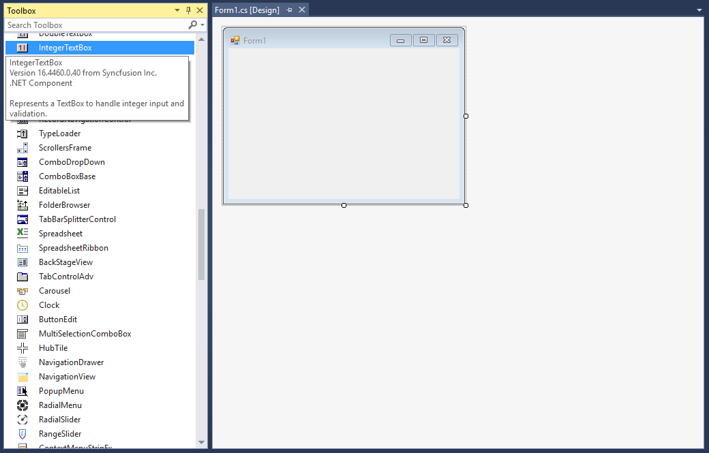

# Getting Started with Windows Forms Integer TextBox

## Assembly deployment

Refer to the [control dependencies](https://help.syncfusion.com/windowsforms/control-dependencies#integertextbox) section to get the list of assemblies or NuGet package that needs to be added as a reference to use the control in any application.

You can find more details about installing the NuGet packages in a Windows Forms application in the following link: 

[How to install nuget packages](https://help.syncfusion.com/windowsforms/installation/install-nuget-packages)

### Create a simple application with IntegerTextBox

You can create a Windows Forms application with IntegerTextBox using the following steps:

### Create a project

Create a new Windows Forms project in Visual Studio to display the IntegerTextBox control.

## Add control through designer

The IntegerTextBox control can be added to an application by dragging it from the toolbox to a designer view. The **Syncfusion.Shared.Base** assembly reference will be added automatically:

 

## Add control manually in code

To add the control manually in C#, follow the given steps:

1. Add the **Syncfusion.Shared.Base** assembly reference to the project: 
 
2. Include the **Syncfusion.Windows.Forms.Tools** namespace.




using Syncfusion.Windows.Forms.Tools;


Imports Syncfusion.Windows.Forms.Tools



{{ codesnippet1 | OrderList_Indent_Level_1 }}

3. Create an IntegerTextBox instance, and add it to the window.




IntegerTextBox integerTextBox1= new IntegerTextBox();
this.Controls.Add(integerTextBox1);


Dim integerTextBox1As IntegerTextBox = New IntegerTextBox()
Me.Controls.Add(integerTextBox1) 



{{ codesnippet2 | OrderList_Indent_Level_1 }}

 

## Maximum and minimum value constraints

You can set the maximum and minimum values using the [MaxValue](https://help.syncfusion.com/cr/windowsforms/Syncfusion.Windows.Forms.Tools.IntegerTextBox.html#Syncfusion_Windows_Forms_Tools_IntegerTextBox_MaxValue) and [MinValue](https://help.syncfusion.com/cr/windowsforms/Syncfusion.Windows.Forms.Tools.IntegerTextBox.html#Syncfusion_Windows_Forms_Tools_IntegerTextBox_MinValue) properties of IntegerTextBox.



this.integerTextBox1.MaxValue = 9223372036854775807;
this.integerTextBox1.MinValue = -9223372036854775808;


Me.integerTextBox1.MaxValue = 9223372036854775807
Me.integerTextBox1.MinValue = -9223372036854775808



## Number format

You can display the numbers in custom format using the [NumberGroupSeparator](https://help.syncfusion.com/cr/windowsforms/Syncfusion.Windows.Forms.Tools.NumericTextBox.html#Syncfusion_Windows_Forms_Tools_NumericTextBox_NumberGroupSeparator) and [NumberGroupSizes](https://help.syncfusion.com/cr/windowsforms/Syncfusion.Windows.Forms.Tools.NumericTextBox.html#Syncfusion_Windows_Forms_Tools_NumericTextBox_NumberGroupSizes) properties of IntegerTextBox.



this.integerTextBox1.NumberGroupSeparator = "/";
integerTextBox1.IntegerValue = 1238761534122;
this.integerTextBox1.NumberGroupSizes = new int[] { 5 };


Me.integerTextBox1.NumberGroupSeparator = "/"
integerTextBox1.IntegerValue = 1238761534122
Me.integerTextBox1.NumberGroupSizes = New Integer() { 5 }



 
