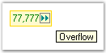

---
layout: post
title: Text Settings in Windows Forms IntegerTextBox | Syncfusion®
description: Learn about Text Settings support in Syncfusion Windows Forms IntegerTextBox (Integertextbox) control and more details.
platform: windowsforms
control: IntegerTextBox
documentation: ug
---

# Text Settings in WinForms Integer TextBox

This section discusses the text settings of the WinForms Integer TextBox control.

The text associated with the WinForms Integer TextBox control can be set and customized using the following properties:

* [Text](https://help.syncfusion.com/cr/windowsforms/Syncfusion.Windows.Forms.Tools.IntegerTextBox.html#Syncfusion_Windows_Forms_Tools_IntegerTextBox_Text) - Gets or sets the text shown in the text field.
* [TextAlign](https://docs.microsoft.com/en-us/dotnet/api/system.windows.forms.textbox.textalign?redirectedfrom=MSDN&view=netframework-4.7.2#System_Windows_Forms_TextBox_TextAlign) - Sets the horizontal alignment of the text.
* [SelectedText](https://help.syncfusion.com/cr/windowsforms/Syncfusion.Windows.Forms.Tools.NumberTextBoxBase.html#Syncfusion_Windows_Forms_Tools_NumberTextBoxBase_SelectedText) - Gets or sets the currently selected text.
* [SelectAllOnFocus](https://help.syncfusion.com/cr/windowsforms/Syncfusion.Windows.Forms.Tools.NumberTextBoxBase.html#Syncfusion_Windows_Forms_Tools_NumberTextBoxBase_SelectAllOnFocus) - When `true`, all text is selected automatically when the control receives focus.
* [ClipText](https://help.syncfusion.com/cr/windowsforms/Syncfusion.Windows.Forms.Tools.NumberTextBoxBase.html#Syncfusion_Windows_Forms_Tools_NumberTextBoxBase_ClipText) - Gets the clipped text without formatting (used for clipboard operations).



this.integerTextBox1.TextAlign = System.Windows.Forms.HorizontalAlignment.Center;
this.integerTextBox1.SelectedText = "-12345678";
this.integerTextBox1.SelectAllOnFocus = true;
this.integerTextBox1.ClipText = "12";


Me.integerTextBox1.TextAlign = System.Windows.Forms.HorizontalAlignment.Center
Me.integerTextBox1.SelectedText = "-12345678"
Me.integerTextBox1.SelectAllOnFocus = true
Me.integerTextBox1.ClipText = "12"



The methods associated with the above properties are:

* [GetClipText](https://help.syncfusion.com/cr/windowsforms/Syncfusion.Windows.Forms.Tools.NumberTextBoxBase.html#Syncfusion_Windows_Forms_Tools_NumberTextBoxBase_GetClipText)
* [Cut](https://help.syncfusion.com/cr/windowsforms/Syncfusion.Windows.Forms.Tools.NumberTextBoxBase.html#Syncfusion_Windows_Forms_Tools_NumberTextBoxBase_Cut)
* [Copy](https://help.syncfusion.com/cr/windowsforms/Syncfusion.Windows.Forms.Tools.NumberTextBoxBase.html#Syncfusion_Windows_Forms_Tools_NumberTextBoxBase_Copy)
* [Delete](https://help.syncfusion.com/cr/windowsforms/Syncfusion.Windows.Forms.Tools.NumberTextBoxBase.html#Syncfusion_Windows_Forms_Tools_NumberTextBoxBase_Delete)
* [Paste](https://help.syncfusion.com/cr/windowsforms/Syncfusion.Windows.Forms.Tools.NumberTextBoxBase.html#Syncfusion_Windows_Forms_Tools_NumberTextBoxBase_Paste)
* [SelectAll](https://help.syncfusion.com/cr/windowsforms/Syncfusion.Windows.Forms.Tools.NumberTextBoxBase.html#Syncfusion_Windows_Forms_Tools_NumberTextBoxBase_SelectAll)

## Clip mode

The formatting for the text can be enabled or disabled using the [ClipMode](https://help.syncfusion.com/cr/windowsforms/Syncfusion.Windows.Forms.Tools.NumberTextBoxBase.html#Syncfusion_Windows_Forms_Tools_NumberTextBoxBase_ClipMode) property.



this.integerTextBox1.ClipMode = Syncfusion.Windows.Forms.Tools.CurrencyClipModes.IncludeFormatting;


Me.integerTextBox1.ClipMode = Syncfusion.Windows.Forms.Tools.CurrencyClipModes.IncludeFormatting



## Formatted text

The formatted text (for example, with grouping separators applied) can be retrieved or set using the [FormattedText](https://help.syncfusion.com/cr/windowsforms/Syncfusion.Windows.Forms.Tools.NumberTextBoxBase.html#Syncfusion_Windows_Forms_Tools_NumberTextBoxBase_FormattedText) property.



this.integerTextBox1.FormattedText = "1,234";


Me.integerTextBox1.FormattedText = "1,234"



## RightToLeft

The text can be displayed from right to left for RTL languages by setting the [RightToLeft](https://help.syncfusion.com/cr/windowsforms/Syncfusion.Windows.Forms.Tools.NumberTextBoxBase.html#Syncfusion_Windows_Forms_Tools_NumberTextBoxBase_RightToLeft) property to the `RightToLeft.Yes` enum value.

>**NOTE**: The [RightToLeft](https://help.syncfusion.com/cr/windowsforms/Syncfusion.Windows.Forms.Tools.NumberTextBoxBase.html#Syncfusion_Windows_Forms_Tools_NumberTextBoxBase_RightToLeft) property will be automatically set to `Yes` for RTL languages.



this.integerTextBox1.RightToLeft = System.Windows.Forms.RightToLeft.Yes;


Me.integerTextBox1.RightToLeft = System.Windows.Forms.RightToLeft.Yes



>**NOTE**: The [ResetRightToLeft](https://help.syncfusion.com/cr/windowsforms/Syncfusion.Windows.Forms.Tools.NumberTextBoxBase.html#Syncfusion_Windows_Forms_Tools_NumberTextBoxBase_ResetRightToLeft) method can be used to reset the [RightToLeft](https://help.syncfusion.com/cr/windowsforms/Syncfusion.Windows.Forms.Tools.NumberTextBoxBase.html#Syncfusion_Windows_Forms_Tools_NumberTextBoxBase_RightToLeft) property to its default value.

## OverflowIndicatorToolTipText

You can set the tooltip text shown when the value overflows the visible area using the following properties:

* [OverflowIndicatorToolTipText](https://help.syncfusion.com/cr/windowsforms/Syncfusion.Windows.Forms.Tools.TextBoxExt.html#Syncfusion_Windows_Forms_Tools_TextBoxExt_OverflowIndicatorToolTipText) - Sets the tooltip text.
* [ShowOverflowIndicator](https://help.syncfusion.com/cr/windowsforms/Syncfusion.Windows.Forms.Tools.TextBoxExt.html#Syncfusion_Windows_Forms_Tools_TextBoxExt_ShowOverflowIndicator) - When `true`, shows an overflow indicator.
* [ShowOverflowIndicatorToolTip](https://help.syncfusion.com/cr/windowsforms/Syncfusion.Windows.Forms.Tools.TextBoxExt.html#Syncfusion_Windows_Forms_Tools_TextBoxExt_ShowOverflowIndicatorToolTip) - When `true`, shows the tooltip text on the indicator.



this.integerTextBox1.OverflowIndicatorToolTipText = "Overflow";
this.integerTextBox1.ShowOverflowIndicator = true;
this.integerTextBox1.ShowOverflowIndicatorToolTip = true;


Me.integerTextBox1.OverflowIndicatorToolTipText = "Overflow"
Me.integerTextBox1.ShowOverflowIndicator = True
Me.integerTextBox1.ShowOverflowIndicatorToolTip = True



A sample that demonstrates the Text, Text Align, and Overflow Indicator features of the WinForms Integer TextBox control is available at the following sample installation path:

`%LOCALAPPDATA%\Syncfusion\EssentialStudio\<Version Number>\Windows\Tools.Windows\Samples\Editor Controls\Editor Controls\CS`
