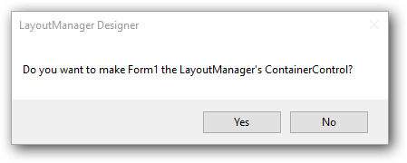
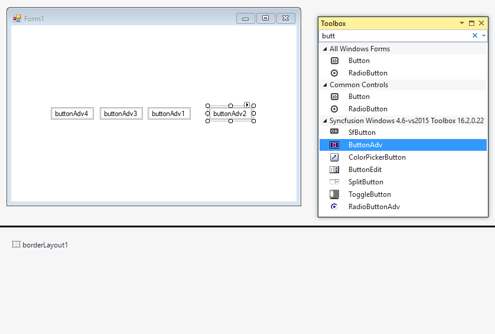

# BorderLayout

BorderLayout is a Layout Manager which allows the user to arrange and layout the Child controls along the borders and at the center, just like the .NET framework's built-in docking support.

N> BorderLayout does not arrange the Child components automatically like the other Layout Managers.

# Key Features

**Spacing** - Provides option to customize horizontal and vertical gaps between child controls

**Position** - Provides options to set the direction of child controls such as north, south, east, west or center.

**Size** - Provides option to  customize the size of the child controls in BorderLayout.

# Getting started

This section describes how to add `BorderLayout` control in a Windows Forms application and overview of its basic functionalities.

## Assembly deployment

The following list of assemblies should be added as reference to use the BorderLayout in any application:

<table>
<tr>
<td>
{{'**Required assemblies**'| markdownify }}
</td>
<td>
{{'**Description**'| markdownify }}
</td>
</tr>
<tr>
<td>
Syncfusion.Shared.Base
</td>
<td>
The Syncfusion.Shared.Base contains the class that handles all UI operations and contains helper class of BorderLayout control.
</td>
</tr>
</table>

# Installing NuGet Packages

To use BorderLayout control in Windows Forms application via nuget, the following packages should be installed.
 
<table>
<tr>
<td>{{'**S.No**'| markdownify }}
</td>
<td>{{'**Framework version**'| markdownify }}
</td>
<td>{{'**NuGet Packages**'| markdownify }}
</td>
</tr>
<tr>
<td> 1
</td>
<td> 2.0
</td>
<td> Syncfusion.Shared.Base20
</td>
</tr>
<tr>
<td> 2
</td>
<td> 3.5
</td>
<td> Syncfusion.Shared.Base35
</td>
</tr>
<tr>
<td> 3
</td>
<td> 4.0
</td>
<td> Syncfusion.Shared.Base40
</td>
</tr>
<tr>
<td> 4
</td>
<td> 4.5
</td>
<td> Syncfusion.Shared.Base45
</td>
</tr>
<tr>
<td> 5
</td>
<td> 4.5.1
</td>
<td> Syncfusion.Shared.Base451
</td>
</tr>
<tr>
<td> 6
</td>
<td> 4.6
</td>
<td>Syncfusion.Shared.Base46
</td>
</tr>
</table>

 
Please find more details regarding how to install the nuget packages in windows form application in the below link:
 
[How to install nuget packages](https://help.syncfusion.com/windowsforms/nuget-packages)

# Creating simple application with BorderLayout

You can create the Windows Forms application with BorderLayout control as follows:

1. [Creating project](#creating-the-project)
2. [Adding control via Designer](#adding-control-via-designer)
3. [Adding control manually in code](#adding-control-manually-in-code)

### Creating the project

Create a new Windows Forms project in the Visual Studio to display the BorderLayout with basic functionalities.

## Adding control via designer

The BorderLayout control can be added to the application by dragging it from the toolbox and dropping it in a designer view. The following required assembly references will be added automatically:

* Syncfusion.Shared.Base.dll

To add the form as a Container control of the BorderLayout, click `Yes` in a popup form which appears automatically before BorderLayout gets added.

**Adding layout components**

The child controls can be added to the layout by dragging it from the toolbox and dropping it in a designer view.

## Adding control manually in code

To add control manually in C#, follow the given steps:

1. Add the following required assembly references to the project:

	* Syncfusion.Shared.Base.dll

2. Include the namespaces **Syncfusion.Shared.Base**.





using Syncfusion.Shared.Base;





Imports Syncfusion.Shared.Base



 

3. Create `BorderLayout` control instance and set `ContainerControl` as form.





BorderLayout borderLayout1 = new BorderLayout();

this.borderLayout1.ContainerControl = this;





Dim borderLayout1 As BorderLayout = New BorderLayout()

Me.borderLayout1.ContainerControl = Me





**Adding Layout components**

The child controls can be added to the layout by simply adding it to the form, since the form is its container control.





ButtonAdv buttonAdv1 = new ButtonAdv();
ButtonAdv buttonAdv2 = new ButtonAdv();
ButtonAdv buttonAdv3 = new ButtonAdv();

this.buttonAdv1.Text = "buttonAdv1";
this.buttonAdv2.Text = "buttonAdv2";
this.buttonAdv3.Text = "buttonAdv3";

this.Controls.Add(this.buttonAdv1);
this.Controls.Add(this.buttonAdv2);
this.Controls.Add(this.buttonAdv3);





Dim buttonAdv1 As ButtonAdv = New ButtonAdv()
Dim buttonAdv3 As ButtonAdv = New ButtonAdv()
Dim buttonAdv3 As ButtonAdv = New ButtonAdv()

Me.buttonAdv1.Text = "buttonAdv1"
Me.buttonAdv2.Text = "buttonAdv2"
Me.buttonAdv3.Text = "buttonAdv3"

Me.Controls.Add(this.buttonAdv1)
Me.Controls.Add(this.buttonAdv2)
Me.Controls.Add(this.buttonAdv3)





## Configuring BorderLayout

The configuration settings for the BorderLayout have been discussed in this topic.

### Spacing

The horizontal and the vertical gap between the Child controls can be set using the properties given below.

<table>
<tr>
<th>
BorderLayout properties</th><th>
Description</th></tr>
<tr>
<td>
HGap</td><td>
Gets/sets the horizontal spacing between the components.</td></tr>
<tr>
<td>
VGap</td><td>
Gets/sets the vertical spacing between the components.</td></tr>
</table>





this.borderLayout1.HGap = 10;

this.borderLayout1.VGap = 10;





Me.borderLayout1.HGap = 10

Me.borderLayout1.VGap = 10





## Configuring Child controls

The Child controls can be aligned to various positions (North, South, East, West and Center) using the property given below.

<table>
<tr>
<th>Child control property</th>
<th>Description</th>
</tr>
<tr>
<td>Position on borderLayout</td>
<td>Gets/sets the border position for a Child component.</td>
</tr>
</table>

### Child control property description

Position on borderLayout - Gets/sets the border position for a Child component.
 
N> This property is added as an extended property in the properties window of the Child control added to the BorderLayout.

  

  

this.borderLayout1.SetPosition(this.btnNorth, Syncfusion.Windows.Forms.Tools.BorderPosition.North);
 




Me.borderLayout1.SetPosition(Me.btnNorth, Syncfusion.Windows.Forms.Tools.BorderPosition.North)





 
Setting the position of button1 on BorderLayout to "North"
{:.caption}
 

 
Layout of all Button Controls using BorderLayout
{:.caption}

N> BorderLayout allows only one control to be aligned along a particular layout position, unlike the .NET Framework support.



[Creating a Simple Layout](/windowsforms/layoutmanagers/creating-a-simple-layout), [Margin Settings](/windowsforms/layoutmanagers/layout-manager-settings#margin-settings), [Border Layout - Configuring Child Controls](#configuring-child-controls), and
[Configuring BorderLayout.](#configuring-borderlayout)

