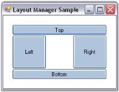

# Layout Manager Settings

The settings that are common to all the Layout Manager's have been discussed in this section.

It includes the below given topics.

## Behavior Settings

The behavior settings that are common to all the Layout Managers are discussed below.

## AutoLayout

The Layout Manager, by default, listens to the Container'sLayout events and performs the layout automatically.

<table>
<tr>
<th>
LayoutManager Property</th><th>
Description</th></tr>
<tr>
<td>
AutoLayout</td><td>
Indicates whether the Layout Manager should layout automatically on Layout event.</td></tr>
</table>



this.borderLayout1.AutoLayout = true;





Me.borderLayout1.AutoLayout = True



N> The above process can be prevented by setting the AutoLayout property to 'False' and invoking the layout explicitly through a call to the LayoutContainer() method.

## ContainerControl

The Container control to be laid out by the Layout Manager can be specified using the below given property.

<table>
<tr>
<th>
LayoutManager Property</th><th>
Description</th></tr>
<tr>
<td>
ContainerControl</td><td>
Specifies the Container control that the Layout Manager will layout.</td></tr>
</table>



this.borderLayout1.ContainerControl = this;





Me.borderLayout1.ContainerControl = Me



## Custom Layout Bounds

The Layout Manager will, by default, layout the Child components within the Container control's client rectangle. However, you can specify any custom layout bounds using the property given below.

<table>
<tr>
<th>
LayoutManager Property</th><th>
Description</th></tr>
<tr>
<td>
CustomLayoutBounds</td><td>
Specifies the custom layout bounds, if any, to be used for layout calculation instead of the Container control's client rectangle.</td></tr>
</table>



this.borderLayout1.CustomLayoutBounds = new System.Drawing.Rectangle(0, 0, 0, 0);





Me.borderLayout1.CustomLayoutBounds = New System.Drawing.Rectangle(0, 0, 0, 0)



N> When you specify the custom layout bounds and the Container is resizable, you should also set the AutoLayout property to 'False' and set a new custom layout Note: The layout is done within the Container's client rectangle, even if the Container has a scrollable display rectangle._

## Margin Settings

The margin settings that are common to all the Layout Managers are discussed below.

The layout bounds will also be adjusted to include some margin space along the borders according to the values specified in the properties given below. The default values of these properties are set to 'Zero'.

<table>
<tr>
<th>
LayoutManager Properties</th><th>
Description</th></tr>
<tr>
<td>
TopMargin</td><td>
Gets / sets the top margin between the client rectangle and the layout rectangle.</td></tr>
<tr>
<td>
HorzNearMargin</td><td>
Gets / sets the left margin between the client rectangle and the layout rectangle.</td></tr>
<tr>
<td>
HorzFarMargin</td><td>
Gets / sets the right margin between the client rectangle and the layout rectangle.</td></tr>
<tr>
<td>
BottonMargin</td><td>
Gets / sets the bottom margin between the client rectangle and the layout rectangle.</td></tr>
</table>



this.borderLayout1.TopMargin = 20;

this.borderLayout1.HorzFarMargin = 20;

this.borderLayout1.HorzNearMargin = 20;

this.borderLayout1.BottomMargin = 20;





Me.borderLayout1.TopMargin = 20

Me.borderLayout1.HorzFarMargin = 20

Me.borderLayout1.HorzNearMargin = 20

Me.borderLayout1.BottomMargin = 20


 | markdownify }



[Configuring BorderLayout](/windowsforms/layoutmanagers/borderlayout#configuring-borderlayout), [Configuring FlowLayout](/windowsforms/layoutmanagers/flowlayout#configuring-flowlayout), [Configuring GridLayout](/windowsforms/layoutmanagers/gridlayout#configuring-gridlayout)



## Child Control Settings

The Child control settings for the Layout Managers are given below.

### Size

### Preferred Size

The Layout Managers usually layout the components based on their preferred sizes. But a .NETcontrol does not provide information regarding it's preferred size. To overcome this, a PreferredSize extended property is provided for each Child control at design time.

In code, you can perform the same using the methods given below.

<table>
<tr>
<th>
Methods</th><th>
Description</th></tr>
<tr>
<td>
SetPreferredSize</td><td>
Associates a preferred size with the specified control.</td></tr>
<tr>
<td>
GetPreferredSize</td><td>
Retrieves the preferred size associated with the specified control.</td></tr>
</table>



this.cardLayout1.SetPreferredSize(this.button1, new System.Drawing.Size(75, 92));





Me.cardLayout1.SetPreferredSize(Me.button1, New System.Drawing.Size(75, 92))



### Minimum Size

You can similarly associate a minimum size for a Child component through the MinimumSize extended property. However, some Layout Managers ignore this setting. Refer to the individual Layout Managers for more information on how the size plays an important part in the layout logic.

In code, you can perform the same using the methods given below.

<table>
<tr>
<th>
Methods</th><th>
Description</th></tr>
<tr>
<td>
SetMinimumSize</td><td>
Associates a minimum size with the specified control.</td></tr>
<tr>
<td>
GetMinimumSize</td><td>
Retrieves the minimum size associated with the specified control.</td></tr>
</table>



this.cardLayout1.SetMinimumSize(this.button1, new System.Drawing.Size(75, 92));





Me.cardLayout1.SetMinimumSize(Me.button1, New System.Drawing.Size(75, 92))



You can also dynamically provide preferred and minimum size information for a Child component at run time. The manner in which a Layout Manager determines the preferred size for a Child control is illustrated below.

* The layout manager checks if the Child control / component implements the IProvideLayoutInformation interface. If so, it calls into that interface to retrieve the preferred size.
* If the above step fails, the Layout Manager fires the ProvideLayoutInformation event, requesting the size information required. If the event is handled and the information provided, that size will be used.
* If the above step fails, the Layout Manager checks if a preferred size was provided statically during design time using the extended PreferredSize property or in code using the SetPreferredSize() method. If so, that size is used. If not, the current size of the Child control is made the preferred size and that size will be used.

 

N> The same steps are used to determine the minimum size, if required, for a Child control.
>
N> The above properties are available as the extended properties for the Child controls of CardLayout, FlowLayout and GridBagLayout only.



[BorderLayout – Configuring Child Control](/windowsforms/layoutmanagers/borderlayout#configuring-child-controls), [CardLayout - Configuring Child Controls](/windowsforms/layoutmanagers/cardlayout#configuring-child-controls), [FlowLayout - Configuring Child Controls](/windowsforms/layoutmanagers/flowlayout#configuring-child-controls), [GridLayout - Configuring Child Controls](/windowsforms/layoutmanagers/gridlayout#configuring-child-controls), [GridBagLayout - Configuring Child Controls](/windowsforms/layoutmanagers/gridbaglayout#configuring-child-controls)

