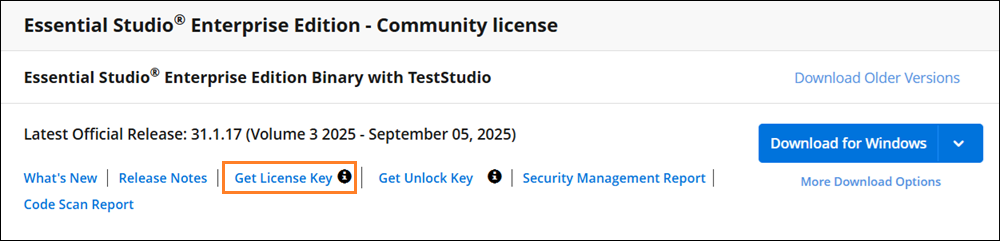
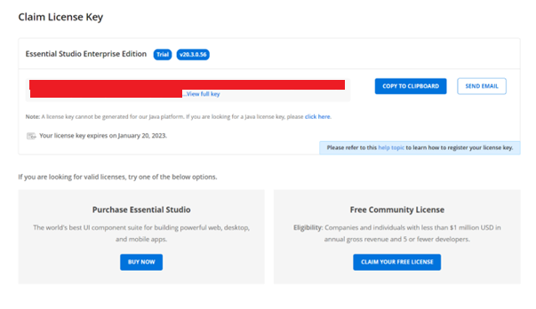
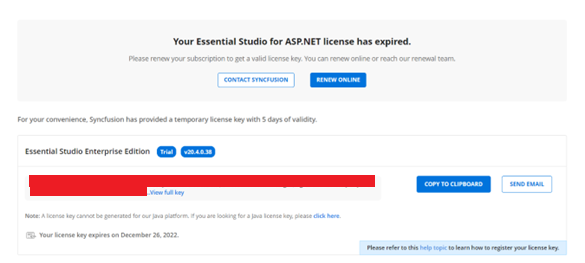
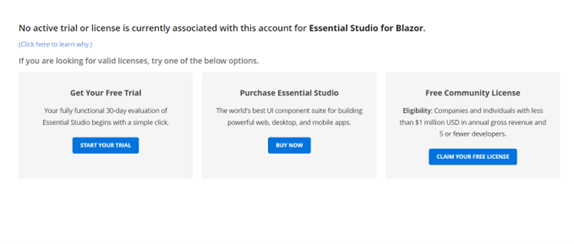

# Generate Syncfusion Windows Forms License Key

License keys for Windows Forms can be generated from the [License & Downloads](https://www.syncfusion.com/account/downloads) or [Trial & Downloads](https://www.syncfusion.com/account/manage-trials/downloads) section from your Syncfusion account.

1. Sign in to your [Syncfusion account](https://www.syncfusion.com/account).
2. Navigate to the [License & Downloads](https://www.syncfusion.com/account/downloads) section.
3. Select the **Windows Forms** platform and the required version, then click **Generate Key**.

I> * Syncfusion license keys are **version and platform specific**, refer to the [KB](https://support.syncfusion.com/kb/article/7898/how-to-generate-license-key-for-licensed-products) to generate the license key for the required version and platform.
* Refer this [KB](https://support.syncfusion.com/kb/article/7865/which-version-syncfusion-license-key-should-i-use-in-my-application) to know about which version of the Syncfusion license key should be used in the application.

## Claim License Key

Syncfusion license keys can also be generated from the **"Claim License Key"** page based on the trial or valid license associated with your Syncfusion account. The **Claim License Key** button is also available directly from the application licensing-warning popup.

You can get the license key, based on license availability in your Syncfusion account.

### Active License

If you have a Syncfusion account associated with a valid license, the license key will be generated from the claim license key page.

### Active Trial

If you have a Syncfusion account associated with a valid trial license, the license key will be generated from the claim license key page with an expiry date.

### Expired License

If you have a Syncfusion account with an expired license, your license subscription must be renewed to obtain a valid license key for the latest Essential Studio version. Meanwhile, a temporary license key with a 5-day validity period will be generated.

To renew, see [My Renewals](https://www.syncfusion.com/account/my-renewals).

### No Trial or No License or Expired trial

If the Syncfusion account is not associated with a trial, license, or expired trial, you can start a new trial from the [Start Trial](https://www.syncfusion.com/account/manage-trials/start-trials) page. After starting the trial, generate the key from the [Trial & Downloads](https://www.syncfusion.com/account/manage-trials/downloads) page.

## See Also

* [How to Register Syncfusion License Key in Windows Forms Application?](https://help.syncfusion.com/windowsforms/licensing/how-to-register-in-an-application)