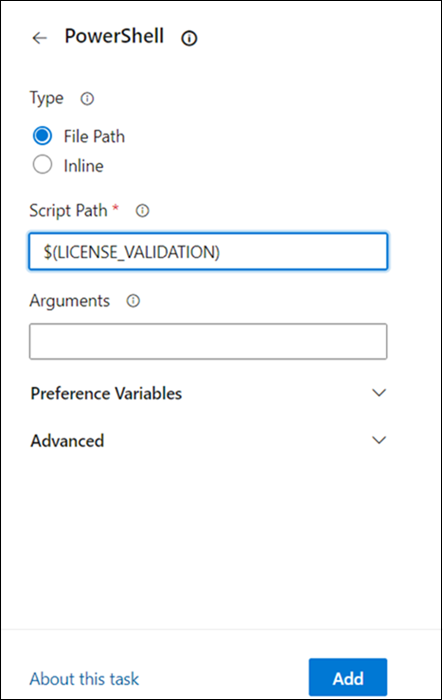
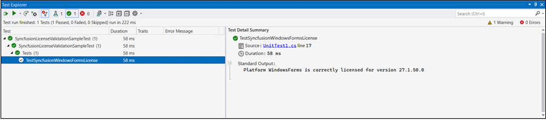
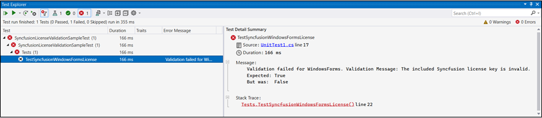

# Syncfusion License Key Validation in CI Services

Syncfusion license key validation in CI services ensures that Syncfusion Essential Studio components are properly licensed during CI processes. Validating the license key at the CI level can prevent licensing errors during deployment. Set up the CI process to fail when the license key validation fails by surfacing a non-zero exit code from the validation script.

This feature is supported from version 16.2.0.41 of Essential Studio and later. From v34.1.29 onwards, the platform identifier changed from `WindowsForms` to `UIComponent`; this is a breaking change for the validator script's `/platform:` argument.

The PowerShell validator returns exit code `0` on success and a non-zero exit code on failure; the CI pipeline should treat any non-zero exit as a build failure.

The following sections show how to validate the Syncfusion license key in CI services.

* Download and extract the `LicenseKeyValidator.zip` utility from the following link: [LicenseKeyValidator](https://s3.amazonaws.com/files2.syncfusion.com/Installs/LicenseKeyValidation/LicenseKeyValidator.zip). Extract the contents to a known location, for example `D:\LicenseKeyValidator`.

* Open the `LicenseKeyValidation.ps1` PowerShell script in a text or code editor, as shown in the example below.



# Replace the parameters with the desired platform, version, and actual license key.

$result = & $PSScriptRoot"\LicenseKeyValidatorConsole.exe" /platform:"UIComponent" /version:"34.1.29" /licensekey:"Your License Key"

Write-Host $result



# Replace the parameters with the desired platform, version, and actual license key.

$result = & $PSScriptRoot"\LicenseKeyValidatorConsole.exe" /platform:"WindowsForms" /version:"26.2.4" /licensekey:"Your License Key"

Write-Host $result



* Update the parameters in the script:
  
  **Platform:** Set `/platform:"UIComponent"` for v34.1.29 and later, or `/platform:"WindowsForms"` for earlier versions (use the relevant Syncfusion platform as needed).

  **Version:** Change the value for `/version:` to the required version (e.g., `"34.1.29"` for v34+ or `"26.2.4"` for earlier versions).

  **License Key:** Replace the value for `/licensekey:` with your actual license key (e.g., `"YOUR LICENSE KEY"`).

  N> This feature is supported from version 16.2.0.41 of Essential Studio and later. The `Platform.UIComponent` value replaces `Platform.WindowsForms` from v34.1.29 onwards.

## Azure Pipelines

### YAML

* Create a new [User-defined Variable](https://learn.microsoft.com/en-us/azure/devops/pipelines/process/variables?view=azure-devops&tabs=yaml%2Cbatch#user-defined-variables) named `LICENSE_VALIDATION` in the Azure Pipeline. Use the path of the `LicenseKeyValidation.ps1` script file as the value (e.g., `D:\LicenseKeyValidator\LicenseKeyValidation.ps1`).

* Add the PowerShell task to the pipeline to execute the script and validate the license key.

The following example shows the syntax for Windows build agents.



pool:
  vmImage: 'windows-latest'

steps:

- task: PowerShell@2
  inputs:
    targetType: filePath
    filePath: $(LICENSE_VALIDATION) #Or the actual path to the LicenseKeyValidation.ps1 script.
  
  displayName: Syncfusion License Validation



## Azure Pipelines (Classic)

* Create a new [User-defined Variable](https://learn.microsoft.com/en-us/azure/devops/pipelines/process/variables?view=azure-devops&tabs=yaml%2Cbatch#user-defined-variables) named `LICENSE_VALIDATION` in the Azure Pipeline. Use the path of the `LicenseKeyValidation.ps1` script file as the value (e.g., `D:\LicenseKeyValidator\LicenseKeyValidation.ps1`).

* Add the PowerShell task to the pipeline to execute the script and validate the license key.

## GitHub Actions

* To execute the script in PowerShell as part of a GitHub Actions workflow, add a step in the configuration file and update the path of the `LicenseKeyValidation.ps1` script file (e.g., `D:\LicenseKeyValidator\LicenseKeyValidation.ps1`).

The following example shows the syntax for validating the Syncfusion license key in GitHub Actions.



  steps:
  - name: Syncfusion License Validation
    shell: pwsh
    run: |
	  ./path/LicenseKeyValidator/LicenseKeyValidation.ps1



## Jenkins

* Create an [Environment Variable](https://www.jenkins.io/doc/pipeline/tour/environment) named `LICENSE_VALIDATION`. Use the path of the `LicenseKeyValidation.ps1` script file as the value (e.g., `D:\LicenseKeyValidator\LicenseKeyValidation.ps1`).

* Add a stage in the Jenkins pipeline to execute the `LicenseKeyValidation.ps1` script in PowerShell. On Windows agents, use the `bat` step (the `sh` step is for Linux/Unix agents).

The following example shows the syntax for validating the Syncfusion license key in the Jenkins pipeline on a Windows agent.



pipeline {
	agent any
	environment {
		LICENSE_VALIDATION = 'path\\to\\LicenseKeyValidator\\LicenseKeyValidation.ps1'
	}
	stages {
		stage('Syncfusion License Validation') {
			steps {
				bat 'pwsh %LICENSE_VALIDATION%'
			}
		}
	}
}



## Validate the License Key By Using the ValidateLicense() Method

* Register the license key properly by calling `RegisterLicense("License Key")` with the license key.

* Once the license key is registered, it can be validated by using the `ValidateLicense(Platform.WindowsForms)` method (or `ValidateLicense(new[] { Platform.UIComponent })` for v34.1.29+). This ensures that the license key is valid for the platform and version you are using. The method returns `true` when the registered key is valid; the `out string validationMessage` overload also returns a description of any failure. Refer to the following example.



using Syncfusion.Licensing;

// Register the Syncfusion license key
SyncfusionLicenseProvider.RegisterLicense("YOUR LICENSE KEY");

//Validate the registered license key.
// The array overload allows validating against multiple platforms in a single call.
bool isValid = SyncfusionLicenseProvider.ValidateLicense(new[] { Platform.UIComponent });



using Syncfusion.Licensing;

// Register the Syncfusion license key
SyncfusionLicenseProvider.RegisterLicense("YOUR LICENSE KEY");

// Validate the registered license key
bool isValid = SyncfusionLicenseProvider.ValidateLicense(Platform.WindowsForms);



N> Use `Platform.UIComponent` for UI component license validation in v34.1.29 and later. `Platform.WindowsForms` is not supported from v34.1.29 onwards.

* If the `ValidateLicense()` method returns `true`, the registered license key is valid and the build can proceed with deployment.
* If the `ValidateLicense()` method returns `false`, the deployment will report invalid license errors. This typically means the license key is invalid or the referenced assembly/package version does not match the license key's version. Please ensure that all the referenced Syncfusion assemblies or NuGet packages are on the same version as the license key's version before deployment.

## Validate the License Key By Using the Unit Test Project

* To create a unit test project in Visual Studio, choose **File -> New -> Project** from the menu. This opens a dialog for creating a new project. Filter the project type by Test, or type Test as a keyword in the search box, to find the available unit test project templates. Select the test framework (such as MSTest, NUnit, or xUnit) that best suits your needs.

* For more details on creating unit test projects in Visual Studio, refer to the [Getting Started with Unit Testing guide](https://learn.microsoft.com/en-us/visualstudio/test/getting-started-with-unit-testing?view=vs-2022&tabs=dotnet%2Cmstest#create-unit-tests).

* Add a reference to the application/project under test (or to the same `Syncfusion.Licensing` NuGet package the application uses), and add the `Syncfusion.Licensing` NuGet package to the test project. Register the license key by calling the `RegisterLicense("YOUR LICENSE KEY")` method in the test project's setup (or load it from an environment variable / secret).

N> * Place the license key between double quotes (e.g., `RegisterLicense("YOUR LICENSE KEY")`). Ensure that `Syncfusion.Licensing.dll` is referenced in the project where the license key is being registered.

* Once the license key is registered, it can be validated by using the ValidateLicense("Platform.WindowsForms", out var validationMessage) method. This ensures that the license key is valid for the platform and version you are using.

* Refer to the following example, which demonstrates how to register and validate the license key in the unit test project.



public void TestSyncfusionWindowsFormsLicense()
{
	var platform = Platform.WindowsForms;
	// Register the Syncfusion license key
	SyncfusionLicenseProvider.RegisterLicense("Your License Key");

	bool isValidLicense = SyncfusionLicenseProvider.ValidateLicense(platform, out var validationMessage);
	Assert.That(isValidLicense, Is.True, $"Validation failed for {platform}." + $" Validation Message: {validationMessage}");

	// Log validation messages to TestContext output
	if (isValidLicense)
	{
		TestContext.Out.WriteLine($"Platform {platform} is correctly licensed for version " + $"{typeof(SyncfusionLicenseProvider).Assembly.GetName().Version}");
	}
}



* After running the test, the output below appears in the Test Explorer window on success.

* If the license validation fails during unit testing, the following output will be displayed in the Test Explorer window.

### Troubleshooting

License validation fails due to either an invalid license key or an incorrect assembly or package version referenced in the project. Perform the following steps:

1. Verify that you are using a valid license key for the platform.
2. Ensure that the assembly or package versions referenced in the project match the version of the license key.
3. Confirm that `Syncfusion.Licensing.dll` (or the `Syncfusion.Licensing` NuGet package) is referenced in the project.