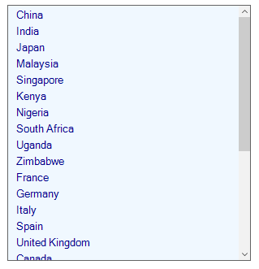
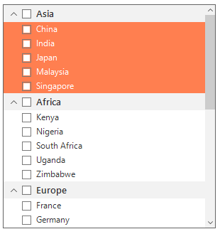
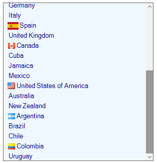
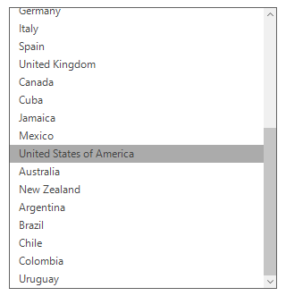
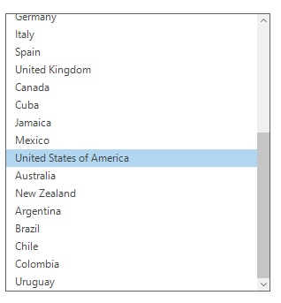
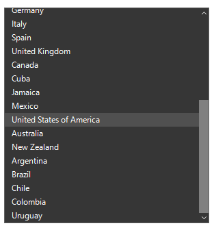

# Appearance
SfListView allows to customize the appearance of selected items through the [SfListView.Style](https://help.syncfusion.com/cr/windowsforms/Syncfusion.WinForms.ListView.SfListView.html#Syncfusion_WinForms_ListView_SfListView_Style) property that contains all the settings for Item and Items Group appearance customizations.

## Customizing item appearance
Item appearance can be customized by using the `SfListView.Style.ItemStyle` property that contains all the settings for the item appearance customization.



sfListView1.Style.ItemStyle.BackColor = Color.AliceBlue;
sfListView1.Style.ItemStyle.ForeColor = Color.DarkBlue;
sfListView1.Style.ItemStyle.TextAlignment = ContentAlignment.BottomLeft;
sfListView1.Style.ItemStyle.Font = new Font("Segoe UI", 10);


sfListView1.Style.ItemStyle.BackColor = Color.AliceBlue
sfListView1.Style.ItemStyle.ForeColor = Color.DarkBlue
sfListView1.Style.ItemStyle.TextAlignment = ContentAlignment.BottomLeft
sfListView1.Style.ItemStyle.Font = New Font("Segoe UI", 10)


         
        
                             
## Customizing items group appearance
The items group appearance can be customized by using the `SfListView.Style.GroupItemStyle` property that contains all the settings for the items group appearance customization.



sfListView1.Style.GroupItemStyle.BackColor = Color.PaleTurquoise;
sfListView1.Style.GroupItemStyle.ForeColor = Color.DarkRed;
sfListView1.Style.GroupItemStyle.TextAlignment = ContentAlignment.BottomLeft;
sfListView1.Style.GroupItemStyle.Font = new Font("Segoe UI", 12);


sfListView1.Style.GroupItemStyle.BackColor = Color.PaleTurquoise
sfListView1.Style.GroupItemStyle.ForeColor = Color.DarkRed
sfListView1.Style.GroupItemStyle.TextAlignment = ContentAlignment.BottomLeft
sfListView1.Style.GroupItemStyle.Font = New Font("Segoe UI", 12)



## Conditional styling
The SfListView allows the items customization by using [SfListView.DrawItem](https://help.syncfusion.com/cr/windowsforms/Syncfusion.WinForms.ListView.SfListView.html#Syncfusion_WinForms_ListView_SfListView_DrawItem) event.



sfListView1.DrawItem += new EventHandler<Syncfusion.WinForms.ListView.Events.DrawItemEventArgs>(SfListView1_DrawItem);
private void SfListView1_DrawItem(object sender, DrawItemEventArgs e)
{
  if(e.ItemType == ItemType.Record && (e.ItemData as CountryInfo).Continent == "Asia")
  {
      e.Style.BackColor = Color.Coral;
      e.Style.ForeColor = Color.White;
  }
}


AddHandler sfListView1.DrawItem, AddressOf SfListView1_DrawItem
Private Sub SfListView1_DrawItem(ByVal sender As Object, ByVal e As DrawItemEventArgs)
  If e.ItemType Is ItemType.Record AndAlso (TryCast(e.ItemData, CountryInfo)).Continent = "Asia" Then
	  e.Style.BackColor = Color.Coral
	  e.Style.ForeColor = Color.White
  End If
End Sub



## Adding image to an item
The SfListView allows adding image to each item by using the [SfListView.DrawItem](https://help.syncfusion.com/cr/windowsforms/Syncfusion.WinForms.ListView.SfListView.html#Syncfusion_WinForms_ListView_SfListView_DrawItem) event. An image can be set to an item by using the `Image` property.



sfListView1.DrawItem += new EventHandler<Syncfusion.WinForms.ListView.Events.DrawItemEventArgs>(SfListView1_DrawItem);
private void SfListView1_DrawItem(object sender, Syncfusion.WinForms.ListView.Events.DrawItemEventArgs e)
{            
    if (e.Text == "Spain" && e.Value.ToString() == "Europe")
   {
       e.Image = Image.FromFile(@"..\..\Flags\Spain.png");
       e.ImageAlignment = ContentAlignment.BottomLeft;
   }
   else if (e.Text == "United States of America" && e.Value.ToString() == "North America")
   {
       e.Image = Image.FromFile(@"..\..\Flags\USA.png");
       e.ImageAlignment = ContentAlignment.BottomLeft;
   }
   else if (e.Text == "Canada" && e.Value.ToString() == "North America")
   {
       e.Image = Image.FromFile(@"..\..\Flags\Canada.png");
       e.ImageAlignment = ContentAlignment.BottomLeft;
   }
   else if (e.Text == "Argentina" && e.Value.ToString() == "South America")
   {
       e.Image = Image.FromFile(@"..\..\Flags\Argentina.png");
       e.ImageAlignment = ContentAlignment.BottomLeft;
   }
   else if (e.Text == "Colombia" && e.Value.ToString() == "South America")
   {
       e.Image = Image.FromFile(@"..\..\Flags\Colombia.png");
       e.ImageAlignment = ContentAlignment.BottomLeft;
   }
}


AddHandler sfListView1.DrawItem, AddressOf SfListView1_DrawItem
Private Sub SfListView1_DrawItem(ByVal sender As Object, ByVal e As Syncfusion.WinForms.ListView.Events.DrawItemEventArgs)
   If e.Text = "Spain" AndAlso e.Value.ToString() = "Europe" Then
	   e.Image = Image.FromFile("..\..\Flags\Spain.png")
	   e.ImageAlignment = ContentAlignment.BottomLeft
   ElseIf e.Text = "United States of America" AndAlso e.Value.ToString() = "North America" Then
	   e.Image = Image.FromFile("..\..\Flags\USA.png")
	   e.ImageAlignment = ContentAlignment.BottomLeft
   ElseIf e.Text = "Canada" AndAlso e.Value.ToString() = "North America" Then
	   e.Image = Image.FromFile("..\..\Flags\Canada.png")
	   e.ImageAlignment = ContentAlignment.BottomLeft
   ElseIf e.Text = "Argentina" AndAlso e.Value.ToString() = "South America" Then
	   e.Image = Image.FromFile("..\..\Flags\Argentina.png")
	   e.ImageAlignment = ContentAlignment.BottomLeft
   ElseIf e.Text = "Colombia" AndAlso e.Value.ToString() = "South America" Then
	   e.Image = Image.FromFile("..\..\Flags\Colombia.png")
	   e.ImageAlignment = ContentAlignment.BottomLeft
   End If
End Sub



## Themes

The SfListView offers four built-in themes for professional representation as follows:
* Office2016Colorful
* Office2016White
* Office2016DarkGray
* Office2016Black

Themes can be applied to the SfListView by using the following steps:

1. `Load theme assembly`
2. `Apply theme`

### Load theme assembly
The Syncfusion.Office2016Theme.WinForms assembly should be added as reference to set theme for the SfListView in any application.
Before applying theme to the SfListView, required theme assembly should be loaded.



using Syncfusion.WinForms.Controls;
{
    static class Program
    {                
        static void Main()
        {
            SfSkinManager.LoadAssembly(typeof(Office2016Theme).Assembly);
            Application.EnableVisualStyles();
            Application.SetCompatibleTextRenderingDefault(false);
            Application.Run(new Form1());
        }
    }
}


Private ReadOnly Property Controls() As using Implements Syncfusion.WinForms.Controls
	static class Program
		static void Main()
			SfSkinManager.LoadAssembly(GetType(Office2016Theme).Assembly)
			Application.EnableVisualStyles()
			Application.SetCompatibleTextRenderingDefault(False)
			Application.Run(New Form1())
End Property



### Apply theme
Appearance of the SfListView can be changed by using the ThemeName.

#### Office2016Colorful
This option helps to set the Office2016Colorful Theme.



sfListView1.ThemeName = "Office2016Colorful";


sfListView1.ThemeName = "Office2016Colorful"



#### Office2016White
This option helps to set the Office2016White Theme.



sfListView1.ThemeName = "Office2016White";


sfListView1.ThemeName = "Office2016White"



 
#### Office2016DarkGray
This option helps to set the Office2016DarkGray Theme.



sfListView1.ThemeName = "Office2016DarkGray";


sfListView1.ThemeName = "Office2016DarkGray"



#### Office2016Black
This option helps to set the Office2016Black Theme.



sfListView1.ThemeName = "Office2016Black";


sfListView1.ThemeName = "Office2016Black"



