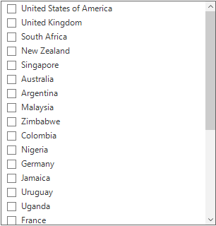
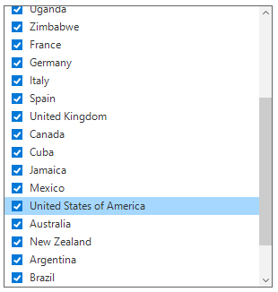
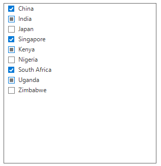
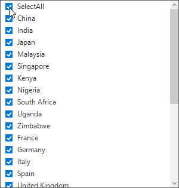
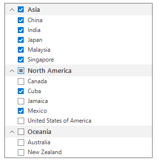
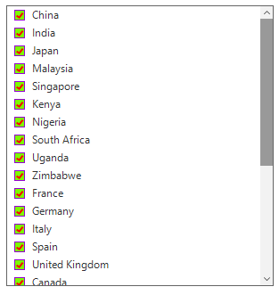

# Check Box Selection 
The SfListView supports loading the checkBox to each item that allows the user to check or uncheck the corresponding item. You can display the check box in each item by setting the [SfListView.ShowCheckBoxes](https://help.syncfusion.com/cr/windowsforms/Syncfusion.WinForms.ListView.SfListView.html#Syncfusion_WinForms_ListView_SfListView_ShowCheckBoxes) property to true.



sfListView1.ShowCheckBoxes = true;


sfListView1.ShowCheckBoxes = True



## Check box selection mode
The check box provides support to select in the context of state of the check box based on the [SfListView.CheckBoxSelectionMode](https://help.syncfusion.com/cr/windowsforms/Syncfusion.WinForms.ListView.SfListView.html#Syncfusion_WinForms_ListView_SfListView_CheckBoxSelectionMode) property.                                                                        

SfListView has the following modes for selection based on the check box state.

* Default: don’t want to affect the selection while checking/unchecking the item CheckBox, you need to set `SfListView.CheckBoxSelectionMode` as Default.



sfListView1.CheckBoxSelectionMode = CheckBoxSelectionMode.Default;


sfListView1.CheckBoxSelectionMode = CheckBoxSelectionMode.Default

         

* SelectOnCheck: To select/deselect the items by using the CheckBox alone, set the [SfListView.CheckBoxSelectionMode](https://help.syncfusion.com/cr/windowsforms/Syncfusion.WinForms.ListView.SfListView.html#Syncfusion_WinForms_ListView_SfListView_CheckBoxSelectionMode) as SelectOnCheck. 
Navigation, editing, and programmatic selection are not supported in this mode.



sfListView1.CheckBoxSelectionMode = CheckBoxSelectionMode.SelectOnCheck;


sfListView1.CheckBoxSelectionMode = CheckBoxSelectionMode.SelectOnCheck



* SynchronizeSelection: To synchronize the selection with IsChecked state, set the [SfListView.CheckBoxSelectionMode](https://help.syncfusion.com/cr/windowsforms/Syncfusion.WinForms.ListView.SfListView.html#Syncfusion_WinForms_ListView_SfListView_CheckBoxSelectionMode) as SynchronizeSelection. In this mode, you can select an item by checking the check box or select/deselect the item will check/uncheck the corresponding item checkbox.



sfListView1.CheckBoxSelectionMode = CheckBoxSelectionMode.SynchronizeSelection;


sfListView1.CheckBoxSelectionMode = CheckBoxSelectionMode.SynchronizeSelection



* CheckOnItemClick: To check or uncheck the item check box state by clicking the item, set the [SfListView.CheckBoxSelectionMode](https://help.syncfusion.com/cr/windowsforms/Syncfusion.WinForms.ListView.SfListView.html#Syncfusion_WinForms_ListView_SfListView_CheckBoxSelectionMode) as CheckOnItemClick.
`MultiSimple` and `MultiExtended` selection mode were not supported in this mode.



sfListView1.CheckBoxSelectionMode = CheckBoxSelectionMode.CheckOnItemClick;


sfListView1.CheckBoxSelectionMode = CheckBoxSelectionMode.CheckOnItemClick



## TriState mode
The SfListView allows you to enable or disable the indeterminate state for item check box by using the [SfListView.AllowTriStateMode](https://help.syncfusion.com/cr/windowsforms/Syncfusion.WinForms.ListView.SfListView.html#Syncfusion_WinForms_ListView_SfListView_AllowTriStateMode) property. The tristate mode can only be supported in the data bound mode i.e. the [SfListView.CheckedMember](https://help.syncfusion.com/cr/windowsforms/Syncfusion.WinForms.ListView.SfListView.html#Syncfusion_WinForms_ListView_SfListView_CheckedMember) property must have the underlying datasource property in type of `CheckState`.



public class CountryInfo
{
   public string CountryName{ get;  set;} 

   public string Continent { get; set; }

   public CheckState CheckedState { get; set; }
}

public ObservableCollection<CountryInfo> GetDataSource()
{
   countryInfoCollection.Add(new CountryInfo() { CountryName = "China", Continent = "Asia", CheckedState = CheckState.Checked });
   countryInfoCollection.Add(new CountryInfo() { CountryName = "India", Continent = "Asia" , CheckedState = CheckState.Indeterminate});
   countryInfoCollection.Add(new CountryInfo() { CountryName = "Japan", Continent = "Asia", CheckedState = CheckState.Unchecked });
   countryInfoCollection.Add(new CountryInfo() { CountryName = "Singapore", Continent = "Asia", CheckedState = CheckState.Checked});
   countryInfoCollection.Add(new CountryInfo() { CountryName = "Kenya", Continent = "Africa" , CheckedState = CheckState. Indeterminate});
   countryInfoCollection.Add(new CountryInfo() { CountryName = "Nigeria", Continent = "Africa" , CheckedState = CheckState. Unchecked});
   countryInfoCollection.Add(new CountryInfo() { CountryName = "South Africa", Continent = "Africa" , CheckedState = CheckState.Checked});
   countryInfoCollection.Add(new CountryInfo() { CountryName = "Uganda", Continent = "Africa" , CheckedState = CheckState. Indeterminate});
   countryInfoCollection.Add(new CountryInfo() { CountryName = "Zimbabwe", Continent = "Africa" , CheckedState = CheckState. Unchecked});  
   return countryInfoCollection;
}

sfListView1.DataSource = GetDataSource();
sfListView1.DisplayMember = "CountryName";
sfListView1.ShowCheckBoxes = true;
sfListView1.AllowTriStateMode = true;
sfListView1.CheckedMember = "CheckedState";


Public Class CountryInfo
   Public Property CountryName() As String

   Public Property Continent() As String

   Public Property CheckedState() As CheckState
End Class

Public Function GetDataSource() As ObservableCollection(Of CountryInfo)
   countryInfoCollection.Add(New CountryInfo() With {.CountryName = "China", .Continent = "Asia", .CheckedState = CheckState.Checked})
   countryInfoCollection.Add(New CountryInfo() With {.CountryName = "India", .Continent = "Asia", .CheckedState = CheckState.Indeterminate})
   countryInfoCollection.Add(New CountryInfo() With {.CountryName = "Japan", .Continent = "Asia", .CheckedState = CheckState.Unchecked})
   countryInfoCollection.Add(New CountryInfo() With {.CountryName = "Singapore", .Continent = "Asia", .CheckedState = CheckState.Checked})
   countryInfoCollection.Add(New CountryInfo() With {.CountryName = "Kenya", .Continent = "Africa", .CheckedState = CheckState.Indeterminate})
   countryInfoCollection.Add(New CountryInfo() With {.CountryName = "Nigeria", .Continent = "Africa", .CheckedState = CheckState.Unchecked})
   countryInfoCollection.Add(New CountryInfo() With {.CountryName = "South Africa", .Continent = "Africa", .CheckedState = CheckState.Checked})
   countryInfoCollection.Add(New CountryInfo() With {.CountryName = "Uganda", .Continent = "Africa", .CheckedState = CheckState.Indeterminate})
   countryInfoCollection.Add(New CountryInfo() With {.CountryName = "Zimbabwe", .Continent = "Africa", .CheckedState = CheckState.Unchecked})
   Return countryInfoCollection
End Function

sfListView1.DataSource = GetDataSource()
sfListView1.DisplayMember = "CountryName"
sfListView1.ShowCheckBoxes = true
sfListView1.AllowTriStateMode = true
sfListView1.CheckedMember = "CheckedState"


 

## Checked items

### Get checked items

The SfListView gets all the checked items through the [SfListView.CheckedItems](https://help.syncfusion.com/cr/windowsforms/Syncfusion.WinForms.ListView.SfListView.html#Syncfusion_WinForms_ListView_SfListView_CheckedItems) property. 
     
### Clear checked items 
      
The checked items can be cleared by calling the ‘CheckedItems.Clear()` method.



sfListView1.CheckedItems.Clear();


sfListView1.CheckedItems.Clear()



## Select all the items
The SfListView allows all the items to change the checked state by checking the `SelectAll` item. You can enable select all item by setting the [SfListView.AllowSelectAll](https://help.syncfusion.com/cr/windowsforms/Syncfusion.WinForms.ListView.SfListView.html#Syncfusion_WinForms_ListView_SfListView_AllowSelectAll) and [SfListView.ShowCheckBoxes](https://help.syncfusion.com/cr/windowsforms/Syncfusion.WinForms.ListView.SfListView.html#Syncfusion_WinForms_ListView_SfListView_ShowCheckBoxes) properties to true.



sfListView1.ShowCheckBoxes = true;
sfListView1.AllowSelectAll = true;


sfListView1.ShowCheckBoxes = true
sfListView1.AllowSelectAll = true


  
  
  
## Recursive checking
The SfListView provides support for recursive checking where the checked state of the group header item and group item are changed recursively based on the state of currently changed item.

The recursive checking actions are:

*	The group header item will be checked only if all its group items are checked.
*	The group header item will be unchecked if all its group items are unchecked.
*	The group header item will be in Indeterminate state in other combinations of its group items.

You can enable recursive checking by setting [SfListView.AllowRecursiveChecking](https://help.syncfusion.com/cr/windowsforms/Syncfusion.WinForms.ListView.SfListView.html#Syncfusion_WinForms_ListView_SfListView_AllowRecursiveChecking) property and [SfListView.ShowCheckBoxes](https://help.syncfusion.com/cr/windowsforms/Syncfusion.WinForms.ListView.SfListView.html#Syncfusion_WinForms_ListView_SfListView_ShowCheckBoxes) property as true.



sfListView1.ShowCheckBoxes = true;
sfListView1.AllowRecursiveChecking = true;


sfListView1.ShowCheckBoxes = true
sfListView1.AllowSelectAll = true



## Appearance
The SfListView allows the item check box customization by using the `SfListView.Style.CheckBoxStyle` property.



sfListView1.Style.CheckBoxStyle.CheckedBackColor = Color.BlueViolet;
sfListView1.Style.CheckBoxStyle.CheckedBorderColor = Color.Black;
sfListView1.Style.CheckBoxStyle.CheckedTickColor = Color.White;


sfListView1.Style.CheckBoxStyle.CheckedBackColor = Color.BlueViolet
sfListView1.Style.CheckBoxStyle.CheckedBorderColor = Color.Black
sfListView1.Style.CheckBoxStyle.CheckedTickColor = Color.White


 
 
 
## Conditional styling
The SfListView allows the item check box customization by using [SfListView.DrawCheckBox](https://help.syncfusion.com/cr/windowsforms/Syncfusion.WinForms.ListView.SfListView.html) event.



sfListView1.DrawCheckBox += new EventHandler<DrawCheckBoxEventArgs>(SfListView1_DrawCheckBox);
private void SfListView1_DrawCheckBox(object sender, DrawCheckBoxEventArgs e)
{
   if (e.ItemType == ItemType.Record && e.ItemIndex % 3 == 0)
   {
       e.Style.CheckedBackColor = Color.Moccasin;
       e.Style.CheckedBorderColor = Color.DarkSlateGray;
       e.Style.CheckedTickColor = Color.Black;
   }       
}


AddHandler sfListView1.DrawCheckBox, AddressOf SfListView1_DrawCheckBox
Private Sub SfListView1_DrawCheckBox(ByVal sender As Object, ByVal e As DrawCheckBoxEventArgs)
   If e.ItemType Is ItemType.Record AndAlso e.ItemIndex Mod 3 = 0 Then
	   e.Style.CheckedBackColor = Color.Moccasin
	   e.Style.CheckedBorderColor = Color.DarkSlateGray
	   e.Style.CheckedTickColor = Color.Black
   End If
End Sub



## Events 

### ItemChecking event

The [ItemChecking](https://help.syncfusion.com/cr/windowsforms/Syncfusion.WinForms.ListView.SfListView.html) event is raised while checking an item at the execution time by using ItemChecking event as follows:

*	`ItemData`: Gets the checked item data object.
*	`ItemIndex`: Gets an index of checked item.
*	`NewState`: Gets the new check state of checked item.
*	`OldState`: Gets the old check state of checked item.

You can cancel the checking process within this event by setting the [ItemCheckingEventArgs.Cancel](https://help.syncfusion.com/cr/windowsforms/Syncfusion.WinForms.ListView.Events.ItemCheckingEventArgs.html) property to true.

The ItemChecking event is used for the following use case:
*	Disable the checking process of the particular item based on the underlying data.



sfListView1.ItemChecking += new EventHandler<ItemCheckingEventArgs>(SfListView1_ItemChecking);
private void SfListView1_ItemChecking(object sender, ItemCheckingEventArgs e)
{
  if ((sender as SfListView).CheckedItems.Count > 0)
      e.Cancel = true;
}


AddHandler sfListView1.ItemChecking, AddressOf SfListView1_ItemChecking
Private Sub SfListView1_ItemChecking(ByVal sender As Object, ByVal e As ItemCheckingEventArgs)
  If (TryCast(sender, SfListView)).CheckedItems.Count > 0 Then
	  e.Cancel = True
  End If
End Sub



### ItemChecked event
The [ItemChecked](https://help.syncfusion.com/cr/windowsforms/Syncfusion.WinForms.ListView.SfListView.html) event will occur once checking process is completed for the checked item in the SfListView by using ItemChecked event.

The ItemChecked event used for the following use cases:

*	`ItemData`: Gets the checked item data object.
*	`ItemIndex`: Gets an index of checked item.
*	`NewState`: Gets the new check state of checked item.
*	`OldState`: Gets the old check state of checked item.



sfListView1.ItemChecked += new EventHandler<Syncfusion.WinForms.ListView.Events.ItemCheckedEventArgs>(SfListView1_ItemChecked);
private void SfListView1_ItemChecked(object sender, Syncfusion.WinForms.ListView.Events.ItemCheckedEventArgs e)
{
  if ((sender as SfListView).CheckedItems.Count > 0)
      (sender as SfListView).CheckedItems.Clear();
}


AddHandler sfListView1.ItemChecked, AddressOf SfListView1_ItemChecked
Private Sub SfListView1_ItemChecked(ByVal sender As Object, ByVal e As Syncfusion.WinForms.ListView.Events.ItemCheckedEventArgs)
  If (TryCast(sender, SfListView)).CheckedItems.Count > 0 Then
	  TryCast(sender, SfListView).CheckedItems.Clear()
  End If
End Sub


