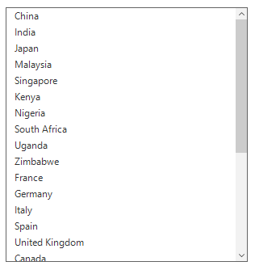

# Data Binding in Windows Forms ListView Control
The data source can be bound by using the [SfListView.DataSource](https://help.syncfusion.com/cr/windowsforms/Syncfusion.WinForms.ListView.SfListView.html#Syncfusion_WinForms_ListView_SfListView_DataSource) property. The following members controls data binding:

* Display Member -  A property of the underlying datasource to display for SfListView. 
* Value Member - A property to use as the actual value for the items.



sfListView1.DataSource = GetDataSource();
sfListView1.DisplayMember = "CountryName";
sfListView1.ValueMember = "Continent";


sfListView1.DataSource = GetDataSource()
sfListView1.DisplayMember = "CountryName"
sfListView1.ValueMember = "Continent"


               

			    
## Events

### SourcePropertyChanged

The [SourcePropertyChanged](https://help.syncfusion.com/cr/windowsforms/Syncfusion.DataSource.DataSource.html#Syncfusion_DataSource_DataSource_SourcePropertyChanged) event is raised when the CountryInfo property value is changed if the CountryInfo Implements the `INotifyPropertyChanged` interface. The event receives with two arguments namely, sender that handles the CountryInfo and `PropertyChangedEventArgs` as object.
[PropertyChangedEventArgs](https://help.syncfusion.com/cr/windowsforms/Syncfusion.DataSource.PropertyChangingEventArgs.html) has below property,

`PropertyName` – Denotes the property name of the changed value.



sfListView1.View.SourcePropertyChanged += new PropertyChangedEventHandler(View_SourcePropertyChanged);
private void View_SourcePropertyChanged(object sender, PropertyChangedEventArgs e)
{

}


AddHandler sfListView1.View.SourcePropertyChanged, AddressOf View_SourcePropertyChanged
Private Sub View_SourcePropertyChanged(ByVal sender As Object, ByVal e As PropertyChangedEventArgs)

End Sub



### SourceCollectionChanged

The [SourceCollectionChanged](https://help.syncfusion.com/cr/windowsforms/Syncfusion.DataSource.DataSource.html#Syncfusion_DataSource_DataSource_SourceCollectionChanged) event is raised when the source collection is changed, for example, add or remove the collection. The event receives two arguments namely, sender that handles `SfListView.View` object and `NotifyCollectionChangedEventArgs` as object.

NotifyCollectionChangedEventArgs has the following properties,

* `Action` - Contains the current action. (i.e.) add, remove, move, replace and reset.
* `NewItems` - Contain list of new items involved in the change.
* `OldItems` - Contains list of old items affected by the action.
* `NewStartingIndex` - Contains the index at which the change occurred.
* `OldStartingIndex` - Contains the index at which the action occurred.



sfListView1.View.SourceCollectionChanged += new NotifyCollectionChangedEventHandler(View_SourceCollectionChanged)
private void View_SourceCollectionChanged(object sender, NotifyCollectionChangedEventArgs e)
{

}


AddHandler sfListView1.View.SourceCollectionChanged, AddressOf View_SourceCollectionChanged
Private Sub View_SourceCollectionChanged(ByVal sender As Object, ByVal e As NotifyCollectionChangedEventArgs)

End Sub


