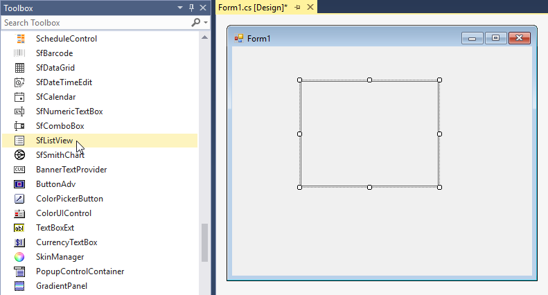
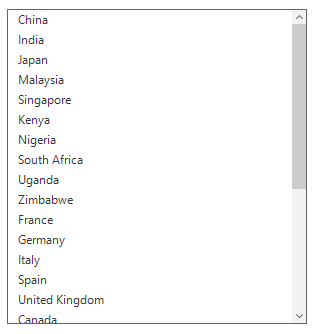
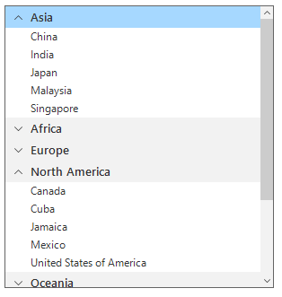
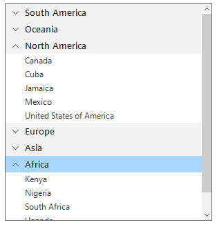
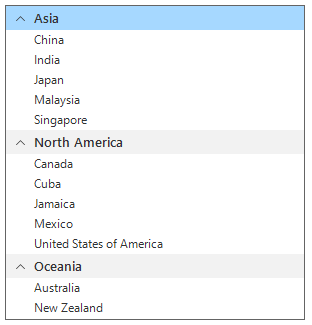
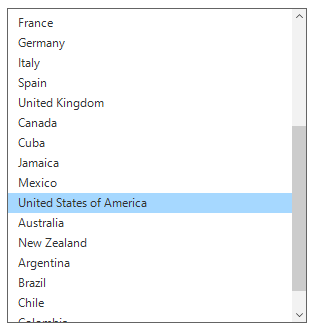

# Getting Started with Windows Forms SfListView

This section creates a WinForms app that displays a list of countries in `SfListView`, with grouping, sorting, filtering, and selection enabled.

## Assembly deployment

Refer to the [Control Dependencies](https://help.syncfusion.com/windowsforms/control-dependencies#sflistview) section for the full list of assemblies or NuGet packages that must be referenced.

Refer to [NuGet Packages](https://help.syncfusion.com/windowsforms/installation/install-nuget-packages) to learn how to install NuGet packages in a Windows Forms application.

To install via the NuGet Package Manager Console, run:

```powershell
Install-Package Syncfusion.SfListView.WinForms
```

## Adding SfListView via designer

1. Create a new Windows Forms project in Visual Studio.

2. The [SfListView](https://help.syncfusion.com/cr/windowsforms/Syncfusion.WinForms.ListView.SfListView.html) control can be added to the application by dragging it from the toolbox and dropping it in the designer. The required assembly references will be added automatically. The following dependent assemblies are added when the control is dropped on the form:

    * Syncfusion.SfListView.WinForms
    * Syncfusion.Core.WinForms
    * Syncfusion.DataSource.WinForms
    * Syncfusion.GridCommon.WinForms



## Adding SfListView via code

To add the control manually, follow these steps:

1. Add the following required assembly references to the project:

    * Syncfusion.Core.WinForms
    * Syncfusion.DataSource.WinForms
    * Syncfusion.GridCommon.WinForms
    * Syncfusion.SfListView.WinForms

2. Create the `SfListView` control instance and add it to the form.




using System.Drawing;
using System.Windows.Forms;
using Syncfusion.WinForms.ListView;

namespace SfListViewDemo
{
    public partial class Form1 : Form
    {
        private SfListView listView;

        public Form1()
        {
            InitializeComponent();

            listView = new SfListView();
            listView.Location = new Point(100, 100);
            listView.Size = new Size(300, 320);

            this.Controls.Add(listView);
        }
    }
}


Imports System.Drawing
Imports System.Windows.Forms
Imports Syncfusion.WinForms.ListView

Partial Public Class Form1
    Inherits Form

    Private listView As SfListView

    Public Sub New()
        InitializeComponent()

        listView = New SfListView()
        listView.Location = New Point(100, 100)
        listView.Size = New Size(300, 320)
        Me.Controls.Add(listView)
    End Sub
End Class




{{ codesnippet_control | OrderList_Indent_Level_1 }}

## Create the data model

Create a simple data object that represents each row in the list.

1. Add a class named `CountryInfo` with the `CountryName` and `Continent` properties.




public class CountryInfo
{
    public string CountryName { get; set; }
    public string Continent { get; set; }
}



Public Class CountryInfo
    Public Property CountryName() As String
    Public Property Continent() As String
End Class




{{ codesnippet_model | OrderList_Indent_Level_1 }}

2. Add a `GetDataSource` method that returns a populated `List<CountryInfo>`.




using System.Collections.Generic;

// Place this method on Form1 (next to the constructor) so the call in the constructor compiles.
public List<CountryInfo> GetDataSource()
{
    List<CountryInfo> countryInfoCollection = new List<CountryInfo>();
    countryInfoCollection.Add(new CountryInfo() { CountryName = "China", Continent = "Asia" });
    countryInfoCollection.Add(new CountryInfo() { CountryName = "India", Continent = "Asia" });
    countryInfoCollection.Add(new CountryInfo() { CountryName = "Japan", Continent = "Asia" });
    countryInfoCollection.Add(new CountryInfo() { CountryName = "Malaysia", Continent = "Asia" });
    countryInfoCollection.Add(new CountryInfo() { CountryName = "Singapore", Continent = "Asia" });
    countryInfoCollection.Add(new CountryInfo() { CountryName = "Kenya", Continent = "Africa" });
    countryInfoCollection.Add(new CountryInfo() { CountryName = "Nigeria", Continent = "Africa" });
    countryInfoCollection.Add(new CountryInfo() { CountryName = "South Africa", Continent = "Africa" });
    countryInfoCollection.Add(new CountryInfo() { CountryName = "Uganda", Continent = "Africa" });
    countryInfoCollection.Add(new CountryInfo() { CountryName = "Zimbabwe", Continent = "Africa" });
    countryInfoCollection.Add(new CountryInfo() { CountryName = "France", Continent = "Europe" });
    countryInfoCollection.Add(new CountryInfo() { CountryName = "Germany", Continent = "Europe" });
    countryInfoCollection.Add(new CountryInfo() { CountryName = "Italy", Continent = "Europe" });
    countryInfoCollection.Add(new CountryInfo() { CountryName = "Spain", Continent = "Europe" });
    countryInfoCollection.Add(new CountryInfo() { CountryName = "United Kingdom", Continent = "Europe" });
    countryInfoCollection.Add(new CountryInfo() { CountryName = "Canada", Continent = "North America" });
    countryInfoCollection.Add(new CountryInfo() { CountryName = "Cuba", Continent = "North America" });
    countryInfoCollection.Add(new CountryInfo() { CountryName = "Jamaica", Continent = "North America" });
    countryInfoCollection.Add(new CountryInfo() { CountryName = "Mexico", Continent = "North America" });
    countryInfoCollection.Add(new CountryInfo() { CountryName = "United States of America", Continent = "North America" });
    countryInfoCollection.Add(new CountryInfo() { CountryName = "Australia", Continent = "Oceania" });
    countryInfoCollection.Add(new CountryInfo() { CountryName = "New Zealand", Continent = "Oceania" });
    countryInfoCollection.Add(new CountryInfo() { CountryName = "Argentina", Continent = "South America" });
    countryInfoCollection.Add(new CountryInfo() { CountryName = "Brazil", Continent = "South America" });
    countryInfoCollection.Add(new CountryInfo() { CountryName = "Chile", Continent = "South America" });
    countryInfoCollection.Add(new CountryInfo() { CountryName = "Colombia", Continent = "South America" });
    countryInfoCollection.Add(new CountryInfo() { CountryName = "Uruguay", Continent = "South America" });
    return countryInfoCollection;
}



' Place this method on Form1 (next to the constructor) so the call in the constructor compiles.
Private Function GetDataSource() As List(Of CountryInfo)
    Dim countryInfoCollection As New List(Of CountryInfo)()
    countryInfoCollection.Add(New CountryInfo() With {.CountryName = "China", .Continent = "Asia"})
    countryInfoCollection.Add(New CountryInfo() With {.CountryName = "India", .Continent = "Asia"})
    countryInfoCollection.Add(New CountryInfo() With {.CountryName = "Japan", .Continent = "Asia"})
    countryInfoCollection.Add(New CountryInfo() With {.CountryName = "Malaysia", .Continent = "Asia"})
    countryInfoCollection.Add(New CountryInfo() With {.CountryName = "Singapore", .Continent = "Asia"})
    countryInfoCollection.Add(New CountryInfo() With {.CountryName = "Kenya", .Continent = "Africa"})
    countryInfoCollection.Add(New CountryInfo() With {.CountryName = "Nigeria", .Continent = "Africa"})
    countryInfoCollection.Add(New CountryInfo() With {.CountryName = "South Africa", .Continent = "Africa"})
    countryInfoCollection.Add(New CountryInfo() With {.CountryName = "Uganda", .Continent = "Africa"})
    countryInfoCollection.Add(New CountryInfo() With {.CountryName = "Zimbabwe", .Continent = "Africa"})
    countryInfoCollection.Add(New CountryInfo() With {.CountryName = "France", .Continent = "Europe"})
    countryInfoCollection.Add(New CountryInfo() With {.CountryName = "Germany", .Continent = "Europe"})
    countryInfoCollection.Add(New CountryInfo() With {.CountryName = "Italy", .Continent = "Europe"})
    countryInfoCollection.Add(New CountryInfo() With {.CountryName = "Spain", .Continent = "Europe"})
    countryInfoCollection.Add(New CountryInfo() With {.CountryName = "United Kingdom", .Continent = "Europe"})
    countryInfoCollection.Add(New CountryInfo() With {.CountryName = "Canada", .Continent = "North America"})
    countryInfoCollection.Add(New CountryInfo() With {.CountryName = "Cuba", .Continent = "North America"})
    countryInfoCollection.Add(New CountryInfo() With {.CountryName = "Jamaica", .Continent = "North America"})
    countryInfoCollection.Add(New CountryInfo() With {.CountryName = "Mexico", .Continent = "North America"})
    countryInfoCollection.Add(New CountryInfo() With {.CountryName = "United States of America", .Continent = "North America"})
    countryInfoCollection.Add(New CountryInfo() With {.CountryName = "Australia", .Continent = "Oceania"})
    countryInfoCollection.Add(New CountryInfo() With {.CountryName = "New Zealand", .Continent = "Oceania"})
    countryInfoCollection.Add(New CountryInfo() With {.CountryName = "Argentina", .Continent = "South America"})
    countryInfoCollection.Add(New CountryInfo() With {.CountryName = "Brazil", .Continent = "South America"})
    countryInfoCollection.Add(New CountryInfo() With {.CountryName = "Chile", .Continent = "South America"})
    countryInfoCollection.Add(New CountryInfo() With {.CountryName = "Colombia", .Continent = "South America"})
    countryInfoCollection.Add(New CountryInfo() With {.CountryName = "Uruguay", .Continent = "South America"})
    Return countryInfoCollection
End Function




{{ codesnippet_data | OrderList_Indent_Level_1 }}

## Bind to data

Set the [SfListView.DataSource](https://help.syncfusion.com/cr/windowsforms/Syncfusion.WinForms.ListView.SfListView.html#Syncfusion_WinForms_ListView_SfListView_DataSource) property to an `IEnumerable`, and use [DisplayMember](https://help.syncfusion.com/cr/windowsforms/Syncfusion.WinForms.ListView.SfListView.html#Syncfusion_WinForms_ListView_SfListView_DisplayMember) to choose which property is rendered. The assignment happens in the form constructor.





// Inside the Form1 constructor, after creating listView:
listView.DataSource = GetDataSource();
listView.DisplayMember = "CountryName";




' Inside the Form1 constructor, after creating listView:
listView.DataSource = GetDataSource()
listView.DisplayMember = "CountryName"




{{ codesnippet_bind | OrderList_Indent_Level_1 }}



## Grouping

`SfListView` can group items by a property through its `View` (a `Syncfusion.DataSource.DataSource` instance) using the [View.GroupDescriptors](https://help.syncfusion.com/cr/windowsforms/Syncfusion.DataSource.DataSource.html#Syncfusion_DataSource_DataSource_GroupDescriptors) collection. Create a [GroupDescriptor](https://help.syncfusion.com/cr/windowsforms/Syncfusion.DataSource.GroupDescriptor.html) for the `Continent` property and add it to the collection.

`GroupDescriptor` exposes the following properties:

* `PropertyName` — Name of the property to group by.
* `KeySelector` — Selector that returns the group key.
* `Comparer` — Comparer applied while sorting groups.





using Syncfusion.DataSource; // GroupDescriptor

listView.View.GroupDescriptors.Add(new GroupDescriptor()
{
    PropertyName = "Continent",
});




Imports Syncfusion.DataSource ' GroupDescriptor

listView.View.GroupDescriptors.Add(New GroupDescriptor() With {.PropertyName = "Continent"})




{{ codesnippet_group | OrderList_Indent_Level_1 }}



## Sorting

`SfListView` can sort its data through the [View.SortDescriptors](https://help.syncfusion.com/cr/windowsforms/Syncfusion.DataSource.DataSource.html#Syncfusion_DataSource_DataSource_SortDescriptors) collection. Create a [SortDescriptor](https://help.syncfusion.com/cr/windowsforms/Syncfusion.DataSource.SortDescriptor.html) and add it to the collection.

`SortDescriptor` exposes the following properties:

* `PropertyName` — Name of the property to sort by.
* `Direction` — A `System.ComponentModel.ListSortDirection` value (`Ascending` or `Descending`).
* `Comparer` — Comparer applied when sorting.





using System.ComponentModel; // ListSortDirection
using Syncfusion.DataSource; // SortDescriptor

listView.View.SortDescriptors.Add(new SortDescriptor()
{
    PropertyName = "Continent",
    Direction = ListSortDirection.Descending,
});




Imports System.ComponentModel ' ListSortDirection
Imports Syncfusion.DataSource ' SortDescriptor

listView.View.SortDescriptors.Add(New SortDescriptor() With {
    .PropertyName = "Continent",
    .Direction = ListSortDirection.Descending
})




{{ codesnippet_sort | OrderList_Indent_Level_1 }}



## Filtering

`SfListView` filters records by setting a predicate on the [View.Filter](https://help.syncfusion.com/cr/windowsforms/Syncfusion.DataSource.DataSource.html#Syncfusion_DataSource_DataSource_Filter) property. Call [View.RefreshFilter](https://help.syncfusion.com/cr/windowsforms/Syncfusion.DataSource.DataSource.html#Syncfusion_DataSource_DataSource_RefreshFilter) after every `Filter` assignment to apply the change.

The example below keeps only countries in `Asia`, `North America`, or `Oceania`.





// Inside Form1:
listView.View.Filter = CustomFilter;
listView.View.RefreshFilter();

// Private method on Form1:
private bool CustomFilter(object obj)
{
    var item = obj as CountryInfo;
    return item != null &&
           (item.Continent == "Asia" ||
            item.Continent == "North America" ||
            item.Continent == "Oceania");
}




' Inside Form1:
listView.View.Filter = AddressOf CustomFilter
listView.View.RefreshFilter()

' Private method on Form1:
Private Function CustomFilter(obj As Object) As Boolean
    Dim item = TryCast(obj, CountryInfo)
    Return item IsNot Nothing AndAlso
           (item.Continent = "Asia" OrElse
            item.Continent = "North America" OrElse
            item.Continent = "Oceania")
End Function




{{ codesnippet_filter | OrderList_Indent_Level_1 }}



## Selection

`SfListView` selects items by setting the [SelectionMode](https://help.syncfusion.com/cr/windowsforms/Syncfusion.WinForms.ListView.SfListView.html#Syncfusion_WinForms_ListView_SfListView_SelectionMode) property to one of the following values. The enum lives in the `Syncfusion.WinForms.ListView` namespace.

| SelectionMode | Description |
| --- | --- |
| `One` | Only a single item can be selected at a time. |
| `MultiSimple` | Multiple items can be selected without holding a modifier key. |
| `MultiExtended` | Multiple items can be selected using Ctrl/Shift. |
| `None` | Selection is disabled. |

Selected items are exposed through [SelectedItem](https://help.syncfusion.com/cr/windowsforms/Syncfusion.WinForms.ListView.SfListView.html#Syncfusion_WinForms_ListView_SfListView_SelectedItem), [SelectedIndex](https://help.syncfusion.com/cr/windowsforms/Syncfusion.WinForms.ListView.SfListView.html#Syncfusion_WinForms_ListView_SfListView_SelectedIndex), and [SelectedItems](https://help.syncfusion.com/cr/windowsforms/Syncfusion.WinForms.ListView.SfListView.html#Syncfusion_WinForms_ListView_SfListView_SelectedItems). Selection changes are reported through the [SelectionChanging](https://help.syncfusion.com/cr/windowsforms/Syncfusion.WinForms.ListView.SfListView.html#Syncfusion_WinForms_ListView_SfListView_SelectionChanging) and [SelectionChanged](https://help.syncfusion.com/cr/windowsforms/Syncfusion.WinForms.ListView.SfListView.html#Syncfusion_WinForms_ListView_SfListView_SelectionChanged) events.





using Syncfusion.WinForms.ListView; // SelectionMode
using Syncfusion.WinForms.ListView.Events;

listView.SelectionMode = SelectionMode.One;
listView.SelectionChanged += ListView_SelectionChanged;

private void ListView_SelectionChanged(object sender, ItemSelectionChangedEventArgs e)
{
    var selected = listView.SelectedItem as CountryInfo;
}




Imports Syncfusion.WinForms.ListView ' SelectionMode
Imports Syncfusion.WinForms.ListView.Events

listView.SelectionMode = SelectionMode.One
AddHandler listView.SelectionChanged, AddressOf ListView_SelectionChanged

Private Sub ListView_SelectionChanged(sender As Object, e As ItemSelectionChangedEventArgs)
    Dim selected = TryCast(listView.SelectedItem, CountryInfo)
End Sub




{{ codesnippet_select | OrderList_Indent_Level_1 }}


