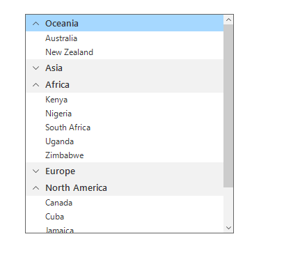
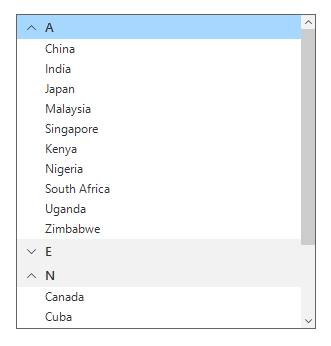
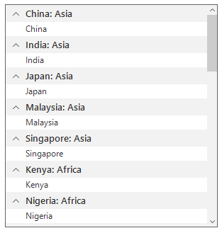
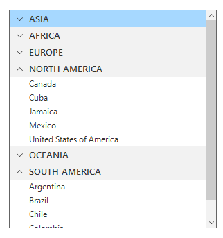
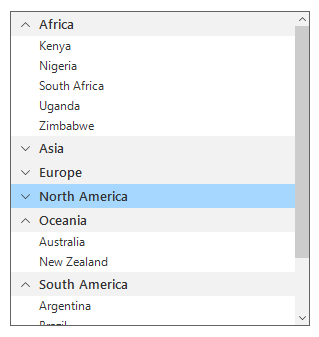

# Grouping
A group represents collection of items belongs to a category. When grouping is applied, the data will be organized into different groups based on the key values. Each group is identified by its `Key` by which you can get the underlying data in the group.

## Programmatic grouping
The SfListView allows programmatic grouping by defining the [GroupDescriptor](https://help.syncfusion.com/cr/windowsforms/Syncfusion.DataSource.GroupDescriptor.html) object and adding it into the [View.GroupDescriptors](https://help.syncfusion.com/cr/windowsforms/Syncfusion.DataSource.DataSource.html#Syncfusion_DataSource_DataSource_GroupDescriptors) collection. The GroupDescriptor object holds the following properties:

* `PropertyName`: Describes the name of the property to be grouped.
* `KeySelector`: Describes selector to return the group key.
* `Comparer`: Describes comparer to be applied in when sorting take place.



sfListView1.View.GroupDescriptors.Add(new Syncfusion.DataSource.GroupDescriptor()
{
   PropertyName = "Continent",
});


sfListView1.View.GroupDescriptors.Add(New Syncfusion.DataSource.GroupDescriptor() With {.PropertyName = "Continent"})



## Custom grouping             
The SfListView supports grouping the items based on custom logic applied to the [SfListView.DataSource.GroupComparer](https://help.syncfusion.com/cr/windowsforms/Syncfusion.DataSource.DataSource.html#Syncfusion_DataSource_DataSource_GroupComparer) or [GroupDescriptor.Comparer](https://help.syncfusion.com/cr/windowsforms/Syncfusion.DataSource.GroupDescriptor.html#Syncfusion_DataSource_GroupDescriptor_Comparer) property added to the [DataSource.GroupDescriptors](https://help.syncfusion.com/cr/windowsforms/Syncfusion.DataSource.DataSource.html#Syncfusion_DataSource_DataSource_GroupDescriptors) collection.
In the custom group comparer, all the items present in a group compares each other based on the items count to each group sorted accordingly.




sfListView1.View.GroupDescriptors.Add(new Syncfusion.DataSource.GroupDescriptor()
{
    PropertyName = "Continent",
    Comparer = new CustomGroupComparer()
});
public class CustomGroupComparer : IComparer<GroupResult>, ISortDirection
{
  public CustomGroupComparer()
  {
    this.SortDirection = Syncfusion.DataSource. ListSortDirection.Ascending;
  }
  
  public ListSortDirection SortDirection
  {
    get;
    set;
  }
  
  public int Compare(GroupResult x, GroupResult y)
  {
    int groupX;
    int groupY;

    groupX = x.Count;
    groupY = y.Count;
   
    if (groupX.CompareTo(groupY) > 0)
      return SortDirection == Syncfusion.DataSource. ListSortDirection.Ascending ? 1 : -1;
    else if (groupX.CompareTo(groupY) == -1)
      return SortDirection == Syncfusion.DataSource. ListSortDirection.Ascending ? -1 : 1;
    else
      return 0;
  }
}


Private Function Syncfusion.DataSource.GroupDescriptor() As sfListView1.View.GroupDescriptors.Add(Shadows
    PropertyName = "Continent",
    Comparer = New CustomGroupComparer()
End Function
)
Public Class CustomGroupComparer
	Implements IComparer(Of GroupResult), ISortDirection
  Public Sub New()
	Me.SortDirection = Syncfusion.DataSource.ListSortDirection.Ascending
  End Sub

  Public Property SortDirection() As ListSortDirection

  Public Function Compare(ByVal x As GroupResult, ByVal y As GroupResult) As Integer
	Dim groupX As Integer
	Dim groupY As Integer

	groupX = x.Count
	groupY = y.Count

	If groupX.CompareTo(groupY) > 0 Then
	  Return If(SortDirection = Syncfusion.DataSource.ListSortDirection.Ascending, 1, -1)
	ElseIf groupX.CompareTo(groupY) = -1 Then
	  Return If(SortDirection = Syncfusion.DataSource.ListSortDirection.Ascending, -1, 1)
	Else
	  Return 0
	End If
  End Function
End Class




## Grouping based on first character
The SfListView supports grouping the items based on first character of the value assigned to the property name in [GroupDescriptor](https://help.syncfusion.com/cr/windowsforms/Syncfusion.DataSource.GroupDescriptor.html) by using the [KeySelector](https://help.syncfusion.com/cr/windowsforms/Syncfusion.DataSource.GroupDescriptor.html#Syncfusion_DataSource_GroupDescriptor_KeySelector).



sfListView1.View.GroupDescriptors.Add(new Syncfusion.DataSource.GroupDescriptor()
{
    PropertyName = "Continent",
    KeySelector = (object obj1) =>
    {
        var item = (obj1 as CountryInfo);
        return item.Continent[0].ToString();
    },
});


Private Function Syncfusion.DataSource.GroupDescriptor() As sfListView1.View.GroupDescriptors.Add(Shadows
    PropertyName = "Continent",
    KeySelector = (Object obj1) =>
    {
        Dim item As var = (obj1 as CountryInfo) 
        Return item.Continent(0).ToString()
    }
End Function
)



## Grouping based on more than one property in the data object
Group the items by binding multiple properties to the property name of [GroupDescriptor](https://help.syncfusion.com/cr/windowsforms/Syncfusion.DataSource.GroupDescriptor.html) using [KeySelector](https://help.syncfusion.com/cr/windowsforms/Syncfusion.DataSource.GroupDescriptor.html#Syncfusion_DataSource_GroupDescriptor_KeySelector) in which the group header items can be created with multiple data model object effectively.



sfListView1.View.GroupDescriptors.Add(new GroupDescriptor()
{
   PropertyName = "Continent",    
   KeySelector = (object obj1) =>
   {
      var item = (obj1 as CountryInfo);
      return item.CountryName + ": " + item.Continent;
   }           
});


Private Function GroupDescriptor() As sfListView1.View.GroupDescriptors.Add(Shadows
   PropertyName = "Continent",    
   KeySelector = (Object obj1) =>
   {
      Dim item As var = (obj1 as CountryInfo) 
      Return item.CountryName + ": " + item.Continent
   }
End Function
)



## Grouping by ignoring case sensitivity
Group the items by ignoring case sensitivity using the [KeySelector](https://help.syncfusion.com/cr/windowsforms/Syncfusion.DataSource.GroupDescriptor.html#Syncfusion_DataSource_GroupDescriptor_KeySelector) property in the [GroupDescriptor](https://help.syncfusion.com/cr/windowsforms/Syncfusion.DataSource.GroupDescriptor.html). While returning the KeySelector, convert the required property name in the data model to group either as upper or lower case. The items will be grouped based on the KeySelector with returned case sensitive.



sfListView1.View.GroupDescriptors.Add(new Syncfusion.DataSource.GroupDescriptor()
{
   PropertyName = "Continent",
   KeySelector = (object obj1) =>
   {
     return (obj1 as CountryInfo).Continent.ToUpper();
   },               
});


sfListView1.View.GroupDescriptors.Add(New Syncfusion.DataSource.GroupDescriptor() With { PropertyName = "Continent", KeySelector = Function(obj1 As Object) (TryCast(obj1, CountryInfo)).Continent.ToUpper(),
})



## Group Expand and Collapse                 
By default, the groups will be in expanded state in the SfListView. You can expand or collapse the group at runtime by tapping the group header, the group gets collapse if the group is in expand state and vice-versa.

## Programmatic expand and collapse  

### Expand or collapse a specific group                             
Expand or collapse a specific group by using the [SfListView.ExpandGroup](https://help.syncfusion.com/cr/windowsforms/Syncfusion.WinForms.ListView.SfListView.html#Syncfusion_WinForms_ListView_SfListView_ExpandGroup_Syncfusion_DataSource_Extensions_GroupResult_) method and [SfListView.CollapseGroup](https://help.syncfusion.com/cr/windowsforms/Syncfusion.WinForms.ListView.SfListView.html#Syncfusion_WinForms_ListView_SfListView_CollapseGroup_Syncfusion_DataSource_Extensions_GroupResult_) method.



var group = sfListView1.View.Groups[0];
sfListView1.ExpandGroup(group);
sfListView1.CollapseGroup(group);


Dim group = sfListView1.View.Groups(0)
sfListView1.ExpandGroup(group)
sfListView1.CollapseGroup(group)



### Expand or collapse all the groups
Expand or collapse all the groups programmatically at runtime by using the [SfListView.ExpandAll](//help.syncfusion.com/cr/windowsforms/Syncfusion.SfListView.WinForms~Syncfusion.WinForms.ListView.SfListView~ExpandAllGroups.html) method and [SfListView.CollapseAll](https://help.syncfusion.com/cr/windowsforms/Syncfusion.WinForms.ListView.SfListView.html#Syncfusion_WinForms_ListView_SfListView_CollapseAllGroups) method.



sfListView1.ExpandAllGroups();
sfListView1.CollapseAllGroups();


sfListView1.ExpandAllGroups()
sfListView1.CollapseAllGroups()



## Disable expanding of specific group
The [SfListView.GroupExpanding](//help.syncfusion.com/cr/windowsforms/Syncfusion.SfListView.WinForms~Syncfusion.WinForms.ListView.SfListView~GroupExpanding_EV.html) event occurs when the group is being expanded.
The [GroupExpandCollapseChangingEventArgs](https://help.syncfusion.com/cr/windowsforms/Syncfusion.WinForms.ListView.Events.GroupExpandCollapseChangingEventArgs.html) of the GroupExpanding event provides information about the expanding group and it has the following members:

* `Group`: Gets a list of group being expanded.
* `Cancel` : Decides whether to cancel the group expansion or not.

The GroupExpanding event used for the following use case:

* Keeps any one specific group in the expanded state by comparing and collapsing all other groups.

You can cancel the group expansion by setting the GroupExpandCollapseChangingEventArgs.Cancel property to true.



sfListView1.GroupExpanding += new EventHandler<GroupExpandCollapseChangingEventArgs>(SfListView1_GroupExpanding);
private void SfListView1_GroupExpanding(object sender, GroupExpandCollapseChangingEventArgs e)
{
   if (e.Group == (sender as SfListView).View.Groups[0])
        e.Cancel = true;
}


AddHandler sfListView1.GroupExpanding, AddressOf SfListView1_GroupExpanding
Private Sub SfListView1_GroupExpanding(ByVal sender As Object, ByVal e As GroupExpandCollapseChangingEventArgs)
   If e.Group = (TryCast(sender, SfListView)).View.Groups(0) Then
		e.Cancel = True
   End If
End Sub



## Disable collapsing of specific group
The [SfListView.GroupCollapsing](https://help.syncfusion.com/cr/windowsforms/Syncfusion.WinForms.ListView.SfListView.html) event occurs when the group is being collapsed.
The [GroupExpandCollapseChangingEventArgs](https://help.syncfusion.com/cr/windowsforms/Syncfusion.WinForms.ListView.Events.GroupExpandCollapseChangingEventArgs.html) of the GroupCollapsing event provides information about the collapsing group and it contains the following members:

* `Group`: Get a group being collapsed.
* `Cancel`: Decides whether to cancel the group collapsing or not.

You can cancel the group is being collapsed by using the GroupExpandCollapseChangingEventArgs.Cancel property of GroupCollapsing event.



sfListView1.GroupCollapsing += new EventHandler<GroupExpandCollapseChangingEventArgs>(SfListView1_GroupCollapsing);
private void SfListView1_GroupCollapsing(object sender, GroupExpandCollapseChangingEventArgs e)
{
   if (e.Group == (sender as SfListView).View.Groups[1])
        e.Cancel = true;
}


AddHandler sfListView1.GroupCollapsing, AddressOf SfListView1_GroupCollapsing
Private Sub SfListView1_GroupCollapsing(ByVal sender As Object, ByVal e As GroupExpandCollapseChangingEventArgs)
   If e.Group = (TryCast(sender, SfListView)).View.Groups(1) Then
		e.Cancel = True
   End If
End Sub



## Group an item with sorting
Group the items of underlying collection with sorting by adding the [DataSource.GroupDescriptors](https://help.syncfusion.com/cr/windowsforms/Syncfusion.DataSource.DataSource.html#Syncfusion_DataSource_DataSource_GroupDescriptors) and the [DataSource.SortDescriptors](https://help.syncfusion.com/cr/windowsforms/Syncfusion.DataSource.DataSource.html#Syncfusion_DataSource_DataSource_SortDescriptors) with required properties.



sfListView1.View.GroupDescriptors.Add(new Syncfusion.DataSource.GroupDescriptor()
{
    PropertyName = "Continent",               
});
sfListView1.View.SortDescriptors.Add(new Syncfusion.DataSource.SortDescriptor()
{
    PropertyName = "Continent",
    Direction = Syncfusion.DataSource.ListSortDirection.Ascending,
});


sfListView1.View.GroupDescriptors.Add(New Syncfusion.DataSource.GroupDescriptor() With {.PropertyName = "Continent"})
sfListView1.View.SortDescriptors.Add(New Syncfusion.DataSource.SortDescriptor() With {.PropertyName = "Continent", .Direction = Syncfusion.DataSource.ListSortDirection.Ascending})



