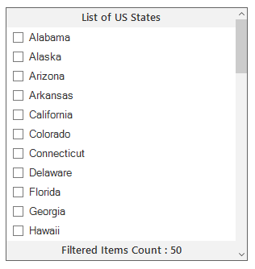
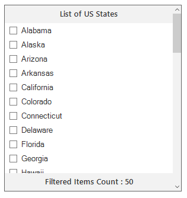
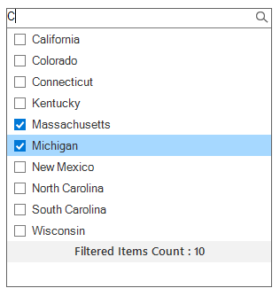
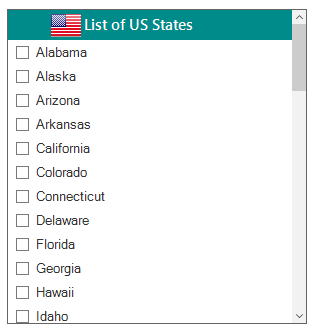
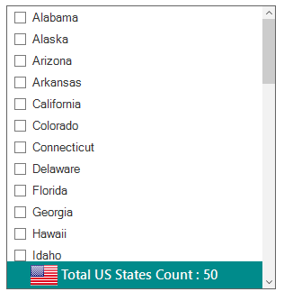

F---
layout: post
title: Header and footer support | ListView for Windows Forms | Syncfusion
description: This section explains about the Header and Footer support in SfListView.
platform: windowsforms
control: SfListView
documentation: ug
---

# Header and Footer

SfListView allows you to show or hide the header and footer items through the [SfListView.ShowHeader](https://help.syncfusion.com/cr/windowsforms/Syncfusion.WinForms.ListView.SfListView.html#Syncfusion_WinForms_ListView_SfListView_ShowHeader) and [SfListView.ShowFooter](https://help.syncfusion.com/cr/windowsforms/Syncfusion.WinForms.ListView.SfListView.html#Syncfusion_WinForms_ListView_SfListView_ShowFooter) properties. By default, the header and footer items will stick on the top and bottom of the view.



// Show header item in SfListView
sfListView1.ShowHeader = true;

// Show footer item in SfListView
sfListView1.ShowFooter = true;


' Show header item in SfListView
sfListView1.ShowHeader = True

' Show footer item in SfListView
sfListView1.ShowFooter = True



## Show text in header and footer

SfListView allows you to customize the header and footer items text by using the [DrawItem](https://help.syncfusion.com/cr/windowsforms/Syncfusion.WinForms.ListView.SfListView.html) event. A text can be set to an item by using the [Text](https://help.syncfusion.com/cr/windowsforms/Syncfusion.WinForms.ListView.Events.DrawItemEventArgs.html#Syncfusion_WinForms_ListView_Events_DrawItemEventArgs_Text) property.



this.sfListView1.DrawItem += sfListView1_DrawItem;

void sfListView1_DrawItem(object sender, Syncfusion.WinForms.ListView.Events.DrawItemEventArgs e)
{
    if (e.ItemType == Syncfusion.WinForms.ListView.Enums.ItemType.Header)
    {
        e.Text = "List of US States";
    }

    if (e.ItemType == Syncfusion.WinForms.ListView.Enums.ItemType.Footer)
    {
        e.Text = "Filtered Items Count : " + this.sfListView1.View.Items.Count;
    }
}


AddHandler sfListView1.DrawItem, AddressOf sfListView1_DrawItem

Private Sub sfListView1_DrawItem(ByVal sender As Object, ByVal e As Syncfusion.WinForms.ListView.Events.DrawItemEventArgs)
    If e.ItemType = Syncfusion.WinForms.ListView.Enums.ItemType.Header Then
        e.Text = "List of US States"
    End If

    If e.ItemType = Syncfusion.WinForms.ListView.Enums.ItemType.Footer Then
        e.Text = "Filtered Items Count : " & Me.sfListView1.View.Items.Count
    End If
End Sub



## Header and footer height

The height of the header and footer items can be changed by using the [SfListView.HeaderHeight](https://help.syncfusion.com/cr/windowsforms/Syncfusion.WinForms.ListView.SfListView.html#Syncfusion_WinForms_ListView_SfListView_HeaderHeight) and [SfListView.FooterHeight](https://help.syncfusion.com/cr/windowsforms/Syncfusion.WinForms.ListView.SfListView.html#Syncfusion_WinForms_ListView_SfListView_FooterHeight) properties respectively.



this.sfListView1.HeaderHeight = 30;
this.sfListView1.FooterHeight = 30;


Me.sfListView1.HeaderHeight = 30
Me.sfListView1.FooterHeight = 30



## Load custom control in header and footer

SfListView allows you to load custom control in the header and footer items by setting the [SfListView.HeaderControl](https://help.syncfusion.com/cr/windowsforms/Syncfusion.WinForms.ListView.SfListView.html#Syncfusion_WinForms_ListView_SfListView_HeaderControl) and [SfListView.FooterControl](https://help.syncfusion.com/cr/windowsforms/Syncfusion.WinForms.ListView.SfListView.html#Syncfusion_WinForms_ListView_SfListView_FooterControl) properties.

In the following example, custom user control with TextBox is created and loaded in the header. The filtering will be performed for the header item control when typing the text.



// Create and add the custom control to header item.
CustomHeaderUserControl  customTextBox = new CustomHeaderUserControl(this.sfListView1);
customTextBox.TextBox.Font = this.sfListView1.Style.ItemStyle.Font;
customTextBox.Width = this.sfListView1.Size.Width - ListView.VerticalScroll.ScrollBar.Width;
this.sfListView1.HeaderControl = customTextBox;

// Implemented the custom control to add at header item of the SfListView.
internal class CustomHeaderUserControl : Panel
{
    internal CustomHeaderUserControl(SfListView listView)
    {
        this.ListView = listView;
        TextBox = new TextBox();
        TextBox.AutoSize = false;
        TextBox.Anchor = AnchorStyles.Left | AnchorStyles.Right;
        TextBox.BorderStyle = System.Windows.Forms.BorderStyle.None;
        this.Controls.Add(TextBox);
        pictureBox.Image = Image.FromFile(@"../../Icon/search_Colorful.png");
        this.TextBox.TextAlign = HorizontalAlignment.Left;
        this.TextBox.Margin = new Padding(10, 0, 0, 0);
        this.TextBox.Controls.Add(pictureBox);
        TextBox.TextChanged += OnTextBoxTextChanged;
        ListView.MouseDown += OnDropDownListViewMouseDown;
        ListView.SizeChanged += OnDropDownSizeChanged;
        ListView.VerticalScroll.ScrollBar.VisibleChanged += OnScrollBarVisibleChanged;
        ListView.View.Filter = FilterItem;
    }
        
    internal PictureBox pictureBox = new PictureBox();
    internal SfListView ListView  {get; set; }
    internal TextBox TextBox { get; set; }

    void OnDropDownListViewMouseDown(object sender, MouseEventArgs e)
    {
        ListView.Focus();
    }

    private void OnScrollBarVisibleChanged(object sender, EventArgs e)
    {
        if (this.ListView.VerticalScroll.ScrollBar.Visible)
        {
            if (this.ListView.HeaderControl != null && this.ListView.HeaderControl.Width == this.ListView.Width)
            {
                this.ListView.HeaderControl.Width -= this.ListView.VerticalScroll.ScrollBar.Width;
            }

            if (this.ListView.FooterControl != null && this.ListView.FooterControl.Width == this.ListView.Width)
            {
                this.ListView.FooterControl.Width -= this.ListView.VerticalScroll.ScrollBar.Width;
            }
        }
        else
        {
            if (this.ListView.HeaderControl != null)
                this.ListView.HeaderControl.Width = this.ListView.Width;

            if (this.ListView.FooterControl != null)
                this.ListView.FooterControl.Width = this.ListView.Width;
        }
    }

    private void OnDropDownSizeChanged(object sender, EventArgs e)
    {
        this.Width = this.ListView.Size.Width - 14;
    }

    private void OnTextBoxTextChanged(object sender, EventArgs e)
    {
        this.ListView.View.RefreshFilter();
    }

    private bool FilterItem(object data)
    {
        if ((data as USState).LongName.ToLower().Contains(this.TextBox.Text.ToLower()))
            return true;
        return false;
    }

    protected override void OnBackColorChanged(EventArgs e)
    {
        this.TextBox.BackColor = this.BackColor;
        base.OnBackColorChanged(e);
    }

    protected override void OnForeColorChanged(EventArgs e)
    {
        this.TextBox.ForeColor = this.ForeColor;
        base.OnForeColorChanged(e);
    }

    protected override void OnSizeChanged(EventArgs e)
    {
        this.TextBox.Width = this.Size.Width - 1;
        this.TextBox.Height = this.Size.Height - 1;
        this.pictureBox.Height = this.pictureBox.Image.Height;
        this.pictureBox.Width = this.pictureBox.Image.Width;
        this.TextBox.Location = new Point(0, 0);

        if (this.RightToLeft != System.Windows.Forms.RightToLeft.Yes)
            this.pictureBox.Location = new Point(this.TextBox.Width - this.pictureBox.Width - 4, 1);
        else
        {
            this.pictureBox.Location = new Point(1, 1);
        }

        base.OnSizeChanged(e);
    }

    protected override void OnRightToLeftChanged(EventArgs e)
    {
        if (this.RightToLeft != System.Windows.Forms.RightToLeft.Yes)
            this.pictureBox.Location = new Point(this.TextBox.Width - this.pictureBox.Width - 4, 0);
        else
            this.pictureBox.Location = new Point(0, 0);

        base.OnRightToLeftChanged(e);
    }

    protected override void OnPaint(PaintEventArgs e)
    {
        base.OnPaint(e);
        ControlPaint.DrawBorder(e.Graphics, this.ClientRectangle, ColorTranslator.FromHtml("#7A7A7A"), ButtonBorderStyle.Solid);
    }
}


Friend Class CustomHeaderUserControl
	Inherits Panel
	
	Friend pictureBox As New PictureBox()
	Friend ListView As SfListView

	Friend Sub New(ByVal listView As SfListView)
		Me.ListView = listView
		TextBox = New TextBox()
		TextBox.AutoSize = False
		TextBox.Anchor = AnchorStyles.Left Or AnchorStyles.Right
		TextBox.BorderStyle = System.Windows.Forms.BorderStyle.None
		Me.Controls.Add(TextBox)
		pictureBox.Image = Image.FromFile("../../Icon/search_Colorful.png")
		Me.TextBox.TextAlign = HorizontalAlignment.Left
		Me.TextBox.Margin = New Padding(10, 0, 0, 0)
		Me.TextBox.Controls.Add(pictureBox)
		AddHandler TextBox.TextChanged, AddressOf OnTextBoxTextChanged
		AddHandler Me.ListView.MouseDown, AddressOf OnDropDownListViewMouseDown
		AddHandler Me.ListView.SizeChanged, AddressOf OnDropDownSizeChanged
		AddHandler Me.ListView.VerticalScroll.ScrollBar.VisibleChanged, AddressOf OnScrollBarVisibleChanged
		Me.ListView.View.Filter = AddressOf FilterItem
	End Sub

	Private privateTextBox As TextBox
	Friend Property TextBox() As TextBox
		Get
			Return privateTextBox
		End Get
		Set(ByVal value As TextBox)
			privateTextBox = value
		End Set
	End Property

	Private Sub OnDropDownListViewMouseDown(ByVal sender As Object, ByVal e As MouseEventArgs)
		ListView.Focus()
	End Sub
	
	Private Sub OnScrollBarVisibleChanged(ByVal sender As Object, ByVal e As EventArgs)
		If Me.ListView.VerticalScroll.ScrollBar.Visible Then
			If Me.ListView.HeaderControl IsNot Nothing AndAlso Me.ListView.HeaderControl.Width = Me.ListView.Width Then
				Me.ListView.HeaderControl.Width -= Me.ListView.VerticalScroll.ScrollBar.Width
			End If

			If Me.ListView.FooterControl IsNot Nothing AndAlso Me.ListView.FooterControl.Width = Me.ListView.Width Then
				Me.ListView.FooterControl.Width -= Me.ListView.VerticalScroll.ScrollBar.Width
			End If
		Else
			If Me.ListView.HeaderControl IsNot Nothing Then
				Me.ListView.HeaderControl.Width = Me.ListView.Width
			End If

			If Me.ListView.FooterControl IsNot Nothing Then
				Me.ListView.FooterControl.Width = Me.ListView.Width
			End If
		End If
	End Sub

	
	Private Sub OnDropDownSizeChanged(ByVal sender As Object, ByVal e As EventArgs)
		Me.Width = Me.ListView.Size.Width - 14
	End Sub
	
	Private Sub OnTextBoxTextChanged(ByVal sender As Object, ByVal e As EventArgs)
		Me.ListView.View.RefreshFilter()
	End Sub

	
	Private Function FilterItem(ByVal data As Object) As Boolean
		If (TryCast(data, USState)).LongName.ToLower().Contains(Me.TextBox.Text.ToLower()) Then
			Return True
		End If
		Return False
	End Function

	
	Protected Overrides Sub OnBackColorChanged(ByVal e As EventArgs)
		Me.TextBox.BackColor = Me.BackColor
		MyBase.OnBackColorChanged(e)
	End Sub

	
	Protected Overrides Sub OnForeColorChanged(ByVal e As EventArgs)
		Me.TextBox.ForeColor = Me.ForeColor
		MyBase.OnForeColorChanged(e)
	End Sub

	
	Protected Overrides Sub OnSizeChanged(ByVal e As EventArgs)
		Me.TextBox.Width = Me.Size.Width - 1
		Me.TextBox.Height = Me.Size.Height - 1
		Me.pictureBox.Height = Me.pictureBox.Image.Height
		Me.pictureBox.Width = Me.pictureBox.Image.Width
		Me.TextBox.Location = New Point(0, 0)

		If Me.RightToLeft <> System.Windows.Forms.RightToLeft.Yes Then
			Me.pictureBox.Location = New Point(Me.TextBox.Width - Me.pictureBox.Width - 4, 1)
		Else
			Me.pictureBox.Location = New Point(1, 1)
		End If

		MyBase.OnSizeChanged(e)
	End Sub

	
	Protected Overrides Sub OnRightToLeftChanged(ByVal e As EventArgs)
		If Me.RightToLeft <> System.Windows.Forms.RightToLeft.Yes Then
			Me.pictureBox.Location = New Point(Me.TextBox.Width - Me.pictureBox.Width - 4, 0)
		Else
			Me.pictureBox.Location = New Point(0, 0)
		End If

		MyBase.OnRightToLeftChanged(e)
	End Sub

	
	Protected Overrides Sub OnPaint(ByVal e As PaintEventArgs)
		MyBase.OnPaint(e)
		ControlPaint.DrawBorder(e.Graphics, Me.ClientRectangle, ColorTranslator.FromHtml("#7A7A7A"), ButtonBorderStyle.Solid)
	End Sub
End Class




**Sample location:** 
&lt;Installed_Location&gt;\Syncfusion\EssentialStudio\&lt;Version_Number&gt;\Windows\ListView.WinForms\Samples\SfListView\Header Footer

## Header appearance customization

The header item appearance can be customized by using the [SfListView.Style.HeaderItemStyle](https://help.syncfusion.com/cr/windowsforms/Syncfusion.WinForms.ListView.Styles.ListViewStyle.html#Syncfusion_WinForms_ListView_Styles_ListViewStyle_HeaderItemStyle) property that contains all the settings for the item appearance customizations.



sfListView1.Style.HeaderItemStyle.BackColor = Color.DarkCyan;
sfListView1.Style.HeaderItemStyle.ForeColor = Color.White;
sfListView1.Style.HeaderItemStyle.TextAlignment = ContentAlignment.MiddleCenter;
sfListView1.Style.HeaderItemStyle.Font = new Font("Segoe UI Semibold", 11);


sfListView1.Style.HeaderItemStyle.BackColor = Color.DarkCyan
sfListView1.Style.HeaderItemStyle.ForeColor = Color.White
sfListView1.Style.HeaderItemStyle.TextAlignment = ContentAlignment.MiddleCenter
sfListView1.Style.HeaderItemStyle.Font = New Font("Segoe UI Semibold", 11)



## Footer appearance customization

The footer item appearance can be customized by using the [SfListView.Style.FooterItemStyle](https://help.syncfusion.com/cr/windowsforms/Syncfusion.WinForms.ListView.Styles.ListViewStyle.html#Syncfusion_WinForms_ListView_Styles_ListViewStyle_FooterItemStyle) property that contains all the settings for the item appearance customizations.



sfListView1.Style.FooterItemStyle.BackColor = Color.DarkCyan;
sfListView1.Style.FooterItemStyle.ForeColor = Color.White;
sfListView1.Style.FooterItemStyle.TextAlignment = ContentAlignment.MiddleCenter;
sfListView1.Style.FooterItemStyle.Font = new Font("Segoe UI Semibold", 11);


sfListView1.Style.FooterItemStyle.BackColor = Color.DarkCyan
sfListView1.Style.FooterItemStyle.ForeColor = Color.White
sfListView1.Style.FooterItemStyle.TextAlignment = ContentAlignment.MiddleCenter
sfListView1.Style.FooterItemStyle.Font = New Font("Segoe UI Semibold", 11)



## Loading image for header

SfListView allows you to load an image in the header item by using the [DrawItem](https://help.syncfusion.com/cr/windowsforms/Syncfusion.WinForms.ListView.SfListView.html) event. An image can be set to an item by using the [Image](https://help.syncfusion.com/cr/windowsforms/Syncfusion.WinForms.ListView.Events.DrawItemEventArgs.html#Syncfusion_WinForms_ListView_Events_DrawItemEventArgs__ctor_System_Drawing_Graphics_System_Drawing_Rectangle_System_String_System_Object_System_Object_Syncfusion_WinForms_ListView_Enums_ItemType_System_Int32_Syncfusion_WinForms_ListView_Styles_ListViewItemStyleInfo_System_Drawing_Image_System_Drawing_ContentAlignment_System_Windows_Forms_TextImageRelation_System_Boolean_) property.



this.sfListView1.DrawItem += sfListView1_DrawItem;

void sfListView1_DrawItem(object sender, Syncfusion.WinForms.ListView.Events.DrawItemEventArgs e)
{
    if (e.ItemType == Syncfusion.WinForms.ListView.Enums.ItemType.Header)
    {
        e.Text = "List of US States";
        e.Image = Image.FromFile("../../Icon/Flag.png");                
        e.ImageAlignment = ContentAlignment.MiddleLeft;
        e.TextImageRelation = TextImageRelation.ImageBeforeText;   
    }           
}


AddHandler sfListView1.DrawItem, AddressOf sfListView1_DrawItem

Private Sub sfListView1_DrawItem(ByVal sender As Object, ByVal e As Syncfusion.WinForms.ListView.Events.DrawItemEventArgs)
	If e.ItemType = Syncfusion.WinForms.ListView.Enums.ItemType.Header Then
		e.Text = "List of US States"
		e.Image = Image.FromFile("../../Icon/Flag.png")
		e.ImageAlignment = ContentAlignment.MiddleLeft
		e.TextImageRelation = TextImageRelation.ImageBeforeText
	End If
End Sub



## Loading image for footer

SfListView allows loading an image in the footer item by using the [DrawItem](https://help.syncfusion.com/cr/windowsforms/Syncfusion.WinForms.ListView.SfListView.html) event. An image can be set to an item by using the [Image](https://help.syncfusion.com/cr/windowsforms/Syncfusion.WinForms.ListView.Events.DrawItemEventArgs.html#Syncfusion_WinForms_ListView_Events_DrawItemEventArgs__ctor_System_Drawing_Graphics_System_Drawing_Rectangle_System_String_System_Object_System_Object_Syncfusion_WinForms_ListView_Enums_ItemType_System_Int32_Syncfusion_WinForms_ListView_Styles_ListViewItemStyleInfo_System_Drawing_Image_System_Drawing_ContentAlignment_System_Windows_Forms_TextImageRelation_System_Boolean_) property.



this.sfListView1.DrawItem += sfListView1_DrawItem;

void sfListView1_DrawItem(object sender, Syncfusion.WinForms.ListView.Events.DrawItemEventArgs e)
{
    if (e.ItemType == Syncfusion.WinForms.ListView.Enums.ItemType.Footer)
    {
        e.Text = "Total US States Count : " + this.sfListView1.View.Items.Count;
        e.Image = Image.FromFile("../../Icon/Flag.png");
        e.ImageAlignment = ContentAlignment.MiddleCenter;
        e.TextImageRelation = TextImageRelation.ImageBeforeText; 
    }
}


AddHandler sfListView1.DrawItem, AddressOf sfListView1_DrawItem

Private Sub sfListView1_DrawItem(ByVal sender As Object, ByVal e As Syncfusion.WinForms.ListView.Events.DrawItemEventArgs)
	If e.ItemType = Syncfusion.WinForms.ListView.Enums.ItemType.Footer Then
		e.Text = "Total US States Count : " & Me.sfListView1.View.Items.Count
		e.Image = Image.FromFile("../../Icon/Flag.png")
		e.ImageAlignment = ContentAlignment.MiddleCenter
		e.TextImageRelation = TextImageRelation.ImageBeforeText
	End If
End Sub




## Showing summary in footer

SfListView allows you to show the summary text at the footer by using the [DrawItem](https://help.syncfusion.com/cr/windowsforms/Syncfusion.WinForms.ListView.SfListView.html) event. A text can be set to an item by using the [Text](https://help.syncfusion.com/cr/windowsforms/Syncfusion.WinForms.ListView.Events.DrawItemEventArgs.html#Syncfusion_WinForms_ListView_Events_DrawItemEventArgs_Text) property.



this.sfListView1.DrawItem += sfListView1_DrawItem;

void sfListView1_DrawItem(object sender, Syncfusion.WinForms.ListView.Events.DrawItemEventArgs e)
{
    if (e.ItemType == Syncfusion.WinForms.ListView.Enums.ItemType.Footer)
    {
        e.Text = "Filtered Items Count : " + this.sfListView1.View.Items.Count;
    }
}


AddHandler sfListView1.DrawItem, AddressOf sfListView1_DrawItem

Private Sub sfListView1_DrawItem(ByVal sender As Object, ByVal e As Syncfusion.WinForms.ListView.Events.DrawItemEventArgs)    
    If e.ItemType = Syncfusion.WinForms.ListView.Enums.ItemType.Footer Then
        e.Text = "Filtered Items Count : " & Me.sfListView1.View.Items.Count
    End If
End Sub



