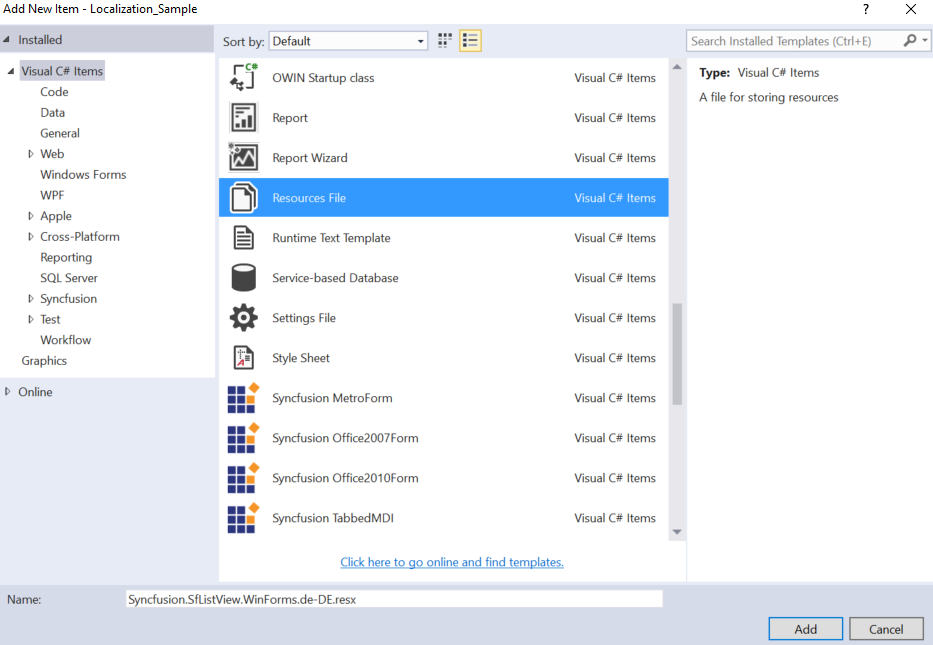
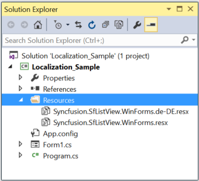
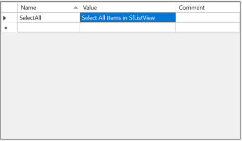
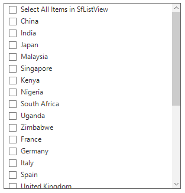
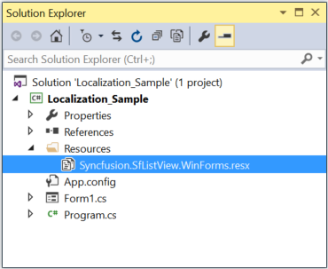
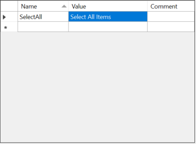
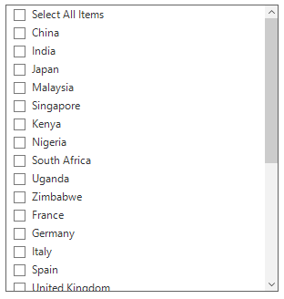

# Localization in Windows Forms SfListView         
Localization is a process of translating the application resources into different languages for some specific cultures. The SfListView can be localized by adding the resource file. The application culture can be changed by setting `CurrentUICulture` before InitializeComponent method.

## Localize at sample level
To localize the SfListView based on the  [CurrentUICulture](https://learn.microsoft.com/en-us/dotnet/api/system.globalization.cultureinfo.currentuiculture?view=net-5.0) using resource files, follow the steps:

1) Create a new folder and name it as Resources in your application.

2) Add the default resource file of the SfListView into Resources folder.You can download the Syncfusion.SfListView.WinForms.resx [here](https://www.syncfusion.com/downloads/support/directtrac/general/ze/ResourceFile1283641291).

                     
3) Right-click on the Resources folder, select Add and then NewItem.

4) In Add New Item wizard, select the Resource File option and name the filename as Syncfusion.SfListView.WinForms.<culture name>.resx. For example, give name as Syncfusion.SfListView.WinForms.de-DE.resx for German culture.The culture name that indicates the name of language and country.

	 

5) Now, select Add option to add the resource file in Resources folder.

6) Add the Name/Value pair in Resource Designer of Syncfusion. SfListView.WinForms.de-DE.resx file and change its corresponding value to the corresponding culture.
 
 
 
7) Now, set the CurrentCulture of the Application before the InitializeComponent method and run the sample.



public Form1()
{
 System.Threading.Thread.CurrentThread.CurrentCulture = new System.Globalization.CultureInfo("de-DE"); 
 System.Threading.Thread.CurrentThread.CurrentUICulture = new System.Globalization.CultureInfo("de-DE"); 
 InitializeComponent();
}


Public Sub New()
 System.Threading.Thread.CurrentThread.CurrentCulture = New System.Globalization.CultureInfo("de-DE")
 System.Threading.Thread.CurrentThread.CurrentUICulture = New System.Globalization.CultureInfo("de-DE")
 InitializeComponent()
End Sub


 

 
## Editing default resource file
The default resource file can be edited by adding it to Resources folder of the application where the SfListView reads the static texts here.
The default resource file can be download from [here](https://www.syncfusion.com/downloads/support/directtrac/general/ze/ResourceFile1283641291).

Now, change the Name and Value pair in Resource Designer of Syncfusion.SfListView.WinForms.resx file.

Run the sample.

 
 
## Localize resource file with different assembly or namespace
By default, the SfListView tries to read the resource file from executing assembly and its default namespace by using the `Assembly.GetExecuteAssembly` method. When the resource file is located at different assembly or namespace, it can be set to the SfListView by using the `SR.SetResources` method.



public Form1()
{
  System.Threading.Thread.CurrentThread.CurrentCulture = new System.Globalization.CultureInfo("de-DE");
  System.Threading.Thread.CurrentThread.CurrentUICulture = new System.Globalization.CultureInfo("de-DE");
  SR.SetResources(typeof(CustomListView).Assembly, "SfListViewExt");
  InitializeComponent();
}


Public Sub New()
  System.Threading.Thread.CurrentThread.CurrentCulture = New System.Globalization.CultureInfo("de-DE")
  System.Threading.Thread.CurrentThread.CurrentUICulture = New System.Globalization.CultureInfo("de-DE")
  SR.SetResources(GetType(CustomListView).Assembly, "SfListViewExt")
  InitializeComponent()
End Sub



## RightToLeft
Items of the SfListView can be aligned from right to left and vice versa using the following property.



sfListView1.RightToLeft = RightToLeft.Yes;


sfListView1.RightToLeft = RightToLeft.Yes



