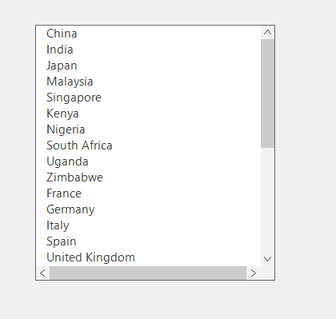

# Scrollbar customization in Windows Forms ListView Control
This section explains how to customize the scrollbar visibility in the SfListView.

## AutoHideScrollBars

SfListView allows to automatically show or hide horizontal and vertical scrollbars using the `AutoHideScrollBars` property. By default, `AutoHideScrollBars` will be set to true. This property manages scrollbar visibility based on content overflow. 





sfListView1.AutoHideScrollBars = True;





sfListView1.AutoHideScrollBars = True




         
        
                             
## Customizing the Visibility of ScrollBars

### HorizontalScrollBarVisible 

`HorizontalScrollBarVisible` property is used to show/hide the horizontal scrollbar. When `AutoHideScrollBars` is set to false, the horizontal scrollbar visibility will depends on the `HorizontalScrollBarVisible` property.

### VerticalScrollBarVisible

`VerticalScrollBarVisible` property is used to show/hide the horizontal scrollbar. When `AutoHideScrollBars` is set to false, the vertical scrollbar visibility will depends on the `VerticalScrollBarVisible` property.





sfListView1.AutoHideScrollBars = False;
sfListView1.HorizontalScrollBarVisible = True;
sfListview1.VerticalScrollBarVisible = True;





sfListView1.AutoHideScrollBars = False
sfListView1.HorizontalScrollBarVisible = True
sfListview1.VerticalScrollBarVisible = True





## ScrollIncrement
			
### HorizontalScrollIncrement

`HorizontalScrollIncrement` property used to set the multiplier of mouse wheel scrolling while doing horizontal scroll. User can customize the increment value per mouse wheel using this property

### VerticalScrollIncrement

`VerticalScrollIncrement` property used to set the multiplier of mouse wheel scrolling while doing vertical scroll. User can customize the increment value per mouse wheel using this property.





this.sfListView1.HorizontalScrollIncrement = 5;
this.sfListView1.VerticalScrollIncrement = 5;





Me.sfListView1.HorizontalScrollIncrement = 5
Me.sfListView1.VerticalScrollIncrement = 5





