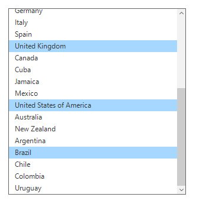
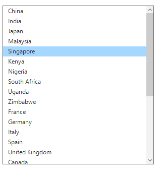
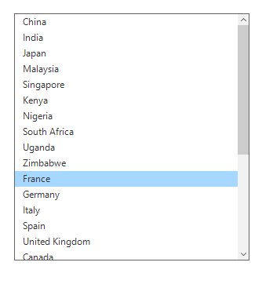
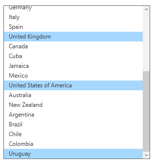
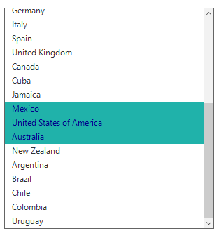

# Selection in Windows Forms ListView (SfListView)
This section explains how to perform selection and its related operations in the [Windows Forms ListView](https://www.syncfusion.com/winforms-ui-controls/listview) (SfListView).

## UI Selection
The control has different selection modes to perform selection operations as listed as follows:

*	None: Disables selection.
*	One: Selects single item. When clicking the selected item, selection will not be cleared. This is the default value of the [SfListView.SelectionMode](https://help.syncfusion.com/cr/windowsforms/Syncfusion.WinForms.ListView.SfListView.html#Syncfusion_WinForms_ListView_SfListView_SelectionMode).
*	MultiSimple: Selects more than one item. Selection is not cleared when selecting more than one item. When clicking the selected item, the selection gets cleared.
*	MultiExtended: Selects more than one item by dragging the items. You can also select multiple items by holding the Ctrl key.
	
    


sfListView1.SelectionMode = SelectionMode.MultiSimple;


sfListView1.SelectionMode = SelectionMode.MultiSimple

   
         

 
## Programmatic Selection
When the [SfListView.SelectionMode](https://help.syncfusion.com/cr/windowsforms/Syncfusion.WinForms.ListView.SfListView.html#Syncfusion_WinForms_ListView_SfListView_SelectionMode) is other than None, the item or items in the SfListView can be selected by using the [SfListView.SelectedItem](https://help.syncfusion.com/cr/windowsforms/Syncfusion.WinForms.ListView.SfListView.html#Syncfusion_WinForms_ListView_SfListView_SelectedItem) or [SfListView.SelectedIndex](https://help.syncfusion.com/cr/windowsforms/Syncfusion.WinForms.ListView.SfListView.html#Syncfusion_WinForms_ListView_SfListView_SelectedIndex) property or by adding items to the [SfListView.SelectedItems](https://help.syncfusion.com/cr/windowsforms/Syncfusion.WinForms.ListView.SfListView.html#Syncfusion_WinForms_ListView_SfListView_SelectedItems) property based on the [SfListView.SelectionMode](https://help.syncfusion.com/cr/windowsforms/Syncfusion.WinForms.ListView.SfListView.html#Syncfusion_WinForms_ListView_SfListView_SelectionMode).

When the selection mode is `One`, programmatically selects an item by setting the underlying object to the [SfListView.SelectedItem](https://help.syncfusion.com/cr/windowsforms/Syncfusion.WinForms.ListView.SfListView.html#Syncfusion_WinForms_ListView_SfListView_SelectedItem) or [SfListView.SelectedIndex](https://help.syncfusion.com/cr/windowsforms/Syncfusion.WinForms.ListView.SfListView.html#Syncfusion_WinForms_ListView_SfListView_SelectedIndex) property.



sfListView1.SelectedItem = sfListView1.View.DisplayItems[4];


sfListView1.SelectedItem = sfListView1.View.DisplayItems[4];

    
 
 
 


sfListView1.SelectedIndex = 10;


sfListView1.SelectedIndex = 10

 
 
 
 
Multiple items can be selected by adding data objects to [SelectedItems](https://help.syncfusion.com/cr/windowsforms/Syncfusion.WinForms.ListView.SfListView.html#Syncfusion_WinForms_ListView_SfListView_SelectedItems) property.



foreach (var item in sfListView1.View.DisplayItems)
{
   var obj = item as CountryInfo;
   if (obj.CountryName[0].ToString() == "U")
      sfListView1.SelectedItems.Add(item);
}


For Each item In sfListView1.View.DisplayItems
   Dim obj = TryCast(item, CountryInfo)
   If obj.CountryName(0).ToString() = "U" Then
	  sfListView1.SelectedItems.Add(item)
   End If
Next item



## Selected items

### Get selected items

The Windows Forms ListView (SfListView) gets all the selected items through the [SfListView.SelectedItems](https://help.syncfusion.com/cr/windowsforms/Syncfusion.WinForms.ListView.SfListView.html#Syncfusion_WinForms_ListView_SfListView_SelectedItems) property and gets single item by using the [SfListView.SelectedItem](https://help.syncfusion.com/cr/windowsforms/Syncfusion.WinForms.ListView.SfListView.html#Syncfusion_WinForms_ListView_SfListView_SelectedItem) or [SfListView.SelectedIndex](https://help.syncfusion.com/cr/windowsforms/Syncfusion.WinForms.ListView.SfListView.html#Syncfusion_WinForms_ListView_SfListView_SelectedIndex) property.                              

### Clear selected items

The selected items can be cleared by calling the `SelectedItems.Clear()` method.



sfListView1.SelectedItems.Clear();


sfListView1.SelectedItems.Clear()



### Getting row index
Windows Forms ListView (SfListView) allows you to get item row index based on provided point. You can use the [GetRowIndexAtPoint](https://help.syncfusion.com/cr/windowsforms/Syncfusion.WinForms.ListView.SfListView.html#Syncfusion_WinForms_ListView_SfListView_GetRowIndexAtPoint_System_Drawing_Point_) method to get a row index based on the bounds value.



int rowIndex = sfListView.GetRowIndexAtPoint(point);


Dim rowIndex As Integer = sfListView.GetRowIndexAtPoint(point)



## Hot tracking
SfListView supports hover selection on item when mouse pointer moves over an item by setting [SfListView.HotTracking](https://help.syncfusion.com/cr/windowsforms/Syncfusion.WinForms.ListView.SfListView.html#Syncfusion_WinForms_ListView_SfListView_HotTracking) as true.



sfListView1.HotTracking = true;


sfListView1.HotTracking = true


 

 
## Appearance
The SfListView allows you to customize the appearance of the selected items or mouse hover items through [SfListView.Style](https://help.syncfusion.com/cr/windowsforms/Syncfusion.WinForms.ListView.SfListView.html#Syncfusion_WinForms_ListView_SfListView_Style) property.

### Change the background and foreground colors for selection
The selection background and foreground color can be changed by using the `SfListView.Style.SelectionStyle` property.



sfListView1.Style.SelectionStyle.SelectionBackColor = Color.LightSeaGreen;
sfListView1.Style.SelectionStyle.SelectionForeColor = Color.DarkBlue;


sfListView1.Style.SelectionStyle.SelectionBackColor = Color.LightSeaGreen
sfListView1.Style.SelectionStyle.SelectionForeColor = Color.DarkBlue


 

 
### Change the background and foreground color for Hover selection
The selection background and foreground colors can be changed by using the `SfListView.Style.SelectionStyle` property.



sfListView1.Style.SelectionStyle.HoverBackColor = Color.PaleVioletRed;
sfListView1.Style.SelectionStyle.HoverForeColor = Color.GreenYellow;


sfListView1.Style.SelectionStyle.HoverBackColor = Color.PaleVioletRed
sfListView1.Style.SelectionStyle.HoverForeColor = Color.GreenYellow



 
## Events

### SelectionChanging event

The [SelectionChanging](https://help.syncfusion.com/cr/windowsforms/Syncfusion.WinForms.ListView.SfListView.html#Syncfusion_WinForms_ListView_SfListView_SelectionChanging) event is raised while selecting an item at the execution time. [ItemSelectionChangingEventArgs](https://help.syncfusion.com/cr/windowsforms/Syncfusion.WinForms.ListView.Events.ItemSelectionChangingEventArgs.html) has the following members that provides information for the SelectionChanging event:

* `AddedItems`: Gets collection of the underlying data objects where the selection is going to process.
* `RemovedItems`: Gets collection of the underlying data objects where the selection is going to remove.

You can cancel the selection process within this event by setting the ItemSelectionChangingEventArgs.Cancel property to true.

The SelectionChanging event is used for the following use case:
*	Disable the selection of the particular item based on the underlying data.



sfListView1.SelectionChanging += new EventHandler<ItemSelectionChangingEventArgs>(SfListView1_SelectionChanging);

private void SfListView1_SelectionChanging(object sender, ItemSelectionChangingEventArgs e)
{
    if ((sender as SfListView).SelectedItems.Count > 0)
                e.Cancel = true;
}


AddHandler sfListView1.SelectionChanging, AddressOf SfListView1_SelectionChanging

Private Sub SfListView1_SelectionChanging(ByVal sender As Object, ByVal e As ItemSelectionChangingEventArgs)
	If (TryCast(sender, SfListView)).SelectedItems.Count > 0 Then
				e.Cancel = True
	End If
End Sub



### SelectionChanged event

The [SelectionChanged](https://help.syncfusion.com/cr/windowsforms/Syncfusion.WinForms.ListView.SfListView.html#Syncfusion_WinForms_ListView_SfListView_SelectionChanged) event will occur once the selection process has been completed for the selected item in the SfListView. [ItemSelectionChangedEventArgs](https://help.syncfusion.com/cr/windowsforms/Syncfusion.WinForms.ListView.Events.ItemSelectionChangedEventArgs.html) has the following members that provides information for the SelectionChanged event:

* `AddedItems`: Gets collection of the underlying data objects where the selection has been processed.
* `RemovedItems`: Gets collection of the underlying data objects where the selection has been removed.

The SelectionChanged event used for the following use cases:
•	Clears all the selected item.
•	Removes the particular selected item.
•	Gets the index of the selected item.



sfListView1.SelectionChanged += new EventHandler<ItemSelectionChangedEventArgs>(SfListView1_SelectionChanged);
private void SfListView1_SelectionChanged(object sender, ItemSelectionChangedEventArgs e)
{
      if (e.AddedItems.Count > 0)
          (sender as SfListView).SelectedItems.Clear();
}


AddHandler sfListView1.SelectionChanged, AddressOf SfListView1_SelectionChanged
Private Sub SfListView1_SelectionChanged(ByVal sender As Object, ByVal e As ItemSelectionChangedEventArgs)
	  If e.AddedItems.Count > 0 Then
		  TryCast(sender, SfListView).SelectedItems.Clear()
	  End If
End Sub



## Disables selection on a particular item
The selection of a particular set of items can be disabled based on the [SfListView.SelectedItems](https://help.syncfusion.com/cr/windowsforms/Syncfusion.WinForms.ListView.SfListView.html#Syncfusion_WinForms_ListView_SfListView_SelectedItems) of the underlying collections.



public partial class Form1: Form
{
    Public Form1()
      {
         InitializeComponent();
         sfListView1.SelectionChanging += new EventHandler<ItemSelectionChangedEventArgs>(SfListView1_SelectionChanging);
   }
}
private void SfListView1_SelectionChanging(object sender, ItemSelectionChangingEventArgs e)
{
    if (e.AddedItems.Count > 0 && (e.AddedItems[0] as CountryInfo).CountryName == "Mexico")
          e.Cancel = true;
}


Partial Public Class Form1
	Inherits Form
	Private Public Sub New()
		 InitializeComponent()
		  AddHandler sfListView1.SelectionChanging, AddressOf SfListView1_SelectionChanging
	End Sub
End Class

Private Sub SfListView1_SelectionChanging(ByVal sender As Object, ByVal e As ItemSelectionChangingEventArgs)
	   If e.AddedItems.Count > 0 AndAlso (TryCast(e.AddedItems(0), CountryInfo)).CountryName = "Mexico" Then
				e.Cancel = True
	   End If
End Sub


