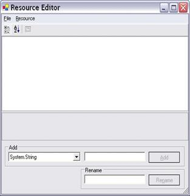
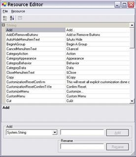

# Localization

Localization is the process of making your application multilingual, by formatting the content according to cultures. This involves configuring the application for a specific language. Culture is the combination of language and location, for example En-US is the culture for English spoken in United States; En-GB is the culture for English spoken in Great Britain. Syncfusion components support localization and have their own neutral resources. These resources can be localized as per the customer requirement.

## Getting Started

The followings are the steps to localize a control:

1. Using **ILocalizationProvider**. 
2. Using **Satellite** **Assemblies**.

### ILocalizationProvider

##### Adding Localization to an Application

Use the following procedure to localize the FindDialogBox in the Edit Control:

1.   Include the required namespaces at the beginning of the source file.

<table>
<tr>
<td>
**[C#]**    using Syncfusion.Windows.Forms;    using Syncfusion.Windows.Forms.Edit;  </td></tr>
</table>

<table>
<tr>
<td>
**[VB]**    Imports Syncfusion.Windows.Forms    Imports Syncfusion.Windows.Forms.Edit  </td></tr>
</table>

2.   Create a class that implements the ILocalizationProvider interface defined in the Syncfusion.Windows.Forms namespace in the Syncfusion.Shared.Base.dll.

3.   Return the localized versions of the strings corresponding to the string identifiers.

4.   String identifiers are defined in the ResourceIdentifiers and the EditResourceIdentifiers classes in Syncfusion.Shared.Base and Syncfusion.Edit.Windows assemblies respectively.

<table>
<tr>
<td>
**[C#/VB]**  Syncfusion.Windows.Forms.Localization.Localizer.EditResourceIdentifiers  Syncfusion.Windows.Forms.ResourceIdentifiers  </td></tr>
</table>

5.   Leave an empty string for the rest of the identifiers that are not involved in the localization. These identifiers are loaded with a default value.

6.   Assign this instance to the Provider property of the LocalizationProvider class, before the InitializeComponent call in the constructor of the application.

<table>
<tr>
<td>
**[C#]**  LocalizationProvider.Provider = new Localizer();  </td></tr>
</table>

<table>
<tr>
<td>
**[VB]**  LocalizationProvider.Provider = New Localizer()  </td></tr>
</table>

7.   The following code example is the result:

<table>
<tr>
<td>
**[C#]**  public string GetLocalizedString(System.Globalization.CultureInfo culture, stringname,object obj)  {  switch (name)  {  #region Find Dialog  case Localizer.EditResourceIdentifiers.FDbtnClose:  return "schließen";  case Localizer.EditResourceIdentifiers.FDbtnFind:  return "finden";  case Localizer.EditResourceIdentifiers.FDbtnMarkAll:  return "markieren Sie alle";                case Localizer.EditResourceIdentifiers.FDchkCase:  return "übereinstimmen Fall";                 case Localizer.EditResourceIdentifiers.FDchkHidden:  return "Suche hidden";  case Localizer.EditResourceIdentifiers.FDchkRegular:  return "Suche regelmäßige";  case Localizer.EditResourceIdentifiers.FDchkUp:  return "Suche Up";  case Localizer.EditResourceIdentifiers.FDchkWholeWord:  return "Ganzes Wort";  case Localizer.EditResourceIdentifiers.FDchkWrap:  return "Zeilenumbruch";  case Localizer.EditResourceIdentifiers.FDGroupTitle:  return "Suchen";  case Localizer.EditResourceIdentifiers.FDMain:  return "Startseite";  case Localizer.EditResourceIdentifiers.FDrdbDocument:  return "Document";  case Localizer.EditResourceIdentifiers.FDrdbSelection:  return "Auswahl";  case Localizer.EditResourceIdentifiers.FDTitle:  return "Kommentar";  #endregion                 default:  return string.Empty;  }  }  </td></tr>
</table>

<table>
<tr>
<td>
**[VB]**    Public Function GetLocalizedString(ByVal culture AsSystem.Globalization.CultureInfo, ByVal name As String, ByVal obj As Object) AsString  Select Case name  '#Region "Find Dialog"  Case Localizer.EditResourceIdentifiers.FDbtnClose  Return "schließen"  Case Localizer.EditResourceIdentifiers.FDbtnFind  Return "finden"  Case Localizer.EditResourceIdentifiers.FDbtnMarkAll  Return "markieren Sie alle"  Case Localizer.EditResourceIdentifiers.FDchkCase  Return "übereinstimmen Fall"  Case Localizer.EditResourceIdentifiers.FDchkHidden  Return "Suche hidden"  Case Localizer.EditResourceIdentifiers.FDchkRegular  Return "Suche regelmäßige"  Case Localizer.EditResourceIdentifiers.FDchkUp  Return "Suche Up"  Case Localizer.EditResourceIdentifiers.FDchkWholeWord  Return "Ganzes Wort"  Case Localizer.EditResourceIdentifiers.FDchkWrap  Return "Zeilenumbruch"  Case Localizer.EditResourceIdentifiers.FDGroupTitle  Return "Suchen"  Case Localizer.EditResourceIdentifiers.FDMain  Return "Startseite"  Case Localizer.EditResourceIdentifiers.FDrdbDocument  Return "Document"  Case Localizer.EditResourceIdentifiers.FDrdbSelection  Return "Auswahl"  Case Localizer.EditResourceIdentifiers.FDTitle  Return "Kommentar"  Case Else  '#End Region    Return String.Empty  End Select  End Function  </td></tr>
</table>

### Using Satellite Assemblies

Localization is a key feature for providing solutions to global customers. This is true for desktop applications, as well as Syncfusion components. Resources are important for localizing an application as they contain the necessary settings for different languages and cultures.

Internationalization and localization are different but related concepts.

•**Internationalization:** Ensuring an application can handle resources (e.g., strings) in a language-specific fashion. Internationalization is also known as i18n.

•**Localization:** Also known as l10n, localization is the process of customizing an application for specific cultures or regions. It is the adaptation of language, content, and design to reflect local cultural sensitivities.

There are three types of cultures:

•**Invariant:** An invariant culture is always culture-insensitive, primarily used as a “default” culture. You can specify the invariant culture by name using an empty string (""). It is associated with the English language but not with any particular country or region.

•**Neutral:** A neutral culture is a culture that is associated with a language but not with a country or region.

•**Specific:** A specific culture is a culture that is associated with a language and a country or region like, “fr-CA” and “fr-FR”. For example, "fr" is a neutral culture and "fr-FR" is a specific culture. Note that "zh-CHS" (simplified Chinese) and "zh-CHT" (traditional Chinese) are neutral cultures.

##### Steps to Localize Syncfusion Components

Syncfusion components have their own neutral resources, and these resources can be localized as per the needs of the customer. The steps for localizing the Syncfusion Menu Package are as follows.

1.   The neutral resources of every Syncfusion component are present in the Localization folder of each component’s source code. For the Tools package, the resources are present in the following path, assuming that “C:\Program Files\” is the installation path for the Syncfusion components.

**Tools.Windows:**

C:\Program Files\Syncfusion\Essential Studio\<version>\Windows\Tools.Windows\Localization\

**Shared.Base:**

C:\Program Files\Syncfusion\Essential Studio\<version>\Base\Shared.Base\Localization

1.   Inside the NeutralResources folder, there are four resource files corresponding to the Tools package. These resources contain the string representations for the English culture, both default and neutral.

2.   Microsoft Visual Studio.NET ships with a tool called Resource Editor (ResEditor) that can be used to localize the string resources. It provides a graphical interface that allows you to construct resource files containing bitmaps, icons, and strings.

3.   Compile the source code using the build.bat command in the Microsoft Visual Studio 2008 Command prompt. The following figure shows how the Resource Editor looks when it first opens.

4.   Using the Resource Editor, open the resource file named **Syncfusion.Windows.Forms.Tools.SR.resources** present in the **NeutralResources** folder. The previous figure shows all string resources displayed in the tool.

5.   Now the actual process for localization begins. After opening the resource file in the Resource Editor, start entering the equivalent strings for the required culture. In this example, the German language is used. In the following figure, all the English strings are replaced by their German equivalent. For instance, the German equivalent of Close is “Ende”.

6.   Open the Visual Studio.NET command prompt and enter WinRes to open the Windows Resource Localization Editor. WinRes is used to work with Windows Forms resources. The Resource Editor tool can’t be used to edit Windows Forms resources. It can only be used to work with images and string-based resources.

7.   Open the other resources using the WinRes utility and replace the English strings with the German equivalent. The following figure shows the file Syncfusion.Windows.Forms.Tools.XPMenus.CustomizationPanel.resources open in the WinRes tool and with German text. The German text has been added to the form using the Properties window.

8.   Click **File** > **Save** **As** and select the culture to be localized, in this case, German-Germany. Now a new resource file with the **nameSyncfusion.Windows.Forms.Tools.XPMenus.CustomizationPanel.de-DE.resources** is added to the source path.

9.   Repeat the process for other resources and save it. Now in the Visual Studio.NET Command Prompt, enter the following command and press Enter. Make sure that you have the **sf.publicsnk** file from the **Localization** folder.

**Tools.Windows**

<table>
<tr>
<td>
al /t:lib /culture:de-DE /out:Syncfusion.Tools.Windows.resources.dll /v:2.0.0.0 /delay+ /keyf:sf.publicsnk /embed:Syncfusion.Windows.Forms.Tools.XPMenus.CustomizationPanel.de-DE.resources /embed:Syncfusion.Windows.Forms.MdiWindowDialog.de-DE.resources /embed:Syncfusion.Windows.Forms.Tools.SR.de-DE.resources /embed:Syncfusion.Windows.Forms.Tools.XPMenus.BarCustomizationDialog.de-DE.resources  </td></tr>
</table>
**Shared.Base**

<table>
<tr>
<td>
al /t:lib /culture:de-DE /out:Syncfusion.Shared.Base.resources.dll /v:1.1.0.0 /delay+ /keyf:sf.publicsnk /embed: Syncfusion.Windows.Forms.Localization.SR.de-DE  </td></tr>
</table>

10.  The version you specify for these DLLs in the __al__ command should be based on the **SatelliteContractVersionAttribute** setting in the **productAssemblyInfo**. This also means that when a new version of the product is released with a newer assembly version you have to recreate by adding new and necessary resources, and recompile your resource DLLs with a new version, if the SatelliteContractVersionAttribute has changed.

11.  On successful execution, an assembly file named **Syncfusion.Tools.Windows.resources.dll** is created.

12.  Finally, mark this satellite DLL for verification skipping since it’s not signed with the same strong-name as the product assembly, as follows:

<table>
<tr>
<td>
sn –Vr Syncfusion.Tools.Windows.resources.dll  </td></tr>
</table>

13.  Drop this DLL into an appropriate sub-directory under your .EXE’s directory (bin\Debug\), based on the naming conventions enforced in .NET. You can put it in the **de-DE** sub-directory if this DLL contains resources from the German (Germany) culture.

14.  Finally, you can make your application fetch the German resources during runtime using the following code example. To change the UI culture of the current thread, add this code in the **Forms** constructor before the **InitializeComponent()**.

<table>
<tr>
<td>
Thread.CurrentThread.CurrentUICulture = newSystem.Globalization.CultureInfo("de-DE");  </td></tr>
</table>

15.  Now run your application that contains the Syncfusion Toolbar and Menu controls and open the **Customization** dialog. The dialog appears in German, as shown in the following figure:

