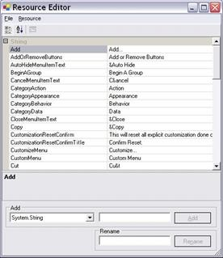
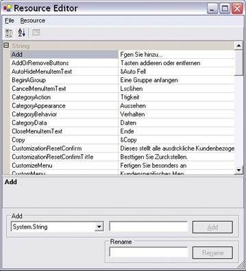
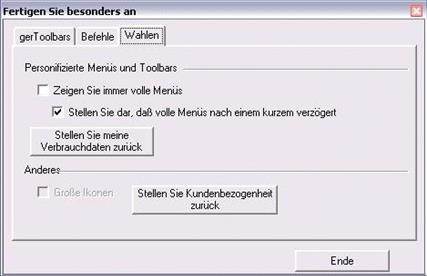

# Localization

Localization is the process of making application multilingual by formatting the content according to the cultures. This involves configuring the application for a specific language. Culture is the combination of language and location. For example, `en-US` is the culture for English spoken in United States; `en-GB` is the culture for English spoken in Great Britain.  
Syncfusion components support localization and have their own neutral resources. These resources can be localized as per the customer requirement and they can be localized in two ways are, 

• Using `ILocalizationProvider`.  
• Using Satellite Assemblies.
 
## Using ILocalizationProvider

The following procedure helps to localize the FindDialogBox in the Edit Control:

1)   Include the required namespaces at the beginning of the source file.





using Syncfusion.Windows.Forms;
using Syncfusion.Windows.Forms.Edit;





Imports Syncfusion.Windows.Forms
Imports Syncfusion.Windows.Forms.Edit





2)   Create a class that implements the `ILocalizationProvider` interface defined in the Syncfusion.Windows.Forms namespace in the Syncfusion.Shared.Base.dll.  

3)   Return the localized versions of the strings corresponding to the string identifiers.  

4)   String identifiers are defined in the `ResourceIdentifiers` and the `EditResourceIdentifiers` classes in Syncfusion.Shared.Base and Syncfusion.Edit.Windows assemblies respectively.





using Syncfusion.Windows.Forms.Localization.Localizer.EditResourceIdentifiers;
using Syncfusion.Windows.Forms.ResourceIdentifiers;





Imports Syncfusion.Windows.Forms.Localization.Localizer.EditResourceIdentifiers
Imports Syncfusion.Windows.Forms.ResourceIdentifiers





5)   Leave an empty string for the rest of the identifiers that are not involved in the localization. These identifiers are loaded with a default value.  

6)   Assign this instance to the `Provider` property of the `LocalizationProvider` class before the InitializeComponent call in the constructor of the application.





LocalizationProvider.Provider = new Localizer();





LocalizationProvider.Provider = New Localizer()



  

7)   The following code example is a reference to assign Localization string





public string GetLocalizedString(System.Globalization.CultureInfo culture, stringname,object obj)

{

switch (name)

{

case Localizer.EditResourceIdentifiers.FDbtnClose:

return "schließen";

case Localizer.EditResourceIdentifiers.FDbtnFind:

return "finden";

case Localizer.EditResourceIdentifiers.FDbtnMarkAll:

return "markieren Sie alle";              

case Localizer.EditResourceIdentifiers.FDchkCase:

return "übereinstimmen Fall";               

case Localizer.EditResourceIdentifiers.FDchkHidden:

return "Suche hidden";

case Localizer.EditResourceIdentifiers.FDchkRegular:

return "Suche regelmäßige";

case Localizer.EditResourceIdentifiers.FDchkUp:

return "Suche Up";

case Localizer.EditResourceIdentifiers.FDchkWholeWord:

return "Ganzes Wort";

case Localizer.EditResourceIdentifiers.FDchkWrap:

return "Zeilenumbruch";

case Localizer.EditResourceIdentifiers.FDGroupTitle:

return "Suchen";

case Localizer.EditResourceIdentifiers.FDMain:

return "Startseite";

case Localizer.EditResourceIdentifiers.FDrdbDocument:

return "Document";

case Localizer.EditResourceIdentifiers.FDrdbSelection:

return "Auswahl";

case Localizer.EditResourceIdentifiers.FDTitle:

return "Kommentar";
             
default:

return string.Empty;

}

}





Public Function GetLocalizedString(ByVal culture AsSystem.Globalization.CultureInfo, ByVal name As String, ByVal obj As Object) AsString

Select Case name

Case Localizer.EditResourceIdentifiers.FDbtnClose

Return "schließen"

Case Localizer.EditResourceIdentifiers.FDbtnFind

Return "finden"

Case Localizer.EditResourceIdentifiers.FDbtnMarkAll

Return "markieren Sie alle"

Case Localizer.EditResourceIdentifiers.FDchkCase

Return "übereinstimmen Fall"

Case Localizer.EditResourceIdentifiers.FDchkHidden

Return "Suche hidden"

Case Localizer.EditResourceIdentifiers.FDchkRegular

Return "Suche regelmäßige"

Case Localizer.EditResourceIdentifiers.FDchkUp

Return "Suche Up"

Case Localizer.EditResourceIdentifiers.FDchkWholeWord

Return "Ganzes Wort"

Case Localizer.EditResourceIdentifiers.FDchkWrap

Return "Zeilenumbruch"

Case Localizer.EditResourceIdentifiers.FDGroupTitle

Return "Suchen"

Case Localizer.EditResourceIdentifiers.FDMain

Return "Startseite"

Case Localizer.EditResourceIdentifiers.FDrdbDocument

Return "Document"

Case Localizer.EditResourceIdentifiers.FDrdbSelection

Return "Auswahl"

Case Localizer.EditResourceIdentifiers.FDTitle

Return "Kommentar"

Case Else

Return String.Empty

End Select

End Function





## Using Satellite Assemblies

Localization is a key feature for providing solutions to global customers. This is true for desktop applications as well as Syncfusion components. Resources are important for localizing an application as they contain the necessary settings for different languages and cultures. Here Internationalization and localization are different but related concepts.

• Internationalization: Ensuring an application can handle resources (For example, strings) in a language-specific fashion. Internationalization is also known as i18n.

• Localization: Also known as l10n. Localization is the process of customizing an application for specific cultures or regions. It is the adaptation of language, content, and design to reflect the local cultural sensitivities.

### Types of cultures

• Invariant: An invariant culture is always culture-insensitive primarily used as a “default” culture and helps to specify the invariant culture with name by using an empty string (""). It is associated with the English language but not with any particular country or region.

• Neutral: A neutral culture is a culture that is associated with a language but not with a country or region.

• Specific: A specific culture is a culture that is associated with a language and a country or region like, `fr-CA` and `fr-FR`. For example, fr is a neutral culture and `fr-FR` is a specific culture. Note that `zh-CHS` (simplified Chinese) and `zh-CHT` (traditional Chinese) are neutral cultures.

### Steps to Localize Syncfusion Components

Syncfusion components have their own neutral resources, and these resources can be localized as per the needs of the customer. The steps for localizing the Syncfusion Menu Package are as follows.

1)   The neutral resources of every Syncfusion component are present in the Localization folder of each component’s source code. For the Tools package, the resources are present in the following path assuming that “C:\Program Files\” is the installation path for the Syncfusion components.

• For Tools.Windows: C:\Program Files\Syncfusion\Essential Studio\{{ site.releaseversion }}\Windows\Tools.Windows\Localization\

• For Shared.Base: C:\Program Files\Syncfusion\Essential Studio\{{ site.releaseversion }}\Base\Shared.Base\Localization

N> In above section, Latest Essential Studio version details has been provided. User can refer installed Essential Studio version instead of mentioned version.

2)   Inside the NeutralResources folder, there are four resource files corresponding to the Tools package. These resources contain the string representations for the English culture, both default and neutral.  

3)   Microsoft Visual Studio.NET ships with a tool called Resource Editor (ResEditor) that can be used to localize the string resources. It provides a graphical interface that allows to construct resource files containing bitmaps, icons, and strings.  

4)   Compile the source code by using the build.bat command in the Microsoft Visual Studio 2008 Command prompt. The following figure shows how the Resource Editor looks when it first opens.  

5)   By using the Resource Editor, open the resource file, Syncfusion.Windows.Forms.Tools.SR.resources present in the NeutralResources folder. The previous figure shows all string resources displayed in the tool.  

6)   Now, the actual process for localization begins. After opening the resource file in the Resource Editor, start entering the equivalent strings for the required culture. In this example, the German language is used. In the following figure, all the English strings are replaced by their German equivalent. For instance, the German equivalent of Close is “Ende”.

7)   Open the Visual Studio.NET command prompt and enter WinRes to open the Windows Resource Localization Editor. WinRes is used to work with Windows Forms resources. The Resource Editor tool cannot be used to edit Windows Forms resources. It can only be used to work with images and string-based resources.  

8)   Open the other resources by using the WinRes utility and replace the English strings with the German equivalent. The following figure shows the file Syncfusion.Windows.Forms.Tools.XPMenus.CustomizationPanel.resources open in the WinRes tool and with German text. The German text has been added to the form by using the Properties window.

9)   Click File -> Save As and select the culture to be localized. In this case, German-Germany. Now, a new resource file with the name Syncfusion.Windows.Forms.Tools.XPMenus.CustomizationPanel.de-DE.resources is added to the source path.  

10)   Repeat the process for other resources and save it. Now, in the Visual Studio.NET Command Prompt, enter the following command and press Enter. Make sure that sf.publicsnk file is available from the Localization folder.  

For Tools.Windows



al /t:lib /culture:de-DE /out:Syncfusion.Tools.Windows.resources.dll /v:2.0.0.0 /delay+ /keyf:sf.publicsnk /embed:Syncfusion.Windows.Forms.Tools.XPMenus.CustomizationPanel.de-DE.resources /embed:Syncfusion.Windows.Forms.MdiWindowDialog.de-DE.resources /embed:Syncfusion.Windows.Forms.Tools.SR.de-DE.resources /embed:Syncfusion.Windows.Forms.Tools.XPMenus.BarCustomizationDialog.de-DE.resources



For Shared.Base



al /t:lib /culture:de-DE /out:Syncfusion.Shared.Base.resources.dll /v:1.1.0.0 /delay+ /keyf:sf.publicsnk /embed: Syncfusion.Windows.Forms.Localization.SR.de-DE



11)  The version can be specified for these DLLs in the al command should be based on the `SatelliteContractVersionAttribute` setting in the productAssemblyInfo. This also means that when a new version of the product is released with a newer assembly version that needs to be recreated by adding new and necessary resources. Recompile the resource DLLs with a new version, when the `SatelliteContractVersionAttribute` has changed.  

12)  On successful execution, an assembly file, Syncfusion.Tools.Windows.resources.dll is created.  

13)  Finally, mark this satellite DLL for verification skipping since, it is not signed with the same strong-name as the product assembly as follows:



sn –Vr Syncfusion.Tools.Windows.resources.dll



14)  Drop this DLL into an appropriate sub-directory under .EXE’s directory (bin\Debug\), based on the naming conventions enforced in .NET. and it can placed in the de-DE sub-directory when this DLL contains resources from the German (Germany) culture.  

15)  Finally, application can refer German resources during runtime by using the following code example. To change the UI culture of the current thread, add this code in the Forms constructor before the InitializeComponent().  





Thread.CurrentThread.CurrentUICulture = new System.Globalization.CultureInfo("de-DE");





Thread.CurrentThread.CurrentUICulture = new System.Globalization.CultureInfo("de-DE")



 

16)  Now, Run the application that contains the Syncfusion Toolbar and Menu controls and open the Customization dialog. The dialog appears in German as shown in the following figure:

