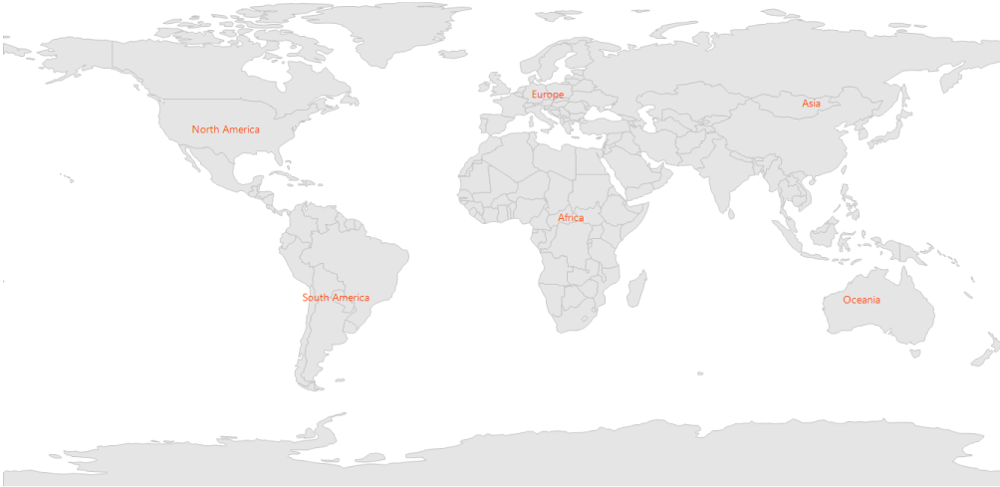

# Annotations in Windows Forms Map (Maps)

Annotations are used to add some message on map. In Maps control, annotations are denoted using the following major properties:

1. [`AnnotationLabel`](https://help.syncfusion.com/cr/windowsforms/Syncfusion.Windows.Forms.Maps.Annotation.html#Syncfusion_Windows_Forms_Maps_Annotation_AnnotationLabel): Shows some information in text format.

2. [`AnnotationStroke`](https://help.syncfusion.com/cr/windowsforms/Syncfusion.Windows.Forms.Maps.Annotation.html#Syncfusion_Windows_Forms_Maps_Annotation_AnnotationStroke): Applies specific color to annotations.

3. [`Latitude`](https://help.syncfusion.com/cr/windowsforms/Syncfusion.Windows.Forms.Maps.Annotation.html#Syncfusion_Windows_Forms_Maps_Annotation_Latitude) and [`Longitude`](https://help.syncfusion.com/cr/windowsforms/Syncfusion.Windows.Forms.Maps.Annotation.html#Syncfusion_Windows_Forms_Maps_Annotation_Longitude): Position the annotations anywhere on the map based on latitude and longitude, which are string types, used to set coordinates of the MapAnnotation in the form of latitude and longitude.

### Code sample:





partial class Form1
{

         private void InitializeComponent()
         {

            this.mapsControl1 = new Syncfusion.Windows.Forms.Maps.Maps();

            this.mapsControl1.Name = "mapsControl1";

            this.mapsControl1.Size = new System.Drawing.Size(880, 585); 

            this.Controls.Add(this.mapsControl1);  

            this.ClientSize = new System.Drawing.Size(880, 585);          

            this.Load += new System.EventHandler(this.Form1_Load);

         }

            private Syncfusion.Windows.Forms.Maps.Maps mapsControl1;

}  









public partial class Form1 : Form
{

        private void Form1_Load(object sender, EventArgs e)
        {

            this.MetroColor = Color.White;

            this.mapsControl1.Dock = DockStyle.Fill;

            this.mapsControl1.Margin = new Padding(0, 0, 4, 0);

            this.mapsControl1.MapBackgroundBrush = new SolidBrush(Color.White);

            this.mapsControl1.MapItemsShape = Syncfusion.Windows.Forms.Maps.MapItemShapes.None;

            MapViewModel model = new MapViewModel();

             ShapeFileLayer shapeLayer = new ShapeFileLayer();

             shapeLayer.Uri = "world1.shp";

             shapeLayer.ItemSource = model.Countries;

             shapeLayer.ShapeSetting.ShapeFill = "#E5E5E5";

             shapeLayer.ShapeSetting.ShapeStrokeThickness = 1.5;

             shapeLayer.ShapeSetting.ShapeStroke = "#C1C1C1";

            shapeLayer.Annotations.Add(new Annotation() { AnnotationLabel = "North America", Latitude = 40.4230, Longitude = -112.7372,AnnotationStroke = new SolidBrush(Color.OrangeRed) });

            shapeLayer.Annotations.Add(new Annotation() { AnnotationLabel = "Africa", Latitude = 9.1021, Longitude = 18.2812, AnnotationStroke = new SolidBrush(Color.OrangeRed) });

            shapeLayer.Annotations.Add(new Annotation() { AnnotationLabel = "Europe", Latitude = 53.0000, Longitude = 9.0000, AnnotationStroke = new SolidBrush(Color.OrangeRed) });

            shapeLayer.Annotations.Add(new Annotation() { AnnotationLabel = "South America", Latitude = -19.6048, Longitude = -73.0625, AnnotationStroke = new SolidBrush(Color.OrangeRed) });

            shapeLayer.Annotations.Add(new Annotation() { AnnotationLabel = "Asia", Latitude = 49.8380, Longitude = 105.8203, AnnotationStroke = new SolidBrush(Color.OrangeRed) });

            shapeLayer.Annotations.Add(new Annotation() { AnnotationLabel = "Oceania", Latitude = -20.3456, Longitude = 120.4346, AnnotationStroke = new SolidBrush(Color.OrangeRed) });

            this.mapsControl1 .Layers.Add(shapeLayer);

         }

     }       





Screenshot:
