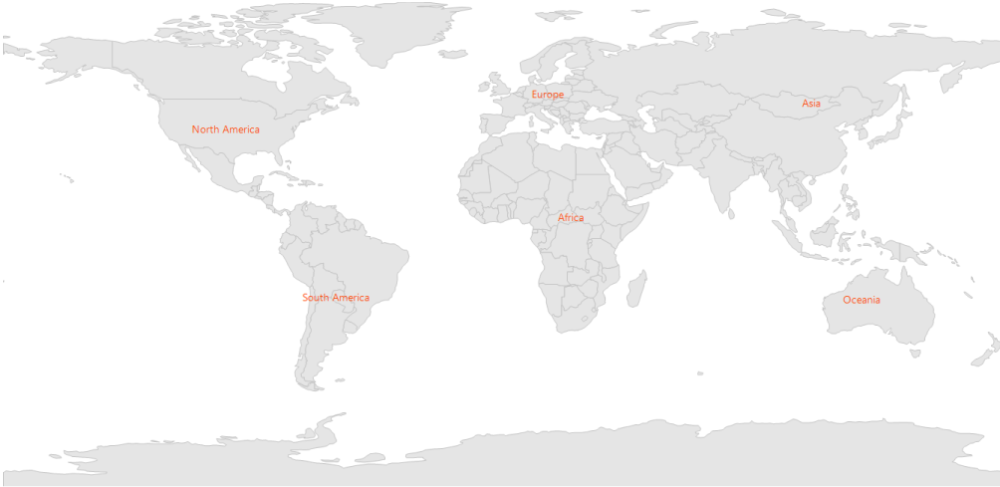

# Annotations in Windows Forms Map (Maps)

Annotations are used to add messages on the map. In Maps control, annotations are denoted using the following major properties:

1. [`AnnotationLabel`](https://help.syncfusion.com/cr/windowsforms/Syncfusion.Windows.Forms.Maps.Annotation.html#Syncfusion_Windows_Forms_Maps_Annotation_AnnotationLabel): Shows some information in text format.

2. [`AnnotationStroke`](https://help.syncfusion.com/cr/windowsforms/Syncfusion.Windows.Forms.Maps.Annotation.html#Syncfusion_Windows_Forms_Maps_Annotation_AnnotationStroke): Applies specific color to annotations.

3. [`Latitude`](https://help.syncfusion.com/cr/windowsforms/Syncfusion.Windows.Forms.Maps.Annotation.html#Syncfusion_Windows_Forms_Maps_Annotation_Latitude) and [`Longitude`](https://help.syncfusion.com/cr/windowsforms/Syncfusion.Windows.Forms.Maps.Annotation.html#Syncfusion_Windows_Forms_Maps_Annotation_Longitude): Position the annotations anywhere on the map based on latitude and longitude, which are string types, used to set coordinates of the MapAnnotation in the form of latitude and longitude.

### Code sample:





partial class Form1
{
    private Syncfusion.Windows.Forms.Maps.Maps mapsControl1;

    private void InitializeComponent()
    {
        this.mapsControl1 = new Syncfusion.Windows.Forms.Maps.Maps();
        this.mapsControl1.Name = "mapsControl1";
        this.mapsControl1.Size = new System.Drawing.Size(880, 585);
        this.Controls.Add(this.mapsControl1);
        this.ClientSize = new System.Drawing.Size(880, 585);
        this.Load += new System.EventHandler(this.Form1_Load);
    }
}





Partial Class Form1
    Private mapsControl1 As Syncfusion.Windows.Forms.Maps.Maps

    Private Sub InitializeComponent()
        Me.mapsControl1 = New Syncfusion.Windows.Forms.Maps.Maps()
        Me.mapsControl1.Name = "mapsControl1"
        Me.mapsControl1.Size = New System.Drawing.Size(880, 585)
        Me.Controls.Add(Me.mapsControl1)
        Me.ClientSize = New System.Drawing.Size(880, 585)
        AddHandler Me.Load, New System.EventHandler(AddressOf Me.Form1_Load)
    End Sub
End Class









public partial class Form1 : Form
{
    private void Form1_Load(object sender, EventArgs e)
    {
        this.mapsControl1.Dock = DockStyle.Fill;
        this.mapsControl1.Margin = new Padding(0, 0, 4, 0);
        this.mapsControl1.MapBackgroundBrush = new SolidBrush(Color.White);
        this.mapsControl1.MapItemsShape = Syncfusion.Windows.Forms.Maps.MapItemShapes.None;

        MapViewModel model = new MapViewModel();

        ShapeFileLayer shapeLayer = new ShapeFileLayer();
        shapeLayer.Uri = "world1.shp";
        shapeLayer.ItemSource = model.Countries;
        shapeLayer.ShapeSetting.ShapeFill = "#E5E5E5";
        shapeLayer.ShapeSetting.ShapeStrokeThickness = 1.5;
        shapeLayer.ShapeSetting.ShapeStroke = "#C1C1C1";

        shapeLayer.Annotations.Add(new Annotation() { AnnotationLabel = "North America", Latitude = 40.4230, Longitude = -112.7372, AnnotationStroke = new SolidBrush(Color.OrangeRed) });
        shapeLayer.Annotations.Add(new Annotation() { AnnotationLabel = "Africa", Latitude = 9.1021, Longitude = 18.2812, AnnotationStroke = new SolidBrush(Color.OrangeRed) });
        shapeLayer.Annotations.Add(new Annotation() { AnnotationLabel = "Europe", Latitude = 53.0000, Longitude = 9.0000, AnnotationStroke = new SolidBrush(Color.OrangeRed) });
        shapeLayer.Annotations.Add(new Annotation() { AnnotationLabel = "South America", Latitude = -19.6048, Longitude = -73.0625, AnnotationStroke = new SolidBrush(Color.OrangeRed) });
        shapeLayer.Annotations.Add(new Annotation() { AnnotationLabel = "Asia", Latitude = 49.8380, Longitude = 105.8203, AnnotationStroke = new SolidBrush(Color.OrangeRed) });
        shapeLayer.Annotations.Add(new Annotation() { AnnotationLabel = "Oceania", Latitude = -20.3456, Longitude = 120.4346, AnnotationStroke = new SolidBrush(Color.OrangeRed) });

        this.mapsControl1.Layers.Add(shapeLayer);
    }
}





Public Partial Class Form1
    Inherits Form

    Private Sub Form1_Load(sender As Object, e As EventArgs)
        Me.mapsControl1.Dock = DockStyle.Fill
        Me.mapsControl1.Margin = New Padding(0, 0, 4, 0)
        Me.mapsControl1.MapBackgroundBrush = New SolidBrush(Color.White)
        Me.mapsControl1.MapItemsShape = Syncfusion.Windows.Forms.Maps.MapItemShapes.None

        Dim model As New MapViewModel()

        Dim shapeLayer As New ShapeFileLayer()
        shapeLayer.Uri = "world1.shp"
        shapeLayer.ItemSource = model.Countries
        shapeLayer.ShapeSetting.ShapeFill = "#E5E5E5"
        shapeLayer.ShapeSetting.ShapeStrokeThickness = 1.5
        shapeLayer.ShapeSetting.ShapeStroke = "#C1C1C1"

        shapeLayer.Annotations.Add(New Annotation() With {.AnnotationLabel = "North America", .Latitude = 40.4230, .Longitude = -112.7372, .AnnotationStroke = New SolidBrush(Color.OrangeRed)})
        shapeLayer.Annotations.Add(New Annotation() With {.AnnotationLabel = "Africa", .Latitude = 9.1021, .Longitude = 18.2812, .AnnotationStroke = New SolidBrush(Color.OrangeRed)})
        shapeLayer.Annotations.Add(New Annotation() With {.AnnotationLabel = "Europe", .Latitude = 53.0000, .Longitude = 9.0000, .AnnotationStroke = New SolidBrush(Color.OrangeRed)})
        shapeLayer.Annotations.Add(New Annotation() With {.AnnotationLabel = "South America", .Latitude = -19.6048, .Longitude = -73.0625, .AnnotationStroke = New SolidBrush(Color.OrangeRed)})
        shapeLayer.Annotations.Add(New Annotation() With {.AnnotationLabel = "Asia", .Latitude = 49.8380, .Longitude = 105.8203, .AnnotationStroke = New SolidBrush(Color.OrangeRed)})
        shapeLayer.Annotations.Add(New Annotation() With {.AnnotationLabel = "Oceania", .Latitude = -20.3456, .Longitude = 120.4346, .AnnotationStroke = New SolidBrush(Color.OrangeRed)})

        Me.mapsControl1.Layers.Add(shapeLayer)
    End Sub
End Class





