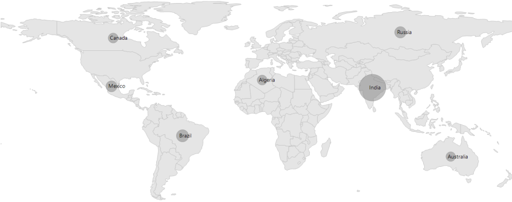
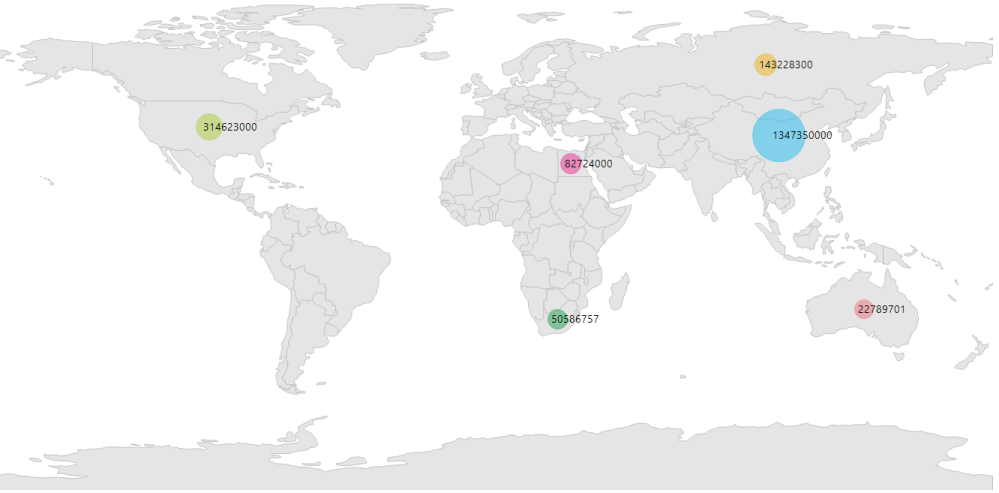

# Bubbles in Windows Forms Map (Maps)

Bubbles in the maps control represent the underlying bound data values of the map. Bubbles are scattered throughout the map shapes, which contain bound values.

Bubbles are included when the data binding and bubble setting are set.

The following properties are available in bubble setting:

<table>
<tr>
<th>
Property</th><th>
Type</th><th>
Description</th></tr>
<tr>
<td>
AutoFillColor</td><td>
Boolean value (true/false)</td><td>
Gets or sets whether the colors should be filled automatically</td></tr>
<tr>
<td>
MaxSize</td><td>
Double</td><td>
Get or sets the maximum height and width of the bubble</td></tr>
<tr>
<td>
MinSize</td><td>
Double</td><td>
Gets or sets the minimum height and width of the bubble</td></tr>
<tr>
<td>
StrokeThickness</td><td>
Double</td><td>
Gets or sets the border thickness of the bubbles</td></tr>
<tr>
<td>
ColorValuePath</td><td>
String</td><td>
Gets or sets the value for bubble color mapping</td></tr>
<tr>
<td>
ValuePath</td><td>
String</td><td>
Gets or sets the name of the under-bound property in ItemsSource</td></tr>
<tr>
<td>
ColorMapping</td><td>
ObservableCollection &lt;RangeColorMapping&gt;</td><td>
Gets or sets the colors for specified range</td></tr>
<tr>
<td>
Fill</td><td>
Brush</td><td>
Gets or sets the fill brush of the bubble when auto fill color is set to true</td></tr>
</table>

## Adding bubbles

To add bubbles to a map, the BubbleSetting has to be added to the ShapeFileLayer. Set the [`AutoFillColors`](https://help.syncfusion.com/cr/windowsforms/Syncfusion.Windows.Forms.Maps.BubbleSetting.html#Syncfusion_Windows_Forms_Maps_BubbleSetting_AutoFillColors) to false in the [`Fill`](https://help.syncfusion.com/cr/windowsforms/Syncfusion.Windows.Forms.Maps.BubbleSetting.html#Syncfusion_Windows_Forms_Maps_BubbleSetting_Fill) property. Also set the [`MaxSize`](https://help.syncfusion.com/cr/windowsforms/Syncfusion.Windows.Forms.Maps.BubbleSetting.html#Syncfusion_Windows_Forms_Maps_BubbleSetting_MaxSize), [`MinSize`](https://help.syncfusion.com/cr/windowsforms/Syncfusion.Windows.Forms.Maps.BubbleSetting.html#Syncfusion_Windows_Forms_Maps_BubbleSetting_MinSize), and [`ValuePath`](https://help.syncfusion.com/cr/windowsforms/Syncfusion.Windows.Forms.Maps.BubbleSetting.html#Syncfusion_Windows_Forms_Maps_BubbleSetting_ValuePath) properties as shown in the following code sample.

When the underlying bound value is below or above any of the given sorted range, then the fill is set as "Black".

The `AutoFillColors` must be set to “False” to enable range color mapping.





partial class Form1
{
    private Syncfusion.Windows.Forms.Maps.Maps mapsControl1;

    private void InitializeComponent()
    {
        this.mapsControl1 = new Syncfusion.Windows.Forms.Maps.Maps();
        this.mapsControl1.Name = "mapsControl1";
        this.mapsControl1.Size = new System.Drawing.Size(880, 585);
        this.Controls.Add(this.mapsControl1);
        this.ClientSize = new System.Drawing.Size(880, 585);
        this.Load += new System.EventHandler(this.Form1_Load);
    }
}





Partial Class Form1
    Private mapsControl1 As Syncfusion.Windows.Forms.Maps.Maps

    Private Sub InitializeComponent()
        Me.mapsControl1 = New Syncfusion.Windows.Forms.Maps.Maps()
        Me.mapsControl1.Name = "mapsControl1"
        Me.mapsControl1.Size = New System.Drawing.Size(880, 585)
        Me.Controls.Add(Me.mapsControl1)
        Me.ClientSize = New System.Drawing.Size(880, 585)
        AddHandler Me.Load, New System.EventHandler(AddressOf Me.Form1_Load)
    End Sub
End Class









public partial class Form1 : Form
{
    private void Form1_Load(object sender, EventArgs e)
    {
        this.mapsControl1.Dock = DockStyle.Fill;
        this.mapsControl1.Margin = new Padding(0, 0, 4, 0);
        this.mapsControl1.MapBackgroundBrush = new SolidBrush(Color.White);
        this.mapsControl1.MapItemsShape = Syncfusion.Windows.Forms.Maps.MapItemShapes.None;

        MapViewModel model = new MapViewModel();
        ShapeFileLayer shapeLayer = new ShapeFileLayer();
        shapeLayer.Uri = "world1.shp";
        shapeLayer.ItemSource = model.Countries;
        shapeLayer.ShapeIDPath = "NAME";
        shapeLayer.ShapeIDTableField = "NAME";
        shapeLayer.ShapeSetting.ShapeValuePath = "Population";
        shapeLayer.ShapeSetting.ShapeColorValuePath = "Population";
        shapeLayer.ShapeSetting.ShapeDisplayValuePath = "NAME";
        shapeLayer.ShapeSetting.ShapeFill = "#E5E5E5";
        shapeLayer.ShapeSetting.ShapeStrokeThickness = 1.5;
        shapeLayer.ShapeSetting.ShapeStroke = "#C1C1C1";
        shapeLayer.BubbleSetting.AutoFillColors = false;
        shapeLayer.BubbleSetting.MaxSize = 70;
        shapeLayer.BubbleSetting.MinSize = 25;
        shapeLayer.BubbleSetting.ValuePath = "Population";
        shapeLayer.BubbleSetting.ColorValuePath = "Population";
        this.mapsControl1.Layers.Add(shapeLayer);
    }
}





Public Partial Class Form1
    Inherits Form

    Private Sub Form1_Load(sender As Object, e As EventArgs)
        Me.mapsControl1.Dock = DockStyle.Fill
        Me.mapsControl1.Margin = New Padding(0, 0, 4, 0)
        Me.mapsControl1.MapBackgroundBrush = New SolidBrush(Color.White)
        Me.mapsControl1.MapItemsShape = Syncfusion.Windows.Forms.Maps.MapItemShapes.None

        Dim model As New MapViewModel()
        Dim shapeLayer As New ShapeFileLayer()
        shapeLayer.Uri = "world1.shp"
        shapeLayer.ItemSource = model.Countries
        shapeLayer.ShapeIDPath = "NAME"
        shapeLayer.ShapeIDTableField = "NAME"
        shapeLayer.ShapeSetting.ShapeValuePath = "Population"
        shapeLayer.ShapeSetting.ShapeColorValuePath = "Population"
        shapeLayer.ShapeSetting.ShapeDisplayValuePath = "NAME"
        shapeLayer.ShapeSetting.ShapeFill = "#E5E5E5"
        shapeLayer.ShapeSetting.ShapeStrokeThickness = 1.5
        shapeLayer.ShapeSetting.ShapeStroke = "#C1C1C1"
        shapeLayer.BubbleSetting.AutoFillColors = False
        shapeLayer.BubbleSetting.MaxSize = 70
        shapeLayer.BubbleSetting.MinSize = 25
        shapeLayer.BubbleSetting.ValuePath = "Population"
        shapeLayer.BubbleSetting.ColorValuePath = "Population"
        Me.mapsControl1.Layers.Add(shapeLayer)
    End Sub
End Class





Screenshot:

## Range color mapping

Range color mapping is one of the features used to differentiate the bubble fill based on its under-bound value and color ranges. It contains the following properties:

<table>
<tr>
<th>
Property</th><th>
Type</th><th>
Description</th></tr>
<tr>
<td>
From and To</td><td>
Double</td><td>
Gets or sets the From and To values based on the ColorValuePath to the bubbles</td></tr>
<tr>
<td>
Color</td><td>
Color</td><td>
Gets or sets the color values for a given From and To values</td></tr>
</table>

The fill color of a particular bubble can be determined by its under-bound value and color range. For example, consider the following color ranges in the below snippet.





partial class Form1
{
    private Syncfusion.Windows.Forms.Maps.Maps mapsControl1;

    private void InitializeComponent()
    {
        this.mapsControl1 = new Syncfusion.Windows.Forms.Maps.Maps();
        this.mapsControl1.Name = "mapsControl1";
        this.mapsControl1.Size = new System.Drawing.Size(880, 585);
        this.Controls.Add(this.mapsControl1);
        this.ClientSize = new System.Drawing.Size(880, 585);
        this.Load += new System.EventHandler(this.Form1_Load);
    }
}





Partial Class Form1
    Private mapsControl1 As Syncfusion.Windows.Forms.Maps.Maps

    Private Sub InitializeComponent()
        Me.mapsControl1 = New Syncfusion.Windows.Forms.Maps.Maps()
        Me.mapsControl1.Name = "mapsControl1"
        Me.mapsControl1.Size = New System.Drawing.Size(880, 585)
        Me.Controls.Add(Me.mapsControl1)
        Me.ClientSize = New System.Drawing.Size(880, 585)
        AddHandler Me.Load, New System.EventHandler(AddressOf Me.Form1_Load)
    End Sub
End Class









public partial class Form1 : Form
{
    private void Form1_Load(object sender, EventArgs e)
    {
        this.mapsControl1.Dock = DockStyle.Fill;
        this.mapsControl1.Margin = new Padding(0, 0, 4, 0);
        this.mapsControl1.MapBackgroundBrush = new SolidBrush(Color.White);
        this.mapsControl1.MapItemsShape = Syncfusion.Windows.Forms.Maps.MapItemShapes.None;

        MapViewModel model = new MapViewModel();
        ShapeFileLayer shapeLayer = new ShapeFileLayer();
        shapeLayer.Uri = "world1.shp";
        shapeLayer.ItemSource = model.Countries;
        shapeLayer.ShapeIDPath = "NAME";
        shapeLayer.ShapeIDTableField = "NAME";
        shapeLayer.ShapeSetting.ShapeValuePath = "Population";
        shapeLayer.ShapeSetting.ShapeColorValuePath = "Population";
        shapeLayer.ShapeSetting.ShapeFill = "#E5E5E5";
        shapeLayer.ShapeSetting.ShapeStrokeThickness = 1.5;
        shapeLayer.ShapeSetting.ShapeStroke = "#C1C1C1";

        shapeLayer.BubbleSetting.AutoFillColors = false;
        shapeLayer.BubbleSetting.MaxSize = 70;
        shapeLayer.BubbleSetting.MinSize = 25;
        shapeLayer.BubbleSetting.ValuePath = "Population";
        shapeLayer.BubbleSetting.ColorValuePath = "Population";
        shapeLayer.BubbleSetting.ColorMappings = new System.Collections.ObjectModel.ObservableCollection<ColorMapping>();
        shapeLayer.BubbleSetting.ColorMappings.Add(new RangeColorMapping { From = 314623001, To = 1347350000, Color = System.Drawing.Color.FromArgb(0x7F, 0x20, 0xBC, 0xEE) });
        shapeLayer.BubbleSetting.ColorMappings.Add(new RangeColorMapping { From = 143228301, To = 314623001, Color = System.Drawing.Color.FromArgb(0x7F, 0xA7, 0xCE, 0x38) });
        shapeLayer.BubbleSetting.ColorMappings.Add(new RangeColorMapping { From = 82724090, To = 143228301, Color = System.Drawing.Color.FromArgb(0x7F, 0xF1, 0xB2, 0x1A) });
        shapeLayer.BubbleSetting.ColorMappings.Add(new RangeColorMapping { From = 22789702, To = 50586757, Color = System.Drawing.Color.FromArgb(0x7F, 0x1D, 0xA2, 0x49) });
        shapeLayer.BubbleSetting.ColorMappings.Add(new RangeColorMapping { From = 0, To = 22789702, Color = System.Drawing.Color.FromArgb(0x7F, 0xEB, 0x73, 0x7C) });
        shapeLayer.BubbleSetting.ColorMappings.Add(new RangeColorMapping { From = 50586757, To = 82724090, Color = System.Drawing.Color.FromArgb(0x7F, 0xED, 0x2D, 0x95) });
        this.mapsControl1.Layers.Add(shapeLayer);
    }
}





Public Partial Class Form1
    Inherits Form

    Private Sub Form1_Load(sender As Object, e As EventArgs)
        Me.mapsControl1.Dock = DockStyle.Fill
        Me.mapsControl1.Margin = New Padding(0, 0, 4, 0)
        Me.mapsControl1.MapBackgroundBrush = New SolidBrush(Color.White)
        Me.mapsControl1.MapItemsShape = Syncfusion.Windows.Forms.Maps.MapItemShapes.None

        Dim model As New MapViewModel()
        Dim shapeLayer As New ShapeFileLayer()
        shapeLayer.Uri = "world1.shp"
        shapeLayer.ItemSource = model.Countries
        shapeLayer.ShapeIDPath = "NAME"
        shapeLayer.ShapeIDTableField = "NAME"
        shapeLayer.ShapeSetting.ShapeValuePath = "Population"
        shapeLayer.ShapeSetting.ShapeColorValuePath = "Population"
        shapeLayer.ShapeSetting.ShapeFill = "#E5E5E5"
        shapeLayer.ShapeSetting.ShapeStrokeThickness = 1.5
        shapeLayer.ShapeSetting.ShapeStroke = "#C1C1C1"

        shapeLayer.BubbleSetting.AutoFillColors = False
        shapeLayer.BubbleSetting.MaxSize = 70
        shapeLayer.BubbleSetting.MinSize = 25
        shapeLayer.BubbleSetting.ValuePath = "Population"
        shapeLayer.BubbleSetting.ColorValuePath = "Population"
        shapeLayer.BubbleSetting.ColorMappings = New System.Collections.ObjectModel.ObservableCollection(Of ColorMapping)()
        shapeLayer.BubbleSetting.ColorMappings.Add(New RangeColorMapping With {.From = 314623001, .To = 1347350000, .Color = System.Drawing.Color.FromArgb(&H7F, &H20, &HBC, &HEE)})
        shapeLayer.BubbleSetting.ColorMappings.Add(New RangeColorMapping With {.From = 143228301, .To = 314623001, .Color = System.Drawing.Color.FromArgb(&H7F, &HA7, &HCE, &H38)})
        shapeLayer.BubbleSetting.ColorMappings.Add(New RangeColorMapping With {.From = 82724090, .To = 143228301, .Color = System.Drawing.Color.FromArgb(&H7F, &HF1, &HB2, &H1A)})
        shapeLayer.BubbleSetting.ColorMappings.Add(New RangeColorMapping With {.From = 22789702, .To = 50586757, .Color = System.Drawing.Color.FromArgb(&H7F, &H1D, &HA2, &H49)})
        shapeLayer.BubbleSetting.ColorMappings.Add(New RangeColorMapping With {.From = 0, .To = 22789702, .Color = System.Drawing.Color.FromArgb(&H7F, &HEB, &H73, &H7C)})
        shapeLayer.BubbleSetting.ColorMappings.Add(New RangeColorMapping With {.From = 50586757, .To = 82724090, .Color = System.Drawing.Color.FromArgb(&H7F, &HED, &H2D, &H95)})
        Me.mapsControl1.Layers.Add(shapeLayer)
    End Sub
End Class





