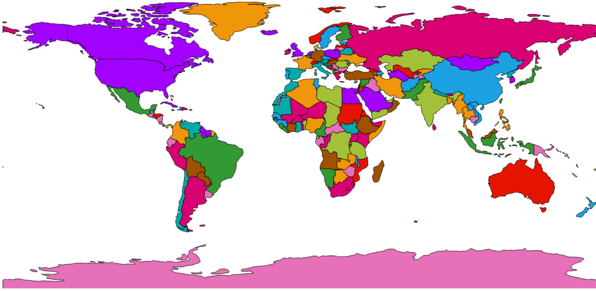

# Color Palettes in Windows Forms Map (Maps)

Color palette is a set of colors applied to the shapes.

Color palette has to be set in the ShapeSetting’s `ColorPalette` property. 





partial class Form1
{ 

    private void InitializeComponent()
    {

            this.mapsControl1 = new Syncfusion.Windows.Forms.Maps.Maps();

            this.mapsControl1.Name = "mapsControl1";

            this.mapsControl1.Size = new System.Drawing.Size(880, 585); 

            this.Controls.Add(this.mapsControl1);  

            this.ClientSize = new System.Drawing.Size(880, 585);          

            this.Load += new System.EventHandler(this.Form1_Load);

    }

            private Syncfusion.Windows.Forms.Maps.Maps mapsControl1;

}  
	 








public partial class Form1 : Form
{

        public Form1()
        {
            InitializeComponent();
        }

        private void Form1_Load(object sender, EventArgs e)
        {
            MapViewModel model = new MapViewModel();

            ShapeFileLayer shapeLayer = new ShapeFileLayer();

            shapeLayer.Uri = "world1.shp";

            shapeLayer.ItemSource = model.Countries;

            shapeLayer.ShapeIDPath = "NAME";

            shapeLayer.ShapeIDTableField = "NAME";  

            shapeLayer.ShapeSetting.ShapeValuePath = "Population";

            shapeLayer.ShapeSetting.ShapeColorValuePath = "Population";

            shapeLayer.ShapeSetting.ShapeDisplayValuePath = "NAME";

            shapeLayer.ShapeSetting.TextForeground = "Black";

            shapeLayer.ShowMapItem = false;

            shapeLayer.ShapeSetting.ShapeFill = "#E5E5E5";

            shapeLayer.ShapeSetting.ShapeStrokeThickness = 1.5;

            shapeLayer.ShapeSetting.ShapeStroke = "Black";

            shapeLayer.ShapeSetting.FillSetting.AutoFillColors = true;

            shapeLayer.ShapeSetting.ColorPalette = ColorPalettes.Metro; 

            this.mapsControl1.Layers.Add(shapeLayer); 

        }

}       





Screenshot:

