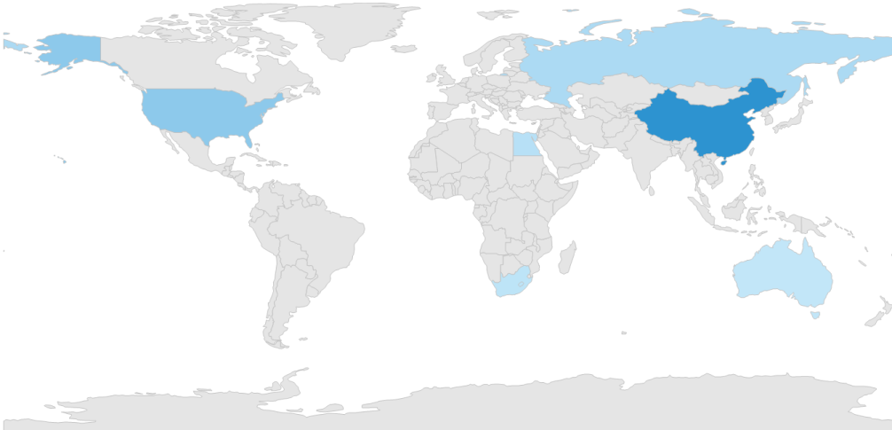

# Color Mapping in Windows Forms Map (Maps)

The color mapping support allows you customize the shape colors based on the underlying value of shapes received from the bound data.

The maps control provides two types of color mapping:

* Equal color mapping
* Range Color mapping

## Equal color mapping

It is used to differentiate the shape’s fill based on its underlying value and color using the [`Value`](https://help.syncfusion.com/cr/windowsforms/Syncfusion.UI.Xaml.Maps.EqualColorMapping.html#Syncfusion_UI_Xaml_Maps_EqualColorMapping_Value) and [`Color`](https://help.syncfusion.com/cr/windowsforms/Syncfusion.UI.Xaml.Maps.ColorMapping.html#Syncfusion_UI_Xaml_Maps_ColorMapping_Color) properties.





partial class Form1
{
         private void InitializeComponent()
         {

            this.mapsControl1 = new Syncfusion.Windows.Forms.Maps.Maps();

            this.mapsControl1.Name = "mapsControl1";

            this.mapsControl1.Size = new System.Drawing.Size(880, 585); 

            this.Controls.Add(this.mapsControl1);  

            this.ClientSize = new System.Drawing.Size(880, 585);          

            this.Load += new System.EventHandler(this.Form1_Load);

         }

        private Syncfusion.Windows.Forms.Maps.Maps mapsControl1;

}  









  public partial class Form1 : Form
{

        private void Form1_Load(object sender, EventArgs e)
        {

            this.mapsControl1.Dock = DockStyle.Fill;
            this.mapsControl1.Margin = new Padding(0, 0, 4, 0);
            this.mapsControl1.MapBackgroundBrush = new SolidBrush(Color.White);
            this.mapsControl1.MapItemsShape = Syncfusion.Windows.Forms.Maps.MapItemShapes.None;
            ViewModel model = new ViewModel();
            ShapeFileLayer shapeLayer = new ShapeFileLayer();
            shapeLayer.Uri = "usa_state.shp";
            shapeLayer.ItemSource = model.Data;
            shapeLayer.ShapeIDPath = "State";
            shapeLayer.ShapeIDTableField = "STATE_NAME";
            shapeLayer.ShapeSetting.ShapeColorValuePath = "Candidate";
            shapeLayer.ShapeSetting.ShapeStrokeThickness = 1.5;
            shapeLayer.ShapeSetting.FillSetting.ColorMappings = new System.Collections.ObjectModel.ObservableCollection<ColorMapping>();            
            shapeLayer.ShapeSetting.FillSetting.ColorMappings.Add(new EqualColorMapping { Color = Color.FromArgb(1, 216, 68, 68), Value = "Romney" });
            shapeLayer.ShapeSetting.FillSetting.ColorMappings.Add(new EqualColorMapping { Color = Color.FromArgb(1, 49, 109, 181), Value = "Obama" });
            this.mapsControl1.Layers.Add(shapeLayer);
         }
} 





Screenshot:

## Range color mapping

The range color mapping is used to differentiate the shape’s fill based on its underlying value and color ranges. The [`From`](https://help.syncfusion.com/cr/windowsforms/Syncfusion.UI.Xaml.Maps.RangeColorMapping.html#Syncfusion_UI_Xaml_Maps_RangeColorMapping_From) and [`To`](https://help.syncfusion.com/cr/windowsforms/Syncfusion.UI.Xaml.Maps.RangeColorMapping.html#Syncfusion_UI_Xaml_Maps_RangeColorMapping_To) properties define the value ranges, and the [`Color`](https://help.syncfusion.com/cr/windowsforms/Syncfusion.UI.Xaml.Maps.ColorMapping.html#Syncfusion_UI_Xaml_Maps_ColorMapping_Color) property defines the equivalent color.





partial class Form1
{
         private void InitializeComponent()
         {

            this.mapsControl1 = new Syncfusion.Windows.Forms.Maps.Maps();

            this.mapsControl1.Name = "mapsControl1";

            this.mapsControl1.Size = new System.Drawing.Size(880, 585); 

            this.Controls.Add(this.mapsControl1);  

            this.ClientSize = new System.Drawing.Size(880, 585);          

            this.Load += new System.EventHandler(this.Form1_Load);

         }

        private Syncfusion.Windows.Forms.Maps.Maps mapsControl1;

}  









public partial class Form1 : Form
{
        private void Form1_Load(object sender, EventArgs e)
        {

            this.mapsControl1.Dock = DockStyle.Fill;

            this.mapsControl1.Margin = new Padding(0, 0, 4, 0);

            this.mapsControl1.MapBackgroundBrush = new SolidBrush(Color.White);

            this.mapsControl1.MapItemsShape = Syncfusion.Windows.Forms.Maps.MapItemShapes.None;

            MapViewModel model = new MapViewModel();

            ShapeFileLayer shapeLayer = new ShapeFileLayer();

            shapeLayer.Uri = "world1.shp";

            shapeLayer.ItemSource = model.Countries;

            shapeLayer.ShapeIDPath = "NAME";

            shapeLayer.ShapeIDTableField = "NAME";

            shapeLayer.ShapeSetting.ShapeColorValuePath = "Population";

            shapeLayer.ShapeSetting.ShapeFill = "#E5E5E5";

            shapeLayer.ShapeSetting.ShapeStrokeThickness = 1.5;

            shapeLayer.ShapeSetting.ShapeStroke = "#C1C1C1";

            shapeLayer.ShapeSetting.FillSetting.ColorMappings = new System.Collections.ObjectModel.ObservableCollection<ColorMapping>();

            shapeLayer.ShapeSetting.FillSetting.ColorMappings.Add(new RangeColorMapping { From = 750000000, To = 1500000000, Color = System.Drawing.Color.FromArgb(0x2A, 0x91, 0xCF) });

            shapeLayer.ShapeSetting.FillSetting.ColorMappings.Add(new RangeColorMapping { From = 0, To = 750000000, Color = System.Drawing.Color.FromArgb(0x3D, 0x9F, 0xD8) });

            shapeLayer.ShapeSetting.FillSetting.ColorMappings.Add(new RangeColorMapping { From = 0, To = 0, Color = System.Drawing.Color.FromArgb(0xC7, 0xE9, 0xFA) });

            this.mapsControl1.Layers.Add(shapeLayer);

         }
}       





Screenshot:

