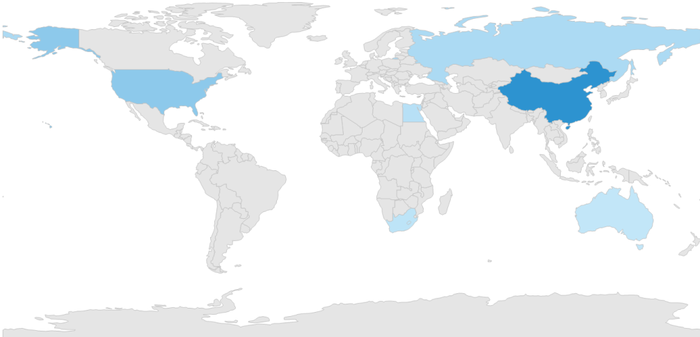

# Color Mapping in Windows Forms Map (Maps)

The color mapping support allows you customize the shape colors based on the underlying value of shapes received from the bound data.

The maps control provides two types of color mapping:

* Equal color mapping
* Range Color mapping

## Equal color mapping

It is used to differentiate the shape's fill based on its underlying value and color using the [`Value`](https://help.syncfusion.com/cr/windowsforms/Syncfusion.Windows.Forms.Maps.EqualColorMapping.html#Syncfusion_Windows_Forms_Maps_EqualColorMapping_Value) and [`Color`](https://help.syncfusion.com/cr/windowsforms/Syncfusion.Windows.Forms.Maps.ColorMapping.html#Syncfusion_Windows_Forms_Maps_ColorMapping_Color) properties.





partial class Form1
{
    private Syncfusion.Windows.Forms.Maps.Maps mapsControl1;

    private void InitializeComponent()
    {
        this.mapsControl1 = new Syncfusion.Windows.Forms.Maps.Maps();
        this.mapsControl1.Name = "mapsControl1";
        this.mapsControl1.Size = new System.Drawing.Size(880, 585);
        this.Controls.Add(this.mapsControl1);
        this.ClientSize = new System.Drawing.Size(880, 585);
        this.Load += new System.EventHandler(this.Form1_Load);
    }
}





Partial Class Form1
    Private mapsControl1 As Syncfusion.Windows.Forms.Maps.Maps

    Private Sub InitializeComponent()
        Me.mapsControl1 = New Syncfusion.Windows.Forms.Maps.Maps()
        Me.mapsControl1.Name = "mapsControl1"
        Me.mapsControl1.Size = New System.Drawing.Size(880, 585)
        Me.Controls.Add(Me.mapsControl1)
        Me.ClientSize = New System.Drawing.Size(880, 585)
        AddHandler Me.Load, New System.EventHandler(AddressOf Me.Form1_Load)
    End Sub
End Class









public partial class Form1 : Form
{
    private void Form1_Load(object sender, EventArgs e)
    {
        this.mapsControl1.Dock = DockStyle.Fill;
        this.mapsControl1.Margin = new Padding(0, 0, 4, 0);
        this.mapsControl1.MapBackgroundBrush = new SolidBrush(Color.White);
        this.mapsControl1.MapItemsShape = Syncfusion.Windows.Forms.Maps.MapItemShapes.None;
        ViewModel model = new ViewModel();
        ShapeFileLayer shapeLayer = new ShapeFileLayer();
        shapeLayer.Uri = "usa_state.shp";
        shapeLayer.ItemSource = model.Data;
        shapeLayer.ShapeIDPath = "State";
        shapeLayer.ShapeIDTableField = "STATE_NAME";
        shapeLayer.ShapeSetting.ShapeColorValuePath = "Candidate";
        shapeLayer.ShapeSetting.ShapeStrokeThickness = 1.5;
        shapeLayer.ShapeSetting.FillSetting.ColorMappings = new System.Collections.ObjectModel.ObservableCollection<ColorMapping>();
        shapeLayer.ShapeSetting.FillSetting.ColorMappings.Add(new EqualColorMapping { Color = Color.FromArgb(255, 216, 68, 68), Value = "Romney" });
        shapeLayer.ShapeSetting.FillSetting.ColorMappings.Add(new EqualColorMapping { Color = Color.FromArgb(255, 49, 109, 181), Value = "Obama" });
        this.mapsControl1.Layers.Add(shapeLayer);
    }
}





Public Partial Class Form1
    Inherits Form

    Private Sub Form1_Load(sender As Object, e As EventArgs)
        Me.mapsControl1.Dock = DockStyle.Fill
        Me.mapsControl1.Margin = New Padding(0, 0, 4, 0)
        Me.mapsControl1.MapBackgroundBrush = New SolidBrush(Color.White)
        Me.mapsControl1.MapItemsShape = Syncfusion.Windows.Forms.Maps.MapItemShapes.None
        Dim model As New ViewModel()
        Dim shapeLayer As New ShapeFileLayer()
        shapeLayer.Uri = "usa_state.shp"
        shapeLayer.ItemSource = model.Data
        shapeLayer.ShapeIDPath = "State"
        shapeLayer.ShapeIDTableField = "STATE_NAME"
        shapeLayer.ShapeSetting.ShapeColorValuePath = "Candidate"
        shapeLayer.ShapeSetting.ShapeStrokeThickness = 1.5
        shapeLayer.ShapeSetting.FillSetting.ColorMappings = New System.Collections.ObjectModel.ObservableCollection(Of ColorMapping)()
        shapeLayer.ShapeSetting.FillSetting.ColorMappings.Add(New EqualColorMapping With {.Color = Color.FromArgb(255, 216, 68, 68), .Value = "Romney"})
        shapeLayer.ShapeSetting.FillSetting.ColorMappings.Add(New EqualColorMapping With {.Color = Color.FromArgb(255, 49, 109, 181), .Value = "Obama"})
        Me.mapsControl1.Layers.Add(shapeLayer)
    End Sub
End Class





## Range color mapping

The range color mapping is used to differentiate the shape's fill based on its underlying value and color ranges. The [`From`](https://help.syncfusion.com/cr/windowsforms/Syncfusion.Windows.Forms.Maps.RangeColorMapping.html#Syncfusion_Windows_Forms_Maps_RangeColorMapping_From) and [`To`](https://help.syncfusion.com/cr/windowsforms/Syncfusion.Windows.Forms.Maps.RangeColorMapping.html#Syncfusion_Windows_Forms_Maps_RangeColorMapping_To) properties define the value ranges, and the [`Color`](https://help.syncfusion.com/cr/windowsforms/Syncfusion.Windows.Forms.Maps.ColorMapping.html#Syncfusion_Windows_Forms_Maps_ColorMapping_Color) property defines the equivalent color.





partial class Form1
{
    private Syncfusion.Windows.Forms.Maps.Maps mapsControl1;

    private void InitializeComponent()
    {
        this.mapsControl1 = new Syncfusion.Windows.Forms.Maps.Maps();
        this.mapsControl1.Name = "mapsControl1";
        this.mapsControl1.Size = new System.Drawing.Size(880, 585);
        this.Controls.Add(this.mapsControl1);
        this.ClientSize = new System.Drawing.Size(880, 585);
        this.Load += new System.EventHandler(this.Form1_Load);
    }
}





Partial Class Form1
    Private mapsControl1 As Syncfusion.Windows.Forms.Maps.Maps

    Private Sub InitializeComponent()
        Me.mapsControl1 = New Syncfusion.Windows.Forms.Maps.Maps()
        Me.mapsControl1.Name = "mapsControl1"
        Me.mapsControl1.Size = New System.Drawing.Size(880, 585)
        Me.Controls.Add(Me.mapsControl1)
        Me.ClientSize = New System.Drawing.Size(880, 585)
        AddHandler Me.Load, New System.EventHandler(AddressOf Me.Form1_Load)
    End Sub
End Class









public partial class Form1 : Form
{
    private void Form1_Load(object sender, EventArgs e)
    {
        this.mapsControl1.Dock = DockStyle.Fill;
        this.mapsControl1.Margin = new Padding(0, 0, 4, 0);
        this.mapsControl1.MapBackgroundBrush = new SolidBrush(Color.White);
        this.mapsControl1.MapItemsShape = Syncfusion.Windows.Forms.Maps.MapItemShapes.None;
        MapViewModel model = new MapViewModel();
        ShapeFileLayer shapeLayer = new ShapeFileLayer();
        shapeLayer.Uri = "world1.shp";
        shapeLayer.ItemSource = model.Countries;
        shapeLayer.ShapeIDPath = "NAME";
        shapeLayer.ShapeIDTableField = "NAME";
        shapeLayer.ShapeSetting.ShapeColorValuePath = "Population";
        shapeLayer.ShapeSetting.ShapeFill = "#E5E5E5";
        shapeLayer.ShapeSetting.ShapeStrokeThickness = 1.5;
        shapeLayer.ShapeSetting.ShapeStroke = "#C1C1C1";
        shapeLayer.ShapeSetting.FillSetting.ColorMappings = new System.Collections.ObjectModel.ObservableCollection<ColorMapping>();
        shapeLayer.ShapeSetting.FillSetting.ColorMappings.Add(new RangeColorMapping { From = 750000000, To = 1500000000, Color = System.Drawing.Color.FromArgb(0x2A, 0x91, 0xCF) });
        shapeLayer.ShapeSetting.FillSetting.ColorMappings.Add(new RangeColorMapping { From = 0, To = 750000000, Color = System.Drawing.Color.FromArgb(0x3D, 0x9F, 0xD8) });
        shapeLayer.ShapeSetting.FillSetting.ColorMappings.Add(new RangeColorMapping { From = 0, To = 0, Color = System.Drawing.Color.FromArgb(0xC7, 0xE9, 0xFA) });
        this.mapsControl1.Layers.Add(shapeLayer);
    }
}





Public Partial Class Form1
    Inherits Form

    Private Sub Form1_Load(sender As Object, e As EventArgs)
        Me.mapsControl1.Dock = DockStyle.Fill
        Me.mapsControl1.Margin = New Padding(0, 0, 4, 0)
        Me.mapsControl1.MapBackgroundBrush = New SolidBrush(Color.White)
        Me.mapsControl1.MapItemsShape = Syncfusion.Windows.Forms.Maps.MapItemShapes.None
        Dim model As New MapViewModel()
        Dim shapeLayer As New ShapeFileLayer()
        shapeLayer.Uri = "world1.shp"
        shapeLayer.ItemSource = model.Countries
        shapeLayer.ShapeIDPath = "NAME"
        shapeLayer.ShapeIDTableField = "NAME"
        shapeLayer.ShapeSetting.ShapeColorValuePath = "Population"
        shapeLayer.ShapeSetting.ShapeFill = "#E5E5E5"
        shapeLayer.ShapeSetting.ShapeStrokeThickness = 1.5
        shapeLayer.ShapeSetting.ShapeStroke = "#C1C1C1"
        shapeLayer.ShapeSetting.FillSetting.ColorMappings = New System.Collections.ObjectModel.ObservableCollection(Of ColorMapping)()
        shapeLayer.ShapeSetting.FillSetting.ColorMappings.Add(New RangeColorMapping With {.From = 750000000, .To = 1500000000, .Color = System.Drawing.Color.FromArgb(&H2A, &H91, &HCF)})
        shapeLayer.ShapeSetting.FillSetting.ColorMappings.Add(New RangeColorMapping With {.From = 0, .To = 750000000, .Color = System.Drawing.Color.FromArgb(&H3D, &H9F, &HD8)})
        shapeLayer.ShapeSetting.FillSetting.ColorMappings.Add(New RangeColorMapping With {.From = 0, .To = 0, .Color = System.Drawing.Color.FromArgb(&HC7, &HE9, &HFA)})
        Me.mapsControl1.Layers.Add(shapeLayer)
    End Sub
End Class





