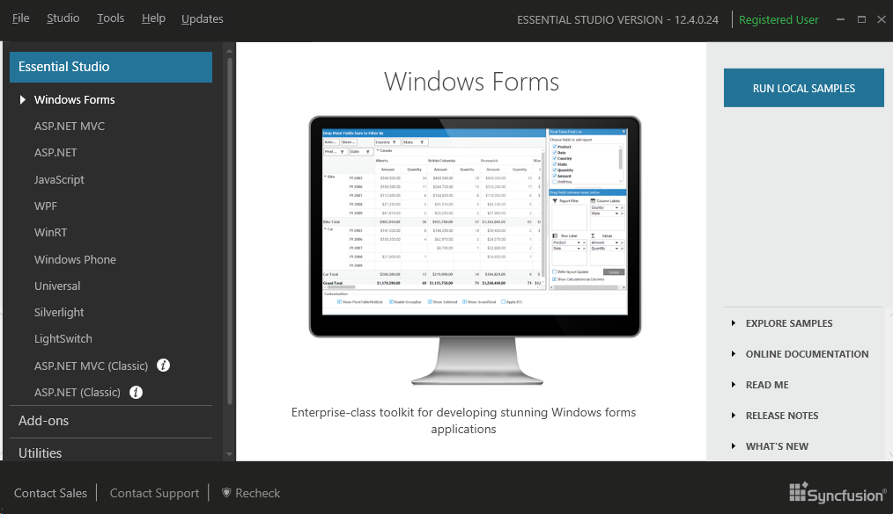
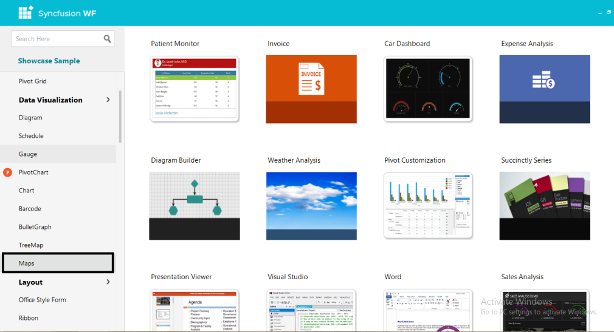
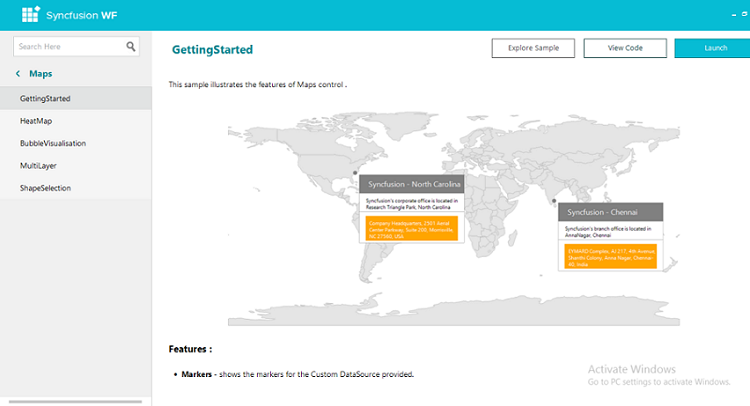

# Installation and Deployment in Windows Forms Map (Maps)

This section covers information on the install location, samples, licensing, patches update, and updation of the recent version of Essential Studio®. It comprises the following subsections:

## Installation

For step-by-step installation procedure for installing of Essential Studio®, refer to the installation topic under Installation and Deployment in the Common UG.

See also,

For licensing, patches, and information on adding or removing selective components, refer to the following topics in Common UG under Installation and Deployment.

* Licensing
* Patches
* Add/remove components

## Sample and location

Use the following steps to view the samples:

1. Go to Start > All Programs > Syncfusion® > Essential Studio® <version number> > Dashboard

      The Essential Studio Enterprise Edition window will be displayed.

             
	  
	  Syncfusion® Essential Studio® Dashboard
      {:.caption}
	  
2. In the Dashboard window, click Run Samples for Windows Forms under UI Edition. The UI Windows Forms Sample Browser window will be displayed.

      N> You can view the samples in any of the following three ways:
      > * Run Samples - Click to view the locally installed samples.
      > * Online Samples - Click to view online samples.
      > * Explore Samples - Explore the UI for Windows Forms on disk.
	  
      The User Interface Edition panel will be displayed by default.
	  
	  

      _Figure 2: UI Windows Forms Sample Browser_

3. Click the Maps under Data Visualization. The Map samples will be displayed.

   

   Essential® Maps WF Samples
   {:.caption}
   
4. Select any sample and browse through the features. 

## Deployment requirements

### Toolbox entries

* Maps

### Assembly list

While deploying an application that references SyncfusionEssentialMaps assembly, the following dependencies must be included in the distribution:

* Syncfusion.Maps.Windows
* Syncfusion.Shared.Base
* Syncfusion.Core