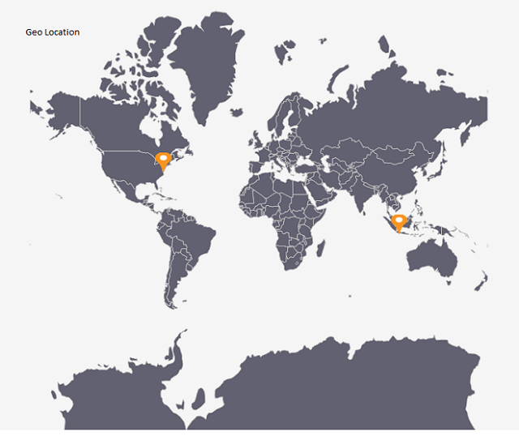

# Layers in Windows Forms Map (Maps)

Map is maintained through layers, and it can accommodate one or more layers.

## MultiLayer

The multilayer support allows to load multiple shape files in a single container by enabling maps to display more information.

### Adding multiple shape files

This feature enables the map to load multiple types of shape files in a single container. Basically, shape files contain point shapes in a single container.

Situations arise where any combination of available shape files needs to be loaded in a single container. In such situations, this feature enables the map to load multiple shape layers in a single container.

### Adding multiple layers 

ShapeFileLayer is the core layer of the map. Multiple layers can be added in the ShapeFileLayer itself. They have to be added in SubShapeFileLayer within the ShapeFileLayer. 

### SubShapeFileLayers

SubShapeFileLayer is a collection of SubShapeFileLayer. SubShapeFileLayer is also a type of ShapeFileLayer. The following code adds multiple layers into the ShapeFileLayer.

### Code sample:





partial class Form1
{

         private void InitializeComponent()
         {

            this.mapsControl1 = new Syncfusion.Windows.Forms.Maps.Maps();

            this.mapsControl1.Name = "mapsControl1";

            this.mapsControl1.Size = new System.Drawing.Size(880, 585); 

            this.Controls.Add(this.mapsControl1);  

            this.ClientSize = new System.Drawing.Size(880, 585);          

            this.Load += new System.EventHandler(this.Form1_Load);

         }

            private Syncfusion.Windows.Forms.Maps.Maps mapsControl1;

}  
	 








public partial class Form1 : Form
{

        private void Form1_Load(object sender, EventArgs e)
        {

            this.mapsControl1.Dock = DockStyle.Fill;

            this.mapsControl1.Margin = new Padding(0, 0, 4, 0);

            this.mapsControl1.MapBackgroundBrush = new SolidBrush(Color.White);

            this.mapsControl1.MapItemsShape = Syncfusion.Windows.Forms.Maps.MapItemShapes.None;

            this.mapsControl1.MapItemStroke = new SolidBrush(Color.Black);

            MapViewModel model = new MapViewModel();

            ShapeFileLayer shapeLayer = new ShapeFileLayer();

            shapeLayer.Uri = "world1.shp";

            shapeLayer.ShapeSetting.ShapeFill = "#E5E5E5";

            shapeLayer.ShapeSetting.ShapeStroke = "#C1C1C1";

            shapeLayer.ShapeSetting.ShapeStrokeThickness = 0.5;

            SubShapeFileLayer layer1 = new SubShapeFileLayer();

            layer1.Uri = "Africa.shp"; 

            layer1.ShapeSetting.ShapeFill = "#8DCEFF";

            layer1.ShapeSetting.ShapeStrokeThickness = 0.5;

            layer1.ShapeSetting.ShapeStroke = "#2F8CEA";
            

            SubShapeFileLayer layer2 = new SubShapeFileLayer();

            layer2.Uri = "australia.shp";

            layer2.ShapeSetting.ShapeFill = "#8DCEFF";

            layer2.ShapeSetting.ShapeStrokeThickness = 0.5;

            layer2.ShapeSetting.ShapeStroke = "#2F8CEA";

            shapeLayer.SubShapeFileLayers.Add(layer1);

            shapeLayer.SubShapeFileLayers.Add(layer2);

            this.mapsControl1.Layers.Add(shapeLayer);

         }   

 }       





Screenshot:

MultiLayer
{:.caption}

## Layout type

[`LayoutType`](https://help.syncfusion.com/cr/windowsforms/Syncfusion.Windows.Forms.Maps.ShapeFileLayer.html#Syncfusion_Windows_Forms_Maps_ShapeFileLayer_LayoutType) defines the way to project the map. This can be categorized into the following types:

1. Default
2. Tile

### Default

In `Default` layout, maps will be rendered based on the given points of shapefile without any further manipulation of maps scale. 

### Tile

In `Tile` layout, maps scale value is maintained in every direction around a point. Therefore shapes are represented accurately and without distortion for small areas.





    public partial class Form1 : Form
        {            

            private void Form1_Load(object sender, EventArgs e)
            {
            
                ShapeFileLayer shapeLayer = new ShapeFileLayer();
                shapeLayer.Uri = "world1.shp";

                shapeLayer.LayoutType = LayoutType.Tile;  // LayoutType Tile

                
                shapeLayer.Annotations = new ObservableCollection<Annotation>(){
                new SyncfusionLocations() { Name = "USA", Latitude = 38.8833, Longitude = -77.0167},
                new SyncfusionLocations() { Name = "Indonesia", Latitude = -6.1750, Longitude = 106.8283},

            };

                this.mapsControl1.AnnotationDrawing += mapsControl1_AnnotationDrawing;
                this.mapsControl1.Layers.Add(shapeLayer);
            
            }

            void mapsControl1_AnnotationDrawing(object sender, AnnotationDrawingEventArgs e)
            {
        
                Image image = Image.FromFile("..//..//pin.png");
                e.Graphics.DrawImage(image, (float)(e.X-10), (float)(e.Y-25),25,30);
                
            }
            
        }

       public class SyncfusionLocations : Annotation
        {
            public string Name { get; set; }  
        }





## ItemSource

The [`ItemSource`](https://help.syncfusion.com/cr/windowsforms/Syncfusion.Windows.Forms.Maps.ShapeFileLayer.html#Syncfusion_Windows_Forms_Maps_ShapeFileLayer_ItemSource) property accepts collection values as input. For example, the list of objects can be provided as input.





partial class Form1
{

        private void InitializeComponent()
        {
            this.mapsControl1 = new Syncfusion.Windows.Forms.Maps.Maps();

            this.mapsControl1.Name = "mapsControl1";

            this.mapsControl1.Size = new System.Drawing.Size(880, 585); 

            this.Controls.Add(this.mapsControl1);  

            this.ClientSize = new System.Drawing.Size(880, 585);          

            this.Load += new System.EventHandler(this.Form1_Load);

         }

         private Syncfusion.Windows.Forms.Maps.Maps mapsControl1;
}  









public partial class Form1 : Form
{
        public Form1()
        {
            InitializeComponent();
        }

        private void Form1_Load(object sender, EventArgs e)
        {
             MapViewModel model = new MapViewModel();

             ShapeFileLayer shapeLayer = new ShapeFileLayer();

             shapeLayer.Uri = "world1.shp";

             shapeLayer.ItemSource = model. Countries; 

             this.mapsControl1.Layers.Add(shapeLayer); 

         }
}       









public class MapViewModel
{
        public ObservableCollection<Country> Countries { get; set; }

        public MapViewModel()
        {
            Countries = new ObservableCollection<Country>();
            Countries = GetCountriesAndPopulation();
        }

        private ObservableCollection<Country> GetCountriesAndPopulation()
        {

            ObservableCollection<Country> countries = new ObservableCollection<Country>();

            countries.Add(new Country() { NAME = "India", Population = 1210193422 });

            countries.Add(new Country() { NAME = "Australia", Population = 22789701 });

            countries.Add(new Country() { NAME = "Mexico", Population = 112336538 });

            countries.Add(new Country() { NAME = "Russia", Population = 143228300 });

            countries.Add(new Country() { NAME = "Canada", Population = 34955100 });

            countries.Add(new Country() { NAME = "Brazil", Population = 193946886 });

            countries.Add(new Country() { NAME = "Algeria", Population = 37100000 });

            return countries;

        }
}

public class Country : INotifyPropertyChanged
{

        public string NAME { get; set; }

        private double population { get; set; }

        public double Population
        {

            get
            {
                return population;
            }

            set
            {
                population = value;
                OnPropertyChanged(new PropertyChangedEventArgs("Population"));
            }
        }

        public event PropertyChangedEventHandler PropertyChanged;

        public void OnPropertyChanged(PropertyChangedEventArgs e)
        {

            if (PropertyChanged != null)
            {
                PropertyChanged(this, e);
            }
        }

}





## ShapeIDPath

[`ShapeIDPath`](https://help.syncfusion.com/cr/windowsforms/Syncfusion.Windows.Forms.Maps.ShapeFileLayer.html#Syncfusion_Windows_Forms_Maps_ShapeFileLayer_ShapeIDPath) is the string type property that is used to refer to the ID of a shape from the ItemSource. The ItemSource property must have a property with name of the ShapeIDPath. The ShapeIDPath and the ShapeIDTableField properties are related to each other (refer to ShapeIDTableField for more details).





partial class Form1
{

         private void InitializeComponent()
         {

            this.mapsControl1 = new Syncfusion.Windows.Forms.Maps.Maps();

            this.mapsControl1.Name = "mapsControl1";

            this.mapsControl1.Size = new System.Drawing.Size(880, 585); 

            this.Controls.Add(this.mapsControl1);  

            this.ClientSize = new System.Drawing.Size(880, 585);          

            this.Load += new System.EventHandler(this.Form1_Load);
         }

            private Syncfusion.Windows.Forms.Maps.Maps mapsControl1;

}  









public partial class Form1 : Form
{

        public Form1()
        {
            InitializeComponent();
        }

        private void Form1_Load(object sender, EventArgs e)
        {

            MapViewModel model = new MapViewModel();

             ShapeFileLayer shapeLayer = new ShapeFileLayer();

             shapeLayer.Uri = "world1.shp";

             shapeLayer.ItemSource = model. Countries;

             shapeLayer.ShapeIDPath = "NAME";

             this.mapsControl1.Layers.Add(shapeLayer); 
         }

}       





## ShapeIDTableField

The `ShapeIDTableField`[https://help.syncfusion.com/cr/windowsforms/Syncfusion.Windows.Forms.Maps.ShapeFileLayer.html#Syncfusion_Windows_Forms_Maps_ShapeFileLayer_ShapeIDTableField] property is similar to the ShapeIDPath. It is a string type property that refers to the column name in the dbf file to identify the shape. When the values of the ShapeIDPath property in the ItemSource and the value of ShapeIDTableField in the .dbf file match, then the associated objects from the ItemSource are bound to the corresponding shape.





partial class Form1
{
       private void InitializeComponent()
       {

            this.mapsControl1 = new Syncfusion.Windows.Forms.Maps.Maps();

            this.mapsControl1.Name = "mapsControl1";

            this.mapsControl1.Size = new System.Drawing.Size(880, 585); 

            this.Controls.Add(this.mapsControl1);  

            this.ClientSize = new System.Drawing.Size(880, 585);          

            this.Load += new System.EventHandler(this.Form1_Load);

         }

        private Syncfusion.Windows.Forms.Maps.Maps mapsControl1;

}  









public partial class Form1 : Form
{

        public Form1()
        {
            InitializeComponent();
        }

        private void Form1_Load(object sender, EventArgs e)
        {

            MapViewModel model = new MapViewModel();

            ShapeFileLayer shapeLayer = new ShapeFileLayer();

            shapeLayer.Uri = "world1.shp";

            shapeLayer.ItemSource = model.Countries;

            shapeLayer.ShapeIDPath = "NAME";

            shapeLayer.ShapeIDTableField = "NAME";

            this.mapsControl1.Layers.Add(shapeLayer); 
        }

}




