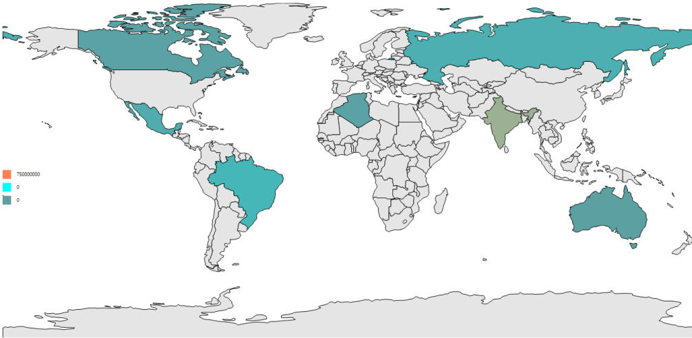

# Legend in Windows Forms Map (Maps)

A legend is a key used on a map that contains swatches of symbols with descriptions. A legend interprets what the map displays; it can be represented in various colors, shapes, or other identifiers based on data. 

## Visibility 

Legends are visible only by setting the [`ShowLegend`](https://help.syncfusion.com/cr/windowsforms/Syncfusion.Windows.Forms.Maps.LegendSettings.html#Syncfusion_Windows_Forms_Maps_LegendSettings_ShowLegend) property to true in the ShapeFileLayer.

## Legend position

Map legends can be positioned by setting the `LegendPosition` property in ShapeFileLayer. Also, the legend can be positioned based on the margin values for the x and y axes with the help of the [`PositionX`](https://help.syncfusion.com/cr/windowsforms/Syncfusion.Windows.Forms.Maps.LegendSettings.html#Syncfusion_Windows_Forms_Maps_LegendSettings_PositionX) and [`PositionY`](https://help.syncfusion.com/cr/windowsforms/Syncfusion.Windows.Forms.Maps.LegendSettings.html#Syncfusion_Windows_Forms_Maps_LegendSettings_PositionY) properties available in ShapeFileLayer. For positioning the legend based on margins corresponding to a map, LegendPosition must be set to “Default”.

<table>
<tr>
<th>
Property</th><th>
Type</th><th>
Description</th></tr>
<tr>
<td>
LegendPosition</td><td>
LegendPosition (enum)</td><td>
Gets or sets the standard position for legend</td></tr>
<tr>
<td>
PositionX</td><td>
Double</td><td>
Gets or sets the margin value for x axis</td></tr>
<tr>
<td>
PositionY</td><td>
Double</td><td>
Gets or sets the margin value for y axis.</td></tr>
</table>

## Legend header

A header for the legend can be added by setting the `Title` property of string type.

## Categories of Legend 

Legends are categorized as the following two types:

* Legends for layers
* Legends for bubbles

These can be set by using the `LegendType` property.

## Shapes for legend 

Bubble type legends are always bubbles with varying sizes. The size of the bubbles is obtained from the SizeRatio of the BubbleSetting.

Layer shape type legends can be different shapes for the legend. The shapes can be set using the LegendIcon of the LegendIcon type.

### Code sample:





partial class Form1
{
    private Syncfusion.Windows.Forms.Maps.Maps mapsControl1;

    private void InitializeComponent()
    {
        this.mapsControl1 = new Syncfusion.Windows.Forms.Maps.Maps();
        this.mapsControl1.Name = "mapsControl1";
        this.mapsControl1.Size = new System.Drawing.Size(880, 585);
        this.Controls.Add(this.mapsControl1);
        this.ClientSize = new System.Drawing.Size(880, 585);
        this.Load += new System.EventHandler(this.Form1_Load);
    }
}





Partial Class Form1
    Private mapsControl1 As Syncfusion.Windows.Forms.Maps.Maps

    Private Sub InitializeComponent()
        Me.mapsControl1 = New Syncfusion.Windows.Forms.Maps.Maps()
        Me.mapsControl1.Name = "mapsControl1"
        Me.mapsControl1.Size = New System.Drawing.Size(880, 585)
        Me.Controls.Add(Me.mapsControl1)
        Me.ClientSize = New System.Drawing.Size(880, 585)
        AddHandler Me.Load, New System.EventHandler(AddressOf Me.Form1_Load)
    End Sub
End Class









public partial class Form1 : Form
{
    private void Form1_Load(object sender, EventArgs e)
    {
        this.mapsControl1.Dock = DockStyle.Fill;
        this.mapsControl1.Margin = new Padding(0, 0, 4, 0);
        this.mapsControl1.MapBackgroundBrush = new SolidBrush(Color.White);
        this.mapsControl1.MapItemsShape = Syncfusion.Windows.Forms.Maps.MapItemShapes.None;

        MapViewModel model = new MapViewModel();

        ShapeFileLayer shapeLayer = new ShapeFileLayer();
        shapeLayer.Uri = "world1.shp";
        shapeLayer.ItemSource = model.Countries;
        shapeLayer.ShapeIDPath = "NAME";
        shapeLayer.ShapeIDTableField = "NAME";
        shapeLayer.ShapeSetting.ShapeValuePath = "Population";
        shapeLayer.ShapeSetting.ShapeColorValuePath = "Population";
        shapeLayer.ShapeSetting.ShapeDisplayValuePath = "NAME";
        shapeLayer.ShapeSetting.TextForeground = "Black";
        shapeLayer.ShowMapItem = false;
        shapeLayer.ShowToolTip = true;
        shapeLayer.ShapeSetting.ShapeFill = "#E5E5E5";
        shapeLayer.ShapeSetting.ShapeStrokeThickness = 1.5;
        shapeLayer.ShapeSetting.ShapeStroke = "Black";
        shapeLayer.ShapeSetting.FillSetting.AutoFillColors = false;
        shapeLayer.LegendSetting = new LegendSettings()
        {
            ShowLegend = true,
            Size = new Size(15, 15),
            PositionX = 30,
            PositionY = 180
        };

        shapeLayer.ShapeSetting.FillSetting.ColorMappings = new System.Collections.ObjectModel.ObservableCollection<ColorMapping>();
        shapeLayer.ShapeSetting.FillSetting.ColorMappings.Add(new RangeColorMapping { From = 750000000, To = 1500000000, Color = Color.Coral });
        shapeLayer.ShapeSetting.FillSetting.ColorMappings.Add(new RangeColorMapping { From = 0, To = 750000000, Color = Color.Aqua });
        shapeLayer.ShapeSetting.FillSetting.ColorMappings.Add(new RangeColorMapping { From = 0, To = 0, Color = Color.CadetBlue });
        this.mapsControl1.Layers.Add(shapeLayer);
    }
}





Public Partial Class Form1
    Inherits Form

    Private Sub Form1_Load(sender As Object, e As EventArgs)
        Me.mapsControl1.Dock = DockStyle.Fill
        Me.mapsControl1.Margin = New Padding(0, 0, 4, 0)
        Me.mapsControl1.MapBackgroundBrush = New SolidBrush(Color.White)
        Me.mapsControl1.MapItemsShape = Syncfusion.Windows.Forms.Maps.MapItemShapes.None

        Dim model As New MapViewModel()

        Dim shapeLayer As New ShapeFileLayer()
        shapeLayer.Uri = "world1.shp"
        shapeLayer.ItemSource = model.Countries
        shapeLayer.ShapeIDPath = "NAME"
        shapeLayer.ShapeIDTableField = "NAME"
        shapeLayer.ShapeSetting.ShapeValuePath = "Population"
        shapeLayer.ShapeSetting.ShapeColorValuePath = "Population"
        shapeLayer.ShapeSetting.ShapeDisplayValuePath = "NAME"
        shapeLayer.ShapeSetting.TextForeground = "Black"
        shapeLayer.ShowMapItem = False
        shapeLayer.ShowToolTip = True
        shapeLayer.ShapeSetting.ShapeFill = "#E5E5E5"
        shapeLayer.ShapeSetting.ShapeStrokeThickness = 1.5
        shapeLayer.ShapeSetting.ShapeStroke = "Black"
        shapeLayer.ShapeSetting.FillSetting.AutoFillColors = False
        shapeLayer.LegendSetting = New LegendSettings() With {
            .ShowLegend = True,
            .Size = New Size(15, 15),
            .PositionX = 30,
            .PositionY = 180
        }
        
        shapeLayer.ShapeSetting.FillSetting.ColorMappings = New System.Collections.ObjectModel.ObservableCollection(Of ColorMapping)()
        shapeLayer.ShapeSetting.FillSetting.ColorMappings.Add(New RangeColorMapping With {.From = 750000000, .To = 1500000000, .Color = Color.Coral})
        shapeLayer.ShapeSetting.FillSetting.ColorMappings.Add(New RangeColorMapping With {.From = 0, .To = 750000000, .Color = Color.Aqua})
        shapeLayer.ShapeSetting.FillSetting.ColorMappings.Add(New RangeColorMapping With {.From = 0, .To = 0, .Color = Color.CadetBlue})
        Me.mapsControl1.Layers.Add(shapeLayer)
    End Sub
End Class





The following screenshot illustrate a map displaying default legend

