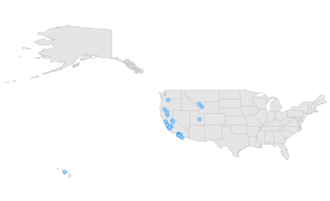

# Map Points in Windows Forms Map (Maps)

[`Points`](https://help.syncfusion.com/cr/windowsforms/Syncfusion.Windows.Forms.Maps.ShapeFileRecord.html#Syncfusion_Windows_Forms_Maps_ShapeFileRecord_Points) are one of the record types in the shape file layer. Points are used to specify the specific point in the map. For example, they are used to specify the capital of countries. Points in the shape file are given as latitude and longitude coordinates. Those points should be converted as map points. 

### Code sample





partial class Form1
{
    private Syncfusion.Windows.Forms.Maps.Maps mapsControl1;

    private void InitializeComponent()
    {
        this.mapsControl1 = new Syncfusion.Windows.Forms.Maps.Maps();
        this.mapsControl1.Name = "mapsControl1";
        this.mapsControl1.Size = new System.Drawing.Size(880, 585);
        this.Controls.Add(this.mapsControl1);
        this.ClientSize = new System.Drawing.Size(880, 585);
        this.Load += new System.EventHandler(this.Form1_Load);
    }
}





Partial Class Form1
    Private mapsControl1 As Syncfusion.Windows.Forms.Maps.Maps

    Private Sub InitializeComponent()
        Me.mapsControl1 = New Syncfusion.Windows.Forms.Maps.Maps()
        Me.mapsControl1.Name = "mapsControl1"
        Me.mapsControl1.Size = New System.Drawing.Size(880, 585)
        Me.Controls.Add(Me.mapsControl1)
        Me.ClientSize = New System.Drawing.Size(880, 585)
        AddHandler Me.Load, New System.EventHandler(AddressOf Me.Form1_Load)
    End Sub
End Class









public partial class Form1 : Form
{
    private void Form1_Load(object sender, EventArgs e)
    {
        MapViewModel model = new MapViewModel();
        ShapeFileLayer shapeLayer = new ShapeFileLayer();
        shapeLayer.ShapeSetting.FillSetting.AutoFillColors = false;
        shapeLayer.Uri = "states.shp";
        shapeLayer.ShapeSetting.ShapeFill = "#E5E5E5";
        shapeLayer.ShapeSetting.ShapeStrokeThickness = 0.5;
        shapeLayer.ShapeSetting.ShapeStroke = "#C1C1C1";
        shapeLayer.ShowToolTip = true;

        SubShapeFileLayer layer1 = new SubShapeFileLayer();
        layer1.Uri = "landslide.shp";
        layer1.ShapeSetting.ShapeFill = "#8DCEFF";
        layer1.ShapeSetting.ShapeStrokeThickness = 0.5;
        layer1.ShapeSetting.ShapeStroke = "#2F8CEA";
        shapeLayer.SubShapeFileLayers.Add(layer1);
        this.mapsControl1.Layers.Add(shapeLayer);
    }
}





Public Partial Class Form1
    Inherits Form

    Private Sub Form1_Load(sender As Object, e As EventArgs)
        Dim model As New MapViewModel()
        Dim shapeLayer As New ShapeFileLayer()
        shapeLayer.ShapeSetting.FillSetting.AutoFillColors = False
        shapeLayer.Uri = "states.shp"
        shapeLayer.ShapeSetting.ShapeFill = "#E5E5E5"
        shapeLayer.ShapeSetting.ShapeStrokeThickness = 0.5
        shapeLayer.ShapeSetting.ShapeStroke = "#C1C1C1"
        shapeLayer.ShowToolTip = True

        Dim layer1 As New SubShapeFileLayer()
        layer1.Uri = "landslide.shp"
        layer1.ShapeSetting.ShapeFill = "#8DCEFF"
        layer1.ShapeSetting.ShapeStrokeThickness = 0.5
        layer1.ShapeSetting.ShapeStroke = "#2F8CEA"
        shapeLayer.SubShapeFileLayers.Add(layer1)
        Me.mapsControl1.Layers.Add(shapeLayer)
    End Sub
End Class





Screenshot:

Map points
{:.caption}
