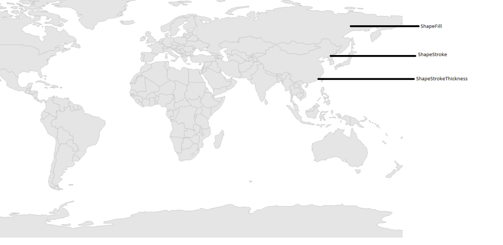

# Shape Customization in Windows Forms Map (Maps)

Shapes in the map control can be customized using the ShapeSetting properties such as ShapeFill, ShapeStroke, and ShapeStrokeThickness.

## Shape settings

The [`ShapeFill`](https://help.syncfusion.com/cr/windowsforms/Syncfusion.UI.Xaml.Maps.ShapeSetting.html#Syncfusion_UI_Xaml_Maps_ShapeSetting_ShapeFill) property fills the shape with respective color. The [`ShapeStroke`](https://help.syncfusion.com/cr/windowsforms/Syncfusion.UI.Xaml.Maps.ShapeSetting.html#Syncfusion_UI_Xaml_Maps_ShapeSetting_ShapeStroke) property sets the border color for the shape in the map, and the [`ShapeStrokeThickness`](https://help.syncfusion.com/cr/windowsforms/Syncfusion.UI.Xaml.Maps.ShapeSetting.html#Syncfusion_UI_Xaml_Maps_ShapeSetting_ShapeStrokeThickness) property sets the thickness for the shape’s border.





partial class Form1
{

         private void InitializeComponent()
         {

            this.mapsControl1 = new Syncfusion.Windows.Forms.Maps.Maps();

            this.mapsControl1.Name = "mapsControl1";

            this.mapsControl1.Size = new System.Drawing.Size(880, 585); 

            this.Controls.Add(this.mapsControl1);  

            this.ClientSize = new System.Drawing.Size(880, 585);          

            this.Load += new System.EventHandler(this.Form1_Load);

         }

            private Syncfusion.Windows.Forms.Maps.Maps mapsControl1;

}  









public partial class Form1 : Form
{

        private void Form1_Load(object sender, EventArgs e)
        {

            this.mapsControl1.Dock = DockStyle.Fill;

            this.mapsControl1.Margin = new Padding(0, 0, 4, 0);

            this.mapsControl1.MapBackgroundBrush = new SolidBrush(Color.White);

            this.mapsControl1.MapItemsShape = Syncfusion.Windows.Forms.Maps.MapItemShapes.None;

             ShapeFileLayer shapeLayer = new ShapeFileLayer();

             shapeLayer.Uri = "world1.shp";

             shapeLayer.ShapeSetting.ShapeFill = "#E5E5E5";

             shapeLayer.ShapeSetting.ShapeStrokeThickness = 1.5;

             shapeLayer.ShapeSetting.ShapeStroke = "#C1C1C1";

             this.mapsControl1.Layers.Add(shapeLayer);

         }
}       





Screenshot:

