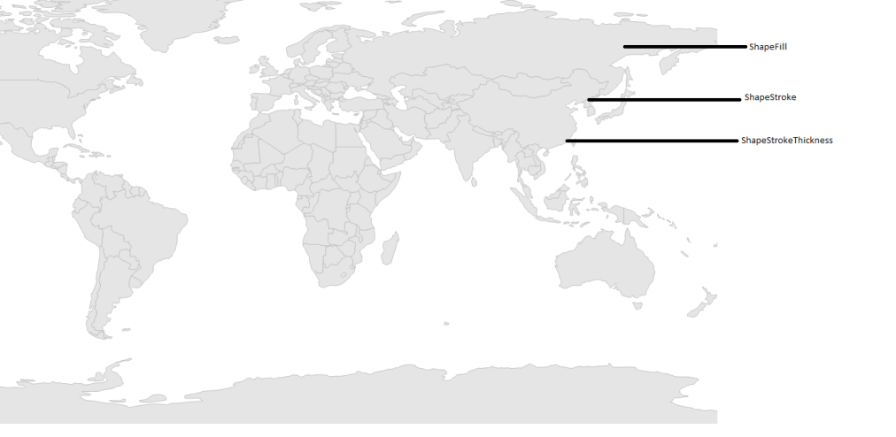

# Shape Customization in Windows Forms Map (Maps)

Shapes in the map control can be customized using the ShapeSetting properties such as ShapeFill, ShapeStroke, and ShapeStrokeThickness.

## Shape settings

The [`ShapeFill`](https://help.syncfusion.com/cr/windowsforms/Syncfusion.Windows.Forms.Maps.ShapeSetting.html#Syncfusion_Windows_Forms_Maps_ShapeSetting_ShapeFill) property fills the shape with respective color. The [`ShapeStroke`](https://help.syncfusion.com/cr/windowsforms/Syncfusion.Windows.Forms.Maps.ShapeSetting.html#Syncfusion_Windows_Forms_Maps_ShapeSetting_ShapeStroke) property sets the border color for the shape in the map, and the [`ShapeStrokeThickness`](https://help.syncfusion.com/cr/windowsforms/Syncfusion.Windows.Forms.Maps.ShapeSetting.html#Syncfusion_Windows_Forms_Maps_ShapeSetting_ShapeStrokeThickness) property sets the thickness for the shape's border.





partial class Form1
{
    private Syncfusion.Windows.Forms.Maps.Maps mapsControl1;

    private void InitializeComponent()
    {
        this.mapsControl1 = new Syncfusion.Windows.Forms.Maps.Maps();
        this.mapsControl1.Name = "mapsControl1";
        this.mapsControl1.Size = new System.Drawing.Size(880, 585);
        this.Controls.Add(this.mapsControl1);
        this.ClientSize = new System.Drawing.Size(880, 585);
        this.Load += new System.EventHandler(this.Form1_Load);
    }
}





Partial Class Form1
    Private mapsControl1 As Syncfusion.Windows.Forms.Maps.Maps

    Private Sub InitializeComponent()
        Me.mapsControl1 = New Syncfusion.Windows.Forms.Maps.Maps()
        Me.mapsControl1.Name = "mapsControl1"
        Me.mapsControl1.Size = New System.Drawing.Size(880, 585)
        Me.Controls.Add(Me.mapsControl1)
        Me.ClientSize = New System.Drawing.Size(880, 585)
        AddHandler Me.Load, New System.EventHandler(AddressOf Me.Form1_Load)
    End Sub
End Class









public partial class Form1 : Form
{
    private void Form1_Load(object sender, EventArgs e)
    {
        this.mapsControl1.Dock = DockStyle.Fill;
        this.mapsControl1.Margin = new Padding(0, 0, 4, 0);
        this.mapsControl1.MapBackgroundBrush = new SolidBrush(Color.White);
        this.mapsControl1.MapItemsShape = Syncfusion.Windows.Forms.Maps.MapItemShapes.None;

        ShapeFileLayer shapeLayer = new ShapeFileLayer();
        shapeLayer.Uri = "world1.shp";
        shapeLayer.ShapeSetting.ShapeFill = "#E5E5E5";
        shapeLayer.ShapeSetting.ShapeStrokeThickness = 1.5;
        shapeLayer.ShapeSetting.ShapeStroke = "#C1C1C1";
        this.mapsControl1.Layers.Add(shapeLayer);
    }
}





Public Partial Class Form1
    Inherits Form

    Private Sub Form1_Load(sender As Object, e As EventArgs)
        Me.mapsControl1.Dock = DockStyle.Fill
        Me.mapsControl1.Margin = New Padding(0, 0, 4, 0)
        Me.mapsControl1.MapBackgroundBrush = New SolidBrush(Color.White)
        Me.mapsControl1.MapItemsShape = Syncfusion.Windows.Forms.Maps.MapItemShapes.None

        Dim shapeLayer As New ShapeFileLayer()
        shapeLayer.Uri = "world1.shp"
        shapeLayer.ShapeSetting.ShapeFill = "#E5E5E5"
        shapeLayer.ShapeSetting.ShapeStrokeThickness = 1.5
        shapeLayer.ShapeSetting.ShapeStroke = "#C1C1C1"
        Me.mapsControl1.Layers.Add(shapeLayer)
    End Sub
End Class





