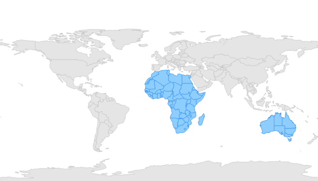

# Multilayer Support

Multilayer support allows you to load multiple shape files in a single container, enabling maps to display more detail. 

## Loading  Multiple Shapefiles in a Single Container

This feature enables the map to load multiple types of shape files in a single container. Basically, shape files contain point shapes in a single container.

Situations arise where any combination of available shape files needs to be loaded in a single container. In such situations this feature enables the map to load multiple shape layers in a single container.

## Adding Multiple Layers in the Map

ShapeFileLayer is the core layer of the map. Multiple layers can be added in the ShapeFileLayer itself. They have to be added in SubShapeFileLayer within the ShapeFileLayer. 

## SubShapeFileLayers

SubShapeFileLayer is the collection of SubShapeFileLayer. SubShapeFileLayer is also a type of ShapeFileLayer. The following code adds multiple layers into the ShapeFileLayer.

### Code sample:



partial class Form1

    {

         private void InitializeComponent()

         {

            this.mapsControl1 = new Syncfusion.Windows.Forms.Maps.Maps();

            this.mapsControl1.Name = "mapsControl1";

            this.mapsControl1.Size = new System.Drawing.Size(880, 585); 

            this.Controls.Add(this.mapsControl1);  

             this.ClientSize = new System.Drawing.Size(880, 585);          

            this.Load += new System.EventHandler(this.Form1_Load);

         }

            private Syncfusion.Windows.Forms.Maps.Maps mapsControl1;

     }  
	 




public partial class Form1 : Form

    {

        private void Form1_Load(object sender, EventArgs e)

        {

            this.mapsControl1.Dock = DockStyle.Fill;

            this.mapsControl1.Margin = new Padding(0, 0, 4, 0);

            this.mapsControl1.MapBackgroundBrush = new SolidBrush(Color.White);

            this.mapsControl1.MapItemsShape = Syncfusion.Windows.Forms.Maps.MapItemShapes.None;

            this.mapsControl1.MapItemStroke = new SolidBrush(Color.Black);

            MapViewModel viewmodel = new MapViewModel();

            ShapeFileLayer shapeLayer = new ShapeFileLayer();

            shapeLayer.Uri = "world1.shp";

            shapeLayer.ShapeSetting.ShapeFill = "#E5E5E5";

            shapeLayer.ShapeSetting.ShapeStroke = "#C1C1C1";

            shapeLayer.ShapeSetting.ShapeStrokeThickness = 0.5;

            SubShapeFileLayer layer1 = new SubShapeFileLayer();

            layer1.Uri = "Africa.shp"; 

            layer1.ShapeSetting.ShapeFill = "#8DCEFF";

            layer1.ShapeSetting.ShapeStrokeThickness = 0.5;

            layer1.ShapeSetting.ShapeStroke = "#2F8CEA";

            SubShapeFileLayer layer2 = new SubShapeFileLayer();

            layer2.Uri = "australia.shp";

            layer2.ShapeSetting.ShapeFill = "#8DCEFF";

            layer2.ShapeSetting.ShapeStrokeThickness = 0.5;

            layer2.ShapeSetting.ShapeStroke = "#2F8CEA";

            shapeLayer.SubShapeFileLayers.Add(layer1);

            shapeLayer.SubShapeFileLayers.Add(layer2);

            this.mapsControl1.Layers.Add(shapeLayer);

         }    

 }       



Screenshot:

MultiLayer
{:.caption}