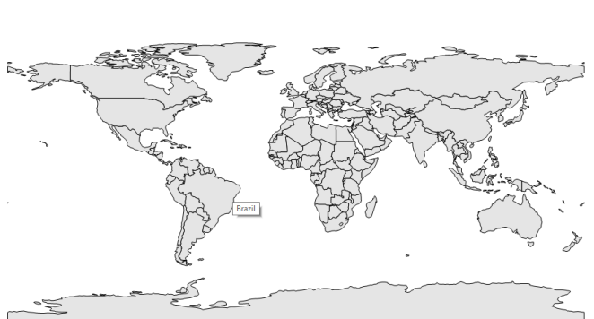

# Tooltip Support

Tooltip is a hanging window, shown when the shape is tapped. It shows additional information from the object bounded with the shape. By default, it takes the property of the bounded object which is referred in the ShapeValuePath and displays its content when the corresponding shape is tapped.

Tooltip is shown only when “ShowToolTip” set to true in the shape file layer.



partial class Form1

    {

         private void InitializeComponent()

         {

            this.mapsControl1 = new Syncfusion.Windows.Forms.Maps.Maps();

            this.mapsControl1.Name = "mapsControl1";

            this.mapsControl1.Size = new System.Drawing.Size(880, 585); 

            this.Controls.Add(this.mapsControl1);  

             this.ClientSize = new System.Drawing.Size(880, 585);          

            this.Load += new System.EventHandler(this.Form1_Load);

         }

            private Syncfusion.Windows.Forms.Maps.Maps mapsControl1;

     }  





public partial class Form1 : Form

    {

        private void Form1_Load(object sender, EventArgs e)

        {

            this.mapsControl1.Dock = DockStyle.Fill;

            this.mapsControl1.Margin = new Padding(0, 0, 4, 0);

            this.mapsControl1.MapBackgroundBrush = new SolidBrush(Color.White);

            this.mapsControl1.MapItemsShape = Syncfusion.Windows.Forms.Maps.MapItemShapes.None;

             MapViewModel model = new MapViewModel();

            ShapeFileLayer shapeLayer = new ShapeFileLayer();

            shapeLayer.Uri = "world1.shp";

            shapeLayer.ItemSource = model.Countries;

            shapeLayer.ShapeIDPath = "NAME";

            shapeLayer.ShapeIDTableField = "NAME";

            shapeLayer.ShapeSetting.ShapeValuePath = "Population";

shapeLayer.ShapeSetting.ShapeColorValuePath = "Population";

            shapeLayer.ShapeSetting.ShapeDisplayValuePath = "NAME";

            shapeLayer.ShapeSetting.TextForeground = "Black";

            shapeLayer.ShowMapItem = false;

            shapeLayer.ShowToolTip = true;

            shapeLayer.ShapeSetting.ShapeFill = "#E5E5E5";

            shapeLayer.ShapeSetting.ShapeStrokeThickness = 1.5;

            shapeLayer.ShapeSetting.ShapeStroke = "Black";

            shapeLayer.ShapeSetting.FillSetting.AutoFillColors = false;

             this.mapsControl1 .Layers.Add(shapeLayer);

         }

     }       



Screenshot:

