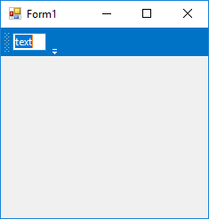

# Adding Menu Items via Code in Windows Forms Menu (Menus)

This section provides a quick overview to add the menu items to a [Menu](https://help.syncfusion.com/cr/windowsforms/Syncfusion.Windows.Forms.Tools.XPMenus.MainFrameBarManager.html) control through the code.

To add control manually in C# or VB, follow the below steps initially.

Step 1. Add the following required assembly references to the project:

        * Syncfusion.Tools.Base.dll
        * Syncfusion.Tools.Windows.dll
        * Syncfusion.Shared.Base.dll
        * Syncfusion.Shared.Windows.dll
        * Syncfusion.Grid.Base.dll
        * Syncfusion.Grid.Windows.dll
        * Syncfusion.Licensing.dll
        * Syncfusion.SpellChecker.Base.dll

Step 2. Include the namespace **Syncfusion.Windows.Forms.Tools**.






using Syncfusion.Windows.Forms.Tools;





Imports Syncfusion.Windows.Forms.Tools





{{ codesnippet1 | OrderList_Indent_Level_1 }}

Step 3. Create [MainFrameBarManager](https://help.syncfusion.com/cr/windowsforms/Syncfusion.Windows.Forms.Tools.XPMenus.MainFrameBarManager.html) control instance and add it to the form.






MainFrameBarManager mainFrameBarManager1 = new MainFrameBarManager();

this.mainFrameBarManager1.Style = Syncfusion.Windows.Forms.VisualStyle.Office2016Colorful;

this.mainFrameBarManager1.Form = this;





Dim mainFrameBarManager1 As MainFrameBarManager = New MainFrameBarManager

Me.mainFrameBarManager1.Style = Syncfusion.Windows.Forms.VisualStyle.Office2016Colorful

Me.mainFrameBarManager1.Form = Me;





{{ codesnippet2 | OrderList_Indent_Level_1 }}

## Adding main bar

The [Bar](https://help.syncfusion.com/cr/windowsforms/Syncfusion.Windows.Forms.Tools.XPMenus.Bar.html) component acts a place holder to the menu items. It can be added to menu using the `Bars` collection property of MainFrameBarManager instance.

The below code snippet shows the addition of a bar to the menu.





// Create an instance
Bar bar1 = new Syncfusion.Windows.Forms.Tools.XPMenus.Bar();

// Add MainFrameBarManager as Manager
this.bar1.BarName = "File";
this.bar1.Caption = "File";
this.bar1.Manager = this.mainFrameBarManager1;

// Add Bar and Categories
this.mainFrameBarManager1.Bars.Add(this.bar1);
this.mainFrameBarManager1.Categories.Add("Menu");





' Create an instance
Dim bar1 As Bar = New Syncfusion.Windows.Forms.Tools.XPMenus.Bar()

' Add MainFrameBarManager as Manager
Me.bar1.BarName = "File"
Me.bar1.Caption = "File"
Me.bar1.Manager = Me.mainFrameBarManager1

' Add Bar and Categories
Me.mainFrameBarManager1.Bars.Add(Me.bar1)
Me.mainFrameBarManager1.Categories.Add("Menu")





## Adding parent item

The [ParentBarItem](https://help.syncfusion.com/cr/windowsforms/Syncfusion.Windows.Forms.Tools.XPMenus.ParentBarItem.html) is a type of [bar item](https://help.syncfusion.com/cr/windowsforms/Syncfusion.Windows.Forms.Tools.XPMenus.BarItem.html), that acts as a parent component for child bar items and sub-menu.

The following code snippet shows the adding of parent bar item to a bar with child items. The sub-menu or the child items can be added via the `Items` property.





// Create instance
ParentBarItem parentBarItem1 = new ParentBarItem();

BarItem barItem1 = new BarItem();
BarItem barItem2 = new BarItem();
BarItem barItem3 = new BarItem();
BarItem barItem4 = new BarItem();

this.barItem1.Text = "New";
this.barItem2.Text = "Open";
this.barItem3.Text = "Save";
this.barItem4.Text = "Save As";

parentBarItem1.Text = "Menu";

// Add it to MainFrameBarManager
this.mainFrameBarManager1.Items.AddRange(new Syncfusion.Windows.Forms.Tools.XPMenus.BarItem[]
{
    parentBarItem1,
    this.barItem1,
    this.barItem2,
    this.barItem3,
    this.barItem4
});

// Add BarItem to ParentBarItem
parentBarItem1.Items.AddRange(new Syncfusion.Windows.Forms.Tools.XPMenus.BarItem[]
{
    this.barItem1,
    this.barItem2,
    this.barItem3,
    this.barItem4
});

// Add ParentBarItem to Bar
this.bar1.Items.AddRange(new Syncfusion.Windows.Forms.Tools.XPMenus.BarItem[] { parentBarItem1 });





' Create instance
Dim parentBarItem1 As New ParentBarItem()

Dim barItem1 As New BarItem()
Dim barItem2 As New BarItem()
Dim barItem3 As New BarItem()
Dim barItem4 As New BarItem()

Me.barItem1.Text = "New"
Me.barItem2.Text = "Open"
Me.barItem3.Text = "Save"
Me.barItem4.Text = "Save As"

parentBarItem1.Text = "Menu"

' Add it to MainFrameBarManager
Me.mainFrameBarManager1.Items.AddRange(New Syncfusion.Windows.Forms.Tools.XPMenus.BarItem()
{
    parentBarItem1,
    Me.barItem1,
    Me.barItem2,
    Me.barItem3,
    Me.barItem4
})

' Add BarItem to ParentBarItem
parentBarItem1.Items.AddRange(New Syncfusion.Windows.Forms.Tools.XPMenus.BarItem()
{
    Me.barItem1,
    Me.barItem2,
    Me.barItem3,
    Me.barItem4
})

' Add ParentBarItem to Bar
Me.bar1.Items.AddRange(New Syncfusion.Windows.Forms.Tools.XPMenus.BarItem() { parentBarItem1 })





## Adding dropdown item

The [DropDownBarItem](https://help.syncfusion.com/cr/windowsforms/Syncfusion.Windows.Forms.Tools.XPMenus.DropDownBarItem.html) is a type of bar item, which will display a popup menu when clicked. A custom control can also be loaded when the menu item is clicked. This can be done by assigning the required component to the [`PopupControlContainer`](https://help.syncfusion.com/cr/windowsforms/Syncfusion.Windows.Forms.Tools.XPMenus.DropDownBarItem.html#Syncfusion_Windows_Forms_Tools_XPMenus_DropDownBarItem_PopupControlContainer) property of the drop down bar item.

The following code snippet shows the drop down item is being added with a color picker control.





DropDownBarItem dropDownBarItem1 = new DropDownBarItem();

PopupControlContainer popupControlContainer1 = new PopupControlContainer();

ColorPickerUIAdv colorPickerUIAdv1 = new ColorPickerUIAdv();

this.popupControlContainer1.Controls.Add(this.colorPickerUIAdv1);

this.Controls.Add(this.popupControlContainer1);

this.dropDownBarItem1.Text = "DropDown";

// Adding PopupControlContainer to DropDownBarItem
this.dropDownBarItem1.PopupControlContainer = this.popupControlContainer1;

this.mainFrameBarManager1.Items.Add(dropDownBarItem1);

this.bar1.Items.Add(dropDownBarItem1);





Dim dropDownBarItem1 As New DropDownBarItem()

Dim popupControlContainer1 As New PopupControlContainer()

Dim colorPickerUIAdv1 As New ColorPickerUIAdv()

Me.popupControlContainer1.Controls.Add(Me.colorPickerUIAdv1)

Me.Controls.Add(Me.popupControlContainer1)

Me.dropDownBarItem1.Text = "DropDown"

' Adding PopupControlContainer to DropDownBarItem
Me.dropDownBarItem1.PopupControlContainer = Me.popupControlContainer1

Me.mainFrameBarManager1.Items.Add(dropDownBarItem1)

Me.bar1.Items.Add(dropDownBarItem1)





## Adding combo box item

The [ComboBoxBarItem](https://help.syncfusion.com/cr/windowsforms/Syncfusion.Windows.Forms.Tools.XPMenus.ComboBoxBarItem.html) is a type of bar item, which behaves like combo box control. The items collection can be specified using the [`ChoiceList`](https://help.syncfusion.com/cr/windowsforms/Syncfusion.Windows.Forms.Tools.XPMenus.ComboBoxBarItem.html#Syncfusion_Windows_Forms_Tools_XPMenus_ComboBoxBarItem_ChoiceList) property.

The below code snippet shows the combo box is being added with a collection of items via the `ChoiceList` property.





ComboBoxBarItem comboBoxBarItem1 = new ComboBoxBarItem();
this.comboBoxBarItem1.ChoiceList.AddRange(new string[]{ "Obj 1", "Obj 2", "Obj 3" });
this.mainFrameBarManager1.Items.Add(this.comboBoxBarItem1);
this.bar1.Items.Add(this.comboBoxBarItem1);





Dim comboBoxBarItem1 As New ComboBoxBarItem()
Me.comboBoxBarItem1.ChoiceList.AddRange(New String() { "Obj 1", "Obj 2", "Obj 3" })
Me.mainFrameBarManager1.Items.Add(Me.comboBoxBarItem1)
Me.bar1.Items.Add(Me.comboBoxBarItem1)





## Adding static item

A [StaticBarItem](https://help.syncfusion.com/cr/windowsforms/Syncfusion.Windows.Forms.Tools.XPMenus.StaticBarItem.html) is a type of bar item, which behaves like Label control.

The below code snippet shows the static bar item is added to the menu.





StaticBarItem staticBarItem1 = new StaticBarItem();

this.staticBarItem1.Text = "StaticBarItem";

this.mainFrameBarManager1.Items.Add(this.staticBarItem1);

this.bar1.Items.Add(staticBarItem1);





Dim staticBarItem1 As New StaticBarItem()

Me.staticBarItem1.Text = "StaticBarItem"

Me.mainFrameBarManager1.Items.Add(Me.staticBarItem1)

Me.bar1.Items.Add(staticBarItem1)





## Adding toolbar item

A [ToolBarListBarItem](https://help.syncfusion.com/cr/windowsforms/Syncfusion.Windows.Forms.Tools.XPMenus.ToolBarListBarItem.html) is a type of bar item, which behaves like a toolbar menu item. It displays the options to customize the menu items of the parent tool bar to which it gets associated.

The below code shows the toolbar item is added to the menu.





ToolbarListBarItem toolbarListBarItem = new ToolbarListBarItem();
toolbarListBarItem.BarName = "toolBarListBarItem";
toolbarListBarItem.Text = "toolBarListBarItem";

this.mainFrameBarManager1.Items.Add(toolbarListBarItem);

this.bar1.Items.Add(toolbarListBarItem);





Dim toolbarListBarItem As New ToolbarListBarItem()
toolbarListBarItem.BarName = "toolBarListBarItem"
toolbarListBarItem.Text = "toolBarListBarItem"

Me.mainFrameBarManager1.Items.Add(toolbarListBarItem)

Me.bar1.Items.Add(toolbarListBarItem)





## Adding textbox item

The [TextBoxBarItem](https://help.syncfusion.com/cr/windowsforms/Syncfusion.Windows.Forms.Tools.XPMenus.TextBoxBarItem.html) is a type of bar item, which behaves like text box control. The text edited can be obtained via the [`TextBoxValue`](https://help.syncfusion.com/cr/windowsforms/Syncfusion.Windows.Forms.Tools.XPMenus.TextBoxBarItem.html#Syncfusion_Windows_Forms_Tools_XPMenus_TextBoxBarItem_TextBoxValue) property.

The below code snippet shows the text item is added to the menu.





TextBoxBarItem textBoxBarItem1 = new TextBoxBarItem();

this.mainFrameBarManager1.Items.Add(this.textBoxBarItem1);

this.bar1.Items.Add(textBoxBarItem1);





Dim textBoxBarItem1 As New TextBoxBarItem()

Me.mainFrameBarManager1.Items.Add(Me.textBoxBarItem1)

Me.bar1.Items.Add(textBoxBarItem1)





