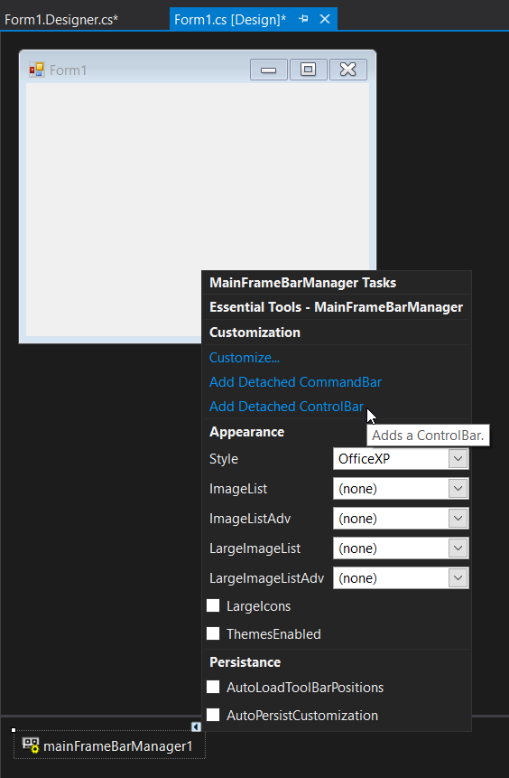
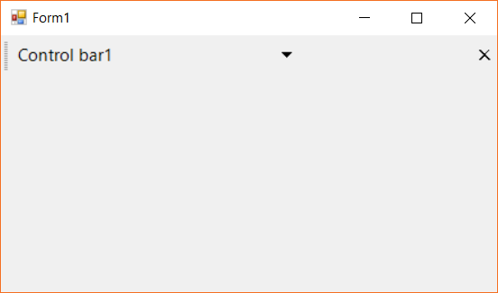
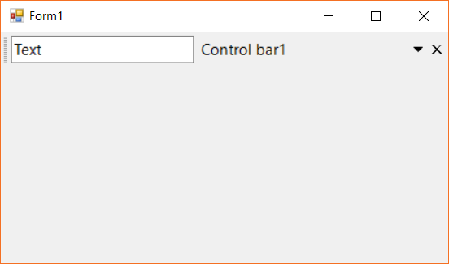

# Detachable Control Bar in Windows Forms Menu (Menus)

Control bars enables application developers to add dock-able / floatable controls to their form's toolbar layout. A common example of a control bar is the task pane window found in the Microsoft Office 2003 product suite.

A [`ControlBar`](https://help.syncfusion.com/cr/windowsforms/Syncfusion.Windows.Forms.Tools.ControlBar.html) is a full-featured docking container that can host any control and be docked along the border of the host form or floated as a top-level window. Control bars, however, differ from traditional docking windows by adopting the characteristic layout behavior of a toolbar rather than that of a classic dock-able control.

## Adding control bar via designer

The control bar can be added via the designer settings selecting the `Add Detachable Control Bars` option from the smart tag menu. The below image shows the added control bar to the form via designer.

## Adding control var via code

The control bar instance can be created with required settings and added to the `DetachedCommandBars` collection property of the menu instance. The below code snippet shows the control bar is added to the menu control with top docked position.

The below code snippet shows the control bar it being added to the menu item.





ControlBar controlbar1 = new ControlBar();
controlbar1.Dock = DockStyle.Top;
controlbar1.Text = "Control bar1";
this.mainFrameBarManager1.DetachedCommandBars.Add(controlbar1);





Dim controlbar1 as New ControlBar()
controlbar1.Dock = DockStyle.Top
controlbar1.Text = "Control bar1"
mainFrameBarManager1.DetachedCommandBars.Add(controlbar1)





## Client controls of control bar

A control bar is capable of hosting two controls.

* Caption region
* Client region

### Caption region

The controls added in this region will be loaded on the caption region of the control bar. Controls with single-line structure like text box, combo box, buttons or menu items can be included in this region. The below code snippet shows the text box is being added to the caption region.





TextBox textBox1 = new TextBox();
textBox1.Text = "Text";
textBox1.Width = 180;
textBox1.Height = 30;
this.controlBar1.CaptionControl = textBox1;





Dim textBox1 as New TextBox()
textBox1.Text = "Text"
textBox1.Width = 180
textBox1.Height = 30
Me.controlBar1.CaptionControl = textBox1





### Client region

This region holds the main control that gets hosted with the control bar. The control bar with tool bar and card layout controls are illustrated in this-example.
