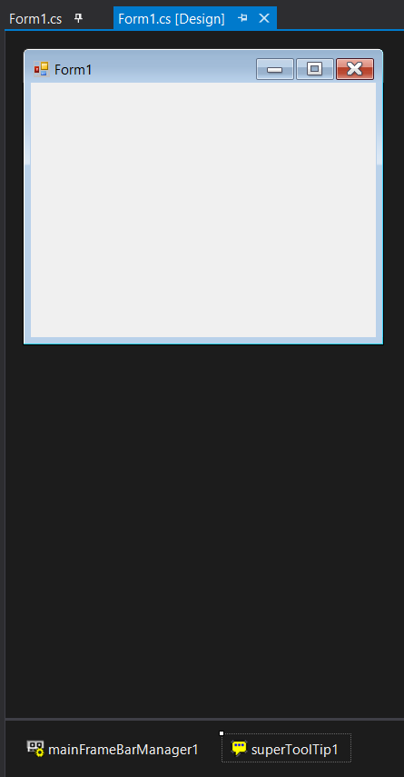
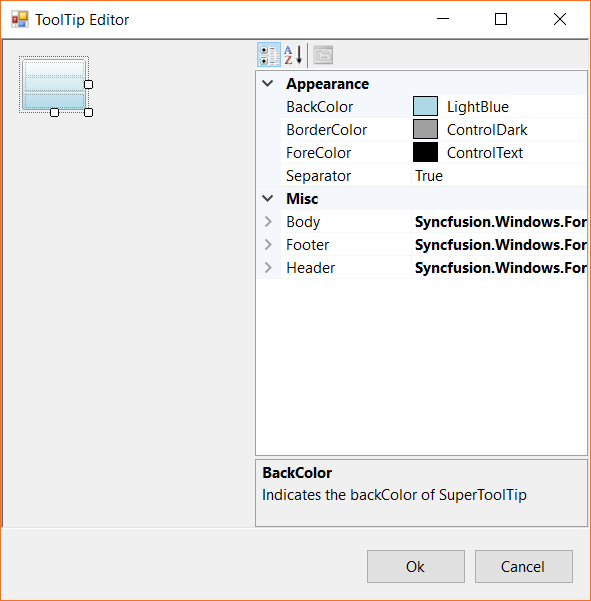
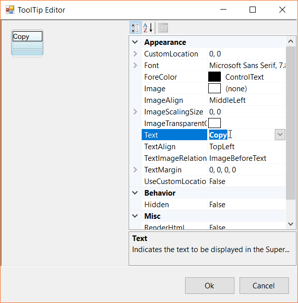
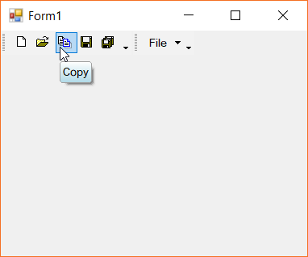
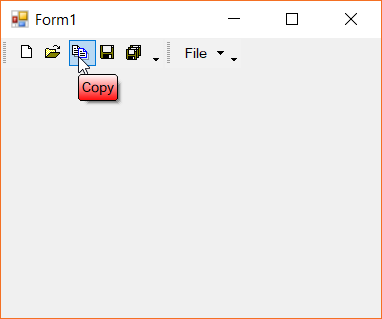
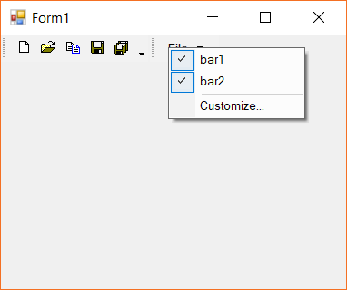

# Interactive Features

Menu control supports interactive features like tooltip and context menu associated with specified menu items. In this page such interactive features are discussed.

## Super tooltip

The menu control supports [`Super Tooltip`](https://help.syncfusion.com/cr/windowsforms/Syncfusion.Windows.Forms.Tools.SuperToolTip.html) support via the super tooltip control. In this topic we discuss about associating a super tooltip control to a bar item.

### Adding super tooltip

The super tooltip control can be drag and dropped to the form via the toolbox of the designer page. The below image shows the super tooltip control is added to the form.

### Enabling super tooltip

The menu item should be associated with the super tooltip to display the content of the tooltip. This can be done either via the designer. The below image shows the menu item `ToolTip` extended property is being set to the super tooltip instance created.

The content of the super tooltip can be edited via the **ToolTip Editor**. This can be opened via the ellipses button `...`. The below image shows the tooltip editor is being opened and the text property is being set.

By default the tooltip for every menu item is enabled via the [`ShowTooltip`](https://help.syncfusion.com/cr/windowsforms/Syncfusion.Windows.Forms.Tools.XPMenus.BarItem.html#Syncfusion_Windows_Forms_Tools_XPMenus_BarItem_ShowTooltip). This can be disabled so that no overlapping of content gets displayed. The following code snippet shows the tooltip menu item is being disabled.





this.barItem3.ShowTooltip = false;





Me.barItem3.ShowTooltip = False





N> Disabling the default tooltip of the menu item is not mandatory. However the overlapping of both tooltip could possibly occur. Its recommended to hide the default tooltip to get better view of the super tooltip.

### Appearance customization

The super tooltip appearance can be customized depending upon the requirement. This can be done via the designer page while editing the tooltip. The below image shows the appearance of the super tooltip with customized state.

## Context menu

By default, the context menu appears while right-clicking of the desired tool bar in the menu control. This provides the on-demand customization of the menu items in the specified tool bar. The below image shows the context menu being shown while right-clicking the toolbar.



[Associate popup menu with menu control](https://help.syncfusion.com/windowsforms/popupmenu/how-to-associate-popup-menu-with-bar-manager)


