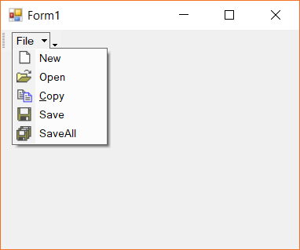

# Keyboard Support in Windows Forms Menu (Menus)

The menu control supports keyboard functionalities for navigation and selection of menu items. In this topic such keyboard support is discussed.

## Displaying shortcut text in menu item

The menu items can be selected and the respective action can be done by specifying the shortcuts via the `Shortcut` property of the menu item. The below code snippet shows a shortcut is being assigned to the menu item.





this.barItem1.Shortcut = Shortcut.AltDownArrow;





Me.barItem1.Shortcut = Shortcut.AltDownArrow





## Displaying Mnemonic in menu items

The menu items supports to add mnemonic text. As usual, the required mnemonic character is appended with `&` symbol in the `Text` property of the menu item. This character can be made visible all the time using the `ShowMnemonicUnderlinesAlways` property of the menu item.

The below snippet shows the drop down item is applied with the mnemonics.





this.barItem3.Text = "&Copy";
this.barItem3.ShowMnemonicUnderlinesAlways = true;





Me.dropDownItem.Text = "Drop do&wn item"
Me.dropDownItem.ShowMnemonicUnderlinesAlways = true





