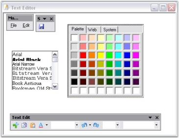

# MDI Child Forms

>**Important**
Starting with v16.2.0.x, if you refer to Syncfusion assemblies from trial setup or from the NuGet feed, include a license key in your projects. Refer to this [link](https://help.syncfusion.com/common/essential-studio/licensing/license-key) to learn about registering Syncfusion license key in your Windows Forms application to use our components.

This section illustrates how to create MDI Child forms using the ChildFrameBarManager control.

## Assembly deployment

Refer [control dependencies](https://help.syncfusion.com/windowsforms/control-dependencies#childframebarmanager) section to get the list of assemblies or NuGet package needs to be added as reference to use the control in any application. Please find more details regarding [installation of nuget packages](https://help.syncfusion.com/windowsforms/visual-studio-integration/nuget-packages) in a windows form application.

## Creating MDI parent form

To create MDI parent form and MDI child form follow the below steps

1. Set up an MDIParent form by setting Form.IsMdIContainer property to true.
2. Add menu items, 'Open' and 'Exit', under File menu bar using MainFrameBarManager. You can refer [this topic](https://help.syncfusion.com/windowsforms/menus/adding-menu-items-via-code) to add menu items to the menu.

3. Create a new form named TextEditor, with the controls FontListBox and ColorUIControl. We will consider this form as the MDIChildForm.

4. Drag-and-Drop ChildFrameBarManager to the child form and add necessary menu items. Adding menu items to ChildFrameBarManager is similar to MainFrameBarManager. You can refer [this topic](https://help.syncfusion.com/windowsforms/menus/adding-menu-items-via-designer) to add menu items to the menu.

## MDI merging

The XP Menus Framework goes to a great extent to support associating menus and toolbars for MDIChild forms. It helps users to create custom menu items and toolbars for child forms and handle menu events right within the child form. Without this support, users would have to handle menu click events in their main form and delegate it to the appropriate child forms with drawn-out casting and run-time checks and would also have to manually control menu and toolbar visibility based on the active MDIChild forms.

Once an MDIChild form is associated with a ChildFrameBarManager, the XP Menus Framework merges the menus and toolbars of the child form with that of the main form. There are two ways in which MDI merging can happen.

* Auto Merging - The Framework will automatically merge the menus of the child forms with that of the main form when a new instance of the child type is parented by the MDIParent. This merging will be undone when all instances of that child type are closed. This is the default behavior.
* Explicit Merging - Explicitly merging the child types when the application loads will provide a completely merged menu/toolbar structure to the end users, all the time. This merged state will stay unaffected through out the lifetime of the application (whether or not there are instances of the child types currently loaded). Note that the merged BarItems of the MDI child forms would be displayed in the runtime customization dialog only, and will not be visible in the parent form's menus or toolbars until an actual instance of the child form is loaded. This is the behavior exhibited in VS .NET. You can explicitly merge child types by registering the child form types with the MainFrameBarManager, as follows.

N> Here the child forms created in the above example is being used.





this.mainFrameBarManager1.RegisterMdiChildTypes(new Type[]{typeof(TextEditorForm), typeof(ImageEditorForm)});





Me.mainFrameBarManager1.RegisterMdiChildTypes(New Type() {GetType(TextEditorForm), GetType(ImageEditorForm)})





The MainFrameBarManager will then create an instance of these form types and obtain the main menu and toolbars, associated with these child form types. 

The following applies to the explicit merging scenario only:

_Warning_ Explicit merging imposes the requirement that the child form types should have a public default constructor (constructor with no arguments).

N> During explicit merging, a new 'dummy' instance of the child forms (one for each type) will be created by the Framework in the background. However, these child forms will never be made visible.

## Types of Merging

There are three types of MDI merging supported in menu control.

1. Main menu Merging: MainMenus (bars with the MainMenu BarStyle) in the main form and the child forms will automatically be merged into one, irrespective of their BarName.
2. Toolbars Merging: Toolbars with the same BarName (in different forms) will be merged into one.
3. BarItems Merging: A BarItem in a child form can merge with a BarItem in the parent form, if it satisfies the following criteria.
   * If it is parented by a Bar or ParentBarItem which in turn is being merged into one.
   * If it has the same text and MergeOrder value.

The merge behavior is also controlled by the `MergeType` property, as follows.

| MDI container item merge type | MDI child item merge type | Merge behavior |
|----------------------|-----------------------|------------------------------|
| Add | Add / MergeItems / Replace | No merging |
| Add | Remove | Parent item stays visible; child item hidden |
| MergeItems | MergeItems | If both are sub-menus (ParentBarItems), their children will be merged together; otherwise the child item will replace the parent item |
| MergeItems | Replace | Child item will replace parent item |
| MergeItems | Add | No merging |
| MergeItems | Remove | Both items will be hidden |
| Remove | Remove | Both items will be hidden |
| Remove | Add / MergeItems / Replace | Child item will replace parent item |
| Replace | Add | No merging |
| Replace | MergeItems | Parent item, if any, will replace the child item |
| Replace | Replace | Child item will replace the parent item |
| Replace | Remove | Parent item stays visible; child item will be hidden |

You can choose anyone of the following for MDI merging.

* To let the Framework automatically merge as new instances of the child types that are created.
* Explicitly merge child types as soon as the application is started.
* Explicit merging is recommended for better performance, usability and for VS.NET like behavior.
* Explicit merging is performed by calling the RegisterMDIChildTypes method with appropriate parameters (see the above section reference for example).

N> This step is relevant only if your form is an MDI container. (i.e) The `IsMDIContainer` property of the parent form should be set as `true`

### Sample Location

The MDI merging is illustrated in this-example.