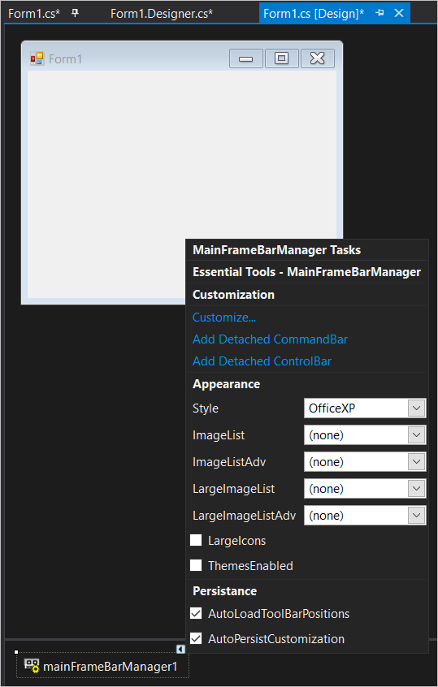

# State Persistence in Windows Forms Menu (Menus)

The menu control supports serialization persisting the state of the toolbars and menu items state whenever the application is being used. In this topic the serialization of menu control is discussed.

## Enabling state persistence

The menu control by default, enables the serialization and state persistence of the menu items. This can be done via the [`AutoLoadToolBarPositions`](https://help.syncfusion.com/cr/windowsforms/Syncfusion.Windows.Forms.Tools.XPMenus.MainFrameBarManager.html#Syncfusion_Windows_Forms_Tools_XPMenus_MainFrameBarManager_AutoLoadToolBarPositions) and [`AutoPersistCustomization`](https://help.syncfusion.com/cr/windowsforms/Syncfusion.Windows.Forms.Tools.XPMenus.MainFrameBarManager.html#Syncfusion_Windows_Forms_Tools_XPMenus_MainFrameBarManager_AutoLoadToolBarPositions). This can be done either via designer **Smart tag** options or through code.

The below image shows the serialization is being enabled via the designer

The below code snippet shows the enabling of toolbar state persistence and serialization of menu item state.





this.mainFrameBarManager1.AutoLoadToolBarPositions = true;
this.mainFrameBarManager1.AutoPersistCustomization = true;





Me.mainFrameBarManager1.AutoLoadToolBarPositions = True
Me.mainFrameBarManager1.AutoPersistCustomization = True





### Sample Location

The serialization feature is illustrated in this-example.
