# Theming in Windows Forms Menu (Menus)

In this section, the various themes supported in menu control is discussed. The required theme can be set via the [`Style`](https://help.syncfusion.com/cr/windowsforms/Syncfusion.Windows.Forms.Tools.XPMenus.BarManager.html#Syncfusion_Windows_Forms_Tools_XPMenus_BarManager_Style) property of the menu instance. The following are the list of applicable themes to menu control.

* Default theme
* Metro theme
* Office XP theme
* Office 2003 theme
* Office 2007 theme
* Office 2010 theme
* Office 2016 theme
* Visual Studio theme

## Default theme

The `Default` theme is applies the default styles to the visual components of the menu control. When this theme is applied the default color values can be modified based on the desired color values. The below code snippet shows the default theme is applied to the menu control.





this.mainFrameBarManager1.Style = Syncfusion.Windows.Forms.VisualStyle.Default;





Me.mainFrameBarManager1.Style = Syncfusion.Windows.Forms.VisualStyle.Default





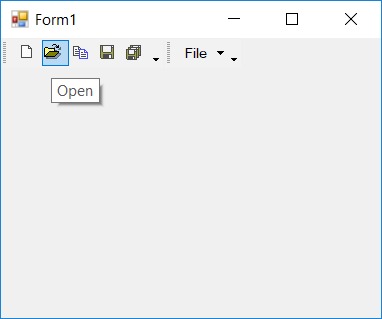

### Customizing default theme

The `Default` theme color values can be modified using the `MenuColors` class. This provides the set of available properties to customize the color values of the menu components. The below code snippet shows the default theme is applied and are modified with desired color values





this.mainFrameBarManager1.Style = Syncfusion.Windows.Forms.VisualStyle.Default;
MenuColors.CommandBarBackColor = Color.Yellow;





Me.mainFrameBarManager1.Style = Syncfusion.Windows.Forms.VisualStyle.Default
MenuColors.CommandBarBackColor = Color.Yellow





## Metro Theme

The menu control is applied with standard metro colors to provide rich look and feel of the control. The below code snippet shows the `Metro` theme is applied to the menu control.





this.mainFrameBarManager1.Style = Syncfusion.Windows.Forms.VisualStyle.Metro;





Me.mainFrameBarManager1.Style = Syncfusion.Windows.Forms.VisualStyle.Metro





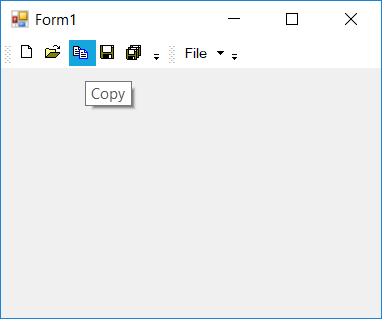

## Office XP theme

The `OfficeXP` theme is the default theme of the menu control. This applies the default color values to all the components of the control. The below code snippet shows the Office XP theme is applied to the menu control.





this.mainFrameBarManager1.Style = Syncfusion.Windows.Forms.VisualStyle.OfficeXP;





Me.mainFrameBarManager1.Style = Syncfusion.Windows.Forms.VisualStyle.OfficeXP





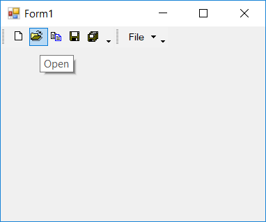

## Office 2003 theme

The menu control is rendered with Office-2003 like color values when `Office2003` theme is applied. The below code snippet shows the Office 2003 theme is applied to the menu control.





this.mainFrameBarManager1.Style = Syncfusion.Windows.Forms.VisualStyle.Office2003;





Me.mainFrameBarManager1.Style = Syncfusion.Windows.Forms.VisualStyle.Office2003





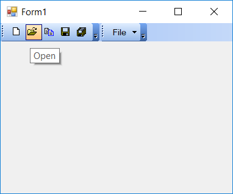

## Office 2007 theme

The menu control can be applied with 4 different Office 2007 color values. The color scheme can be selected via the `Office2007Theme` property is used. This color values can also be customized to required color scheme

* Blue
* Silver
* Black
* Managed

### Blue theme

The `Blue` color scheme is the default Office-2007 theme. The below code snippet shows the Office 2007 blue theme is applied to the menu control.





this.mainFrameBarManager1.Style = Syncfusion.Windows.Forms.VisualStyle.Office2007;
this.mainFrameBarManager1.Office2007Theme = Office2007Theme.Blue;





Me.mainFrameBarManager1.Style = Syncfusion.Windows.Forms.VisualStyle.Office2007
Me.mainFrameBarManager1.Office2007Theme = Office2007Theme.Blue





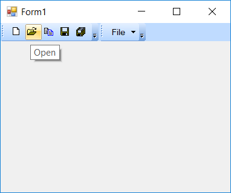

### Black theme

The `Black` color scheme applies black colored Office 2007 theme. The below code snippet shows the Office 2007 black theme is applied to the menu control.





this.mainFrameBarManager1.Style = Syncfusion.Windows.Forms.VisualStyle.Office2007;
this.mainFrameBarManager1.Office2007Theme = Office2007Theme.Black;





Me.mainFrameBarManager1.Style = Syncfusion.Windows.Forms.VisualStyle.Office2007
Me.mainFrameBarManager1.Office2007Theme = Office2007Theme.Black





### Silver theme

The `Silver` color scheme applies silver colored Office 2007 theme. The below code snippet shows the Office 2007 silver theme is applied to the menu control.





this.mainFrameBarManager1.Style = Syncfusion.Windows.Forms.VisualStyle.Office2007;
this.mainFrameBarManager1.Office2007Theme = Office2007Theme.Silver;





Me.mainFrameBarManager1.Style = Syncfusion.Windows.Forms.VisualStyle.Office2007
Me.mainFrameBarManager1.Office2007Theme = Office2007Theme.Silver





### Managed theme

The `Managed` color scheme applies with custom base color to the default Office colored theme. This custom base color is set via the `ApplyManagedColors` method in **Office2007Colors** class. The below code snippet shows the Office 2007 theme is applied to the menu control with red colored style.





this.mainFrameBarManager1.Style = Syncfusion.Windows.Forms.VisualStyle.Office2007;
this.mainFrameBarManager1.Office2007Theme = Office2007Theme.Managed;
Office2007Colors.ApplyManagedColors(this, Color.Red);





Me.mainFrameBarManager1.Style = Syncfusion.Windows.Forms.VisualStyle.Office2007
Me.mainFrameBarManager1.Office2007Theme = Office2007Theme.Managed
Office2007Colors.ApplyManagedColors(this, Color.Red)





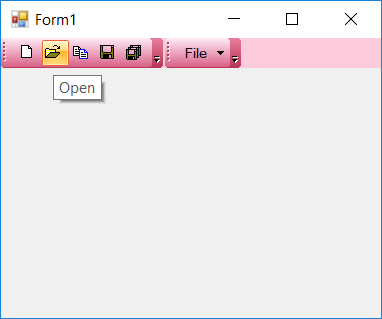

## Office 2007 outlook

The menu control is rendered with Office-2007 Outlook like color values when `Office2007Outlook` theme is applied. The below code snippet shows the Office 2007 Outlook theme is applied to the menu control.





this.mainFrameBarManager1.Style = Syncfusion.Windows.Forms.VisualStyle.Office2007Outlook;





Me.mainFrameBarManager1.Style = Syncfusion.Windows.Forms.VisualStyle.Office2007Outlook





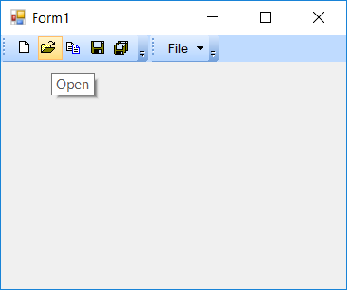

## Office 2010 theme

The menu control can be applied with 4 different Office 2010 color values. The color scheme can be selected via the `Office2010Theme` property is used. This color values can also be customized to required color scheme.

* Blue
* Silver
* Black
* Managed

### Blue theme

The `Blue` color scheme is the default Office-2010 theme. The below code snippet shows the Office 2010 blue theme is applied to the menu control.





this.mainFrameBarManager1.Style = Syncfusion.Windows.Forms.VisualStyle.Office2010;
this.mainFrameBarManager1.Office2010Theme = Office2010Theme.Blue;





Me.mainFrameBarManager1.Style = Syncfusion.Windows.Forms.VisualStyle.Office2010
Me.mainFrameBarManager1.Office2010Theme = Office2010Theme.Blue





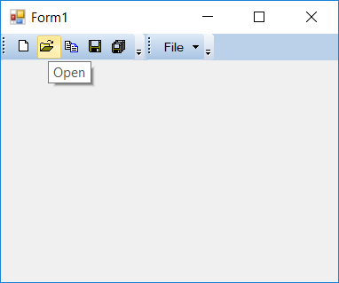

### Black theme

The `Black` color scheme applies black colored Office 2010 theme. The below code snippet shows the Office 2010 black theme is applied to the menu control.





this.mainFrameBarManager1.Style = Syncfusion.Windows.Forms.VisualStyle.Office2010;
this.mainFrameBarManager1.Office2010Theme = Office2010Theme.Black;





Me.mainFrameBarManager1.Style = Syncfusion.Windows.Forms.VisualStyle.Office2010
Me.mainFrameBarManager1.Office2010Theme = Office2010Theme.Black





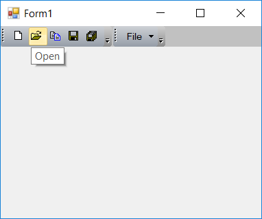

### Silver theme

The `Silver` color scheme applies silver colored Office 2010 theme. The below code snippet shows the Office 2010 silver theme is applied to the menu control.





this.mainFrameBarManager1.Style = Syncfusion.Windows.Forms.VisualStyle.Office2010;
this.mainFrameBarManager1.Office2010Theme = Office2010Theme.Silver;





Me.mainFrameBarManager1.Style = Syncfusion.Windows.Forms.VisualStyle.Office2010
Me.mainFrameBarManager1.Office2010Theme = Office2010Theme.Silver





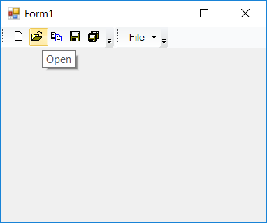

### Managed theme

The `Managed` color scheme applies with custom base color to the default Office colored theme. This custom base color is set via the `ApplyManagedColors` method in **Office2010Colors** class. The below code snippet shows the Office 2010 theme is applied to the menu control with brick colored style.





this.mainFrameBarManager1.Style = Syncfusion.Windows.Forms.VisualStyle.Office2010;
this.mainFrameBarManager1.Office2010Theme = Office2010Theme.Managed;
Office2010Colors.ApplyManagedColors(this, Color.Brick);





Me.mainFrameBarManager1.Style = Syncfusion.Windows.Forms.VisualStyle.Office2010
Me.mainFrameBarManager1.Office2010Theme = Office2010Theme.Managed
Office2010Colors.ApplyManagedColors(this, Color.Brick)





## Office 2016 theme

The menu control supports 4 distinct color styles for Office 2016 themes.

* Office 2016 Black
* Office 2016 White
* Office 2016 Colorful
* Office 2016 Dark-gray

### Office 2016 black

The `Office2016Black` applies with Office 2016 black colored styles to the menu control. The below code snippet shows the Office 2016 black theme is applied to the menu control.





this.mainFrameBarManager1.Style = Syncfusion.Windows.Forms.VisualStyle.Office2016Black;





Me.mainFrameBarManager1.Style = Syncfusion.Windows.Forms.VisualStyle.Office2016Black





### Office 2016 white

The `Office2016White` applies with Office 2016 white colored styles to the menu control. The below code snippet shows the Office 2016 white theme is applied to the menu control.





this.mainFrameBarManager1.Style = Syncfusion.Windows.Forms.VisualStyle.Office2016White;





Me.mainFrameBarManager1.Style = Syncfusion.Windows.Forms.VisualStyle.Office2016White





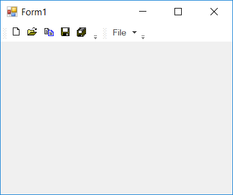

### Office 2016 colorful

The `Office2016Colorful` applies with Office 2016 mixed-color styles to the menu control. The below code snippet shows the Office 2016 colorful theme is applied to the menu control.





this.mainFrameBarManager1.Style = Syncfusion.Windows.Forms.VisualStyle.Office2016Colorful;





Me.mainFrameBarManager1.Style = Syncfusion.Windows.Forms.VisualStyle.Office2016Colorful





### Office 2016 dark gray

The `Office2016DarkGray` applies with Office 2016 dark gray colored styles to the menu control. The below code snippet shows the Office 2016 dark gray theme is applied to the menu control.





this.mainFrameBarManager1.Style = Syncfusion.Windows.Forms.VisualStyle.Office2016DarkGray;





Me.mainFrameBarManager1.Style = Syncfusion.Windows.Forms.VisualStyle.Office2016DarkGray





## Visual Studio theme

The menu control supports the VS-like color styles that are applied to the visual components of the menu control. The following are the VS-like theme applicable for menu control.

* VS2005
* VS2010

### VS2005 theme

The `VS2005` applies with VS 2005 like colored styles to the menu control components. The below code snippet shows the VS2005-theme is applied to the menu control.





this.mainFrameBarManager1.Style = Syncfusion.Windows.Forms.VisualStyle.VS2005;





Me.mainFrameBarManager1.Style = Syncfusion.Windows.Forms.VisualStyle.VS2005





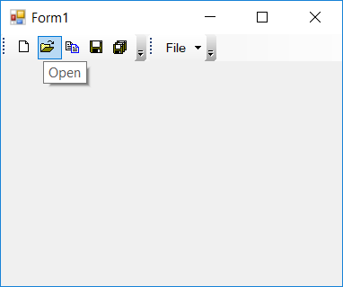

### VS2010 theme

The `VS2010` applies with VS 2010 like colored styles to the menu control components. The below code snippet shows the VS2010-theme is applied to the menu control.





this.mainFrameBarManager1.Style = Syncfusion.Windows.Forms.VisualStyle.VS2010;





Me.mainFrameBarManager1.Style = Syncfusion.Windows.Forms.VisualStyle.VS2010





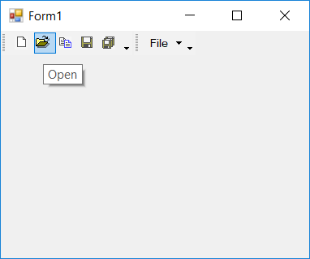
