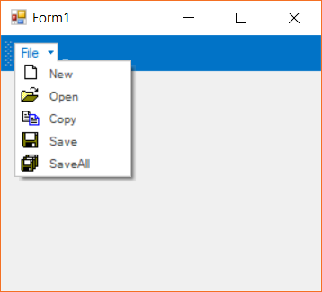
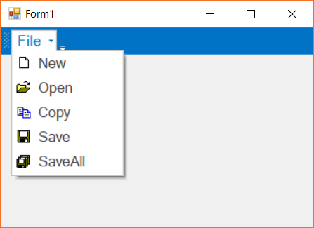
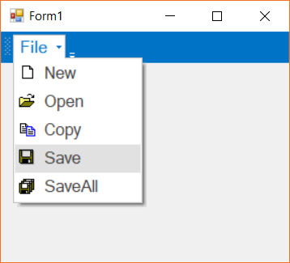

# Touch Support in Windows Forms Menu (Menus)

The menu control supports to touch mode to the menu items and other visual elements. The components are also scaled automatically to render the menu items. This can be done by using the [`EnableTouchMode`](https://help.syncfusion.com/cr/windowsforms/Syncfusion.Windows.Forms.Tools.XPMenus.BarManager.html#Syncfusion_Windows_Forms_Tools_XPMenus_BarManager_EnableTouchMode) property or the menu instance. The below code snippet shows the touch mode is being enabled in the menu.

By default, this property is set to `false`.





this.mainFrameBarManager1.EnableTouchMode = true;





Me.mainFrameBarManager1.EnableTouchMode = True





## Touch selection

When the property `EnableTouchMode` is set to `true`, menu items can be selected via general touch action. The below image shows the menu items are being selected with touch action.

## Context menu

Tap and holding on the menu bar or a menu item will display the corresponding context menu for the menu bar. The below screen shot shows the context menu is displayed when tap and hold on the main menu bar.

