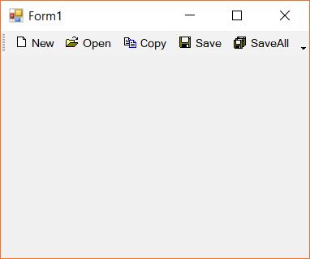
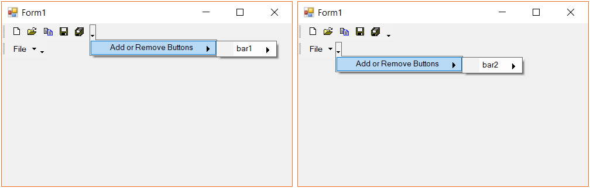

# Appearance Customization

In this section the appearance customization of the menu and child menu items is discussed.

## Customizing bar styles

The menu bar appearance can be customized with the usage scenario depending upon the menu items it holds. The following are the bar styles suppoterd in menu control.

* None
* AllowQuickCustomizing
* IsMainMenu
* MultiLine
* RotateWhenVertical
* Visible
* UseWholeRow
* DrawDragBorder
* IsStatusBar
* TextBelowImage

The enum value of `BarStyle` cam also be adjoined to represent the bar with combined applied styles. The below image shows the bar items are combined with the `Visible` value.

*Allow Quick Customizing*

*Draw drag-drop border*

*Main menu*

*Status bar*

The below code snippet shows the bar style is being applied with `IsMainMenu` style.





this.bar1.BarStyle = BarStyle.IsMainMenu | BarStyle.Visible;





Me.bar1.BarStyle = BarStyle.IsMainMenu | BarStyle.Visible





## Customizing paint styles

The menu items rendering mode can be customized with the `PaintStyle` property. The following modes are supported to customize the rendering mode.

* Default mode
* Text only mode
* Text only in menu mode
* Image and text mode

### Default mode

As the name indicated this is the default value of the paint style property. Images are tet are drawn only in the child-menus like drop down menu or from parent menu. Otherwise all the bar will be drawn only with its respective image.

The below image shows that the drop-down menu is rendered with both image and text where as the main menu items are rendered only with images.

### Text only mode

This mode ignores the images associated with the menu items. This applies only to the tool bar menu items. The below code snippet shows the menu item is being applied with `TextOnly` mode.





barItem1.PaintStyle = PaintStyle.TextOnly;





barItem1.PaintStyle = PaintStyle.TextOnly





### Text only in menu mode

The menu items can be represented as text only specific to the child-menu or drop down menu of the menu control. The below code snippet shows the menu items are applied with `TextOnlyInMenus` mode.





barItem1.PaintStyle = PaintStyle.TextOnlyInMenus;





barItem1.PaintStyle = PaintStyle.TextOnlyInMenus





### Image and text only mode

Both the image and text are applied to all the menu items either from main menu or child menu. The below code snippet shows the menu items are applied with `ImageAndText` mode.





barItem1.PaintStyle = PaintStyle.ImageAndText;





barItem1.PaintStyle = PaintStyle.ImageAndText





## Customizing customize dialog

The **Customize Dialog** style can be customized with required colors by using the `ForeColor`, `BackColor` and `Font` properties. The below code snippet shows the modified Customize dialog.





this.mainFrameBarManager1.CustomizationDialog.ForeColor = Color.Red;
this.mainFrameBarManager1.CustomizationDialog.BackColor = Color.Black;
this.mainFrameBarManager1.CustomizationDialog.Font = new Font("Times New Roman", 8.5f);





Me.mainFrameBarManager1.CustomizationDialog.ForeColor = Color.Red
Me.mainFrameBarManager1.CustomizationDialog.BackColor = Color.Black
this.mainFrameBarManager1.CustomizationDialog.Font = New Font("Times New Roman", 8.5f)





## Customizing menu items

The menu items of a tool bar in menu control can be customized. This can be done both design-time and on-demand initialization. This can be done by using the `EnableCustomizing` property. By default, this is enabled to promote on-demand customization. The below code shows the menu items customization is being disabled.





this.mainFrameBarManager1.EnableCustomizing = false;





Me.mainFrameBarManager1.EnableCustomizing = False





The above code could disable the customization to all the bars of the menu control collectively. In order to disable the customize option for a specific bar, the respective bar instance's `AllowCustomizing` property should be set to `false`. The below image shows the customization to _bar1_ is being disabled while _bar2_ is not.





this.bar1.AllowCustomizing = false;





Me.bar1.AllowCustomizing = False





