# Appearance Settings

This section discusses the below appearance related topics.

## Bar Styles

The BarStyle property of the bar object lets users customize certain behavior and look-and-feel of the toolbar, such as visibility, whether it should be drawn in multi-line mode or whether the toolbar should be treated like a status bar that always gets shown at the bottom of the form.

<table>
<tr>
<th>
Bar.BarStyle Property</th><th>
Description</th></tr>
<tr>
<td>
AllowQuickCustomizing</td><td>
This will draw an arrow button to the right side of the toolbar that will allow the user to drop down a menu from which they can select hidden items, add or remove buttons and invoke Customize dialog. {{ '_Note:_' | markdownify }} This is effective only with IsMainMenu unchecked.</td></tr>
<tr>
<td>
DrawDragBorder</td><td>
Allows the user to drag the bar around, to move it within dock border, dock to different border or float. To move the bar within the form set DrawDragBorder to true. If this is not set, user cannot to move the bar.</td></tr>
<tr>
<td>
Multiline</td><td>
Wraps the bar into multiple rows when there is not enough space in a row while docked or the user resizes the floating bars.</td></tr>
<tr>
<td>
IsMainMenu</td><td>
When this option is checked, it treats the bar as the main menu and forces the bar to occupy the whole row irrespective of multiline settings. > {{ '_Note: If this option is selected for more one bar, the first setting will be effective and the rest will be ignored._' | markdownify }}</td></tr>
<tr>
<td>
RotateWhenVertical</td><td>
The text in the bars will always be drawn as horizontal irrespective of docked position of a bar. To change this behavior RotateWhenVertical should be set to true.</td></tr>
<tr>
<td>
TextBelowImage</td><td>
Specifies whether the text in the bar should be drawn below the images in the toolbar.</td></tr>
<tr>
<td>
UseWholeRow</td><td>
Forces the bar to occupy the full row when docked to Form's border.</td></tr>
<tr>
<td>
Visible</td><td>
Hides / shows a bar.</td></tr>
</table>



this.bar1.BarStyle = ((Syncfusion.Windows.Forms.Tools.XPMenus.BarStyle)((((((((Syncfusion.Windows.Forms.Tools.XPMenus.BarStyle.AllowQuickCustomizing | Syncfusion.Windows.Forms.Tools.XPMenus.BarStyle.IsMainMenu)| Syncfusion.Windows.Forms.Tools.XPMenus.BarStyle.MultiLine) 

| Syncfusion.Windows.Forms.Tools.XPMenus.BarStyle.RotateWhenVertical)| Syncfusion.Windows.Forms.Tools.XPMenus.BarStyle.Visible) 

| Syncfusion.Windows.Forms.Tools.XPMenus.BarStyle.UseWholeRow)| Syncfusion.Windows.Forms.Tools.XPMenus.BarStyle.DrawDragBorder) 

| Syncfusion.Windows.Forms.Tools.XPMenus.BarStyle.TextBelowImage)));




Me.bar1.BarStyle = (CType((((((((Syncfusion.Windows.Forms.Tools.XPMenus.BarStyle.AllowQuickCustomizing Or Syncfusion.Windows.Forms.Tools.XPMenus.BarStyle.IsMainMenu) Or Syncfusion.Windows.Forms.Tools.XPMenus.BarStyle.MultiLine) Or Syncfusion.Windows.Forms.Tools.XPMenus.BarStyle.RotateWhenVertical) Or Syncfusion.Windows.Forms.Tools.XPMenus.BarStyle.Visible) Or Syncfusion.Windows.Forms.Tools.XPMenus.BarStyle.UseWholeRow) Or Syncfusion.Windows.Forms.Tools.XPMenus.BarStyle.DrawDragBorder) Or Syncfusion.Windows.Forms.Tools.XPMenus.BarStyle.TextBelowImage), Syncfusion.Windows.Forms.Tools.XPMenus.BarStyle))


## Colors for Menus and Toolbars

Essential Studio comes with three classes to provide custom colors for the Menus. 

* MenuColors - The Syncfusion.Windows.Forms.Tools.XPMenus.MenuColors class is used when the Visual Styles is Default. 
* Office2003Colors - The Syncfusion.Windows.Forms.Office2003Colors class is used when the Visual Styles is set as Office2003.
* Office2007Colors - The Syncfusion.Windows.Forms.Office2007Colors class is used when the Visual Styles is set as Office2007.

### MenuColors

The Syncfusion.Windows.Forms.Tools.XPMenus.MenuColors class includes static properties that allow you to change them to get custom background colors for the different portions of the menus and toolbars. Some of the properties include MainMenuBackColor, CommandBarBackColor and StatusBarBackColor.

The following methods of MenuColors class can be invoked to set the custom color.

<table>
<tr>
<th>
MenuColors</th><th>
Description</th></tr>
<tr>
<td>
CommandBarBackColor</td><td>
Gets / sets the background color for a toolbar / command bar.</td></tr>
<tr>
<td>
CheckedSelColor</td><td>
Sets the selected color for a checked menu item.</td></tr>
<tr>
<td>
DisabledMenuTextColorBase</td><td>
Gets / sets the text color base for the text in the disabled menu items.</td></tr>
<tr>
<td>
DisabledToolbarItemTextColorBase</td><td>
Gets / sets the text color base for the text in the disabled toolbar items.</td></tr>
<tr>
<td>
DropDownBorderColor</td><td>
Gets / sets the border color for a drop-down menu.</td></tr>
<tr>
<td>
ExpandedMenuStripBackColor</td><td>
Gets / sets the Back color for the expanded, left-aligned menu strip region. This is the region you see when a partial menu gets expanded to show all the menu items.</td></tr>
<tr>
<td>
FloatingCommandBarCaptionColor</td><td>
Gets / sets the Caption background color for a floating toolbar / command bar.</td></tr>
<tr>
<td>
InactiveItemAlphaBlendFactor</td><td>
Gets / sets the alpha-blend factor to use to shade the inactive menu item's icons. (255 for no alpha-blending; 0 will completely hide the item).</td></tr>
<tr>
<td>
MainMenuBackColor</td><td>
Gets / sets the background color for the main-menu bar.</td></tr>
<tr>
<td>
MenuActiveTextColor</td><td>
Gets / sets the active text color of the menu and toolbar items.</td></tr>
<tr>
<td>
MenuBGColor</td><td>
Sets the background color for a drop down menu.</td></tr>
<tr>
<td>
MenuLeftStripColor</td><td>
Gets / sets the color for the left aligned strip in a drop-down menu where images and check boxes are shown.</td></tr>
<tr>
<td>
MenuTextColor</td><td>
Gets / sets the text color of the menu and toolbar items.</td></tr>
<tr>
<td>
PressedSelColor</td><td>
Gets / sets the selected-pressed color for a menu item in a toolbar.</td></tr>
<tr>
<td>
SelBorderColor</td><td>
Gets / sets the border color for a selected menu item in a toolbar.</td></tr>
<tr>
<td>
SelColor</td><td>
Gets / sets the selected color for a menu item in a toolbar.</td></tr>
<tr>
<td>
SelTextColor</td><td>
Gets / sets the selected text color for an item in a toolbar.</td></tr>
<tr>
<td>
StatusBarBackColor</td><td>
Gets / sets the background color for the Status Bar.</td></tr>
</table>

Add the following code snippet to get Custom colors for the menu bar items.



//Set the background color for a drop down menu

MenuColors.MenuBGColor = Color.Pink;

//Set border color for a drop down menu

MenuColors.DropDownBorderColor = Color.Aqua;




'Set the background color for a drop down menu

Private MenuColors.MenuBGColor = Color.Pink

'Set border color for a drop down menu

Private MenuColors.DropDownBorderColor = Color.Aqua


 

A sample which demonstrates setting colors for Menus using MenuColors class is available in the below sample installation path.

…\_My Documents\Syncfusion\EssentialStudio\Version Number\Windows\Tools.Windows\Samples\Advanced Editor Functions\ActionGroupingDemo_

### Office2003Colors

The following table lists the members exposed by Office2003Colors class.

<table>
<tr>
<th>
Colors</th><th>
Description</th></tr>
<tr>
<td>
CheckedColor</td><td>
Gets / sets the background color of a check box in the drop-down menu margin or a checked item in the toolbar.</td></tr>
<tr>
<td>
CheckedSelColor</td><td>
Gets / sets the background color of a selected check box in the drop-down menu margin or a checked item in the toolbar.</td></tr>
<tr>
<td>
CommandBarDropDownColorDark</td><td>
Gets or sets the dark-gradient color of quick customize dropdown button.</td></tr>
<tr>
<td>
CommandBarDropDownColorLight</td><td>
Gets or sets the light-gradient color of quick customize dropdown button.</td></tr>
<tr>
<td>
ControlBorderColorDark</td><td>
Gets or sets the dark-gradient border color of bars.</td></tr>
<tr>
<td>
ControlBorderColorLight</td><td>
Gets or sets the light-gradient border color of bars.</td></tr>
<tr>
<td>
ControlGripperColor</td><td>
Gets or sets the color of the gripper.</td></tr>
<tr>
<td>
DockBarColorDark</td><td>
Gets or sets the left-gradient color of docked bars.</td></tr>
<tr>
<td>
DockBarColorLight</td><td>
Gets or sets the right-gradient color of docked bars.</td></tr>
<tr>
<td>
DropDownBorderColor</td><td>
Gets / sets the border color of a drop-down menu.</td></tr>
<tr>
<td>
FloatingCommandBarCaptionColor</td><td>
Gets or sets the caption background color of floating bars.</td></tr>
<tr>
<td>
FloatingCommandBarItemPressedColor</td><td>
Gets or sets the color for the floating command bar item which is pressed.</td></tr>
<tr>
<td>
GroupBarHeaderColorDark</td><td>
Gets or sets the dark-gradient color of groupBar header.</td></tr>
<tr>
<td>
GroupBarHeaderColorLight</td><td>
Gets or sets the light-gradient color of groupBar header.</td></tr>
<tr>
<td>
GroupBarHighlightColorDark</td><td>
Gets or sets the dark-gradient highlight color of groupBarItem.</td></tr>
<tr>
<td>
GroupBarHighlightColorLight</td><td>
Gets or sets the light-gradient highlight color of groupBarItem.</td></tr>
<tr>
<td>
GroupBarItemTextColor</td><td>
Gets / sets the color of the text in a GroupBar item.</td></tr>
<tr>
<td>
GroupBarItemTextSelectedHighlightColor</td><td>
Gets / sets the highlight color to be used for the selected text of the GroupBar item.</td></tr>
<tr>
<td>
GroupBarSelectedColorDark</td><td>
Gets or sets the dark-gradient color of selected groupBarItem.</td></tr>
<tr>
<td>
GroupBarSelectedColorLight</td><td>
Gets or sets the light-gradient color of selected groupBarItem.</td></tr>
<tr>
<td>
GroupBarSelectedHighlightColorDark</td><td>
Gets or sets the dark-gradient highlight color of selected groupBarItem.</td></tr>
<tr>
<td>
GroupBarSelectedHighlightColorLight</td><td>
Gets or sets the light-gradient highlight color of selected groupBarItem.</td></tr>
<tr>
<td>
MenuExpandedItemsMarginColorLeft</td><td>
Gets / sets the left-gradient color of the drop-down menu margin of the expanded menu items.</td></tr>
<tr>
<td>
MenuExpandedItemsMarginColorRight</td><td>
Gets / sets the right-gradient color of the drop-down menu margin of the expanded menu items.</td></tr>
<tr>
<td>
MenuItemHotColorDark</td><td>
Gets or sets the dark-gradient color of menu item for hot-tracking.</td></tr>
<tr>
<td>
MenuItemHotColorLight</td><td>
Gets or sets the light-gradient color of menu item for hot-tracking.</td></tr>
<tr>
<td>
MenuItemPressedColorDark</td><td>
Gets or sets the dark-gradient color of quick customize button when it is pressed.</td></tr>
<tr>
<td>
MenuItemPressedColorLight</td><td>
Gets or sets the light-gradient color of quick customize button when it is pressed.</td></tr>
<tr>
<td>
MenuMarginColorDark</td><td>
Gets / sets the right-gradient color of the drop-down menu margin.</td></tr>
<tr>
<td>
MenuMarginColorLight</td><td>
Gets / sets the left-gradient color of the drop-down menu margin.</td></tr>
<tr>
<td>
PressedSelColor</td><td>
Gets / sets the pressed-selected color for a menu item in a toolbar.</td></tr>
<tr>
<td>
SelBorderColor</td><td>
Gets / sets the border color of a menu item selection in the drop-down menus and toolbars.</td></tr>
<tr>
<td>
SelColor</td><td>
Gets / sets the selected color for a menu item in a drop-down menu.</td></tr>
<tr>
<td>
SeparatorColor</td><td>
Gets / sets the color of the separator line between the bar items.</td></tr>
</table>

### Office2007 Colors

The following table lists the members exposed by Office2007Colors class.

<table>
<tr>
<th>
Color</th><th>
Description</th></tr>
<tr>
<td>
BarItemCheckBorderColor</td><td>
Gets / sets color for the checked bar item.</td></tr>
<tr>
<td>
BarItemCheckDarkColor </td><td>
Gets / sets dark color for background of the checked bar item.</td></tr>
<tr>
<td>
BarItemCheckFlashColor </td><td>
Gets / sets color for flash of the checked bar item.</td></tr>
<tr>
<td>
BarItemCheckLightColor </td><td>
Gets / sets light color for background of the checked bar item.</td></tr>
<tr>
<td>
Bar itemHighlightBorderColor </td><td>
Gets / sets color for highlighted border of the BarItem.</td></tr>
<tr>
<td>
BarItemPressBorderColor </td><td>
Gets / sets color for pressed border of the BarItem.</td></tr>
<tr>
<td>
BarItemPressFlashColor</td><td>
Gets or sets color for flash of the pressed BarItem.</td></tr>
<tr>
<td>
BarItemPressDarkColor </td><td>
Gets or sets dark color for background of the pressed BarItem.</td></tr>
<tr>
<td>
BarItemPressLightColor </td><td>
Gets or sets light color for background of the pressed BarItem.</td></tr>
<tr>
<td>
BarItemSelectFlashColor</td><td>
Gets or sets color for flash of the selected BarItem.</td></tr>
<tr>
<td>
BarItemSeparatorColor</td><td>
Gets or sets color for separator line of the CommandBar.</td></tr>
<tr>
<td>
ComboButtonBorder </td><td>
Gets or sets border color for ComboButton of the ComboBoxBarItem.</td></tr>
<tr>
<td>
ComboButtonDarkColor</td><td>
Gets or sets dark color for ComboButton of the ComboBoxBarItem.</td></tr>
<tr>
<td>
ComboButtonLightColor </td><td>
Gets or sets light color for ComboButton of the ComboBoxBarItem.</td></tr>
<tr>
<td>
ComboButtonHighlightBorder  </td><td>
Gets or sets border color for ComboButton of the highlighted ComboBoxBarItem.</td></tr>
<tr>
<td>
ComboButtonHighlightDarkColor  </td><td>
Gets or sets dark color for ComboButton of the highlighted ComboBoxBarItem.</td></tr>
<tr>
<td>
ComboButtonHighlightLightColor  </td><td>
Gets or sets light color for ComboButton of the highlighted ComboBoxBarItem.</td></tr>
<tr>
<td>
ComboButtonPressBorder  </td><td>
Gets or sets border color for ComboButton of the pressed ComboBoxBarItem.</td></tr>
<tr>
<td>
ComboButtonPressDarkColor </td><td>
Gets or sets dark color for ComboButton of the pressed ComboBoxBarItem.</td></tr>
<tr>
<td>
ComboButtonPressLightColor </td><td>
Gets or sets light color for ComboButton of the pressed ComboBoxBarItem.</td></tr>
<tr>
<td>
CommandBarBorderColor</td><td>
Gets or sets color for border of the CommandBar.</td></tr>
<tr>
<td>
CommandBarDarkColor </td><td>
Gets or sets dark color of the CommandBar.</td></tr>
<tr>
<td>
CommandBarLightColor </td><td>
Gets or sets light color of the CommandBar.</td></tr>
<tr>
<td>
DockBarBackColor </td><td>
Gets or sets background color of the DockBar or the main menu.</td></tr>
<tr>
<td>
DropDownBarItemBorderColor</td><td>
Gets or sets color for border of the DropDownBarItem.</td></tr>
<tr>
<td>
DropDownBarItemDarkColor</td><td>
Gets or sets dark color for background of the DropDownBarItem.</td></tr>
<tr>
<td>
DropDownBarItemLightColor</td><td>
Gets or sets light color for background of the DropDownBarItem.</td></tr>
<tr>
<td>
DropDownDarkColor</td><td>
Gets or sets dark color for dropdown button of the CommandBar.</td></tr>
<tr>
<td>
DropDownHighlightDarkColor</td><td>
Gets or sets dark color for highlight dropdown button of the CommandBar.</td></tr>
<tr>
<td>
DropDownHighlightLightColor</td><td>
Gets or sets light color for highlight dropdown button of the CommandBar.</td></tr>
<tr>
<td>
DropDownLightColor</td><td>
Gets or sets light color for dropdown button of the CommandBar.</td></tr>
<tr>
<td>
DropDownPressedDarkColor</td><td>
Gets or sets dark color for pressed dropdown button of the CommandBar.  </td></tr>
<tr>
<td>
DropDownPressedLightColor</td><td>
Gets or sets light color for pressed dropdown button of the CommandBar. </td></tr>
<tr>
<td>
FloatBackgroundColor</td><td>
Gets or sets background color of the floating CommandBar.</td></tr>
<tr>
<td>
FloatBorderColor</td><td>
Gets or sets color for border of the floating CommandBar.</td></tr>
<tr>
<td>
FloatCaptionColor</td><td>
Gets or sets color for caption text of the floating CommandBar.</td></tr>
<tr>
<td>
FloatCommandBarDarkColor</td><td>
Gets or sets dark color of the floating CommandBar.</td></tr>
<tr>
<td>
FloatCommandBarLightColor</td><td>
Gets or sets light color of the floating CommandBar.</td></tr>
<tr>
<td>
FloatHighlightButtonBorderColor</td><td>
Gets or sets border color for highlighted dropdown button of the floating CommandBar.</td></tr>
<tr>
<td>
FloatHighlightButtonColor</td><td>
Gets or sets color for highlighted dropdown button of the floating CommandBar.</td></tr>
<tr>
<td>
FloatLightBorderColor</td><td>
Gets or sets color for light border of the floating CommandBar.</td></tr>
<tr>
<td>
FloatPressButtonBorderColor</td><td>
Gets or sets border color for pressed dropdown button of the floating CommandBar.</td></tr>
<tr>
<td>
FloatPressButtonColor</td><td>
Gets or sets color for pressed dropdown button of the floating CommandBar.</td></tr>
<tr>
<td>
FloatPressCloseButtonButtonColor </td><td>
Gets or sets border color for pressed close button of the floating CommandBar.</td></tr>
<tr>
<td>
FloatPressCloseButtonColor </td><td>
Gets or sets color for pressed close button of the floating CommandBar. </td></tr>
<tr>
<td>
GroupBarBorderColor </td><td>
BorderColor of the GroupBar.</td></tr>
<tr>
<td>
GroupBarHeaderColorDark </td><td>
Dark color of the GroupBarHeader.</td></tr>
<tr>
<td>
GroupBarHeaderColorLight </td><td>
Light color of the GroupBarHeader.</td></tr>
<tr>
<td>
GroupBarHeaderTextColor </td><td>
Text color of the GroupBar header text.</td></tr>
<tr>
<td>
GroupBarHighlightColorDark </td><td>
Gets or Sets dark color for groupbar item when it is highlighted.</td></tr>
<tr>
<td>
GroupBarHighlightColorLight  </td><td>
Gets or Sets light color of groupbar item when it is highlighted.</td></tr>
<tr>
<td>
GroupBarItemColorDark </td><td>
Color of groupBar item.</td></tr>
<tr>
<td>
GroupBarItemColorLight  </td><td>
Color of groupBar item (Top half).</td></tr>
<tr>
<td>
GroupBarItemTextColor</td><td>
Text color of the groupbar item.</td></tr>
<tr>
<td>
GroupBarItemSelectedColorDark</td><td>
Selected Item color (Top gradient).</td></tr>
<tr>
<td>
GroupBarItemSelectedColorLight </td><td>
Selected Item color (Bottom gradient).</td></tr>
<tr>
<td>
GroupBarItemSelectedHighlightColorDark  </td><td>
Selected Item Color (Top gradient).</td></tr>
<tr>
<td>
GroupBarItemSelectedHighlightColorLight </td><td>
Selected Item Color (Bottom gradient).</td></tr>
<tr>
<td>
GroupBarSplitterColorDark </td><td>
Color of groupBar splitter.</td></tr>
<tr>
<td>
GroupBarSplitterColorLight </td><td>
Color of groupBar splitter.</td></tr>
<tr>
<td>
MenuBackground</td><td>
Gets or sets the background color of the menu.</td></tr>
<tr>
<td>
MenuDropDownBorderColor </td><td>
Gets or sets the color for border of the menu.</td></tr>
<tr>
<td>
MenuCheckedBorderColor </td><td>
Gets or sets the color for border check mark of the menu.</td></tr>
<tr>
<td>
MenuCheckedColor  </td><td>
Gets or sets the color for check mark of the menu.</td></tr>
<tr>
<td>
MenuCheckedFillColor </td><td>
Gets or sets the background color for check mark of the menu.</td></tr>
<tr>
<td>
MenuColumnColor </td><td>
Gets or sets the dark color for column of the menu.</td></tr>
<tr>
<td>
MenuColumnSeparatorColor  </td><td>
Gets or sets the separator color for column of the menu.</td></tr>
<tr>
<td>
MenuComboButtonArrowColor </td><td>
Gets or sets the color for arrow ComboButton of the menu.</td></tr>
<tr>
<td>
MenuComboButtonHighlightDarkColor </td><td>
Gets or sets the dark color for highlighted ComboButton of the menu.</td></tr>
<tr>
<td>
MenuComboButtonHighlightDarkColor  </td><td>
Gets or sets the light color for highlighted ComboButton of the menu.</td></tr>
<tr>
<td>
MenuComboButtonPushed1Color </td><td>
Pressed color of combo button in menu dropdown.</td></tr>
<tr>
<td>
MenuComboButtonPushed2Color </td><td>
Color of combo button in menu dropdown (Top half).</td></tr>
<tr>
<td>
MenuComboButtonPushed3Color </td><td>
Color of combo button in menu dropdown (Middle).</td></tr>
<tr>
<td>
MenuComboButtonPushed4Color </td><td>
Color of combo button in menu dropdown (Bottom half).</td></tr>
<tr>
<td>
MenuItemArrowDarkColor </td><td>
Arrow button dark color of submenu parent / dropdown barItem.</td></tr>
<tr>
<td>
MenuItemArrowLightColor </td><td>
Arrow button light color of submenu parent / dropdown barItem.</td></tr>
<tr>
<td>
MenuItemBorderColor </td><td>
Gets or sets the border color for highlighted item of the menu.</td></tr>
<tr>
<td>
MenuItemDarkColor</td><td>
Gets or sets the dark color for highlighted item of the menu.</td></tr>
<tr>
<td>
MenuItemLightColor </td><td>
Gets or sets the light color for highlighted item of the menu.</td></tr>
<tr>
<td>
MenuSeparatorColor </td><td>
Gets or sets the color for separator of the menu.</td></tr>
<tr>
<td>
MenuTextBoxBackColor </td><td>
Gets or sets the background color for TextBox item of the menu.</td></tr>
<tr>
<td>
MenuTextBoxBorderColor </td><td>
Gets or sets the border color for TextBox item of the menu.</td></tr>
<tr>
<td>
TextBarItemBackColor </td><td>
Gets or sets back color for the TextBoxBarItem.</td></tr>
<tr>
<td>
TextBarItemBorderColor</td><td>
Gets or sets color for border of the TextBoxBarItem.</td></tr>
<tr>
<td>
TextBarItemBorderHighlightColor </td><td>
Gets or sets color for border of the highlight TextBoxBarItem.</td></tr>
</table>

A sample which demonstrates setting colors for Menus using Office2007Colors class is available in the below sample installation path.

…\_My Documents\Syncfusion\EssentialStudio\Version Number\Windows\Tools.Windows\Samples\Advanced Editor Functions\ActionGroupingDemo_

## Visual Styles

The MainFrameBarManager control for Windows Forms Supports for below listed Visual Styles. It can easily modify the look using the built-in visual styles.

•	Default

•	Office2007

•	Office2007Outlook

•	Office2010

•	Metro

•	Office2016Colorful

•	Office2016DarkGray

•	Office2016Black

•	Office2016White

**Default**

This option is used to set the Default theme.

#####  Code Sample





// Default

this.MainFrameBarManager1.Style = Syncfusion.Windows.Forms.VisualStyle.Default;





' Default

Me.MainFrameBarManager1.Style = Syncfusion.Windows.Forms.VisualStyle.Default





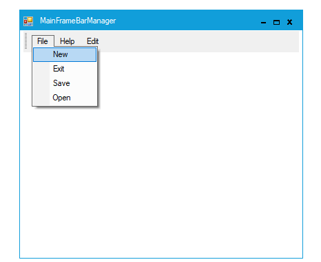 

**Office2007**

This option helps to set the Office2007 theme.

#####  Code Sample





// office2007

this.mainFrameBarManager1.Style = Syncfusion.Windows.Forms.VisualStyle.Office2007





' office2007

Me.MainFrameBarManager1.Style = Syncfusion.Windows.Forms.VisualStyle.office2007





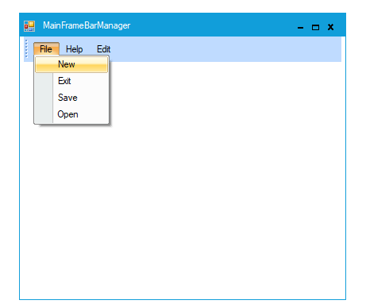 

Office2007 Theme also allows to specify the different color schemes. They can be Blue, Silver, Black and Managed.

**Blue**

This option helps to set the Blue color scheme of Office2007 Theme.

#####  Code Sample





// Office2007Theme.Blue

this.mainFrameBarManager1.Style = Syncfusion.Windows.Forms.VisualStyle.Office2007;

this.mainFrameBarManager1.Office2007Theme = Syncfusion.Windows.Forms.Office2007Theme.Blue;





' Office2007Theme.Blue

Me.mainFrameBarManager1.Style = Syncfusion.Windows.Forms.VisualStyle.Office2007

Me.mainFrameBarManager1.Office2007Theme = Syncfusion.Windows.Forms.Office2007Theme.Blue





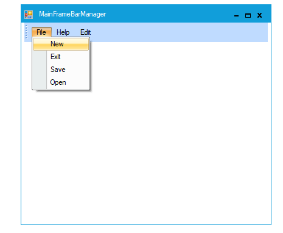 

**Black**

This option helps to set the Black color scheme of Office2007 Theme.

#####  Code Sample





// Office2007Theme.Black

this.mainFrameBarManager1.Style = Syncfusion.Windows.Forms.VisualStyle.Office2007;

this.mainFrameBarManager1.Office2007Theme = Syncfusion.Windows.Forms.Office2007Theme.Black;





'Office2007Theme.Black

Me.mainFrameBarManager1.Style = Syncfusion.Windows.Forms.VisualStyle.Office2007

Me.mainFrameBarManager1.Office2007Theme = Syncfusion.Windows.Forms.Office2007Theme.Black





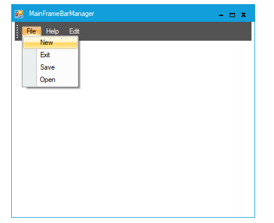 

**Silver**

This option helps to set the silver color scheme of Office2007 Theme.

#####  Code Sample





// Office2007ThemeSilver

this.mainFrameBarManager1.Style = Syncfusion.Windows.Forms.VisualStyle.Office2007;

this.mainFrameBarManager1.Office2007Theme = Syncfusion.Windows.Forms.Office2007Theme.Silver;





‘ Office2007ThemeSilver

Me.mainFrameBarManager1.Style = Syncfusion.Windows.Forms.VisualStyle.Office2007

Me.mainFrameBarManager1.Office2007Theme =Syncfusion.Windows.Forms.Office2007Theme.Silver





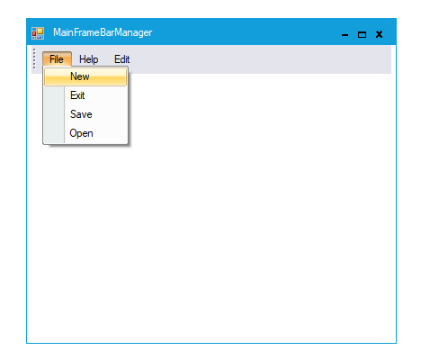 

**Managed**

This option helps to apply the custom colors to the MainFrameBarManager by setting Office2007Theme to **Managed** and specifying the custom color through the ApplyManagedColors method as follows.

#####  Code Sample





//Managed

this.mainFrameBarManager1.Style = Syncfusion.Windows.Forms.VisualStyle.Office2007;

this.mainFrameBarManager1.Office2007Theme = Syncfusion.Windows.Forms.Office2007Theme.Managed;

Office2007Colors.ApplyManagedColors(this, Color.Crimson);;





'Managed

Me.mainFrameBarManager1.Style =Syncfusion.Windows.Forms.VisualStyle.Office2007

Me.mainFrameBarManager1.Office2007Theme = Syncfusion.Windows.Forms.Office2007Theme.Managed

Syncfusion.Windows.Forms.Office2007Colors.ApplyManagedColors(Me, Color.Crimson)





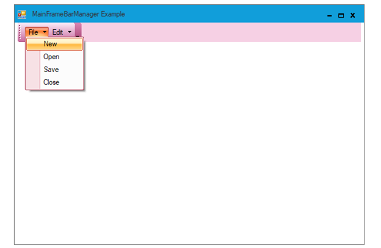 

**Office2007Outlook**

This option helps to set the Office2007 Outlook theme.

#####  Code Sample





// Outlook2007

this.mainFrameBarManager1.Style = Syncfusion.Windows.Forms.VisualStyle.Office2007Outlook;





'Outlook2007

Me.mainFrameBarManager1.Style = Syncfusion.Windows.Forms.VisualStyle.Office2007Outlook





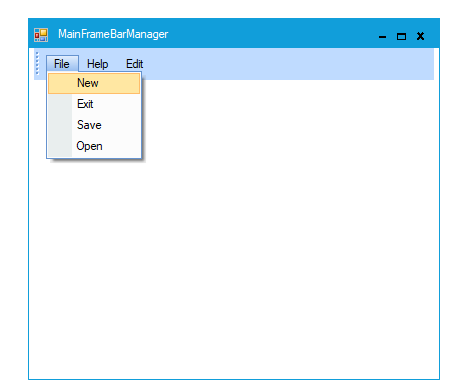 

**Office2010**

This option helps to set the Office2010 theme.

#####  Code Sample





// Office2010

this.mainFrameBarManager1.Style = Syncfusion.Windows.Forms.VisualStyle.Office2010;





'Office2010

 Me.mainFrameBarManager1.Style = Syncfusion.Windows.Forms.VisualStyle.Office2010





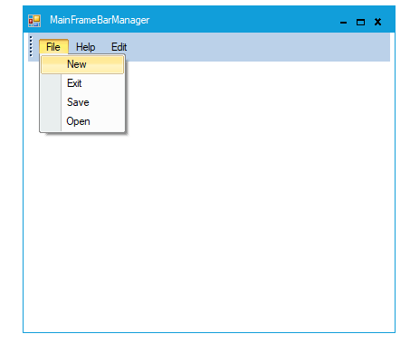 

You can also specify the different color schemes for Office 2010 visual styles. They can be Blue, Silver, Black and managed.

**Blue**

This option helps to set the Blue color scheme of Office2010 Theme.

#####  Code Sample





// Office2010Theme.Blue

this.mainFrameBarManager1.Style = Syncfusion.Windows.Forms.VisualStyle.Office2010;
this.mainFrameBarManager1.Office2010Theme = Syncfusion.Windows.Forms.Office2010Theme.Blue;





'Office2010Theme.Blue

Me.mainFrameBarManager1.Style = Syncfusion.Windows.Forms.VisualStyle.Office2010
Me.mainFrameBarManager1.Office2010Theme = Syncfusion.Windows.Forms.Office2010Theme.Blue





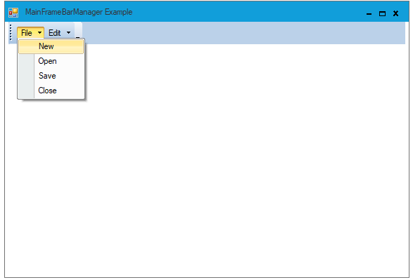 

**Black**

This option helps to set the Black color scheme of Office2010 Theme.

#####  Code Sample

% tabs %}



/// Office2010Theme.Black

this.mainFrameBarManager1.Style = Syncfusion.Windows.Forms.VisualStyle.Office2010;
this.mainFrameBarManager1.Office2010Theme = Syncfusion.Windows.Forms.Office2010Theme.Black;





'Office2010Theme.Black

Me.mainFrameBarManager1.Style = Syncfusion.Windows.Forms.VisualStyle.Office2010
Me.mainFrameBarManager1.Office2010Theme .= Syncfusion.Windows.Forms.Office2010Theme.Black





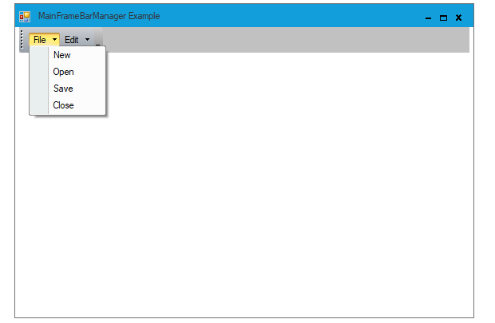 

**Silver**

This option helps to set the silver color scheme of Office2010 Theme.

#####  Code Sample

% tabs %}



// Office2007ThemeSilver

this.mainFrameBarManager1.Style = Syncfusion.Windows.Forms.VisualStyle.Office2010;
this.mainFrameBarManager1.Office2010Theme = Syncfusion.Windows.Forms.Office2010Theme.Silver;





' Office2007ThemeSilver

Me.mainFrameBarManager1.Style = Syncfusion.Windows.Forms.VisualStyle.Office2010
Me.mainFrameBarManager1.Office2010Theme = Syncfusion.Windows.Forms.Office2010Theme.Silver





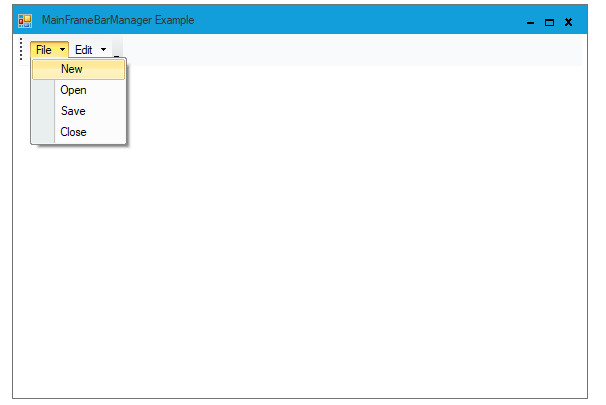 

**Managed**

This option helps to apply the custom colors to the MainFrameBarManager by setting Office2010Theme to **Managed** and specifying the custom color through the ApplyManagedColors method as follows.

#####  Code Sample

% tabs %}



//Managed

this.mainFrameBarManager1.Style = Syncfusion.Windows.Forms.VisualStyle.Office2010;
this.mainFrameBarManager1.Office2010Theme = Syncfusion.Windows.Forms.Office2010Theme.Managed;
Syncfusion.Windows.Forms.Office2010Colors.ApplyManagedColors(this, Color.Red);





'Managed

Me.mainFrameBarManager1.Style = Syncfusion.Windows.Forms.VisualStyle.Office2010
Me.mainFrameBarManager1.Office2010Theme = Syncfusion.Windows.Forms.Office2010Theme.Managed
Syncfusion.Windows.Forms.Office2010Colors.ApplyManagedColors(Me, Color.Red)





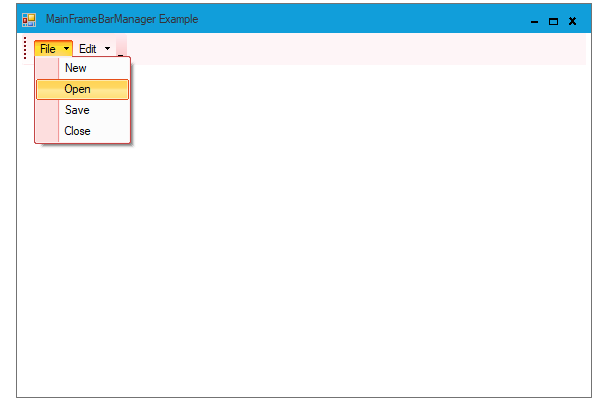

**Metro**

This option helps to set the Metro theme.

#####  Code Sample





//Metro

this.mainFrameBarManager1.Style = Syncfusion.Windows.Forms.VisualStyle.Metro;





'Metro

Me.mainFrameBarManager1.Style = Syncfusion.Windows.Forms.VisualStyle.Metro





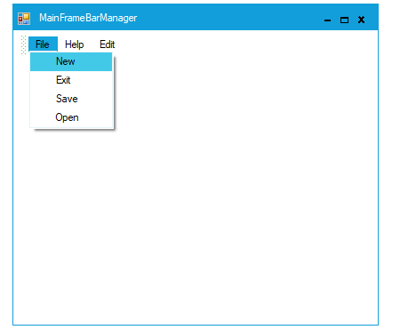

**Office2016Colorful**

This option helps to set the Office2016Colorful theme.

#####  Code Sample





// office2016Colorful

this.mainFrameBarManager1.Style = Syncfusion.Windows.Forms.VisualStyle.Office2016Colorful;





' office2016Colorful

Me.mainFrameBarManager1.Style = Syncfusion.Windows.Forms.VisualStyle.Office2016Colorful





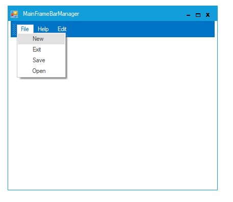

**Office2016DarkGray**

This option helps to set the Office2016DarkGray theme.

#####  Code Sample





// office2016DarkGray

this.mainFrameBarManager1.Style = Syncfusion.Windows.Forms.VisualStyle.Office2016DarkGray;





' office2016DarkGray

Me.mainFrameBarManager1.Style = Syncfusion.Windows.Forms.VisualStyle.Office2016DarkGray





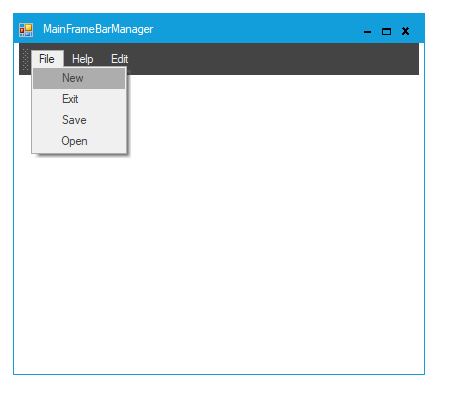

**Office2016Black**

This option helps to set the Office2016Black theme.





// office2016Black

this.mainFrameBarManager1.Style = Syncfusion.Windows.Forms.VisualStyle.Office2016Black;





'office2016Black

Me.mainFrameBarManager1.Style = Syncfusion.Windows.Forms.VisualStyle.Office2016Black





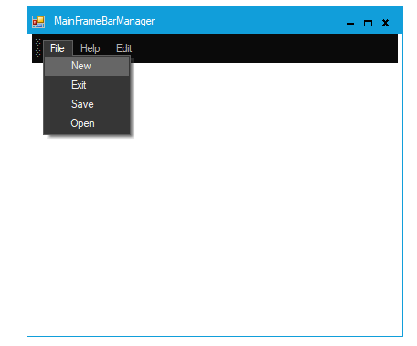

**Office2016White**

This option helps to set the Office2016White theme.





// office2016White

this.mainFrameBarManager1.Style = Syncfusion.Windows.Forms.VisualStyle.Office2016White;





' office2016White

Me.mainFrameBarManager1.Style = Syncfusion.Windows.Forms.VisualStyle.Office2016White





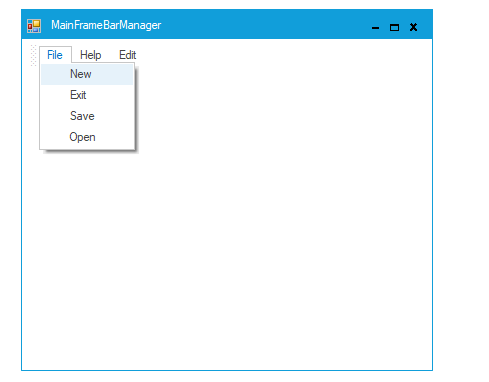

## Customize Dialog Appearance

Foreground and Background Settings

Fore color, back color and the Font style can be set for the Customize Dialog using ForeColor, BackColor and Font properties respectively.



//to change ForeColor

this.mainFrameBarManager1.CustomizationDialog.ForeColor = Color.OrangeRed;

//to change BackColor

this.mainFrameBarManager1.CustomizationDialog.BackColor = Color.PowderBlue;

//Change the font,font style and size

mainFrameBarManager1.CustomizationDialog.Font = new Font("Arial", 8, System.Drawing.FontStyle.Bold);




'to change ForeColor

Me.mainFrameBarManager1.CustomizationDialog.ForeColor = Color.OrangeRed

'to change BackColor

Me.mainFrameBarManager1.CustomizationDialog.BackColor = Color.PowderBlue

'Change the font,font style and size 

mainFrameBarManager1.CustomizationDialog.Font = New Font("Arial", 8, System.Drawing.FontStyle.Bold) 



 

### Size Settings

Size and the client size of the Customize Dialog can be controlled using the Size property as follows.


//to change the size of entire dialog

this.mainFrameBarManager1.CustomizationDialog.Size = new Size(700, 800);

//to change the client area

this.mainFrameBarManager1.CustomizationDialog.ClientSize = new Size(600, 700);




'to change the size of entire dialog 

Me.mainFrameBarManager1.CustomizationDialog.Size = New Size(700, 800)

'to change the client area 

Me.mainFrameBarManager1.CustomizationDialog.ClientSize = New Size(600, 700)


## Multiline Support for ParentBarItem in MainFrameBarManager

You can customize and display the ParentBarItem text in Multiline format by using “MultiLine” property. 

API Details:

<table>
<tr>
<th>
Property</th><th>
Type</th><th>
Description</th></tr>
<tr>
<td>
MultiLine</td><td>
Boolean</td><td>
Enables MultiLine in MainFrameBarManager</td></tr>
</table>

The following code example illustrates how to set MultiLine property in C# and VB language.



  this.parentBarItem1.MultiLine = true;




    Me.parentBarItem1.MultiLine = true



The following screenshot shows how the ParentBarItem is displayed in Multiline.

## Text Orientation in ParentBarItem of MainFrameBarManager

You can align the ParentBarItem text in vertical or horizontal manner by using “Orientation” property.
 

### Horizontal Alignment:

The following image illustrates how the parent bar items are displayed in horizontal alignment.

 

 

### Vertical Alignment:

The following image illustrates how the parent bar items are displayed in vertical alignment.

### API Details:

<table>
<tr>
<th>
 Property  </th><th>
 Type  </th><th>
 Description  </th></tr>
<tr>
<td>
 Orientation  </td><td>
enum</td><td>
Gets or sets the text alignment of ParentBarItem in MainframeBarManager.</td></tr>
</table>

The following code example shows how to set the vertical and horizontal text alignment.


// To set Vertical text alignment.

this.parentBarItem1.Orientation= Syncfusion.Windows.Forms.Tools.XPMenus.Orientation.Vertical;

// To set Horizontal text alignment.

this.parentBarItem1. Orientation=Syncfusion.Windows.Forms.Tools.XPMenus.Orientation.Vertical;





// To set Vertical text alignment.

Me.parentBarItem1. Orientation= Syncfusion.Windows.Forms.Tools.XPMenus. Orientation.Vertical

// To set Horizontal text alignment.

Me.parentBarItem1. Orientation= Syncfusion.Windows.Forms.Tools.XPMenus. Orientation.Vertical


