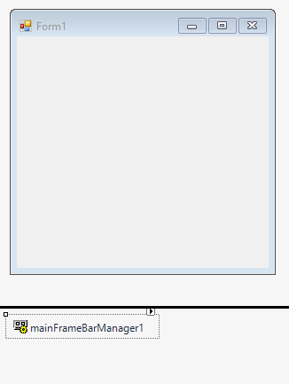
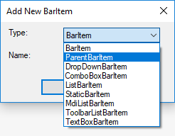
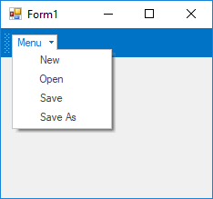
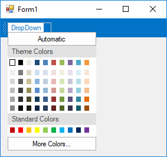
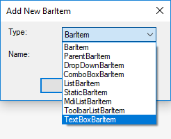
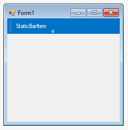
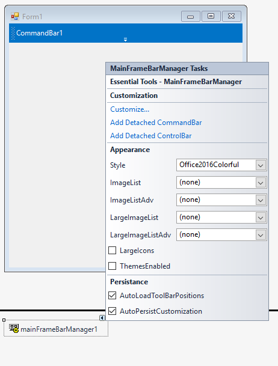
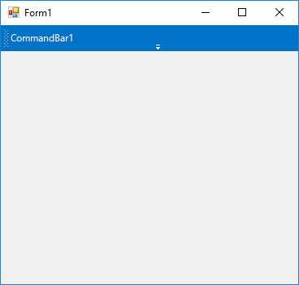
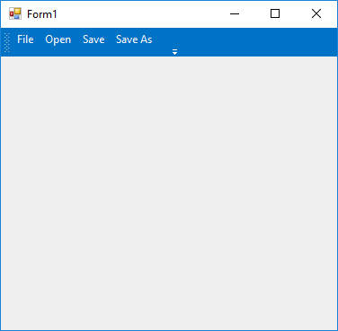

# Getting started

This section describes how to configure a [MainFrameBarManager](https://help.syncfusion.com/cr/cref_files/windowsforms/tools/Syncfusion.Tools.Windows~Syncfusion.Windows.Forms.Tools.XPMenus.MainFrameBarManager.html) control in a Windows Forms application and overview of its basic functionalities.

## Assembly deployment

The following list of assemblies should be added as reference to use the [MainFrameBarManager](https://help.syncfusion.com/cr/cref_files/windowsforms/tools/Syncfusion.Tools.Windows~Syncfusion.Windows.Forms.Tools.XPMenus.MainFrameBarManager.html) in any application:

<table>
<tr>
<td>
{{'**Required assemblies**'| markdownify }}
</td>
<td>
{{'**Description**'| markdownify }}
</td>
</tr>
<tr>
<td>
Syncfusion.Grid.Base.dll
</td>
<td>
Syncfusion.Grid.Base contains classes that contains fundamentals and base classes of GridControl.
</td>
</tr>
<tr>
<td>
Syncfusion.Grid.Windows.dll
</td>
<td>
Syncfusion.Grid.Windows contains classes that handles all UI operations, fundamentals and base classes of GridControl which are used in the MainFrameBarManager control.
</td>
</tr>
<tr>
<td>
Syncfusion.Shared.Base.dll
</td>
<td>
Syncfusion.Shared.Base contains style related properties of MainFrameBarManager and various editor controls.
</td>
</tr>
<tr>
<td>
Syncfusion.Shared.Windows.dll
</td>
<td>
Syncfusion.Shared.Windows contains style related properties of MainFrameBarManager and various editor controls.
</td>
</tr>
<tr>
<td>
Syncfusion.Tools.Base.dll
</td>
<td>
Syncfusion.Tools.Base contains base class which used for MainFrameBarManager control.
</td>
</tr>
<tr>
<td>
Syncfusion.Tools.Windows.dll
</td>
<td>
Syncfusion.Tools.Windows contains the class that handles all UI operations and contains helper class of MainFrameBarManager control.
</td>
</tr>
</table>

## Installing NuGet Packages

To use [MainFrameBarManager](https://help.syncfusion.com/cr/cref_files/windowsforms/tools/Syncfusion.Tools.Windows~Syncfusion.Windows.Forms.Tools.XPMenus.MainFrameBarManager.html) control in Windows Forms application via nuget, the following packages should be installed.
 
<table>
<tr>
<td>{{'**S.No**'| markdownify }}
</td>
<td>{{'**Framework version**'| markdownify }}
</td>
<td>{{'**NuGet Packages**'| markdownify }}
</td>
</tr>
<tr>
<td> 1
</td>
<td> 2.0
</td>
<td> Syncfusion.Tools.Windows20
</td>
</tr>
<tr>
<td> 2
</td>
<td> 3.5
</td>
<td> Syncfusion.Tools.Windows35
</td>
</tr>
<tr>
<td> 3
</td>
<td> 4.0
</td>
<td> Syncfusion.Tools.Windows40
</td>
</tr>
<tr>
<td> 4
</td>
<td> 4.5
</td>
<td> Syncfusion.Tools.Windows45
</td>
</tr>
<tr>
<td> 5
</td>
<td> 4.5.1
</td>
<td>Syncfusion.Tools.Windows451
</td>
</tr>
<tr>
<td> 6
</td>
<td> 4.6
</td>
<td>Syncfusion.Tools.Windows46
</td>
</tr>
</table>
 
Please find more details regarding how to install the nuget packages in windows form application in the below link:
 
[How to install nuget packages](https://help.syncfusion.com/windowsforms/nuget-packages)

# Creating simple application with MainFrameBarManager

You can create the Windows Forms application with [MainFrameBarManager](https://help.syncfusion.com/cr/cref_files/windowsforms/tools/Syncfusion.Tools.Windows~Syncfusion.Windows.Forms.Tools.XPMenus.MainFrameBarManager.html) control as follows:

1. [Creating project](#creating-the-project)
2. [Adding control via Form Designer](#adding-control-via-form-designer)
3. [Adding control manually using code](#adding-control-manually-using-code) 

### Creating the project

Create a new Windows Forms project in the Visual Studio to display the [MainFrameBarManager](https://help.syncfusion.com/cr/cref_files/windowsforms/tools/Syncfusion.Tools.Windows~Syncfusion.Windows.Forms.Tools.XPMenus.MainFrameBarManager.html) with basic information.

## Adding control via Form designer

[MainFrameBarManager](https://help.syncfusion.com/cr/cref_files/windowsforms/tools/Syncfusion.Tools.Windows~Syncfusion.Windows.Forms.Tools.XPMenus.MainFrameBarManager.html) control can be added to the application by dragging it from the toolbox and dropping it in a designer view. The following required assembly references will be added automatically:

* Syncfusion.Grid.Base.dll
* Syncfusion.Grid.Windows.dll
* Syncfusion.Shared.Base.dll
* Syncfusion.Shared.Windows.dll
* Syncfusion.Tools.Base.dll
* Syncfusion.Tools.Windows.dll

 

 

**Adding Bar to MainFrameBarManager**

[Bar](https://help.syncfusion.com/cr/cref_files/windowsforms/tools/Syncfusion.Tools.Windows~Syncfusion.Windows.Forms.Tools.XPMenus.Bar.html) can be added to [MainFrameBarManager](https://help.syncfusion.com/cr/cref_files/windowsforms/tools/Syncfusion.Tools.Windows~Syncfusion.Windows.Forms.Tools.XPMenus.MainFrameBarManager.html) through `Customize...` option from Smart Tags, where Bar can be added to `Toolbars` in the DialogBox.

 

**Adding ParentBarItem to Bar** 

[ParentBarItem](https://help.syncfusion.com/cr/cref_files/windowsforms/tools/Syncfusion.Tools.Windows~Syncfusion.Windows.Forms.Tools.XPMenus.ParentBarItem.html) is a type of BarItem, under which child BarItems can be added.

**Adding BarItem to Bar**

{BarItem](https://help.syncfusion.com/cr/cref_files/windowsforms/tools/Syncfusion.Tools.Windows~Syncfusion.Windows.Forms.Tools.XPMenus.BarItem.html) represents an individual item that can be displayed in a menu structure.

**Adding ComboBoxBarItem to Bar** 

[ComboBoxBarItem](https://help.syncfusion.com/cr/cref_files/windowsforms/tools/Syncfusion.Tools.Windows~Syncfusion.Windows.Forms.Tools.XPMenus.ComboBoxBarItem.html) is a type of BarItem, which behaves like ComboBox and its Items collection can be added using property named [ChoiceList](https://help.syncfusion.com/cr/cref_files/windowsforms/tools/Syncfusion.Tools.Windows~Syncfusion.Windows.Forms.Tools.XPMenus.ComboBoxBarItem~ChoiceList.html). 

**Adding DropDownBarItem to Bar** 

[DropDownBarItem](https://help.syncfusion.com/cr/cref_files/windowsforms/tools/Syncfusion.Tools.Windows~Syncfusion.Windows.Forms.Tools.XPMenus.DropDownBarItem.html) is a type of BarItem, which will display popup menu when clicked. It is also possible to load custom control in it. 

**Adding TextBoxBarItem to Bar**

[TextBoxBarItem](https://help.syncfusion.com/cr/cref_files/windowsforms/tools/Syncfusion.Tools.Windows~Syncfusion.Windows.Forms.Tools.XPMenus.TextBoxBarItem.html) is a type of BarItem, which behaves like TextBox control.

**Adding StaticBarItem to Bar** 

[StaticBarItem](https://help.syncfusion.com/cr/cref_files/windowsforms/tools/Syncfusion.Tools.Windows~Syncfusion.Windows.Forms.Tools.XPMenus.StaticBarItem.html) is a type of BarItem, which behaves like Label control.

**Adding CommandBar to MainFrameBarManager**

CommandBar can be added to [MainFrameBarManager](https://help.syncfusion.com/cr/cref_files/windowsforms/tools/Syncfusion.Tools.Windows~Syncfusion.Windows.Forms.Tools.XPMenus.MainFrameBarManager.html) using `Add Detached CommandBar` from Smart Tags.

BarItem can be added to CommandBar by dragging [XPToolBar](https://help.syncfusion.com/cr/cref_files/windowsforms/tools/Syncfusion.Tools.Windows~Syncfusion.Windows.Forms.Tools.XPMenus.XPToolBar.html) from the toolbox and dropping it into CommandBar and Add BarItem to XPToolBar.

## Adding control manually using code

To add control manually in C#, follow the given steps:

**Step 1** : Add the following required assembly references to the project:

 * Syncfusion.Tools.Base.dll
 * Syncfusion.Tools.Windows.dll
 * Syncfusion.Shared.Base.dll
 * Syncfusion.Shared.Windows.dll
 * Syncfusion.Grid.Base.dll
 * Syncfusion.Grid.Windows.dll

**Step 2** : Include the namespaces **Syncfusion.Windows.Forms.Tools**.





using Syncfusion.Windows.Forms.Tools;





Imports Syncfusion.Windows.Forms.Tools





**Step 3** : Create [MainFrameBarManager](https://help.syncfusion.com/cr/cref_files/windowsforms/tools/Syncfusion.Tools.Windows~Syncfusion.Windows.Forms.Tools.XPMenus.MainFrameBarManager.html) control instance and add it to the form.





MainFrameBarManager mainFrameBarManager1 = new MainFrameBarManager();

this.mainFrameBarManager1.Style = Syncfusion.Windows.Forms.VisualStyle.Office2016Colorful;

this.mainFrameBarManager1.Form = this;





Dim mainFrameBarManager1 As MainFrameBarManager = New MainFrameBarManager

Me.mainFrameBarManager1.Style = Syncfusion.Windows.Forms.VisualStyle.Office2016Colorful

Me.mainFrameBarManager1.Form = Me;





**Adding Bar to MainFrameBarManager**

Create an instance of [Bar](https://help.syncfusion.com/cr/cref_files/windowsforms/tools/Syncfusion.Tools.Windows~Syncfusion.Windows.Forms.Tools.XPMenus.Bar.html) and add it to `Bars` collection property of MainFrameBarManager.





// Create an instance
Bar bar1 = new Syncfusion.Windows.Forms.Tools.XPMenus.Bar();

// Add MainFrameBarManager as Manager 
this.bar1.BarName = "File";
this.bar1.Caption = "File";
this.bar1.Manager = this.mainFrameBarManager1;

// Add Bar and Categories
this.mainFrameBarManager1.Bars.Add(this.bar1);
this.mainFrameBarManager1.Categories.Add("Menu");





' Create an instance
Dim bar1 As Bar = New Syncfusion.Windows.Forms.Tools.XPMenus.Bar()

' Add MainFrameBarManager as Manager 
Me.bar1.BarName = "File"
Me.bar1.Caption = "File"
Me.bar1.Manager = Me.mainFrameBarManager1

' Add Bar and Categories
Me.mainFrameBarManager1.Bars.Add(Me.bar1)
Me.mainFrameBarManager1.Categories.Add("Menu")





**Adding ParentBarItem to Bar**

To add [ParentBarItem](https://help.syncfusion.com/cr/cref_files/windowsforms/tools/Syncfusion.Tools.Windows~Syncfusion.Windows.Forms.Tools.XPMenus.ParentBarItem.html) can be added it by creating an instance and add it to [Items](https://help.syncfusion.com/cr/cref_files/windowsforms/tools/Syncfusion.Tools.Windows~Syncfusion.Windows.Forms.Tools.XPMenus.Bar~Items.html) collection property. BarItem can be added to ParentBarItem using [Items](https://help.syncfusion.com/cr/cref_files/windowsforms/tools/Syncfusion.Tools.Windows~Syncfusion.Windows.Forms.Tools.XPMenus.ParentBarItem~Items.html) property.





// Create instance
ParentBarItem parentBarItem1 = new ParentBarItem();

BarItem barItem1 = new BarItem();
BarItem barItem2 = new BarItem();
BarItem barItem3 = new BarItem();
BarItem barItem4 = new BarItem();

this.barItem1.Text = "New";
this.barItem2.Text = "Open";
this.barItem3.Text = "Save";
this.barItem4.Text = "Save As";

parentBarItem1.Text = "Menu";

// Add it to MainFrameBarManager
this.mainFrameBarManager1.Items.AddRange(new Syncfusion.Windows.Forms.Tools.XPMenus.BarItem[] {
            parentBarItem1,
            this.barItem1,
            this.barItem2,
            this.barItem3,
            this.barItem4});

// Add BarItem to ParentBarItem
parentBarItem1.Items.AddRange(new Syncfusion.Windows.Forms.Tools.XPMenus.BarItem[] {
            this.barItem1,
            this.barItem2,
            this.barItem3,
            this.barItem4});

// Add ParentBarItem to Bar
this.bar1.Items.AddRange(new Syncfusion.Windows.Forms.Tools.XPMenus.BarItem[] {
            parentBarItem1});





' Create instance
Dim parentBarItem1 As New ParentBarItem()

Dim barItem1 As New BarItem()
Dim barItem2 As New BarItem()
Dim barItem3 As New BarItem()
Dim barItem4 As New BarItem()

Me.barItem1.Text = "New"
Me.barItem2.Text = "Open"
Me.barItem3.Text = "Save"
Me.barItem4.Text = "Save As"

parentBarItem1.Text = "Menu"

' Add it to MainFrameBarManager
Me.mainFrameBarManager1.Items.AddRange(New Syncfusion.Windows.Forms.Tools.XPMenus.BarItem() { parentBarItem1, Me.barItem1, Me.barItem2, Me.barItem3, Me.barItem4})

' Add BarItem to ParentBarItem
parentBarItem1.Items.AddRange(New Syncfusion.Windows.Forms.Tools.XPMenus.BarItem() { Me.barItem1, Me.barItem2, Me.barItem3, Me.barItem4})

' Add ParentBarItem to Bar
Me.bar1.Items.AddRange(New Syncfusion.Windows.Forms.Tools.XPMenus.BarItem() { parentBarItem1})





**Adding BarItem to Bar**

To add [BarItem]((https://help.syncfusion.com/cr/cref_files/windowsforms/tools/Syncfusion.Tools.Windows~Syncfusion.Windows.Forms.Tools.XPMenus.BarItem.html)) into Bar, Create instance of required BarItem and add it to `Item` collection of MainFrameBarManager and `Item` collection of the respective Bar.





// Create an instance of BarItems 
BarItem barItem1 = new BarItem();
BarItem barItem2 = new BarItem();
BarItem barItem3 = new BarItem();
BarItem barItem4 = new BarItem();

this.barItem1.Text = "File";
this.barItem2.Text = "Open";
this.barItem3.Text = "Save";
this.barItem4.Text = "Save As";

// Add it to MainFrameBarManager
this.mainFrameBarManager1.Items.AddRange(new Syncfusion.Windows.Forms.Tools.XPMenus.BarItem[] {
            this.barItem1,
            this.barItem2,
            this.barItem3,
            this.barItem4});

// Add it to Bar
this.bar1.Items.AddRange(new Syncfusion.Windows.Forms.Tools.XPMenus.BarItem[] {
            this.barItem1,
            this.barItem2,
            this.barItem3,
            this.barItem4});





' Create an instance of BarItems 
Dim barItem1 As New BarItem()
Dim barItem2 As New BarItem()
Dim barItem3 As New BarItem()
Dim barItem4 As New BarItem()

Me.barItem1.Text = "File"
Me.barItem2.Text = "Open"
Me.barItem3.Text = "Save"
Me.barItem4.Text = "Save As"

' Add it to MainFrameBarManager
Me.mainFrameBarManager1.Items.AddRange(New Syncfusion.Windows.Forms.Tools.XPMenus.BarItem() { Me.barItem1, Me.barItem2, Me.barItem3, Me.barItem4})

' Add it to Bar
Me.bar1.Items.AddRange(New Syncfusion.Windows.Forms.Tools.XPMenus.BarItem() { Me.barItem1, Me.barItem2, Me.barItem3, Me.barItem4})





**Adding ComboBoxBarItem to Bar** 

Create an instance of [ComboBoxBarItem](https://help.syncfusion.com/cr/cref_files/windowsforms/tools/Syncfusion.Tools.Windows~Syncfusion.Windows.Forms.Tools.XPMenus.ComboBoxBarItem.html) and add it to Bar. Items can be added through [ChoiceList](https://help.syncfusion.com/cr/cref_files/windowsforms/tools/Syncfusion.Tools.Windows~Syncfusion.Windows.Forms.Tools.XPMenus.ComboBoxBarItem~ChoiceList.html) property.





ComboBoxBarItem comboBoxBarItem1 = new ComboBoxBarItem();

this.comboBoxBarItem1.ChoiceList.AddRange(new string[] {
            "Obj 1",
            "Obj 2",
            "Obj 3"});

this.mainFrameBarManager1.Items.Add(this.comboBoxBarItem1);

this.bar1.Items.Add(this.comboBoxBarItem1);





Dim comboBoxBarItem1 As New ComboBoxBarItem()

Me.comboBoxBarItem1.ChoiceList.AddRange(New String() { "Obj 1", "Obj 2", "Obj 3"})

Me.mainFrameBarManager1.Items.Add(Me.comboBoxBarItem1)

Me.bar1.Items.Add(Me.comboBoxBarItem1)





**Adding DropDownBarItem to Bar**

Create an instance [DropDownBarItem](https://help.syncfusion.com/cr/cref_files/windowsforms/tools/Syncfusion.Tools.Windows~Syncfusion.Windows.Forms.Tools.XPMenus.DropDownBarItem.html) and add it to Bar. Add any control to a PopupControlContainer and add it to DropDownBarItem.





DropDownBarItem dropDownBarItem1 = new DropDownBarItem();

PopupControlContainer popupControlContainer1 = new PopupControlContainer();

ColorPickerUIAdv colorPickerUIAdv1 = new ColorPickerUIAdv();

this.popupControlContainer1.Controls.Add(this.colorPickerUIAdv1);

this.Controls.Add(this.popupControlContainer1);

this.dropDownBarItem1.Text = "DropDown";

// Adding PopupControlContainer to DropDownBarItem
this.dropDownBarItem1.PopupControlContainer = this.popupControlContainer1;

this.mainFrameBarManager1.Items.Add(dropDownBarItem1);

this.bar1.Items.Add(dropDownBarItem1);





Dim dropDownBarItem1 As New DropDownBarItem()

Dim popupControlContainer1 As New PopupControlContainer()

Dim colorPickerUIAdv1 As New ColorPickerUIAdv()

Me.popupControlContainer1.Controls.Add(Me.colorPickerUIAdv1)

Me.Controls.Add(Me.popupControlContainer1)

Me.dropDownBarItem1.Text = "DropDown"

' Adding PopupControlContainer to DropDownBarItem
Me.dropDownBarItem1.PopupControlContainer = Me.popupControlContainer1

Me.mainFrameBarManager1.Items.Add(dropDownBarItem1)

Me.bar1.Items.Add(dropDownBarItem1)





**Adding TextBoxBarItem to Bar**

Create an instance of [TextBoxBarItem](https://help.syncfusion.com/cr/cref_files/windowsforms/tools/Syncfusion.Tools.Windows~Syncfusion.Windows.Forms.Tools.XPMenus.TextBoxBarItem.html) and add it to `Items` collection of Bar.





TextBoxBarItem textBoxBarItem1 = new TextBoxBarItem();

this.mainFrameBarManager1.Items.Add(this.textBoxBarItem1);

this.bar1.Items.Add(textBoxBarItem1);





Dim textBoxBarItem1 As New TextBoxBarItem()

Me.mainFrameBarManager1.Items.Add(Me.textBoxBarItem1)

Me.bar1.Items.Add(textBoxBarItem1)





**Adding StaticBarItem to Bar** 

Create an instance of [StaticBarItem](https://help.syncfusion.com/cr/cref_files/windowsforms/tools/Syncfusion.Tools.Windows~Syncfusion.Windows.Forms.Tools.XPMenus.StaticBarItem.html) and add it `Items` collection of Bar.





StaticBarItem staticBarItem1 = new StaticBarItem();

this.staticBarItem1.Text = "StaticBarItem";

this.mainFrameBarManager1.Items.Add(this.staticBarItem1);

this.bar1.Items.Add(staticBarItem1);





Dim staticBarItem1 As New StaticBarItem()

Me.staticBarItem1.Text = "StaticBarItem"

Me.mainFrameBarManager1.Items.Add(Me.staticBarItem1)

Me.bar1.Items.Add(staticBarItem1)





**Adding CommandBar to MainFrameBarManager**

Create an instance of `CommandBar` and add it to [DetachedCommandBars](https://help.syncfusion.com/cr/cref_files/windowsforms/tools/Syncfusion.Tools.Windows~Syncfusion.Windows.Forms.Tools.XPMenus.MainFrameBarManager~DetachedCommandBars.html) collections of MainFrameBarManager.





CommandBar commandBar1 = new CommandBar();

this.commandBar1.Text = "CommandBar1";

this.mainFrameBarManager1.DetachedCommandBars.Add(this.commandBar1);





Dim commandBar1 As New CommandBar()

Me.commandBar1.Text = "CommandBar1"

Me.mainFrameBarManager1.DetachedCommandBars.Add(Me.commandBar1)





[BarItem](https://help.syncfusion.com/cr/cref_files/windowsforms/tools/Syncfusion.Tools.Windows~Syncfusion.Windows.Forms.Tools.XPMenus.BarItem.html) can be added to CommandBar by added [XPToolBar](https://help.syncfusion.com/cr/cref_files/windowsforms/tools/Syncfusion.Tools.Windows~Syncfusion.Windows.Forms.Tools.XPMenus.XPToolBar.html) to it and adding `BarItem` to it.





// Create instance of XPToolBar
XPToolBar xpToolBar1 = new XPToolBar();

// Create an instance of BarItems 
BarItem barItem1 = new BarItem();
BarItem barItem2 = new BarItem();
BarItem barItem3 = new BarItem();
BarItem barItem4 = new BarItem();

this.barItem1.Text = "File";
this.barItem2.Text = "Open";
this.barItem3.Text = "Save";
this.barItem4.Text = "Save As";

// Add BarItems
this.xpToolBar1.Bar.Items.AddRange(new Syncfusion.Windows.Forms.Tools.XPMenus.BarItem[] {
            this.barItem1,
            this.barItem2,
            this.barItem3,
            this.barItem4});

this.commandBar1.Controls.Add(this.xpToolBar1);





' Create instance of XPToolBar
Dim xpToolBar1 As New XPToolBar()

' Create an instance of BarItems 
Dim barItem1 As New BarItem()
Dim barItem2 As New BarItem()
Dim barItem3 As New BarItem()
Dim barItem4 As New BarItem()

Me.barItem1.Text = "File"
Me.barItem2.Text = "Open"
Me.barItem3.Text = "Save"
Me.barItem4.Text = "Save As"

' Add BarItems
Me.xpToolBar1.Bar.Items.AddRange(New Syncfusion.Windows.Forms.Tools.XPMenus.BarItem() { Me.barItem1, Me.barItem2, Me.barItem3, Me.barItem4})

Me.commandBar1.Controls.Add(Me.xpToolBar1)





