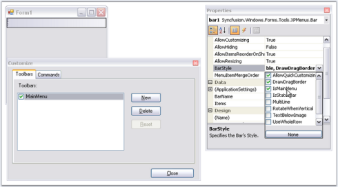

# Getting Started

## Creating Menus 

This section will provide a step by step procedure to create a toolbar with menu items added by using the designer and by using programmatical approach in .NET application. 

### Through Designer

This section deals with creating bar items and adding them to the toolbar which are demonstrated in the following topics.

### Adding Bar Items to a BarManager

To add BarItems (menu items) to the menu Bar (note that this step will NOT automatically populate menus and toolbars) during design-time:

* Drag-and-drop one of the BarManagers, MainFrameBarManager (if this is the top-level form) or a ChildFrameBarManager if this is an MDIChild form, onto the form, which will be added to the component tray.
* To invoke the Customize dialog, right click the component and select the Customize... option, or choose the 'Customize...' option from the smart tag.

 

 

* In the customization dialog, go to the Commands tab.
* To add new categories, right click on the Categories' area and select Add.

 

* This will open up a dialog where you can enter the name of a new category. The category name should be unique within this BarManager. 

N> The categories do not correspond to any menu entries in the main menu or toolbars, they just provide you a logical grouping of different BarItems.

 

* Now to add bar items into this category, select the category and click the Modify... button (top right corner of the Commands tab) select Add to invoke the Add New BarItem dialog.
* Select the type of BarItem you would like to add, from the list and name it (the BarItem's text property). Take a look at the topic [Bar Items](/windowsforms/popupmenu/popup-menucontext-menuxpmenu-bars#bar-items) for more information on the different types of BarItems.

 

* Once you insert the BarItems, you can select them in the Commands list and modify their properties in the VS .NET design-time property grid.

 

N> Remember that you haven't filled your menus and toolbars yet. To display the items refer to [Adding Toolbars](#adding-toolbars-and-populating-the-bar-items)

### Adding Toolbars and Populating the Bar Items

To add a toolbar and populate it with the bar items follow the below steps.

* To create a new toolbar, go to the Toolbars tab in the Customize dialog, select New and specify a name (Ex: MainMenu) for the toolbar.

* This will create a new bar component in the designer as shown in the image below. Name this component as 'MainMenu'. This will also make a corresponding entry in the Toolbars list.

 

* Set the toolbar as a main menu, by selecting the IsMainMenu option in the [BarStyle](/windowsforms/menus/appearance-settings#bar-styles) property of the mainMenuBar component.

 

* Fill your toolbars with items by simply dragging-and-dropping the items from the Command tab into the toolbars and submenus. To fill the sub menu of the parent bar items, again drag the required bar items inside it.

 

* You can drag and dock the toolbars on all four sides of the designer by dragging through the gripper on the left of the toolbar and moving them to any desired position. The toolbars can also be floated. See [Toolbar Properties](/windowsforms/xptoolbar/xptoolbar-properties) for more details.
N> If a toolbar from the mainFrameBarManager and one (or more) from the child forms gets merged (the rules for merging are discussed in the [MDI Merging](/windowsforms/mdichildforms/mdi-merging)topic), the BarItems in the toolbar will be ordered based on their MergeOrder property

If this is a ChildFrameBarManager, all the toolbars (including the main menu) will be floating at design-time. This is because the child toolbars will be docked to the main form rather than to your child form during run-time, and hence, floating avoids polluting your child forms during design-time.

 

### Through Code

This section deals with the programmatic approach of creating and populating the toolbar with menus.

#### Adding Bar Items to a BarManager

To programmatically add bar items to a BarManager, perform the below steps.

1. Include the required namespaces.

   ~~~ cs

		using Syncfusion.Windows.Forms.Tools;

		using Syncfusion.Windows.Forms.Tools.XPMenus;

   ~~~
   {:.prettyprint }

   ~~~ vbnet

		Imports Syncfusion.Windows.Forms.Tools

		Imports Syncfusion.Windows.Forms.Tools.XPMenus

   ~~~
   {:.prettyprint }

2. Create an instance of MainFrameBarManager.

   ~~~ cs

		private Syncfusion.Windows.Forms.Tools.XPMenus.MainFrameBarManager mainFrameBarManager1;

		this.mainFrameBarManager1 = new Syncfusion.Windows.Forms.Tools.XPMenus.MainFrameBarManager(this.components, this);

   ~~~
   {:.prettyprint }

   ~~~ vbnet

		Private mainFrameBarManager1 As Syncfusion.Windows.Forms.Tools.XPMenus.MainFrameBarManager

		Private Me.mainFrameBarManager1 = New Syncfusion.Windows.Forms.Tools.XPMenus.MainFrameBarManager(Me.components, Me)

   ~~~
   {:.prettyprint }

3. Add category to the MainFrameBarManager.

   ~~~ cs

		this.mainFrameBarManager1.Categories.Add("MainMenu");

   ~~~
   {:.prettyprint }

   ~~~ vbnet

		Me.mainFrameBarManager1.Categories.Add("MainMenu")

   ~~~
   {:.prettyprint }

4. Create an instances for ParentBarItem(File) and BarItems(New,Open and Close).

   ~~~ cs

					private Syncfusion.Windows.Forms.Tools.XPMenus.ParentBarItem parentBarItem1;

					private Syncfusion.Windows.Forms.Tools.XPMenus.BarItem barItem1;

					private Syncfusion.Windows.Forms.Tools.XPMenus.BarItem barItem2;

					private Syncfusion.Windows.Forms.Tools.XPMenus.BarItem barItem3;

			this.parentBarItem1 = new Syncfusion.Windows.Forms.Tools.XPMenus.ParentBarItem();

			this.barItem1 = new Syncfusion.Windows.Forms.Tools.XPMenus.BarItem();

			this.barItem2 = new Syncfusion.Windows.Forms.Tools.XPMenus.BarItem();

			this.barItem3 = new Syncfusion.Windows.Forms.Tools.XPMenus.BarItem();

   ~~~
   {:.prettyprint }

   ~~~ vbnet

					Private parentBarItem1 As Syncfusion.Windows.Forms.Tools.XPMenus.ParentBarItem

					Private barItem1 As Syncfusion.Windows.Forms.Tools.XPMenus.BarItem

					Private barItem2 As Syncfusion.Windows.Forms.Tools.XPMenus.BarItem

					Private barItem3 As Syncfusion.Windows.Forms.Tools.XPMenus.BarItem

					Me.parentBarItem1 = New Syncfusion.Windows.Forms.Tools.XPMenus.ParentBarItem()

					Me.barItem1 = New Syncfusion.Windows.Forms.Tools.XPMenus.BarItem()

					Me.barItem2 = New Syncfusion.Windows.Forms.Tools.XPMenus.BarItem()

					Me.barItem3 = New Syncfusion.Windows.Forms.Tools.XPMenus.BarItem()

   ~~~
   {:.prettyprint }

5. Add BarItems to the MainFrameBarManager.

   ~~~ cs

		this.mainFrameBarManager1.Items.AddRange(new Syncfusion.Windows.Forms.Tools.XPMenus.BarItem[] {

		this.parentBarItem1,this.barItem1,this.barItem2,this.barItem3});

   ~~~
   {:.prettyprint }

   ~~~ vbnet

		Me.mainFrameBarManager1.Items.AddRange(New Syncfusion.Windows.Forms.Tools.XPMenus.BarItem() {
		Me.parentBarItem1,Me.barItem1,Me.barItem2,Me.barItem3})

   ~~~
   {:.prettyprint }

				 Refer Adding Toolbars and Populating the Bar Items to add toolbar and populate menus.
   

### Adding Toolbars and Populating the Bar Items

Follow the steps below to create and populate the toolbar with menus.

1. Create an instance of Toolbar and associate it with MainFrameBarManager.

   ~~~ cs
			private Syncfusion.Windows.Forms.Tools.XPMenus.Bar bar1;

			this.bar1 = new Syncfusion.Windows.Forms.Tools.XPMenus.Bar(this.mainFrameBarManager1, "MyMenu");

			this.mainFrameBarManager1.Bars.Add(this.bar1);

			this.bar1.Manager = this.mainFrameBarManager1;

   ~~~
   {:.prettyprint }

   ~~~ vbnet

			Private bar1 As Syncfusion.Windows.Forms.Tools.XPMenus.Bar

			Private Me.bar1 = New Syncfusion.Windows.Forms.Tools.XPMenus.Bar(Me.mainFrameBarManager1, "MyMenu")

			Me.mainFrameBarManager1.Bars.Add(Me.bar1)

			Private Me.bar1.Manager = Me.mainFrameBarManager1

   ~~~
   {:.prettyprint }

2. Add bar items to the ParentBarItem.

   ~~~ cs

			this.parentBarItem1.Items.AddRange(new Syncfusion.Windows.Forms.Tools.XPMenus.BarItem[] {this.barItem1,this.barItem2,

			this.barItem3});

   ~~~
   {:.prettyprint }

   ~~~ vbnet

			Me.parentBarItem1.Items.AddRange(New Syncfusion.Windows.Forms.Tools.XPMenus.BarItem() {Me.barItem1,Me.barItem2, Me.barItem3})

   ~~~
   {:.prettyprint }

3. Finally add ParentBarItem to the toolbar.

   ~~~ cs

		this.bar1.Items.AddRange(new Syncfusion.Windows.Forms.Tools.XPMenus.BarItem[] {this.parentBarItem1});

   ~~~
   {:.prettyprint }

   ~~~ vbnet

		Me.bar1.Items.AddRange(New Syncfusion.Windows.Forms.Tools.XPMenus.BarItem() {Me.parentBarItem1})

   ~~~
   {:.prettyprint }

4. You can make the toolbar to occupy the entire row in the form by setting BarStyle property to following values.

   ~~~ cs

		this.bar1.BarStyle = ((Syncfusion.Windows.Forms.Tools.XPMenus.BarStyle) ((((Syncfusion.Windows.Forms.Tools.XPMenus.BarStyle.AllowQuickCustomizing | Syncfusion.Windows.Forms.Tools.XPMenus.BarStyle.IsMainMenu)| Syncfusion.Windows.Forms.Tools.XPMenus.BarStyle.Visible) 

		| Syncfusion.Windows.Forms.Tools.XPMenus.BarStyle.DrawDragBorder)));

   ~~~
   {:.prettyprint }

   ~~~ vbnet

		Me.bar1.BarStyle = (CType((((Syncfusion.Windows.Forms.Tools.XPMenus.BarStyle.AllowQuickCustomizing Or Syncfusion.Windows.Forms.Tools.XPMenus.BarStyle.IsMainMenu) Or Syncfusion.Windows.Forms.Tools.XPMenus.BarStyle.Visible) Or Syncfusion.Windows.Forms.Tools.XPMenus.BarStyle.DrawDragBorder), Syncfusion.Windows.Forms.Tools.XPMenus.BarStyle))

   ~~~
   {:.prettyprint }

   The resulting form will look like the below image.

    

