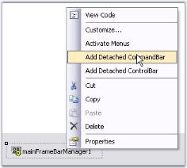
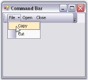

# Menus framework

This section will demonstrate the addition and customization of detached CommandBars and ControlBars.

## Detached CommandBar

The XP Menus Framework provides the flexibility to add detached toolbars through CommandBar that can host any .NET control. These toolbars are detached from the Framework in the sense that they cannot participate in user customization. Otherwise, they are seamless in look-and-feel.

### Through designer

Right-click on the MainFrameBarManager in the designer and choose the "Add Detached CommandBar" option, to add a detached command bar.

N> Command Bar can also be added by clicking the command in the properties window.

The following screenshot shows the CommandBar in the designer.

* Drag and drop [XPToolBar](/windowsforms/xptoolbar/overview) control on to the CommandBar and add bar items to the XPToolBar through BarItem Collection Editor.
* The following screenshot shows the XPToolBar with bar items hosted on CommandBar. This CommandBar can be hosted to any target within the form by just dragging and dropping.

To associate a bar with the CommandBar use the below code snippet.



//Associate the created Bar with CommandBar.

CommandBar cmd = this.mainFrameBarManager1.GetBarControl(this.bar1);

'Associate the created Bar with CommandBar.

Private cmd As CommandBar = Me.mainFrameBarManager1.GetBarControl(Me.bar1)

XPMenus lets you add custom controls to the CommandBar for example TrackBarEx by simple drag and drop.

//Adding the control to CommandBar

this.commandBar2.Controls.Add(this.trackBarEx1);

'Adding the control to CommandBar

Me.commandBar2.Controls.Add(Me.trackBarEx1)





[CommandBar Properties](#commandbar-properties)



### CommandBar properties

#### Appearance properties

<table>
<tr>
<th>
CommandBar property</th><th>
Description</th></tr>
<tr>
<td>
BackColor</td><td>
Sets the back color for the control.</td></tr>
<tr>
<td>
BackgroundImage</td><td>
Sets the background image for the control.</td></tr>
<tr>
<td>
BackgroundImage layout</td><td>
Specifies the layout of the image. Title, Center, Stretch, Zoom are the options. Default value is Tile.</td></tr>
<tr>
<td>
ChevronColor</td><td>
Sets color of the chevron.</td></tr>
<tr>
<td>
Font</td><td>
Sets the font style for the text.</td></tr>
<tr>
<td>
ForeColor</td><td>
Sets the foreground color of the text.</td></tr>
<tr>
<td>
Text</td><td>
Sets the control's text.</td></tr>
</table>

#### Behavior properties

<table>
<tr>
<th>
CommandBar property</th><th>
Description</th></tr>
<tr>
<td>
AllowedDockBorders</td><td>
Specifies dock border sides in which command bar can be docked from floating.</td></tr>
<tr>
<td>
AlwaysLeadingEdge</td><td>
Docks the CommandBar permanently to the leading edge of the dock border.</td></tr>
<tr>
<td>
AlwaysTrailingEdge</td><td>
Docks the CommandBar permanently to the trailing edge of the dock border.</td></tr>
<tr>
<td>
DisableDocking</td><td>
Disables docking ability of the CommandBar.</td></tr>
<tr>
<td>
DisableFloating</td><td>
Disables floating ability of the CommandBar.</td></tr>
<tr>
<td>
DockModeWrapping</td><td>
Wraps the docked CommandBar when bounds are less than maximum length.</td></tr>
<tr>
<td>
FloatModeWrapping</td><td>
Wraps the floating CommandBar when it is resized to less than its maximum length.</td></tr>
<tr>
<td>
OccupyFullRow</td><td>
Lets CommandBar occupy the full row in a form.</td></tr>
<tr>
<td>
ShowDockModeText</td><td>
Specifies whether the command bar should display the text that is set through CommandBar.Text property when the command bar is in docked position.</td></tr>
</table>

#### Hide/show

<table>
<tr>
<th>
CommandBar property</th><th>
Description</th></tr>
<tr>
<td>
HideChevron</td><td>
When set to true hides the chevron for the CommandBar.</td></tr>
<tr>
<td>
HideCloseButton</td><td>
Hides Close button for the floating CommandBar, when set to true.</td></tr>
<tr>
<td>
HideDropDownButton</td><td>
Shows/hides the drop-down button.</td></tr>
<tr>
<td>
HideGripper</td><td>
Shows/hides the drag gripper.</td></tr>
</table>

 

#### Pop-up for the drop-down

<table>
<tr>
<th>
CommandBar property</th><th>
Description</th></tr>
<tr>
<td>
PopupContainer</td><td>
Indicates the PopupContainer control that is displayed when the drop-down button is clicked.</td></tr>
<tr>
<td>
PopupMenu</td><td>
Indicates the pop-up menu on clicking the drop-down button.</td></tr>
</table>

## Detached ControlBars

ControlBars inEssential Tools XP Menus Framework enables application developers to add dockable/floatable controls to their form's toolbar layout. A common example of a ControlBar is the task pane window found in the Microsoft Office 2003 product suite.

A ControlBar is a full-featured docking container that can host any control and be docked along the border of the host form or floated as a top-level window. ControlBars, however, differ from traditional docking windows by adopting the characteristic layout behavior of a toolbar rather than that of a classic dockable control.



How to dock the ControlBars to any edge of the host form?



### ControlBar client controls

A ControlBar is capable of hosting two controls.

* A main control that occupies the ControlBar's client region.
* A CaptionControl that is displayed within the ControlBar's caption region. 

While just about any System.Windows.Forms.Control instance can be used as the ControlBar's main client, the caption control position is normally occupied by single line controls such as a toolbar, text box, or combo box.

Dropping a control onto the ControlBar automatically sets it as the ControlBar's main client. To assign the caption control, drop the control onto the ControlBar and using the Properties window, set the bar's CaptionControl property to refer that control. Doing so will reposition and resize the control to occupy the bar's caption region. Height of the ControlBar caption bar can be specified in ControlBarCaptionHeight property. Default height is 25.





this.controlBar1.CaptionControl = this.xpToolBar1;

this.controlBar1.ControlBarCaptionHeight = 30;





Me.controlBar1.CaptionControl = Me.xpToolBar1

Me.controlBar1.ControlBarCaptionHeight = 30







[ControlBar Properties](#controlbar-properties)

[Adding Different Pages To Control Bar](#adding-different-pages-to-control-bar)

How to dock the ControlBars to any edge of the host form?



### ControlBar properties

#### Appearance properties

<table>
<tr>
<th>
ControlBar property</th><th>
Description</th></tr>
<tr>
<td>
BackColor</td><td>
Sets the back color for the XPToolbar.</td></tr>
<tr>
<td>
BackgroundImage</td><td>
Sets the background image for the XPToolbar.</td></tr>
<tr>
<td>
BackgroundImage layout</td><td>
Specifies the layout of the image.Title, Center, Stretch, Zoom are the option. Default value is Tile.</td></tr>
<tr>
<td>
ChevronColor</td><td>
Sets color of the chevron.</td></tr>
<tr>
<td>
Font</td><td>
Sets the font style for the text.</td></tr>
<tr>
<td>
ForeColor</td><td>
Sets the foreground color of the text.</td></tr>
<tr>
<td>
Text</td><td>
Sets the control's text.</td></tr>
</table>

#### Behavior properties

<table>
<tr>
<th>
ControlBar property</th><th>
Description</th></tr>
<tr>
<td>
AllowedDockBorders</td><td>
Specifies dock border sides in which command bar can be docked from floating.</td></tr>
<tr>
<td>
AlwaysLeadingEdge</td><td>
Docks the CommandBar permanently to the leading edge of the dock border.</td></tr>
<tr>
<td>
AlwaysTrailingEdge</td><td>
Docks the CommandBar permanently to the trailing edge of the dock border.</td></tr>
<tr>
<td>
CaptionControl</td><td>
Specifies the control that represents the caption of the control bar.</td></tr>
<tr>
<td>
DisableDocking</td><td>
Disables docking ability of the CommandBar.</td></tr>
<tr>
<td>
DisableFloating</td><td>
Disables floating ability of the CommandBar.</td></tr>
</table>

#### Hide/show

<table>
<tr>
<th>
ControlBar property</th><th>
Description</th></tr>
<tr>
<td>
HideCloseButton</td><td>
Hides Close button for the floating CommandBar, when set to true.</td></tr>
<tr>
<td>
HideDropDownButton</td><td>
Shows/hides the drop-down button.</td></tr>
<tr>
<td>
HideGripper</td><td>
Shows/hides the drag gripper.</td></tr>
</table>

#### Pop-up for the drop-down

<table>
<tr>
<th>
ControlBar property</th><th>
Description</th></tr>
<tr>
<td>
PopupContainer</td><td>
Indicates the PopupContainer control that is displayed when the dropdown button is clicked.</td></tr>
<tr>
<td>
PopupMenu</td><td>
Indicates the pop-up menu on clicking the drop-down button.</td></tr>
</table>


[ControlBar Client Controls](#controlbar-client-controls)

[Adding Different Pages To Control Bar](#adding-different-pages-to-control-bar)

How to dock the ControlBars to any edge of the host form?



### Adding different pages to control bar

#### Adding and removing ControlBars

The MainFrameBarManager's Add Detached ControlBar design-time verb, available through the Properties window, facilitates the addition of ControlBars to the design form. The XP Menus design-time is fully WYSIWYG and the bar layout can be designed by simply dragging and docking or floating each ControlBar at the desired location. Upon saving the design form, the ControlBar state information is serialized by the BarManager as a part of the form's resource file along with the rest of the menu/toolbar layout.

Follow the given steps to add different pages to the control bar.

N> ControlBar can also be added by clicking the verb in the properties window.

 The resulted screenshot displays control bar in the designer.

* Now add XPToolbar to the control bar.
* Add panel to the control bar.
* Add CardLayout over the panel to add different pages.

While dropping out CardLayout onto the panel, the layout designer window will open, asking whether to make panel1 as container control. Click 'Yes' and continue.

* You can add multiple panels to the control bar.
* Select the card using the SelectedCard property in the CardLayout Property window.

* In the selected card, add XPTaskBar to the control bar and right-click it to add XPTaskBarBox to add Items.

 

The resultant form is as follows.

 

* Inside XPTaskbarBox, you can insert link labels, ComboBoxAdv controls like in the following screenshot.

 

#### At run time

Include the following code snippet in the Click event of a BarItem to view the next page of a card.





this.cardlayoutmanager1.next();





Me.cardlayoutmanager1.next()





A sample which demonstrates adding control bar is available in the below sample installation location.

…\_My Documents\Syncfusion\EssentialStudio\Version Number\Windows\Tools.Windows\Samples\Advanced Editor Functions\ActionGroupingDemo_



[ControlBar Client Controls](#controlbar-client-controls)

[Adding Different Pages To Control Bar](#adding-different-pages-to-control-bar)

How to dock the ControlBars to any edge of the host form

