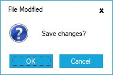
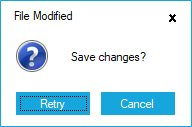
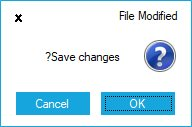
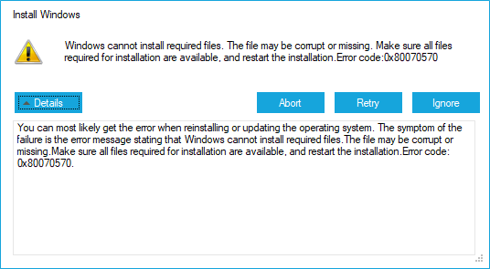

# Button Parameters in Windows Forms MessageBox (MessageBoxAdv)

[Show](https://help.syncfusion.com/cr/windowsforms/Syncfusion.Windows.Forms.MessageBoxAdv.html#Syncfusion_Windows_Forms_MessageBoxAdv_Show_System_String_) function helps to display a [MessageBoxAdv](https://help.syncfusion.com/cr/windowsforms/Syncfusion.Windows.Forms.MessageBoxAdv.html). This section explains regarding the parameters available in [Show](https://help.syncfusion.com/cr/windowsforms/Syncfusion.Windows.Forms.MessageBoxAdv.html#Syncfusion_Windows_Forms_MessageBoxAdv_Show_System_String_) function.

## Caption bar text

The text to display in the caption bar of the [MessageBoxAdv](https://help.syncfusion.com/cr/windowsforms/Syncfusion.Windows.Forms.MessageBoxAdv.html).

## Text

Represents the text which need to be displayed in the [MessageBoxAdv](https://help.syncfusion.com/cr/windowsforms/Syncfusion.Windows.Forms.MessageBoxAdv.html).

## Buttons 

Provides various button combination like Ok, OkCancel, YesNo, YesNoCancel, RetryCancel and much more. By default, it shows only Ok button. [MessageBoxButtons](https://docs.microsoft.com/en-us/dotnet/api/system.windows.forms.messageboxbuttons?view=net-5.0) enumeration helps to set various button combination in [MessageBoxAdv](https://help.syncfusion.com/cr/windowsforms/Syncfusion.Windows.Forms.MessageBoxAdv.html). Some of the available default buttons are as follows:

* Ok
* OkCancel
* YesNo
* YesNoCancel
* RetryCancel
* AbortRetryIgnore

### Ok

This option helps to show the [MessageBoxAdv](https://help.syncfusion.com/cr/windowsforms/Syncfusion.Windows.Forms.MessageBoxAdv.html) with Ok button.





//MessageBox with Ok Button

MessageBoxAdv.Show(this, "Save changes?", "File Modified", MessageBoxButtons.OK, MessageBoxIcon.Question);





'MessageBox with Ok Button

MessageBoxAdv.Show(Me, "Save changes?", "File Modified", MessageBoxButtons.OK, MessageBoxIcon.Question)





 
 
### Ok Cancel

This option helps to show the [MessageBoxAdv](https://help.syncfusion.com/cr/windowsforms/Syncfusion.Windows.Forms.MessageBoxAdv.html) with combination of Ok and Cancel buttons.





//MessageBox with combination of Ok and Cancel buttons.

MessageBoxAdv.Show(this, "Save changes?", "File Modified", MessageBoxButtons.OKCancel, MessageBoxIcon.Question);





'MessageBox with combination of Ok and Cancel buttons.

MessageBoxAdv.Show(Me, "Save changes?", "File Modified", MessageBoxButtons.OKCancel, MessageBoxIcon.Question)




 
  

### Yes No

This option helps to show the [MessageBoxAdv](https://help.syncfusion.com/cr/windowsforms/Syncfusion.Windows.Forms.MessageBoxAdv.html) with combination of Yes and No buttons.





//MessageBox with combination of Yes and No buttons.

MessageBoxAdv.Show(this, "Save changes?", "File Modified", MessageBoxButtons.YesNo, MessageBoxIcon.Question);





'MessageBox with combination of Yes And No buttons.

MessageBoxAdv.Show(Me, "Save changes?", "File Modified", MessageBoxButtons.YesNo, MessageBoxIcon.Question)



 

 

### Yes No Cancel

This option helps to show the [MessageBoxAdv](https://help.syncfusion.com/cr/windowsforms/Syncfusion.Windows.Forms.MessageBoxAdv.html) with combination of Yes, No, and Cancel buttons.





//MessageBox with combination of Yes,No and Cancel buttons.

MessageBoxAdv.Show(this, "Save changes?", "File Modified", MessageBoxButtons.YesNoCancel, MessageBoxIcon.Question);





'MessageBox with combination of Yes,No And Cancel buttons.

MessageBoxAdv.Show(Me, "Save changes?", "File Modified", MessageBoxButtons.YesNoCancel, MessageBoxIcon.Question)





 
 
### Retry Cancel

This option helps to show the [MessageBoxAdv](https://help.syncfusion.com/cr/windowsforms/Syncfusion.Windows.Forms.MessageBoxAdv.html) with combination of Retry and Cancel buttons.





//MessageBox with combination of Retry and Cancel buttons.

MessageBoxAdv.Show(this, "Save changes?", "File Modified", MessageBoxButtons.RetryCancel, MessageBoxIcon.Question);





'MessageBox with combination of Retry And Cancel buttons.

MessageBoxAdv.Show(Me, "Save changes?", "File Modified", MessageBoxButtons.RetryCancel, MessageBoxIcon.Question)





 

### Abort Retry Ignore

This option helps to show the [MessageBoxAdv](https://help.syncfusion.com/cr/windowsforms/Syncfusion.Windows.Forms.MessageBoxAdv.html) with combination of Abort, Retry, and Ignore buttons.





//MessageBox with combination of Abort,Retry and Ignore buttons.

MessageBoxAdv.Show(this, "Save changes?", "File Modified", MessageBoxButtons.AbortRetryIgnore, MessageBoxIcon.Question);





'MessageBox with combination of Abort,Retry And Ignore buttons.

MessageBoxAdv.Show(Me, "Save changes?", "File Modified", MessageBoxButtons.AbortRetryIgnore, MessageBoxIcon.Question)





 

## Icon 

Supports to display wide variety of built-in icons and also empowered with loading custom icons. The default icons can be displayed in [MessageBoxAdv](https://help.syncfusion.com/cr/windowsforms/Syncfusion.Windows.Forms.MessageBoxAdv.html) by using [MessageBoxIcon](https://docs.microsoft.com/en-us/dotnet/api/system.windows.forms.messageboxicon?view=net-5.0) Enum and it is listed as follows:

* Asterisk
* Error
* Exclamation
* Hand
* Information
* None
* Question
* Stop
* Warning

The following code example illustrates adding `Exclamation` icon in MessageBoxAdv.





//Icon Support

MessageBoxAdv.Show(this, "Save changes?", "Warning", MessageBoxButtons.OKCancel, MessageBoxIcon.Exclamation);





'Icon Support

MessageBoxAdv.Show(Me, "Save changes?", "Warning", MessageBoxButtons.OKCancel, MessageBoxIcon.Exclamation)





The following code example illustrates adding custom icons in [MessageBoxAdv](https://help.syncfusion.com/cr/windowsforms/Syncfusion.Windows.Forms.MessageBoxAdv.html).





//Icon Support

MessageBoxAdv.Show(this, "Save changes?", "Warning", MessageBoxButtons.OKCancel, image, new Size(50,50));





'Icon Support

MessageBoxAdv.Show(Me, "Save changes?", "Warning", MessageBoxButtons.OKCancel, image, New Size(50,50))





## Right to left support

[MessageBoxAdv](https://help.syncfusion.com/cr/windowsforms/Syncfusion.Windows.Forms.MessageBoxAdv.html) elements can be aligned in right-to-left layout. It is laid out from the right to left when [RightToLeft](https://help.syncfusion.com/cr/windowsforms/Syncfusion.Windows.Forms.MessageBoxAdv.html#Syncfusion_Windows_Forms_MessageBoxAdv_RightToLeft) property is set to true. Its default value is false.





MessageBoxAdv.RightToLeft = RightToLeft.Yes;

MessageBoxAdv.Show(this,"Save changes?", "File Modified", MessageBoxButtons.YesNo,MessageBoxIcon.Question);





MessageBoxAdv.RightToLeft = RightToLeft.Yes

MessageBoxAdv.Show(Me,"Save changes?", "File Modified", MessageBoxButtons.YesNo,MessageBoxIcon.Question)





  

## Details view

This pane helps to view the detail message about the text shown in the [MessageBoxAdv](https://help.syncfusion.com/cr/windowsforms/Syncfusion.Windows.Forms.MessageBoxAdv.html). It also provide options to show / hide the detail pane.





MessageBoxAdv.Show(this, "Save changes?", "Warning", MessageBoxButtons.OKCancel, image, new Size(50, 50), "Do you want to save your changes to respective file location?");





MessageBoxAdv.Show(Me, "Save changes?", "Warning", MessageBoxButtons.OKCancel, image, New Size(50, 50), "Do you want to save your changes to respective file location?")





Eg: Detail view 

Eg: Collapsed view

## Resizing support

[MessageBoxAdv](https://help.syncfusion.com/cr/windowsforms/Syncfusion.Windows.Forms.MessageBoxAdv.html) allows you to adjust the size of the control at run time by dragging the gripper at bottom right. It can be achieved by using the [CanResize](https://help.syncfusion.com/cr/windowsforms/Syncfusion.Windows.Forms.MessageBoxAdv.html#Syncfusion_Windows_Forms_MessageBoxAdv_CanResize) property. The default value is false.





MessageBoxAdv.CanResize = true;





MessageBoxAdv.CanResize = True





N> [View sample in GitHub](https://github.com/SyncfusionExamples/Messageboxadv-resize-support-in-Winforms)