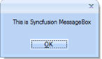
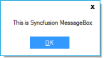

# How to apply the shadow effects in Windows Forms MessageBoxAdv

In MessageBoxAdv, you can enable/disable the shadow effect by using the DropShadow property. Refer to the following code examples.





 //To set the shadow effect

 MessageBoxAdv.DropShadow = true;





 'To set the shadow effect 

 MessageBoxAdv.DropShadow = True





N> The default value of the DropShadow property is false. So, it is needed to enable the property to achieve the shadow effect.

