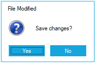

# Getting Started with Windows Forms MessageBox (MessageBoxAdv)

This section explains how to configure [MessageBoxAdv](https://help.syncfusion.com/cr/windowsforms/Syncfusion.Windows.Forms.MessageBoxAdv.html) control in a Windows Forms application.

## Assembly deployment

Refer [control dependencies](https://help.syncfusion.com/windowsforms/control-dependencies#messageboxadv) section to get the list of assemblies or NuGet package needs to be added as reference to use the control in any application.

Please find more details regarding how to install the nuget packages in windows form application in the below link:
 
[How to install nuget packages](https://help.syncfusion.com/windowsforms/installation/install-nuget-packages)

## Creating simple application with MessageBoxAdv

You can create the Windows Forms application with MessageBoxAdv as follows:

1. [Creating the project](#creating-the-project)
2. [Configure MessageBoxAdv](#configure-messageboxadv)

## Creating the project

Create a new Windows Forms project in the Visual Studio to display the MessageBoxAdv.

## Configure MessageBoxAdv

To add control manually in C#, follow the given steps:

**Step1:** Add the following required assembly references to the project:
   
   * Syncfusion.Shared.Base.dll

**Step2:** Include the namespaces **Syncfusion.Windows.Forms**.





using Syncfusion.Windows.Forms;





Imports Syncfusion.Windows.Forms





**Step3:** Displays the `MessageBoxAdv` by using [MessageBoxAdv.Show](https://help.syncfusion.com/cr/windowsforms/Syncfusion.Windows.Forms.MessageBoxAdv.html#Syncfusion_Windows_Forms_MessageBoxAdv_Show_System_String_) function.





// Display the MessageBox using [Show](https://help.syncfusion.com/cr/windowsforms/Syncfusion.Windows.Forms.MessageBoxAdv.html#Syncfusion_Windows_Forms_MessageBoxAdv_Show_System_String_) function.

MessageBoxAdv.MessageBoxStyle = MessageBoxAdv.Style.Metro;

MessageBoxAdv.Show(this,"Save changes?", "File Modified", MessageBoxButtons.YesNo,MessageBoxIcon.Question);





' Display the MessageBox using [Show](https://help.syncfusion.com/cr/windowsforms/Syncfusion.Windows.Forms.MessageBoxAdv.html#Syncfusion_Windows_Forms_MessageBoxAdv_Show_System_String_) function.

MessageBoxAdv.MessageBoxStyle = MessageBoxAdv.Style.Metro

MessageBoxAdv.Show(this,"Save changes?", "File Modified", MessageBoxButtons.YesNo,MessageBoxIcon.Question)





This short guide helps you get a MessageBoxAdv dialog running quickly in a Windows Forms app, and points to more detailed topics (buttons, styling, localization, and advanced usage) elsewhere in this collection.

## Prerequisites

- A Windows Forms project in Visual Studio (targeting a compatible .NET runtime).
- Reference the Syncfusion assemblies or NuGet packages required for MessageBoxAdv (see the project or product installation docs). For a quick check, ensure you have `Syncfusion.Shared.Base.dll` or the equivalent NuGet package referenced in your project.

## Where to go next (concise references)

- Buttons and return values: see the focused reference in [Button Parameters](https://help.syncfusion.com/windowsforms/messagebox/button-parameters) for the available `MessageBoxButtons` combinations, examples, and images.
- Styling and themes: learn how to change the visual style and customize colors in [Styles Settings](https://help.syncfusion.com/windowsforms/messagebox/styles-settings).
- Localization: if your app needs translated button text or captions, follow the step-by-step guide in [Localization](https://help.syncfusion.com/windowsforms/messagebox/localization).
- Overview and advanced features: read [Overview](https://help.syncfusion.com/windowsforms/messagebox/overview) for feature highlights such as details view, resizing, icons, and RTL support.

## Tips and common tasks (brief)

- Displaying an icon: pass `MessageBoxIcon` to the `Show` call (see icon options in the Buttons doc).
- Details/extended text: MessageBoxAdv supports an optional details pane — see the Overview for illustrative usage.
- Resizing: enable `CanResize` if you want end-users to resize the dialog.

## Troubleshooting

- If `MessageBoxAdv` doesn't appear, confirm the Syncfusion assemblies/packages are referenced and that the correct `using Syncfusion.Windows.Forms;` (or `Imports`) line is included.
- For unexpected button captions or languages, check the localization provider setup described in [Localization](https://help.syncfusion.com/windowsforms/messagebox/localization).

## Summary

This page provides a concise quick start to get `MessageBoxAdv` displayed in your app and points you to the specialized pages in this folder for deeper examples and configuration. 
