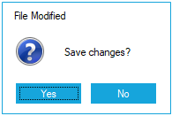

# Windows Forms MessageBox (MessageBoxAdv) Overview

The [MessageBoxAdv](https://help.syncfusion.com/cr/windowsforms/Syncfusion.Windows.Forms.MessageBoxAdv.html) is an advanced MessageBox control that can be used to display a message to the end-user. It provides icons, buttons support and complete customization option for the control.

## Key features 

* **Button Parameters support** - Provides various button combination like OkCancel, YesNo, YesNoCancel, RetryCancel and much more.
* **Details view** - Helps to view the detailed message about the text shown in the MessageBoxAdv.
* **Localization** - Supports complete localization to any desired language of all the elements.
* **Font customization** - Provides option to change the font of all the elements. 
* **Visual Styles** - Provides rich set of VisualStyle to customize the look and feel of MessageBoxAdv.
* **Icons** - Supports to display wide variety of built-in icons and also empowered with loading custom icons.
* **Right-to-left support** - Supports to align all the control elements in right-to-left layout.
* **Resizing support** - Supports to adjust the size of the control at run time.
